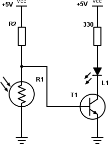

## 10.3 Lepší řešení detektoru tmy {#10-3-lep-e-en-detektoru-tmy}

Všimněte si, že u výše uvedeného zapojení jste limitováni odporem R2 – jeho velikost 15 kΩ znamená, že i když bude absolutní tma, tak do diody může téct maximálně 0,33 mA. Což je hodně málo. Když odpor zmenšíte, bude zase LED svítit i při větším osvětlení, takže se nakonec dostanete do stavu, kdy LED ve tmě svítí víc, a na světle svítí míň. Což tedy není nic moc.

Kéž by tak byl způsob, jak malým proudem, co proteče z R2, sepnout velký proud pro LED, že?

Moment, co že jsem to právě napsal? _Malým proudem sepnout větší proud_? Kde jsem tohle už psal? To bylo – no ano, to bylo v kapitole o tranzistoru.

Připomenu teorii: Tranzistor sepne tehdy, když je na jeho přechodu báze-emitor napětí větší než 0,7 voltu. Pak stačí malý proud k tomu, aby vedl násobně větší proud ve směru kolektor-emitor.

Upravme naše zapojení tak, že využije tranzistor ke spínání LED. Budeme muset upravit hodnotu R2 tak, aby při našem limitu „šero“ bylo na bázi 0,7 voltu (místo 2 V) – vychází to na cca 62 kΩ.

Teoretický výsledek je fajn, ale nejlepší bude na místě R2 použít trimr 100k, a ten přesně nastavit podle požadované úrovně osvětlení.

Za naprosté a absolutní tmy (nereálné, já vím) poteče rezistorem R2 proud 0,08 mA (uvažuju hodnotu R2 rovnou 62k). Pokud použijeme např. tranzistor BC547B s proudovým zesilovacím činitelem okolo 300, může při 0,08 mA bází téct kolektorem (a tedy LEDkou) až 24 mA, což je dost (ve skutečnosti bude proud omezen rezistorem 330R na 15 mA).

Tady bych chtěl upozornit na důležitou věc: Takovéhle výpočty jsou orientační. Sice pro většinu aplikací stačí, ale pokud se dostanete blíž k limitním hodnotám, například k velkým proudům skrz kolektor, posunou se i jiné hodnoty mimo „standardně uvažované hodnoty“. Pro takové to domácí kutění je to dostatečné, ale snažte se vždy pohybovat v rozumných mezích a nejít, jak se říká, _až na krev_. Pak se součástky mohou chovat výrazně jinak. Vždy se proto podívejte do datasheetu, jaké jsou mezní hodnoty – nejčastěji pro protékající proud a připojené napětí.
