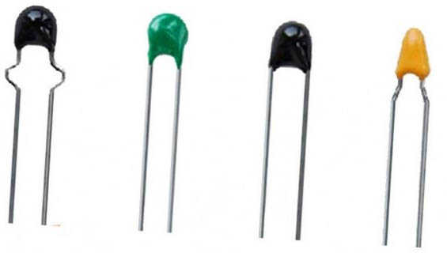
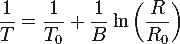

# 11 Termistor {#11-termistor}

Už několikrát jsem tu zmínil v nejrůznějších obměnách větu „… a odpor závisí i na teplotě“. U většiny součástek je to vlastnost nevítaná, ale někdy se hodí – třeba pro měření teploty. Vyrábí se k tomu speciální součástky – rezistory s odporem, závislým na teplotě, zvané termistory.

Termistory jsou dvojího typu – jedny, ty běžnější, fungují tak, že s rostoucí teplotou jejich odpor klesá (označují se jako NTC), druhé, označované PTC, svůj odpor s rostoucí teplotou zvyšují.

Pokud máte po ruce termistor, zapojte si jej místo fotorezistoru k Arduinu. Zbytek zůstane tak, jak byl. Nechte si vypisovat naměřenou hodnotu a zkuste termistor zahřát – například tak, že ho chytnete do prstů.

V EduShieldu je také termistor, ale zapojený na vstup A1.

Po načtení získáte celé číslo v rozmezí 0 až 1023\. Jak přepočítat toto číslo na skutečnou teplotu? No, není to úplně triviální. Vzorec (jmenuje se Steinhartův-Hartův, Steinhart-Hart Equation) vypadá takto:

„Magické“ hodnoty B, R0 a T0 naleznete v datasheetu k danému termistoru. T0 je referenční pokojová teplota 25 °C, R0 je odpor rezistoru při této teplotě (například 10 000 ohmů) a B je teplotní koeficient (například u termistoru, který je v EduShieldu, je to 3950).

Pro přepočet na stupně Celsia je zapotřebí nejprve z naměřené úrovně napětí spočítat odpor termistoru (musíme znát odpor druhého rezistoru v děliči napětí), a dosadit tento odpor do výše uvedeného vzorce. Což s Arduinem samozřejmě lze, ale je to docela náročný výpočet, který používá desetinná čísla atd.

Proto se používá podobný fígl, jako u měření světla – většinou potřebujete něco udělat při nějaké hodnotě teploty, tak stačí zjistit, že při dané teplotě je naměřená hodnota například 700, takže i bez přepočtu můžete říct: Pokud překročí hodnota 700, tak se něco stane.

Pokud ale chcete třeba vytvořit teploměr, který ukazuje teplotu, nezbyde vám, než přepočítávat naměřenou hodnotu výše uvedeným vzorcem na stupně. Anebo jít jinou cestou, třeba použít sofistikovanější součástku…

##### 12 LM35 {#12-lm35}