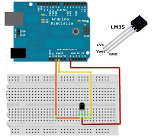

# 12 LM35 {#12-lm35}

LM35 je přesný teploměr, který vypadá trochu jako tranzistor. Dva krajní vývody jsou zem a napájecí napětí, prostřední vývod je měřicí. Napětí na něm je přímo úměrné teplotě – jednomu stupni Celsia odpovídá 10 milivoltů. Při teplotě 0 °C je na tomto výstupu 0, při 100 °C je na vývodu přesně 1 volt.

Teplotu pak spočítáte jednoduše, pomocí vzorce:

<pre class="kod">temp = (5.0 * analogRead(tempPin) * 100.0) / 1024;</pre>

Magické konstanty 5.0 a 1024 jsou maximum (5 V) a hodnota, kterou při tomto maximu naměříte (1024).

V praxi těžko budete měřit teploty nad 100 °C, takže se dá předpokládat, že napětí na měřicím výstupu nepřesáhne 1 volt. Můžete tedy přepnout referenční napětí pro převodník (pamatujete?) na vnitřní zdroj 1,1 V, pomocí funkce analogReference. Zvýšíte tím i přesnost měření.

Vzorec se tedy lehce změní. Maximum (1023) není 5 voltů, ale 1,1\. Když 1,1 podělíte 1024 (to je rozsah měření), zjistíte, že nárust hodnoty o 1 odpovídá nárustu napětí o 1,0742 mV (u pěti voltů to bylo 4,88 mV). Pokud jednomu stupni Celsia odpovídá 10 mV, znamená to, že odpovídá hodnotě zhruba 9,31 (10 / 1,0742). Pokud naměřená hodnota vzroste o 9,31, znamená to, že teplota vzrostla o jeden stupeň. Zkuste si to sami:

<pre class="kod">float tempC;</pre>

<pre class="kod">int reading;</pre>

int tempPin = A0;  

<pre class="kod">void setup() {</pre>

<pre class="kod">    analogReference(INTERNAL);</pre>

<pre class="kod">    Serial.begin(9600);</pre>

}  

<pre class="kod">void loop(){</pre>

<pre class="kod">    reading = analogRead(tempPin);</pre>

<pre class="kod">    tempC = reading / 9.31;</pre>

<pre class="kod">    Serial.println(tempC);</pre>

<pre class="kod">    delay(1000);</pre>

<pre class="kod">}</pre>

##### 13 „Jak naučit kámen počítat“ {#13-jak-nau-it-k-men-po-tat}
