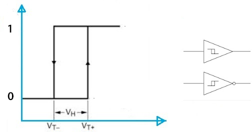

# 13.11 {#13-11}

Schmittův obvod

O kousek dřív jsem řešil, že číslicové obvody potřebují jasnou hodnotu: méně než VIL je nula, víc než VIH je jednička, a cokoli mezi tím je zakázané. To se prostě nesmí!

Jenže – co když se to stane? Jak? No, je hned několik možností. Nejčastěji se stane, že někde na vstupu je nějaká kapacita. A tím nemyslím odborníka kapacitu, ale kapacitu – kondenzátor. Někdy záměrně, někdy náhodou – třeba jsou vodiče, co vedou signál, příliš dlouhé a příliš blízko u sebe, takže mezi nimi vznikne takzvaná parazitní kapacita. Z experimentu s LEDkou a kondenzátorem si určitě pamatujete, že kondenzátor v obvodu zpomalí vypínání a zapínání. Z dokonale čistého signálu „0 nebo 1“, který vypadá nějak takto (říkáme, že má „strmé hrany“)

se stane signál, který bude pomalu nabíhat a pomalu klesat:

Všimněte si, že v tomto případě signál stráví významnou dobu někde uprostřed mezi minimem a maximem. A to není dobře. To je přímo problém, protože během té doby obvod nedokáže vyhodnotit, jestli je na vstupu 0, nebo 1, a jeho chování je nejisté. On si s tím nějak nakonec poradí, ale může se také stát, že bude třeba „pootevřený“, takže jím poteče zbytečně velký proud, na jeho výstupu bude zase zakázaná úroveň, další obvod to taky vyhodnotí špatně...

Zkrátka – číslicové obvody vyžadují, aby to přepnutí z jednoho stavu do druhého bylo co nejrychlejší, hrany co nejstrmější. Pak funguje dobře. Ale co když to prostě nelze zajistit?

Pak musíme použít součástku, která má na vstupu takzvaný Schmittův klopný obvod. To je speciální úprava vstupu obvodu, která má rozhodovací úrovně mezi 0 a 1 posunuté tak, že se překrývají. To znamená, že když napětí na vstupu pomalu roste, tak třeba až do 3 V je považované za logickou 0, a pak je to logická 1\. Ovšem pokud napětí klesá od 5 V dolů, tak je stále považované za logickou 1, až když klesne třeba pod 2 V, tak je považované za logickou 0.

To, že úroveň pro přepnutí z 0 na 1 je vyšší, než pro přepnutí z 1 na 0, způsobí, že obvod nebude při žádné úrovni napětí zmatený, ale vždy v přesně definovaném stavu, v závislosti na předchozím stavu. Této vlastnosti, kdy pro přepnutí v jednom směru platí jiné podmínky, než pro přepnutí ve směru opačném, se říká hystereze. Když si to nakreslím do grafu, vznikne typický obrazec, kterému se říká hysterezní smyčka. Hysterezní smyčka má tak charakteristický tvar, že se u obvodů, které mají takto ošetřené vstupy, maluje i do schematické značky.

Rozdíl mezi prahovým napětím VT+ a VT- udává takzvanou šířku hysterezní smyčky. Čím širší, tím bude obvod odolnější proti náhodným výkyvům, ale zase bude vyžadovat jednoznačnější úrovně užitečného signálu.

[eknh.cz/schm](https://eknh.cz/schm)