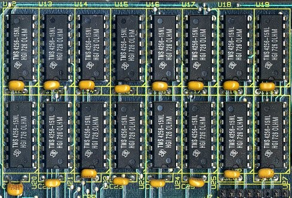

# 13.12 {#13-12}

Blokovací kondenzátor

Přeci jen je ale jedno místo, kam se kondenzátory zapojují schválně a záměrně a vždy.

Už víte, že když se číslicový obvod přepíná z jednoho stavu do druhého, může se stát, že přepnutí není ideální. Že zkrátka na malý okamžik mohou být otevřeny obvody pro logickou 0 i pro logickou 1, a po ten malý okamžik teče skrz obvod velký proud z napájení do země. Projeví se to prudkým skokovým zvýšením spotřeby. Čím větší frekvence přepínání, tím častěji se takové proudové špičky objeví. To znamená, že na napájecím napětí vznikají nevítané pulsy, které způsobují rušení, a to se přenáší do dalších obvodů. Proto se paralelně k napájecím vývodům připojuje kondenzátor o dostatečné kapacitě, který podobné špičky dokáže pokrýt a zachytit. Používá se nejčastěji kondenzátor o kapacitě 100 nF. Zapojuje se co nejblíž integrovanému obvodu, ideálně „hned vedle“.

Když se podíváte na desky plošných spojů u starších počítačů, uvidíte to názorně:

U každého obvodu je co nejblíž zapojen blokovací kondenzátor – na fotografii jsou hned pod integrovanými obvody.