# 13.13 {#13-13}

Buzení z Arduina

Jen takový tip… Když se vám nechce zapojovat všechny ty přepínače, tlačítka a rezistory, tak můžete použít zase Arduino. Vstupy obvodu si připojíte na nějaké z digitálních výstupů v Arduinu, napájecí napětí vezmete taky z Arduina, a nastavování logických úrovní necháte na programu…

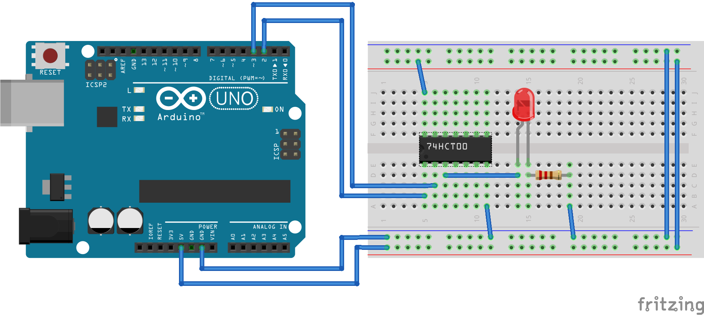

A pokud jste opravdový programátor, tak vynecháte i LEDku, místo toho zapojíte výstup z hradla na volný digitální vstup Arduina, a otestujete si fungování úplně čistě Arduinem.

14

Kombinační logika

14

Kombinační logika

Je fajn, že nám jedno hradlo dělá jednu funkci, ale to není moc zajímavé. Zajímavé to začne být, až když si ty vývody začnete všelijak spojovat. U obvodů 74xx platí, že k jednomu výstupu můžete připojit až deset vstupů. Výstup ale nikdy nesmíte připojit přímo k jinému výstupu. Pokud chcete dva výstupy nějak spojit dohromady, (skoro) vždycky musíte použít hradlo.

Proč nesmíte spojit výstupy přímo spolu? Ještě se k tomu vrátím, ale teď dovolte aspoň stručné vysvětlení: Když budou oba v logické 1 nebo oba v logické 0, tak by to teoreticky nemuselo vadit. Jenže co když výstup jednoho hradla bude logická 1 a výstup druhého logická 0? Jaký bude výsledek? „Logická polovina“ neexistuje… Ve skutečnosti bude výsledek takový, že zbůhdarma poteče proud skrz jedno hradlo do druhého a výsledek bude nejasný.

Hradlo je součástka, která realizuje logickou funkci. Základní logické funkce jsou, znovu připomínám, AND, OR a NOT. Jejich vhodnou kombinací lze získat všechny logické funkce. V praxi se používá hradlo NAND (popřípadě NOR), z nějž lze poskládat všechny ostatní. Vážně, hned si to ukážeme.

Proč hradlo? Hradlo je pojem z železnice. Do jeho přesné definice se pouštět nebudu, to by mě případní železničáři mezi vámi utloukli. Zůstanu u jednoduchého lidového popisu: Hradlo je ten semafór, který říká v zásadě buď „volno“, nebo „stůj“. Obvod s funkcí AND vlastně může hrát roli takového „hradla“ pro logický signál. Na jeden vstup, nazvu ho datový, přivedu kýžený signál, a druhým řídím. Když je řídicí vstup 0, je na výstupu taky nula. Když je na řídicím vstupu jednička, je na výstupu to, co je na datovém vstupu.

Zkusme si to na nepájivém poli:

Jedno tlačítko pro nás bude „signál“, druhé tlačítko „povolení“. Ale musíme počítat s tím, že výsledek je negovaný, takže pokud je „povolení“ nula, bude na výstupu vždy 1, pokud je „povolení“ 1, bude na výstupu negovaný signál.

Chcete poradit trik, jak diodou zobrazovat negovaný výstup? Zapojte ji ne k zemi, ale k napájecímu napětí! Samozřejmě je nezbytné, aby byla správně polarizovaná… Pak bude svítit, když na výstupu hradla bude logická 0.

Zkuste si to takto přepojit, uvidíte, že teď bude LED svítit přesně opačně, tedy ve stavu 0.

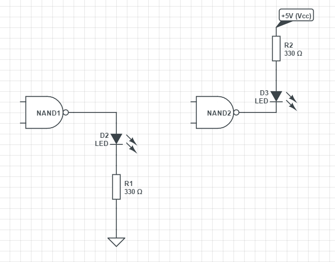

A když už v tom budete, podívejte se, co se stane, když použijete jen jedno tlačítko, a to připojíte:

a.

na oba vstupy NAND najednou

b.

na jeden vstup NAND, a na druhý zapojíte napevno zem (GND)

c.

na jeden vstup NAND, a na druhý zapojíte napevno napájecí napětí (Vcc)

14.1

De Morganův zákon

Ve skutečnosti, věřte mi nebo ne, si v celé číslicové technice vystačíte s jedním jediným typem hradla! Vše ostatní si z něj dokážete poskládat. Tímto hradlem je nejčastěji NAND (mohl by teoreticky být i NOR). Všimněte si tabulky obvodu NAND a přemýšlejte: Co se stane, když spojíte oba vstupy dohromady a na oba přivedete stejnou hodnotu? Jak se bude obvod chovat? Podívejte se na první a poslední řádek tabulky – nepřipomíná vám to nic?

No jasně, získáte tak invertor!

Zkuste si to:

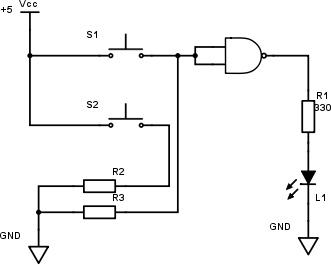

Tlačítko S2 je teď úplně „plonkové“, bez funkce (jen zahřívá rezistor R2). Tlačítko S1 obsluhuje oba vstupy.

A když zapojíte takový invertor na výstup hradla NAND? Tedy použijete dvě hradla…

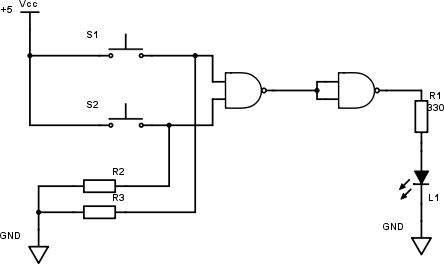

Zapište si zase výsledky do tabulky:

| A | B | Y |
| --- | --- | --- |
| 0 | 0 |  |
| 0 | 1 |  |
| 1 | 0 |  |
| 1 | 1 |  |

Jistě už víte, co to je za funkci.

A co když invertujete vstupy hradla NAND? Jaký bude výsledek? (Napovím: všimněte si v tabulce podobnosti mezi sloupcem NAND a dalšími sloupci... A všimněte si, že při invertování A a B dostanete tutéž tabulku, ale pozpátku...)

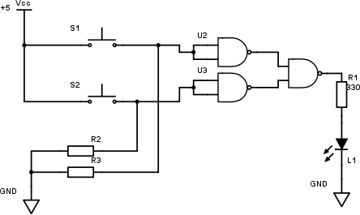

A naměřené výsledky hned do tabulky:

| A | B | Y |
| --- | --- | --- |
| 0 | 0 |  |
| 0 | 1 |  |
| 1 | 0 |  |
| 1 | 1 |  |

[eknh.cz/mrgn](https://eknh.cz/mrgn)

Tomu, co jste si teď prakticky zkusili, zapsali a zjistili, se vznešeněji říká de Morganovy zákony, a formulují se takto: Negace součinu je rovna součtu negací, negace součtu je rovna součinu negací. Když se vrátíme k matematickému zápisu:

¬ A ⋀ ¬ B = ¬ (A ⋁ B) – - NOT A AND NOT B = NOT (A OR B)

¬ A ⋁ ¬ B = ¬ (A ⋀ B) – - NOT A OR NOT B = NOT (A AND B)

My si z toho můžeme vzít jednoduché ponaučení: z NAND se invertováním vstupů stane OR, z NOR se invertováním vstupů stane AND.

14.2

XOR

A kde máme tu zmíněnou funkci „exkluzivního OR“, neboli XOR? No, dala by se poskládat z hradel NAND. Schválně…

Nejprve si udělejme tabulku. Slovní definice zní: Výstup je v log. 1, pokud jsou hodnoty na vstupech různé (tedy buď A, nebo B jsou v log. 1, a ten druhý v log. 0). Pokud platí, že A = B, tak je na výstupu 0\. Tabulka bude vypadat takto:

| A | B | Y |
| --- | --- | --- |
| 0 | 0 | 0 |
| 0 | 1 | 1 |
| 1 | 0 | 1 |
| 1 | 1 | 0 |

Zapojení je takovéhle:

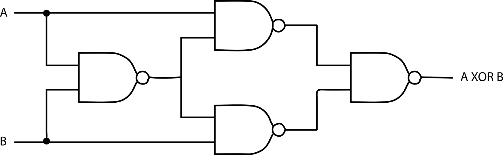

Po pravdě říkám, že bych ho dokázal odvodit, ale raději si to zapamatuju. A vy si to zapamatujte taky. Máme tu čtyři hradla NAND. První zleva má na výstupu 0, pokud jsou na vstupu A = B = 1\. Tedy A NAND B. Označme si tuto mezihodnotu jako C.

Horní a dolní hradlo NAND pak počítá hodnoty A NAND C a B NAND C. Označme si je třeba AX a BX.

Poslední hradlo pak udělá AX NAND BX.

Zkuste si to zapojit. Tlačítka máte, v obvodu 7400 máte i čtyři hradla NAND, zapojte, zkuste, uvidíte sami!

[eknh.cz/xor](https://eknh.cz/xor)

Kompletní tabulka:

| A | B | A NAND B (C) | A NAND C (AX) | B NAND C (BX) | AX NAND BX (Y) |
| --- | --- | --- | --- | --- | --- |
| 0 | 0 | 1 | 1 | 1 | 0 |
| 0 | 1 | 1 | 1 | 0 | 1 |
| 1 | 0 | 1 | 0 | 1 | 1 |
| 1 | 1 | 0 | 1 | 1 | 0 |

Výsledek si můžeme „schovat“ zase do jednoho symbolu:

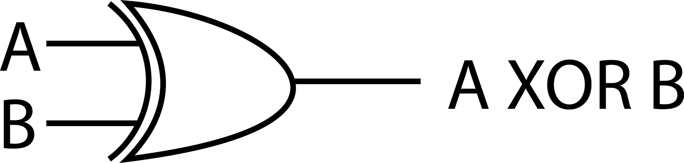

Když se nad tím tak zamyslíte – kolik takových funkcí pro dvě proměnné může být?

14.3

Logické funkce dvou proměnných

Dvě vstupní proměnné mohou nabývat celkem čtyř kombinací: 00, 01, 10 a 11\. Každé téhle kombinaci odpovídá nějaká hodnota na výstupu, kterou můžeme zapsat jako čtyřbitové slovo – jako bychom četli poslední sloupec pravdivostní tabulky shora dolů.

Pro OR to je 0111, pro NOR 1000, pro AND 0001, pro NAND zase 1110...

Máme tedy 16 možných výsledků, od 0000 (vždy 0) po 1111 (vždy 1). Pojďme si je zase zapsat do tabulky.

| AB |  |  |  | Funkce | Poznámka |
| --- | --- | --- | --- | --- | --- |
| 00 | 01 | 10 | 11 |  |  |
| 0 | 0 | 0 | 0 |  |  | Y = 0 | Kontradikce, vždy 0 |
| 0 | 0 | 0 | 1 |  |  | Y = A AND B | Součin (konjunkce) |
| 0 | 0 | 1 | 0 |  |  | Y = NOT (A –&gt; B) | Nonimplikace |
| 0 | 0 | 1 | 1 |  |  | Y = A | Projekce A |
| 0 | 1 | 0 | 0 |  |  | Y = NOT (A &lt;– B) | Obrácená nonimplikace |
| 0 | 1 | 0 | 1 |  |  | Y = B | Projekce B |
| 0 | 1 | 1 | 0 |  |  | Y = A XOR B | Nonekvivalence |
| 0 | 1 | 1 | 1 |  |  | Y = A OR B | Disjunkce |
| 1 | 0 | 0 | 0 |  |  | Y = NOT (A OR B) | NOR |
| 1 | 0 | 0 | 1 |  |  | Y = A XNOR B | Ekvivalence |
| 1 | 0 | 1 | 0 |  |  | Y = NOT B | Negace B |
| 1 | 0 | 1 | 1 |  |  | Y = A &lt;– B | Obrácená implikace |
| 1 | 1 | 0 | 0 |  |  | Y = NOT A | Negace A |
| 1 | 1 | 0 | 1 |  |  | Y = A –&gt; B | Implikace |
| 1 | 1 | 1 | 0 |  |  | Y = NOT (A AND B) | NAND |
| 1 | 1 | 1 | 1 |  |  | Y = 1 | Tautologie, vždy 1 |

Není jich víc? Co?

No, opravdu není. Tahle tabulka vyčerpala všechny možné kombinace výsledků pro všechny možné kombinace dvou vstupních hodnot.

Všimněte si, že v tabulce jsou naši staří známí (AND, NAND, OR, NOR, XOR a jeho negovaný bratr XNOR), jsou tam i funkce jedné proměnné (negace a projekce), jsou tam funkce, které jsou vždy 0, nebo vždy 1 (a přátelé, taková funkce, to snad ani není funkce!), a jsou tam ještě čtyři funkce implikace (normální, obrácená, a dvě jejich negované varianty). Funkce implikace jako jediné porušují pravidlo komutativnosti, tedy když zaměníme vývody A a B, dostaneme jinou funkci. Po pravdě řečeno nevím o tom, že by někdo „implikační“ hradla vyráběl jako integrovaný obvod. Pokud už někdo potřebuje třeba implikaci (1101), tak použije například hradlo OR, a na vstup A připojí invertor. Schválně se podívejte, jestli implikace není totéž co (NOT A) OR B.

14.4

Vícevstupová hradla

Ještě jsme si neřekli, i když si to mnozí z vás asi odvodili, že existují i vícevstupová hradla – v praxi se používají třívstupová, čtyřvstupová a osmivstupová, ale při syntéze obvodů v logických polích si klidně nadefinujeme třináctivstupové AND. Funkce je podobná těm dvouvstupovým, jen si slovo „oba“ nahraďte slovy „všechny“ (AND). Tedy: Výsledkem AND je 1, pokud všechny vstupy jsou 1, jinak 0\. OR je 1, pokud alespoň jeden vstup je 1, jinak 0.

Schválně, co udělá třívstupový XOR? Třívstupový XOR je v logické 1 tehdy, pokud je na vstupu právě jedna logická 1, nebo pokud tam jsou tři. V logické 0 je, pokud na vstupu nejsou žádné jedničky, nebo pokud tam jsou dvě. Obvod XOR tak vlastně počítá lichou paritu.

Lichá parita (Parity Odd) nějakého vícebitového signálu je jednobitový údaj, který je logická 1 tehdy a jen tehdy, pokud je počet logických 1 v signálu lichý. Paritní bit se používá pro jednoduchou kontrolu správnosti dat: pokud je jeden bit poškozen (má opačnou hodnotu), parita nesedí. Na více bitů bohužel jednoduchá parita nesedí. A ano, je i sudá parita (Parity Even), která má přesně opačnou funkci.

14.5

Mimochodem, když máme NAND, co ty ostatní?

Už víme, že 7400 je čtveřice hradel NAND. V první kapitole jsme používali i obvod 7404, což je šestice invertorů.

Co ta ostatní hradla? Máme někde invertory, hradla NOR, AND, XOR? Máme někde třívstupová hradla? Čtyřvstupová?

Máme! Nejlépe je najdete v různých přehledech rodiny 74xx, ale protože jsou tak různě na přeskáčku, tak jsem si řekl, že bude dobře, když si je tu shrneme a ukážeme si i zapojení. S dovolením tedy – velký přehled hradel!

| Funkce | Varianta | Základní | Schmitt | OC |
| --- | --- | --- | --- | --- |
| OR | 4 dvouvstupová hradla | 7432 |  |  |

Vývody základní verze

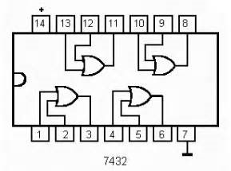

| Funkce | Varianta | Základní | Schmitt | OC |
| --- | --- | --- | --- | --- |
| NOR | 4 dvouvstupová hradla | 7402 | 74232 | 7433 |

Vývody základní verze

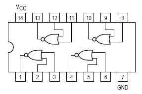

| Funkce | Varianta | Základní | Schmitt | OC |
| --- | --- | --- | --- | --- |
| NOR | 3 třívstupová hradla | 7427 |  |  |

Vývody základní verze

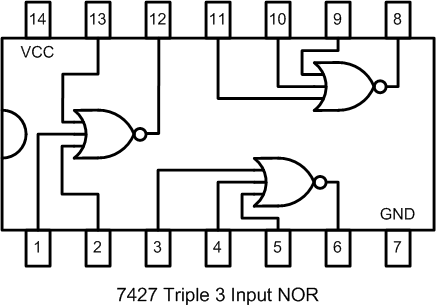

| Funkce | Varianta | Základní | Schmitt | OC |
| --- | --- | --- | --- | --- |
| AND | 4 dvouvstupová hradla | 7408 |  | 7409 |

Vývody základní verze

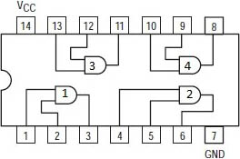

| Funkce | Varianta | Základní | Schmitt | OC |
| --- | --- | --- | --- | --- |
| AND | 3 třívstupová hradla | 7411 |  | 7415 |

Vývody základní verze

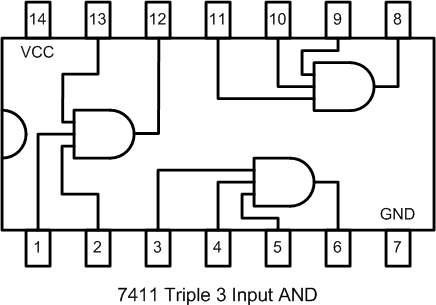

| Funkce | Varianta | Základní | Schmitt | OC |
| --- | --- | --- | --- | --- |
| AND | 2 čtyřvstupová hradla | 7421 |  |  |

Vývody základní verze

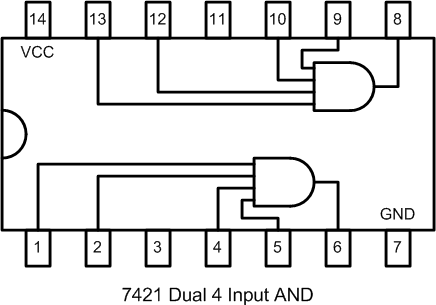

| Funkce | Varianta | Základní | Schmitt | OC |
| --- | --- | --- | --- | --- |
| NAND | 4 dvouvstupová hradla | 7400 | 7424 | 7401 |

Vývody základní verze

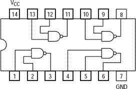

| Funkce | Varianta | Základní | Schmitt | OC |
| --- | --- | --- | --- | --- |
| NAND | 3 třívstupová hradla | 7410 |  | 7412 |

Vývody základní verze

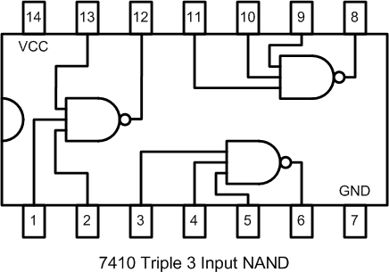

| Funkce | Varianta | Základní | Schmitt | OC |
| --- | --- | --- | --- | --- |
| NAND | 2 čtyřvstupová hradla | 7420 | 7413 | 7422 |

Vývody základní verze

| Funkce | Varianta | Základní | Schmitt | OC |
| --- | --- | --- | --- | --- |
| NAND | 1 osmivstupové hradlo | 7430 |  |  |

Vývody základní verze

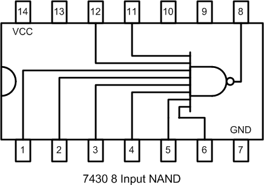

| Funkce | Varianta | Základní | Schmitt | OC |
| --- | --- | --- | --- | --- |
| XOR | 4 dvouvstupová hradla | 7486 |  | 74136 |

Vývody základní verze

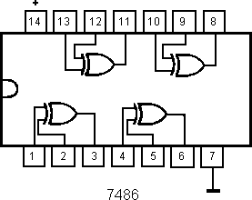

| Funkce | Varianta | Základní | Schmitt | OC |
| --- | --- | --- | --- | --- |
| NOT | 6 invertorů | 7404 | 7414 | 7405 |

Vývody základní verze

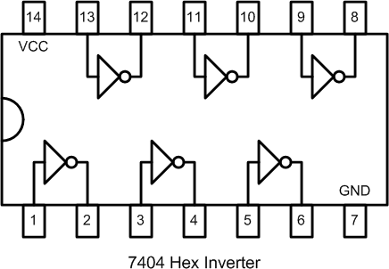

V tabulce jsou kromě základních typů uvedené i typy se Schmittovým obvodem na vstupu. O něm jsme si už říkali – slouží k ochraně obvodů před signály, které nejsou dostatečně strmé. Další sloupec ukazuje obvody s otevřeným kolektorem na výstupu. V tuto chvíli to nechme stranou, později v této kapitole si o nich povíme víc.

14.6

Zjednodušování logických výrazů

Na logické výrazy můžeme s trochou dobré vůle nahlížet podobně jako na aritmetické – i zde existují například operace sčítání a násobení (OR, AND), i tyto operace mají neutrální prvek 0, resp. 1, i tyto operace jsou komutativní (lze prohodit operandy) a asociativní, i zde lze krátit a dělat podobné operace. Nejčastější situace, kdy je potřeba pracovat s těmito funkcemi, je tehdy, když máte daný „black box“, tedy nějaký obvod s určitým počtem vstupů a výstupů, k tomu dostanete pravdivostní tabulku, tedy seznam požadovaných hodnot při určitých vstupních kombinacích, a vy máte navrhnout z hradel ekvivalentní zapojení.

V číslicové technice platí, že libovolný výraz, zadaný pomocí tabulky hodnot, můžeme převést na součet součinů (popřípadě součin součtů), a to nad vstupními signály a jejich negacemi. Tedy třeba (A AND B) OR (NOT B AND C) OR (C AND NOT D AND E)... V praxi se k takovému zjednodušení používají různé metody – [Karnaughova mapa](https://en.wikipedia.org/wiki/Karnaugh_map), [algoritmus Quine-McCluskey](https://en.wikipedia.org/wiki/Quine%E2%80%93McCluskey_algorithm)...

14.7

AND-OR-INVERT

Přiznám se, že když jsem se seznamoval s číslicovou technikou, tak jsem moc nerozuměl smyslu tohoto obvodu. V katalogu TESLA jich bylo několik (mezi 7450 a 7470), a mně vrtalo hlavou, k čemu takový nesmysl může být. Vám ušetřím tápání: AND-OR je ten výše zmíněný „součet součinů“, takže tyto obvody slouží právě ke skládání složitých logických funkcí.

No a druhá věc, která je na AND-OR hezká, je, že mohou přímo sloužit k vytvoření obvodu, který se jmenuje

14.8

Multiplexor

V anglické literatuře se tentýž obvod jmenuje multiplexer, a česky jsem slyšel oba tvary. Ačkoli se většinou přimlouvám za jednotnou terminologii, tak zrovna u tohoto slova používám oba tvary. Hanba mi!

Multiplexor je „digitálně řízený přepínač“. V základní podobě má několik signálových vstupů (třeba 2, označme si je A a B), jeden výstup (Q) a jeden řídicí vstup (S), který říká, který ze vstupů má být připojen na výstup. U našeho dvouvstupového multiplexoru stačí jeden řídicí bit. Funkce je pak v závislosti na hodnotě S následující:

| S | Y |
| --- | --- |
| 0 | hodnota ze vstupu A |
| 1 | hodnota ze vstupu B |

Jasné? Pokud ne, tak si to celé ještě rozepíšeme:

| S | A | B | Y |
| --- | --- | --- | --- |
| 0 | 0 | 0 | 0 |
| 0 | 0 | 1 | 0 |
| 0 | 1 | 0 | 1 |
| 0 | 1 | 1 | 1 |
| 1 | 0 | 0 | 0 |
| 1 | 0 | 1 | 1 |
| 1 | 1 | 0 | 0 |
| 1 | 1 | 1 | 1 |

Všimněte si, že funkce odpovídá slovnímu popisu výše: pokud je S = 0, je na výstupu Y hodnota, která je na vstupu A, a vstup B se ignoruje. Pokud je S = 1, je na výstupu hodnota ze vstupu B bez ohledu na vstup A.

Můžeme navrhnout různá zapojení, ale nejjednodušší získáme, když si uvědomíme to, co jsme si řekli výše o hradlech: vstup S bude povolovat buď signál A, nebo signál B. Signál B bude povolovat, pokud bude roven 1\. Takže „povolený signál B“ bude vlastně „B AND S“. Signál A je povolen v nule, takže „povolený signál A“ bude „A AND NOT S“. No a protože víme, že „zakázaný signál“ je 0, a nula je zároveň neutrální hodnota pro OR, můžeme výsledek zapsat jako „povolené A OR povolené B“ – po dosazení tedy „(A AND NOT S) OR (B AND S)“.

A jak řekli, tak udělali…

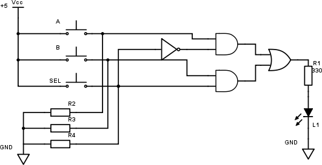

[eknh.cz/muxao](https://eknh.cz/muxao)

Náš multiplexor byste tedy mohli poskládat z jednoho obvodu OR (7432), z jednoho invertoru (7404) a ze dvou hradel AND (7408). Jenže: z OR byste využili jednu čtvrtinu obvodu 7432 (1 hradlo ze čtyř), z invertorů jednu šestinu a z AND pouhou polovinu obvodu (2 hradla ze čtyř). A to se nevyplatí.

Naštěstí to dělat nemusíte, protože většinu složitějších obvodů už za nás někdo poskládal a udělal je jako samostatné součástky. I multiplexory a další. Ale teď neřešme, jestli to už existuje, ale přemýšlejme, jak to udělat? Protože cílem této knihy je i to, abyste uměli vymyslet vlastní složitější konstrukci z jednodušších komponent.

Pomocí hradla AND-OR jsme stvořili multiplexor. Tedy teoreticky, nijak jsme si ho nezapojovali – nanejvýš v emulátoru. Jeho funkce spočívá v propojení vybraného vstupu s výstupem. Vstup se vybírá pomocí řídicího vstupu S. V naší nejjednodušší podobě má řídicí vstup S jeden bit, proto může vybrat jeden ze dvou vstupů. Pokud použijeme dva řídicí bity S1 a S2, můžeme vybrat jeden ze čtyř vstupů. Při třech řídicích bitech jeden z osmi vstupů. V praxi jsou nejčastěji používány právě tyto tři multiplexory, totiž se dvěma, čtyřmi a osmi vstupy.

Zkusme si cvičně vytvořit soustavu rovnic pro čtyřvstupový multiplexor:

Y =

(A AND NOT S1 AND NOT S2) OR

(B AND S1 AND NOT S2) OR

(C AND NOT S1 AND S2) OR

(D AND S1 AND S2)

Na každém řádku je zapsaný logický součin pro jeden vstup. NOT S1 AND NOT S2 je splněno pro S1 = S2 = 0, S1 AND NOT S2 je splněno pro S1 = 1, S2 = 0 a tak dále. Takto vlastně „hradlujeme“ čtyři vstupy, a nakonec je prostě sloučíme do jednoho.

14.9

Proč slučujeme přes OR?

Ano, správná otázka. To bychom nemohli ty vývody prostě jen tak spojit dohromady drátem? No, mohli. Taky bychom mohli zkratovat baterii hřebíkem, ale neděláme to. Důvod je, že by to nefungovalo tak, jak si představujeme. U logických obvodů totiž platí, že proud může téci z výstupu i do výstupu (za chvíli si řekneme, proč to tak je). A pokud bychom spojili „jen tak drátem“ vývody dvou hradel, a na jednom by byla výstupní hodnota 0, na druhém 1, tekl by proud z jednoho výstupu do výstupu druhého hradla a jen by se darmo pálila elektřina. Pokud chceme nějak „sloučit“ výstupy hradel, musíme vždy použít logickou funkci (pravděpodobně OR). Existují výjimky, ke kterým se dostanu za chvilku.