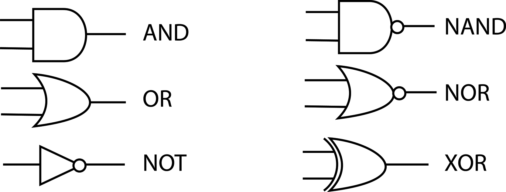

## 13.6 Logika v číslicové technice {#13-6-logika-v-slicov-technice}

Už jsme si říkali, že v digitální technice používáme jen dva stavy, Pravda a Nepravda, tedy True a False, a řešíme to tak, že buď je někde napájecí napětí (a pak to je 1), nebo tam není, je to spojené se zemí, a pak to je 0.

Neexistuje žádná hodnota „0.5“, třeba že bychom pustili „ne úplně napájecí napětí, ale jen trochu“. Ne, buď 0, nebo 1! Pokud bude na vstupu nejasná hodnota, bude výsledek podivný a chybný.

Asi už tušíte, že jsem o logických funkcích nepsal jen tak zbůhdarma, a máte pravdu. Tyto základní logické funkce mají totiž svou fyzickou podobu – existují číslicové obvody, které dělají přesně tyto operace. Vstupy i výstupy jsou signálové vodiče (opravdové fyzické spoje), a součástka dělá AND, OR, NOT, NAND, NOR, ...

_Moment, NAND? NOR?_

Ano, ve světě číslicové techniky jsme si rozšířili základní typy logických operací pro dva vstupy na 4\. K AND existuje NAND, tedy „negovaný AND“, a k OR existuje NOR, čili „negovaný OR“. Zkrátka za výstupem je ještě zapojený invertor, takže tabulka hodnot vypadá takto:

| A | B | A OR B | A NOR B | A ANDB | A NAND B |
| --- | --- | --- | --- | --- | --- |
| 0 | 0 | 0 | 1 | 0 | 1 |
| 0 | 1 | 1 | 0 | 0 | 1 |
| 1 | 0 | 1 | 0 | 0 | 1 |
| 1 | 1 | 1 | 0 | 1 | 0 |

Každá logická funkce (hradlo) má i vlastní schematickou značku. Ty jsou shrnuty v obrázku (včetně hradla XOR, k němuž se ještě dostaneme). Schematické značky, co používám, jsou podle normy ANSI. V ČSSR se koncem osmdesátých let začala prosazovat evropská norma IEC, kde všechny vypadají jako obdélníčky se symbolem; setkáte se s oběma typy schematických značek. Jedno mají společné: Negovaný vstup nebo výstup se značí kroužkem:

Ta první funkce, označená jako „BUF“ (z anglického Buffer, česky se pro tuto součástku používá slovo „budič“), je vlastně něco-jako-invertor, který neinvertuje. Když je na vstupu 0, na výstupu je taky 0\. Když je na vstupu 1, na výstupu je taky 1\. Možná si říkáte, že taková součástka je úplně na... zbytečná, ale přeci jen se někdy hodí: v případě, že potřebujeme signál přivést k více dalším zařízením, hodí se posilovač – budič. Takové součástky většinou dokáží spolehlivě dodat dostatek proudu k tomu, aby signál mohl být přiveden do několika různých obvodů najednou. Pro klasické obvody TTL platí, že k jejich výstupu můžete připojit maximálně 10 vstupů dalších obvodů TTL. Pro CMOS je tento počet mnohem nižší – a tam se hodí právě budič.

Mimochodem, tomu číslu, které říká, kolik vstupů může být připojeno na jeden výstup, se říká logický zisk a je dobré ho znát a vzpomenout si na něj pokaždé, když jeden výstup budete připojovat na víc vstupů. Je to vlastně poměr mezi proudem, který může téct výstupem jednoho hradla, a proudem, který musí téct vstupy dalších hradel. Pokud je výstupní proud desetkrát větší než vstupní, můžete připojit deset vstupů na jeden výstup a máte logický zisk 10.
