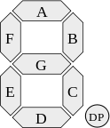
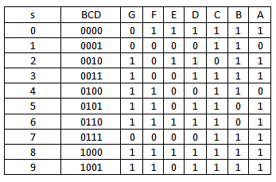
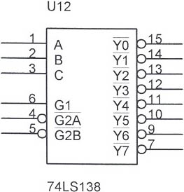
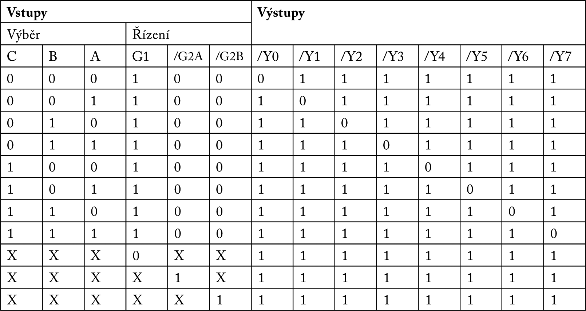

# 14.13 {#14-13}

Dekodéry

Z kombinačních obvodů už nám toho k probrání moc nezbývá. Užitečné jsou dekodéry, které berou vstupní informaci, většinou vícebitovou, a převádí ji na nějaký jiný vícebitový kód. Asi nejpoužívanější jsou dekodéry, určené pro připojení sedmisegmentových displejů. Sedmisegmentovky pomocí rozsvěcení určitých segmentů ukazují číslice 0-9 (a s trochou dobré vůle i některá písmena). Jejich segmenty jsou označeny A až G, a to takto:

Pokud pečlivě počítáte, zjistíte, že segmentů je osm, a tím osmým je desetinná tečka (DP). Tu ale můžeme teď vypustit a nestarat se o ni.

Pro přenos hodnot 0 až 9 potřebujeme čtyři bity. Čtyři bity dokážou přenést hodnoty 0 až 15\. Otázka je, co s hodnotami 10 až 15\. Nejjednodušší způsob je prohlásit je za zakázané. Výsledný čtyřbitový kód se pak nazývá kód BCD – Binary Coded Decimal, tedy dvojkově kódované desítkové číslo. Dekodér BCD-to-7segment pak pracuje podle následující tabulky:

Takové obvody fakt existovaly a existují, například 7447 (za socialismu se vyráběl v NDR pod označením D147D a představoval nejjednodušší způsob, jak vytvořit nějaký displej se sedmisegmentovkami). Ale sedmisegmentovkám se ještě budeme věnovat podrobněji.

Další oblíbené dekodéry jsou 1-z-N, tedy například 1-z-8\. Tento obvod má tři vstupy a osm výstupů (proto se taky někdy označuje jako 3-na-8 – čteme „jeden z osmi“ a „tři na osm“), a aktivní je vždy jen jeden výstup, podle toho, jaká kombinace je na vstupech. Jako příklad nám může posloužit obvod 74LS138.

Jeho pravdivostní tabulka je následující:

Můžeme brát vstupy A, B, C jako tříbitovou adresu v rozsahu 0-7 (tedy binárně 000 až 111). Binární „hodnota“ na těchto třech vstupech určuje, který výstup bude aktivní.

Obvod má tři řídicí vstupy G, jeden normální (G1) a dva negované (/G2A a /G2B). Obvod pracuje tehdy, když je výsledek G = G1 AND NOT /G2A AND NOT /G2B = 1, tedy pouze tehdy, když G1 = 1, /G2A = 0 a /G2B = 0\. Pokud tato podmínka splněna není, bude na všech vývodech logická 1, tedy „neaktivní stav“ (vývody jsou negované). Takovou situaci ukazují poslední tři řádky tabulky.

Pokud je na vstupech G správná kombinace, tak funkci obvodu můžeme popsat nejlépe slovním popisem: Všechny vývody jsou neaktivní (log. 1) s výjimkou vývodu, jehož číslo odpovídá kombinaci bitů na vstupech C, B, A. Například pro kombinaci CBA = 110, což je binární podoba číslice 6, je aktivní (=log. 0) vývod /Y6.

Tento obvod se velmi často používal v osmibitových počítačích na adresování periferií a pamětí. Ze tří adresových vodičů dokázal vytvořit osm řídicích signálů, které pak přímo ovládaly jednotlivé periferie.

Mimochodem, ve schématech starších počítačů najdete někdy adresový dekodér s označením 3205\. To byl obvod s totožnou funkcí, ale z jiné produktové řady, a protože byl v ČSSR dostupnější než 74138, používal se ten. I když měl vyšší spotřebu.

Existují i další typy dekodérů: 2-na-4 (tedy 1-z-4), 4-na-16 (tedy 1-z-16), nebo i 4-na-10 (1-z-10).

Takovéto dekodéry jsou vlastně degradované multiplexory – funkce je stejná (posílá se signál na jeden z N daných výstupů), ovšem signál je pevně daný (v případě obvodu 74138 to je logická 0).