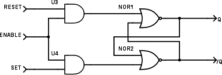
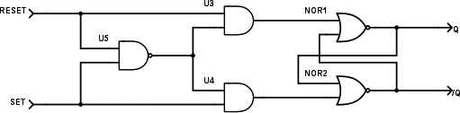
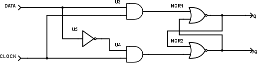

### 18.6.1 {#18-6-1}

Klopný obvod s hradly NAND

Co se stane, když hradla NOR nahradíte hradly NAND? Zkuste si nahradit obvod 7402 obvodem 7400\. A pozor, musíte jej pozapojovat jinak, v obvodu 00 jsou hradla „otočená“!

Jak označíte vstupy u takového obvodu?

Po troše zkoumání přijdete na to, že takový obvod funguje, jako by měl invertované vstupní signály – klidový stav je 1, aktivní 0, takže by bylo fér vstupy označit jako /R a /S

18.7

Zakázané kombinace, zpětná vazba, …

Pojďme si říct na rovinu, že zpětná vazba je dobrý sluha, ale zlý pán. Může snadno způsobit to, že se celý obvod rozkmitá, začne fungovat úplně podivně, popřípadě přestane fungovat, a výsledek nebude předvídatelný. Zpětná vazba totiž do krásně deterministického světa kombinačních obvodů, kde je stav výstupů závislý jen a pouze na stavu vstupů, zavádí prvek zpětného působení výstupů na vstupy, a pokud vytvoříme něco jako „smyčku“, vznikne nám obvod, jehož stav na výstupech není závislý jen na samotných vstupech, ale i na předchozím stavu obvodu.

Ovšem tahle vlastnost není vždy jen negativní.

Zpětná vazba je v elektronice, v číslicové technice i ve spoustě dalších oborů velmi užitečná. Na jednu stranu způsobí třeba to, že mikrofon strčený před zesilovač vygeneruje hnusné hlasité pískání, na druhou stranu když je vhodně zkrocená, tak může generovat pravidelné (i nepravidelné) impulsy a můžeme s ní navrhnout prvek, který si něco pamatuje. (Ano, tušíte správně, základ všech polovodičových pamětí je zde!)

Na to, abychom takové obvody drželi zkrátka a aby fungovaly tak, jak si představujeme, je potřeba dodržet určitá pravidla sebekázně. Minule jsme si ukázali, že u klopného obvodu R-S (Reset / Set) existuje takzvaný „hazadrní stav“, totiž takový, v němž jsou oba vstupy aktivované a oba výstupy mají stejnou hodnotu. Pokud z takového stavu přepneme naráz oba vstupy do neaktivního stavu, nelze říct, v jakém stavu se bude obvod nacházet.

Nejprve si rozšíříme náš klopný obvod R-S o takzvaný povolovací vstup E (Enable). Uděláme to jednoduše – na vstupy R a S připojíme hradla, která propustí řídicí signály R a S pouze v případě, že vstupní signál E bude log. 1:

Vidíte sami – do vlastního klopného obvodu se nedostane nic, pokud je E rovno 0\. Pokud nastavíme E na 1, funguje obvod jako vždycky.

TIP: Tento postup si zapamatujte. Vždy, když potřebujete nějaký vstup, aktivní v logické 1, ošetřit tak, aby fungoval „jen někdy“, použijte předřazené hradlo AND, a do něj zaveďte daný signál a řídicí (povolovací) signál E.

Máme teď hradlo R-S s povolovacím vstupem, ale to nijak neřeší hazardní stav (R = S = 1). Zkuste přemýšlet – jak zařídit, aby nikdy nenastal stav, že R i S budou zároveň v logické 1? Tak samozřejmě, můžeme zapojit mezi oba vstupy hradlo AND, jehož výstup bude zároveň ovládat vstup E tak, že pokud nastane R = S = 1, tak vstup E zavře... Nějak takto:

Což je řešení, které téměř nemá chybu. Ve skutečnosti má chybu zásadní, a to tu, že řídicí signál vzniká až v hradle NAND. A hradlo má, jak už víme, nějaké zpoždění, takže hazardní stav R = S = 1 projde přes obě hradla o chviličku dřív, než je stihne nula na výstupu E „zabouchnout“.

Použijeme tedy jiný trik: zrušíme dva vstupy R a S, a budeme používat jen jeden. Ten připojíme na oba vstupy – na vstup S přímo, na vstup R přes invertor. Takový vstup nazveme D (jako že „data“). Pokud bude D = 0, bude S taky rovno 0 a R rovno 1\. Pokud bude D = 1, bude S = 1 a R = 0\. A takto vygenerované signály pošleme do obvodu spolu s povolovacím vstupem E, jak jsme si ho ukázali výše. Výsledkem je obvod, který se označuje jako latch – česky se překládá jako „závora“, ale tenhle pojem se moc neujal, a i v češtině se říká latch, ale vyslovuje se to [leč].

18.8

Hodiny

Když píšu „hodiny“, nepředstavujte si prosím nic sofistikovaného, natož švýcarského natahovacího se strojkem. Je to prostě jen jeden vodič, na kterém se plus mínus pravidelně střídají 0 a 1\. Tento signál podobně jako srdeční tep řídí pak celý obvod. V zásadě má funkci takovou, že říká, kdy nějaký obvod smí změnit svůj stav. A protože u většiny zapojení bývá opravdu pravidelný a přesný a určuje rytmus vnitřních dějů, říká se mu „hodinový puls„.

Výchozí stav je takový, že vstup E je 0\. Výstupy zůstávají stále ve stejné úrovni. Jakmile je E = 1, nastaví se výstupy podle vstupu D. Pokud je nula, bude Q = 0 a /Q = 1, pokud je jedna, bude Q = 1 a /Q = 0\. Dokud bude E = 1, budou výstupy reagovat na vstup D. Jakmile přepneme vstup E zpátky na 0, zůstane obvod v posledním nastaveném stavu. Proto ten český název „závora“ – jakmile spadne, zůstane výsledek zamknutý až do doby, než se opět zvedne.

Modifikací tohoto obvodu dostaneme zapojení, které se přepíná pouze v jednom jediném okamžiku, totiž když se mění stav hodinového vstupu. Nejčastěji reaguje na změnu z 0 do 1 – tomu okamžiku se říká náběžná hrana hodinového pulsu.

Výsledek se nazývá „klopný obvod D“. Můžeme si to představit jako paměťovou buňku pro jeden bit informace. Přivedeme tento bit na vstup D (buď 1, nebo 0), a „zapamatujeme“ si jej tak, že na vstup Clock přivedeme krátký impuls. Impulsem je míněn přechod z 0 do 1 a opět zpátky na  0\. Nějak takto:

Zapamatovaná hodnota je na výstupu Q, na výstupu /Q (NOT Q) je jeho negovaná hodnota.

18.9

Synchronní / Asynchronní

U takového zapojení hovoříme o synchronním vstupu D. Slovo „synchronní“ znamená, že se jeho změny projeví v obvodu až poté, co nastane nějaká událost – zde příchod hodinového pulsu. Pouze pokud přijde hodinový puls, může se vstup nějak projevit. Naproti tomu vstupy R, S u dříve zmíněného klopného obvodu R-S jsou vstupy asynchronní – změna na těchto vstupech se okamžitě projeví na výstupech.

Jak jsem psal už na začátku kapitoly: pokud je ve hře zpětná vazba, je potřeba ji zkrotit a dát ji zcela jasné mantinely. Takovým mantinelem jsou v číslicových systémech právě hodinové pulsy. Hodinové pulsy synchronizují celý obvod a zajišťují, že se něco stane až po něčem jiném, že změny nastanou ve stejný okamžik, že jedna část obvodu se nezmění jindy než jiná, a pokud ano, tak že to nebude mít vliv na výstup, a tak dále...

Proto u složitějších obvodů vždy všechno řídíme hodinovými pulsy. Nechceme, aby se cokoli měnilo halabala, protože pak můžou nastat hazardní stavy. Vždy všechno důsledně řízené hodinami a synchronní. Asynchronní vstup znamená vždy výjimečnou událost, a jako takový by měl být používaný. RESET či přerušení je asynchronní událost, vše ostatní by mělo být synchronní. Jakmile ztratíme synchronizaci, rozsype se funkce celého obvodu, a to znamená třeba ztrátu dat při přenosu, vznik falešných dat a podobné chyby funkčnosti.