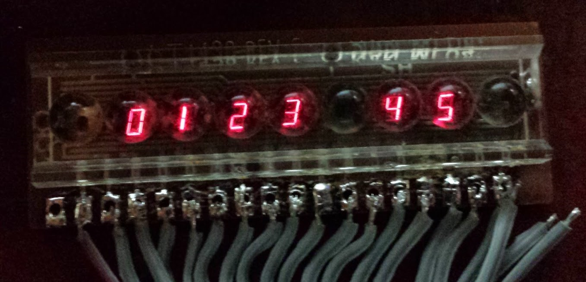
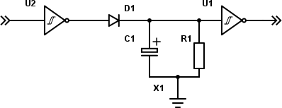

# 14.15 {#14-15}

Aritmeticko-logická jednotka (ALU)

Asi nejsložitější obvody, které můžete stvořit kombinační technikou, jsou násobičky a aritmeticko-logické jednotky (ALU). Takové obvody mívají většinou dva vícebitové vstupy, jeden vícebitový výstup, a k tomu sadu řídicích vstupů, které určují, jakou operaci obvod právě dělá. Většinou mívá i jakési „vedlejší výstupy“, třeba přenos nebo informaci o tom, že jsou si čísla rovna.

Reálným příkladem takového obvodu je obvod 74181\. Tento obvod zpracovává dva čtyřbitové vstupy (A0-A3 a B0-B3) a nabízí sadu funkcí pro sčítání, odčítání, logické operace či posuny, a to s přenosem i bez přenosu. Funkce se vybírají pomocí čtyřbitového řídicího vstupu S0-S3\. Pro zajímavost se podívejme na schéma:

CC BY-SA 3.0, Link

Sčítání dvou čísel zabralo tomuto obvodu 22 nanosekund. Verze „Schottky“ 74S181 sčítala dvě čísla 11 nanosekund, rychlá verze 74F181 sedm nanosekund. Rychlost byla dána rychlostí přepínání hradel a tvořila technologický limit – nějaké „zvyšování kmitočtu“ nepomohlo. Důvod je ten, že sčítačka sčítá všechny pozice najednou, a jediné, co ji brzdí, je právě zmíněný technologický limit, který se projeví jako zpoždění při přenosu z nižšího řádu do vyššího.

Funkce se volily jednak pomocí výběru S0-S3 a dále pak vstupem, který přepínal logické a aritmetické instrukce (M). Obvod pracoval buď v normálním režimu, nebo v negovaném. Za normálního režimu dokázal následující operace (Cn je přenos z nižšího řádu):

Násobení nevedeme... Násobilo se buď postupně, nebo existovala hardwarová násobička – velmi specializovaná součástka. Pro vícebitové operace se zapojovalo několik těchto obvodů vedle sebe a propojovaly se pomocí přenosu Cn. Protože zpoždění signálu mohlo ovlivnit výsledek, používal se obvod 74182 pro „předvídání přenosu“.

Předvídání přenosu je postup, kdy pomocí jednoduché kombinační logiky rychle tipneme, zda výsledek „přeteče“, a dál s tímto odhadem pracujeme, takže pro většinu případů získáme výsledek rychleji.

Aritmeticko-logická jednotka je základem každého moderního procesoru. Dnes už je integrovaná přímo na čipu, ale v dřevních dobách let 60\. a 70\. se opravdu skládala z hradel, později z takovýchto málobitových jednotek vedle sebe.

15

Sedmisegmentovky LED

15

Sedmisegmentovky LED

Odpočiňme si na chvíli od kombinačních obvodů a podívejme se na něco mnohem atraktivnějšího. Podívejme se na známé digitální osmičky, ze kterých se dělaly displeje. A ačkoli vypadají jako osmičky, říká se jim sedmisegmentovky. Správně vlastně „sedmisegmentová zobrazovací jednotka“, ale než to řeknete, tak posluchači usnou.

Bývaly doby, kdy sedmisegmentovka představovala ultramoderní techniku. Když chtěli ve filmu tvůrci ukázat, jak doba kvačí a budoucnost je na dosah, vrzli tam něco, co zobrazovalo na displeji ze sedmisegmentovek nějaké číslice. Sedmisegmentovky jsme pak všichni měli v kapesních kalkulačkách a digitálních hodinkách.

Sedmisegmentovka má opravdu sedm segmentů. Označují se tradičně písmeny A až G, od horního vodorovného po směru hodinových ručiček, prostřední vodorovný je pak poslední. Jenže naprostá většina sedmisegmentovek má vstupů osm: poslední je desetinná tečka, nebo dvojtečka. Sedmisegmentovek je spousta různých druhů, dělají se sdružené displeje po dvou číslicích, po čtyřech, po osmi, dělají se speciální „hodinové“ displeje, které mají jeden a půl pozice…

Sedmisegmentovky se skládají ze sedmi (s tečkou z osmi) svítících diod (LED), které jsou paralelně spojené. Ovšem je otázka, jak jsou spojené, jestli katodami, nebo anodami.

Podle toho, jestli je sedmisegmentovka se společnou katodou (CC, Common Cathode), nebo se společnou anodou (CA, Common Anode), se bude lišit i práce s ní. U sedmisegmentovky se společnou katodou se společný vývod zapojuje na zem, a segmenty budou svítit tehdy, když bude na příslušný vstup přivedeno kladné napětí (tedy log. 1). U společné anody tomu bude obráceně – společná anoda je zapojena na kladné napájecí napětí, a segment, který má svítit, musí mít vstup v log. 0, neboli uzemněný.

Samosebou nesmíme zapomenout na rezistory ke každému segmentovému vstupu. Uvnitř jsou úplně stejné LED jako známe, tak je potřeba se k nim i stejně chovat.

Poznámka: Nechme teď stranou displeje z kapalných krystalů (LCD). Samozřejmě existují i v podobě sedmisegmentovek, ale jejich princip není tak jednoduchý a vyžadují trošku specifičtější zacházení.

Pomocí sedmisegmentovky můžeme zobrazit 127 různých znaků, které ukazuje následující obrázek.

Většinou se používají číslice 0 až 9 a některá písmena. Pokud chcete lepší ztvárnění písmen i číslic, můžete použít zobrazovače se 14 nebo 16 segmenty, nebo pak matici bodů.

Pro displeje ze sedmisegmentovek existují speciální obvody – dekodéry, které převádějí (většinou čtyřbitovou) informaci na sedm bitů pro sedmisegmentovku. O nich jsem se už zmiňoval v kapitole o dekodérech a kombinační logice.

15.0.1

Mimochodem…

Sedmisegmentovky jsou dnes už velmi levné, ale bývaly to poměrně drahé součástky. Dnes už i ty staré, původní, seženete defacto „na váhu“, za pár korun. S některými výjimkami, jako jsou obvody TIL od Texas Instruments. Šlo o jedny z prvních sedmisegmentovek, a výrobce Texas Instruments třeba do modelu TIL 306 či TIL307 zamontoval i integrovaný obvod, který fungoval jako čítač a jako dekodér.

Taková sedmisegmentovka je dnes skoro malý poklad, protože její ceny na aukčních serverech jsou okolo dvou set korun za jeden kus. Podobně i jejich klony z bývalého NDR, jako je například VQC10\. Ovšem pokud stavíte něco, co má mít „retro vzhled“, budou tyto displeje naprostým hitem.

Další oblíbený displej byl takzvaný „bublinkový“. Šlo o několik sedmisegmentovek, spojených do jednoho bloku (většinou po 4, 8 nebo 9). Nad každou sedmisegmentovkou byla plastová „bublinka“, která fungovala jako čočka a zvětšovala titěrné symboly tak, aby byly čitelné. Podobné displeje se používaly převážně v kalkulačkách.

No a když už jsme v tom retrovzpomínání, tak se dodneška můžeme potkat s takzvanými „nixie“ displeji – vypadaly jako elektronky, a nebyly zapojené po segmentech, ale měly speciálně tvarované vlákno pro každou číslici. Vyráběly se i v Sovětském svazu, kde se jim říkalo Itrony.

15.1

Víc sedmisegmentovek…

Na Aliexpressu nebo eBay najdete mnoho hotových modulů se sedmisegmentovkami. Většinou používají čínské obvody TM16xx, popřípadě obvody Maxim MAX72xx. Jeden z oblíbených typů je osmimístný displej s obvodem MAX7219\. Tento obvod v zásadě funguje podobně jako naše oblíbené posuvné registry, jen místo osmi segmentů dokáže budit až 64 segmentů (8 pozic po osmi segmentech). Pomocí jednoduchého sériového rozhraní (CLK a MOSI) pošlete do obvodu 16bitové řídicí slovo, které nastavuje segmenty, zapíná a vypíná dekodér znaků nebo řídí intenzitu, a pulsem na vstupu LOAD jej nahrajete do registrů (a tedy provedete). Výhodou je, že obvod MAX7219 je průchozí, a je tedy možné naskládat takových displejů za sebe několik.

Když může takový obvod budit 64 LED segmentů, tak kde je psáno, že to musí být jen sedmisegmentovky? Může to být klidně i matice diod:

Takové matice můžete zase pospojovat za sebe a vytvořit z nich například displeje, podobné těm, co v MHD ukazují názvy stanic. Dokonce existují i velmi jednoduché herní konzole s takovými displeji (ovšem s RGB LED):

Málokdy budete s takovými obvody pracovat napřímo, většinou budou skryté v nějakém modulu spolu s LED a omezovacími rezistory. Když je o tom řeč – nezapomeňte, že LED jsou sice málo náročné na proud, ale když jich je 64, tak se to nasčítá…

16

Jak vypadá hradlo uvnitř

16

Jak vypadá hradlo uvnitř

Tahle kapitola není povinná. Nemusíte ji znát, ale je dobré, když se k ní třeba za čas vrátíte. V ní totiž zjistíte, jak jsou hradla udělaná „vevnitř“. Jak je poskládané z těch tranzistorů či čeho, jaký je rozdíl mezi TTL a CMOS, co se děje, když se něco děje, proč se řídicí signály často používají negované, proč se k obvodům zapojuje odrušovací kondenzátor…

Tranzistor je prvek, který je vlastně základním stavebním kamenem celé číslicové techniky. Na rozdíl od analogové, kde máme tranzistory rádi, protože zesilují slabé signály, tak v číslicové spíš využíváme toho, že tranzistor se za jistých podmínek sepne pro procházející proud, a to podle proudu, který prochází bází.

Základní prvek je invertor. Musíme nějak dokázat, aby na výstupu byl proud, pokud na vstupu není, a obráceně.

Začneme úplně od lesa. Zapojte si do série tlačítko, LED a rezistor tak, aby LED svítila, když zmáčknete tlačítko. Máte? Nějak takhle to bude:

A teď výzva: Zapojte to tak, aby to fungovalo obráceně, totiž aby LED ZHASLA, když zmáčknete tlačítko.

Chvíle pro přemýšlení...

Ještě chvíle pro přemýšlení...

Máte to?

Napovím: Proud jde cestou menšího odporu. A co má menší odpor – tlačítko, nebo dioda? Navíc jsme to probírali už u fotorezistoru a detektoru tmy!

Dobře, tak takhle:

Když tlačítko pustíte, jde proud přes rezistor do diody. Když tlačítko zmáčknete, teče místo toho většina tím tlačítkem.

No, a teď využijeme toho, že tranzistor je vlastně takový „proudem řízený spínač“. Postavte si toto:

Princip je jednoduchý: Když je na vstupu logická 0 (L), tedy vstup je spojen (více méně) se zemí, je tranzistor zavřený, a proud teče přes rezistor 640 ohmů z napájecího napětí na výstup. Jakmile na vstup přivedeme log. 1 (H), tranzistor se otevře a spojí výstup se zemí. Na výstupu bude tedy logická 0.

[eknh.cz/rtlinverter](https://eknh.cz/rtlinverter)

Hradlo NAND bude na podobném principu:

[eknh.cz/rtlnand](https://eknh.cz/rtlnand)

Pokud tranzistory zapojíme paralelně, namísto sériově, získáme hradlo NOR.

[eknh.cz/rtlnor](https://eknh.cz/rtlnor)

Takovéhle logické elementy opravdu existovaly. Říkalo se jim RTL – Resistor-Transistor Logic – a už jsem psal, že byly použité například v naváděcím počítači Apolla. Měly ale obrovskou spotřebu (podívejte se, jaké proudy tečou hradlem NAND, když jsou oba tranzistory otevřené), nebyly moc odolné proti rušení atd. Vývoj proto přinesl další technologii, a tou byla TTL, neboli transistor-transistor logic.

Výhodou TTL proti RTL je nižší spotřeba a větší rychlost. Nevýhodou pak to, že potřebujete výrazně vyšší počet tranzistorů na logickou funkci. Na výše uvedeném invertoru je to vidět – tranzistor úplně vlevo, připojený emitorem ke vstupu (Q1), slouží ke spínání centrálního tranzistoru (Q2). Pokud je vstup na nízké logické úrovni, teče proud skrz první tranzistor ven (ano, teče proud ze vstupu…) Při napájecím napětí 5 V a omezovacím odporu R1 o velikosti 100k jde o necelých 50 uA. Centrální tranzistor Q2 je tak uzavřen, a proud teče přes rezistor R2 do báze tranzistoru Q4\. Ten je tak otevřen, a na výstup je přes R4 a D1 přivedeno napájecí napětí. Q3 je uzavřen díky odporu R3 v bázi.

Pokud na vstup přivedeme logickou 1 (H), dostane se toto napětí na bázi Q2, který se otevře. Proud nyní putuje přes R2 a Q2 do báze Q3\. Q4 je tedy zavřený, Q3 otevřený, a výstup je propojen přes něj se zemí.

Toto řešení výstupu pomocí dvou tranzistorů, rezistoru a diody se nazývá též totem. Připomíná Darlingtonovo zapojení, které dovoluje spínat velké proudy. Díky tomu lze výstup zatížit poměrně velkou zátěží. U standardní řady TTL lze na jeden výstup hradla připojit až deset vstupů.

16.1

Proč zapojovat blokovací kondenzátory k napájení

Nevýhodou totemu je, že spoléháme na nekonečnou rychlost přepínání tranzistoru Q2\. V ideálním případě je tento tranzistor buď plně otevřen (a Q4 je tedy zavřený, Q3 otevřený), nebo plně zavřen (Q4 otevře, Q3 zavře). Jenže reálné obvody vykazují pomalejší přechod, daný převážně fyzikálními vlastnostmi. Na krátký okamžik se tak při přepínání stane, že budou otevřeny oba tranzistory v totemu, jak Q3, tak Q4, a poteče přes ně proud, omezený jen rezistorem R4\. V praxi se to projeví rušivými pulsy, kdy je zvýšený odběr z napájení. Proto se připojuje k napájení obvodů TTL paralelně kondenzátor o kapacitě ~ 100 nF, který tyto špičky pokryje. Zároveň z toho vyplývá, že čím větší je přepínací frekvence, tím vyšší je odběr obvodu.

16.2

Negované signály

Možná jste si říkali, proč jsou některé signály v číslicové technice negované. Typicky třeba signál RESET a signály řízení sběrnice bývají navržené tak, že jsou aktivní v log. 0, a v klidovém stavu jsou v log. 1\. Důvodem je rušení. Představte si, že se ve vedení indukuje rušivé napětí, a tak místo 5 V tam je vlivem rušení třeba o 1,5 V méně, tedy 3,5 V. Pokud je signál navržený jako invertovaný, nevadí to, stále se vejdeme do dovoleného pásma (2 V-5 V). Pokud bychom ale měli signál v klidu na log. 0, tak by 1,5 V rušivého napětí znamenalo, že se signál dostane mimo bezpečnou oblast (0 V-0,8 V), a obvod takový stav může vyhodnotit jako aktivní impuls. Zkrátka díky tomu, že logická 1 má mnohem větší pracovní pásmo, je výhodnější u signálů, které mají být po většinu doby v klidu a sepnout jen někdy, použít invertovanou hodnotu a nadefinovat klidový stav jako 1.

16.3

MOS, CMOS

Až do této chvíle jsme si popisovali obvody, nazývané jako „bipolární“. To proto, že používají takzvané bipolární tranzistory NPN. Místo bipolárních tranzistorů můžeme ale použít tranzistory MOSFET. Už jsem je představoval, tak to jen bleskem zopakuju: FET znamená Field-Effect Transistor, MOS odkazuje na jeho uspořádání: Metal-Oxid-Semiconductor. Na rozdíl od bipolárních tranzistorů, řízených protékajícím proudem, jsou tranzistory MOS řízeny napětím. V praxi to znamená, že vstupem takového obvodu teče téměř nulový proud a chová se tedy jako by měl (téměř) nekonečný odpor.

N-MOS se spíná pozitivním napětím řídicí elektrody (gate) proti společné (source). Technologie P-MOS to má přesně obráceně. Technologie MOS má mnoho výhod, a jednou z nich je to, že se na stejnou plochu křemíkového čipu vejde víc logiky. Proto se obvody TTL dělaly nanejvýš ve středním stupni integrace (MSI – čítače, dekodéry, multiplexery). Vyšší stupeň integrace (LSI, VLSI), potřebný pro složitější obvody včetně mikroprocesorů, vznikaly technologií MOS. Nejprve šlo o P-MOS, ale později přišla rychlejší NMOS, bohužel s vyšším odběrem.

Pokud se v logickém prvku zkombinovaly obě tyto technologie, vznikl CMOS (Complementary MOS).

Vidíte, že díky použití dvou rozdílných tranzistorů, které jsou zapojené „proti sobě“, získáváme téměř ideální invertor, kterým v klidovém stavu neteče téměř žádný proud. Spotřeba je tedy nula nula nic. Ovšem – jen teoreticky. V praxi je vlivem technických nedokonalostí a parazitních kapacit situace spíš takováto:

Při přepínání krátkodobě vyskočí proud protékající obvodem. Na druhou stranu oproti hradlům TTL je to vysloveně nic. Obvody CMOS (řady 40xx) mají proti TTL mizivou spotřebu, mohou pracovat v širokém rozmezí napájecího napětí, ale na druhou stranu jsou pomalejší a jejich úrovně jsou nekompatibilní s TTL.

Pokud obvody CMOS napájíme 5 V, je pro ně logická 0 na vstupu v rozmezí 0 V až 1,3 V. Logická 1 je 3,7 V až 5 V. Na výstupu je v log. 0 maximálně 0,2 V, v log. 1 pak minimálně 3,7 V. Vstupy CMOS mají hodně velké „zakázané pásmo“ (1,3 V až 3,7 V), a střední hodnota (prahové napětí pro přepnutí) je okolo 2,5 V – tedy už v oblasti, kde je TTL logická 1.

Naštěstí v dnešní době technologie pokročila dopředu., a dnešní moderní CMOS jsou mnohem rychlejší, a třeba řada HCT má napěťové úrovně kompatibilní s TTL a představuje tak reálně „to nejlepší z obou světů“.

17

„Plnou parou vzad!“ – „Ale jak daleko?“

17

„Plnou parou vzad!“ – „Ale jak daleko?“

Ne, nezbláznil jsem se, nebojte… Chtěl jsem vás jen nečekaným titulkem připravit na další pokus. Na chvíli si zase odpočineme od kombinačních obvodů a postavíme si něco s Arduinem.

Asi víte, jak funguje takzvaný parkovací asistent v autě. Je to takové nenápadné zařízení na palubní desce, které ukazuje, jak daleko za zadním nárazníkem máte překážku – tedy jiné auto, zeď, chodce, …

Fungování takového zařízení je jednoduché: v nárazníku jsou namontované reproduktory, které vysílají zvukový signál. Ten se odrazí od překážky a vrátí se zpět. Reproduktor v tu chvíli funguje jako mikrofon, odraženou vlnu zachytí a převede ji na impuls. Řídicí elektronika jen počítá čas, který uplyne od vyslání impulsu („pípnutí“) do jeho příchodu zpátky.

Říkáte si, že zvuk letí hodně rychle? No, jak se to vezme. Rychlost šíření zvuku ve vzduchu záleží na mnoha faktorech, ale zhruba lze říct, že za jednu sekundu uletí 340 metrů. Což se zdá jako velká vzdálenost, ale když si uvědomíte, že v elektronice pracujeme běžně s mnohem kratšími časy, třeba milisekundami, a že takové Arduino udělá 16 operací každou mikrosekundu, tak to zas tak závratná rychlost není, že? Za jednu milisekundu zvuk urazí tedy pouhých 34 centimetrů. A když si uvědomíte, že musí letět k překážce a zpátky, tedy urazit dvě cesty, tak vám vyjde, že pokud se zvuk vrátí za jednu milisekundu, tak je překážka vzdálená pouhých 17 centimetrů.

Parkovací asistent většinou používá čtyři takové senzory, které slouží zároveň jako reproduktor i mikrofon. Pro amatérské konstrukce jsou dobře dostupné senzory HC-SR04, které používají dvojici reproduktor-mikrofon.

Tyto levné moduly jsou uzpůsobené pro napájení 5 V (vstupy GND a VCC), a mají dva další vývody: Trig, kterým se spouští ono „písknutí“, a Echo, které oznamuje, že mikrofon přijal signál. Délka pulsu na výstupu Echo odpovídá naměřené vzdálenosti. Modul pracuje s ultrazvukem na frekvenci 40 kHz, což je vysoko nad tím, co dokáže slyšet lidské ucho (to slyší tóny zhruba v rozsahu 20 Hz až 20 kHz).

Postavit si měřič vzdálenosti s takovým modulem a Arduinem je velmi snadné – stačí propojit vývody Trig a Echo s datovými piny a zapojit napájení podle obrázku.

Já zapojil Echo na pin 2 a Trig na pin 3.

Obslužný program má jen pár řádků – ve funkci Setup je potřeba nastavit správně vstupy a výstupy, a ve smyčce pak posílat pulsy, dlouhé 10 mikrosekund na vstup Trig (pin 3) a čekat na odpověď na pinu 2\. K tomu slouží funkce pulseIn(), která měří délku pulsu (v mikrosekundách).

#define ECHOPIN 2 // Echo pin z HC-SC04 na pin 2

#define TRIGPIN 3 // Trig pin z HC-SC04 na pin 3

void setup() {

//Nastaví sériovou komunikaci

Serial.begin(9600);

//Nastaví pin 2 jako vstupní

pinMode(ECHOPIN, INPUT);

//Nastaví pin 3 jako výstupní

pinMode(TRIGPIN, OUTPUT);

digitalWrite(TRIGPIN, LOW);

}  

void loop() {

// Vyšle impuls do modulu HC-SR04

digitalWrite(TRIGPIN, HIGH);

delayMicroseconds(10);

digitalWrite(TRIGPIN, LOW);

// Spočítá vzdálenost

float distance = pulseIn(ECHOPIN, HIGH);

distance= distance*0.017315f;

// odešle informace na sériový port

Serial.print(distance);

Serial.print(„\n„);

//počká 1 sekundu

delay(1000);

}

17.1

Ještě pípat!

Takový parkovací senzor ale většinou taky pípá, to aby řidič nemusel sledovat displej a mohl se soustředit na couvání. Otázka tedy zní: Jak udělat zvuk? Jak udělat to pípání?

Asi víte, že zvuk je vlnění, přenášené hmotou, že podle počtu kmitů za sekundu člověk rozlišuje výšku tónu. Možná nevíte, že tón o dvojnásobné frekvenci vnímáme jako o „oktávu vyšší“, ale můžete si to sami vyzkoušet s plastovým pravítkem a stolem.

Máte? A jste v tiché kanceláři, kde to vzbudí pořádnou nevoli u kolegů? Pokud ano, tak jděte raději vedle. Položte pravítko na stůl tak, aby bylo ve vzduchu třeba svou polovinou. A drnkněte. Slyšíte ten rachot? Tak, a když teď posunete pravítko tak, aby přesahovala jen čtvrtina, uslyšíte rachot o oktávu vyšší. Kytaristi to znají – když stisknou strunu E přesně uprostřed, bude hrát zase E, ale o oktávu výš.

No dobře, a co tedy my s elektronikou? Jak můžeme udělat zvuk? Máme na výběr několik možností. Jedna z možností je reproduktor se zesilovačem. Bez zesilovače to není moc dobrý nápad, protože reproduktor potřebuje velký proud (má malý odpor).

Samozřejmě existuje jednoduché zapojení tranzistorového zesilovače pro reproduktor. Na webu naleznete desítky jednoduchých zapojení, která budou vypadat třeba nějak takto:

Zkušený elektronik v nich odhalí hned několik nectností (například chybějící oddělovací kondenzátor na vstupu) a z hlavy nakreslí mnohem vhodnější zapojení:

Takovéhle zapojení má mnohem menší zkreslení, teplotní stálost, nižší šum a je „čistší“ než to předchozí, ale ty hodnoty rezistorů nespadly odněkud shůry, ty si musíte poměrně zdlouhavě spočítat podle napájecího napětí a typu tranzistoru…

Hodnoty rezistorů jsem se jako mladý elektrotechnik učil počítat, a zařekl jsem se, že to v téhle knize nebudu dělat. Já vás nechci zmučit počítáním něčeho, co si můžete koupit hotové v různých obchodech s elektronickými moduly. Hledejte „audio amplifier module“, třeba s obvodem LM386:

Do zelených svorek zapojíte reproduktor. Čtyři piny na opačné straně jsou označené „GND – GND – IN – VCC“. Krajní dva (GND a Vcc) slouží pro napájecí napětí reproduktoru (5 až 12 voltů), prostřední dva (GND a IN) jsou audio vstup. GND připojte na společnou zem s Arduinem, IN na některý z datových pinů v Arduinu. Vynechte piny 0 a 1, ty slouží ke komunikaci, a kdybyste připojili zesilovač na ně, asi byste se při programování nestačili divit. Ale klidně si to zkuste…

Tak, tohle by bylo. Dejme tomu, že jste zapojili zesilovač na pin 4\. Jak teď udělat pípnutí?

No, asi vás to nepřekvapí: použijte zase stejný kód jako pro blikání LEDkou, jen místo delay(1000) použijte třeba delay(1) – parametr funkce delay() říká, kolik milisekund se má čekat, pokud budete před každým přepnutím čekat 1 ms, bude celková doba jednoho taktu rovna (zhruba) 2 ms, tedy frekvence bude okolo 500 Hz (f {Hz} = 1 / T {s}).

Nechte cyklus proběhnout třeba pětsetkrát – tím získáte jednosekundové pípnutí tónem o výšce 500 Hz, což je tón, zhruba odpovídající komornímu H (komorní A je tón s frekvencí 440 Hz, ten náš je o kousek vyšší).

Druhá možnost je použití piezobzučáku. Vypadají jako takové malé válečky s otvorem a dvěma nožičkami.

Takových bzučáků je mnoho typů – některé vyžadují vyšší napětí, třeba 12 voltů, další se spokojí s pěti volty. Některé z nich při zapojení stejnosměrného napětí pískají samy na nějaké frekvenci, dané konstrukcí, jiné fungují jako maličké reproduktorky. Velké množství konstrukcí je připojuje přímo k Arduinu na digitální piny.

Já bych tu byl trochu opatrnější a zvolil bych způsob, při kterém se bude spínat větší proud, který… aha, už víte? Že už je to pro vás obnošená vesta? To rád slyším. Tak jak to bude?

No, pro spínání použijeme tranzistor (správně), zvolíme běžný NPN, protože ten se spíná kladným napětím proti zemi, a použijeme to nejjednodušší zapojení, kde tranzistor nezesiluje proud, jen funguje jako spínač, protože to potřebujeme. Tedy nějak takto:

Mezi Arduinem a tranzistorem je ten rezistor proč? Aha? No protože Arduino pustí na výstup ve stavu logické 1 svých 5 voltů, a bez vhodného omezení by tekl maximální proud. S rezistorem jeho velikost omezíte – rezistor 2K2 pustí při 5 voltech něco málo přes 2 mA, což je proud bezpečný a Arduino to ustojí!

Pamatujte si, že jediným pinem by neměl téct proud větší než 20 mA, a že není rozumné pouštět do mnoha pinů najednou velký proud, protože snadno překročíte interní maximální proudy a Arduino se vám bude zbytečně přehřívat, nebo se dokonce spálí.

18

Zpětná vazba

18

Zpětná vazba

Když už jsme tu nakousli to pípání a bzučení – pamatujete se na staré elektrické domovní zvonky? Tam byl elektromagnet a kovová kotva, která břinkala do toho kovového zvonivého objektu. Jakmile se pustil proud, elektromagnet přitáhnul kotvu – ale tím se zároveň přerušil obvod, takže elektromagnet pustil, kotva se vrátila zpět, ale tím opět sepnula obvod, takže elektromagnet přitáhnul...

Výsledek tedy byl ten, že s určitou frekvencí, danou mechanickými vlastnostmi té kotvy, především její setrvačností, střídalo zařízení dva stavy.

[eknh.cz/zvnk](https://eknh.cz/zvnk)

A teď myšlenkový pokus, ano? Máme invertor. Víme, že když má na vstupu 0, má na výstupu 1\. Když má na vstupu 1, má na výstupu 0\. Zkrátka je vždycky v opozici, asi jako ten elektromagnet s kotvou u zvonku... Co kdybychom ho donutili, aby byl v opozici se sebou samotným?! Vytvořili bychom paradox? Zakázaný stav? Nestvořili bychom časoprostorovou trhlinu? Nebo by to fungovalo jako ten zvonek?

No, schválně si to představte. Na vstupu je 0\. Tedy na výstupu je 1\. Tu přivedeme na vstup, takže na výstupu bude 0\. Tu přivedeme na vstup, takže na výstupu bude 1\. Tu přivedeme na vstup, takže... Takže se to celé buď ustálí v nějakém stavu „ani ryba, ani rak, logická hodnota 0.5“, nebo se to rozkmitá, že?

Bé je správně! Invertor má totiž taky určité dynamické vlastnosti, stejně jako ta kotva, a nepřepíná úplně hned, chvilku mu to trvá. Jakou chvilku? No, u toho starého dobrého TTL invertoru 7400 to bylo okolo 10 ns. Řada 74ALS má okolo 4 ns, řada 74S okolo 3 ns, „rychlá“ řada Fast (74F) přepne za 2.5 ns. Nízkoodběrová řada 74L měla zpoždění 33 ns (používám minulý čas, protože i tato řada je dnes minulostí). Ve skutečnosti to bylo ještě složitější, protože zpoždění se lišilo podle toho, jestli se přepíná z 0 do 1, nebo z 1 do 0, ale to můžeme v našem případě zanedbat.

Většinou nevadí, když do zapojení dáte místo obvodu 74LS00 třeba obvod 74ALS00 nebo 74L00\. Nějak to fungovat bude. Ale u složitějších (a rychlých) obvodů může pomalejší kus způsobovat velmi výrazné změny funkce (většinou směrem k horšímu, jak jinak). Někdy to platí i obráceně – že zapojení, které stavíte, buď schválně, nebo v důsledku „race condition“, bude fungovat pouze s pomalejší řadou, protože autorovi zpoždění někde k něčemu pomohlo.

Pokud je zpoždění 10 nanosekund, bude frekvence, na které to celé kmitá, rovna 1/t, tedy 100 MHz. Což je hodně moc. Já vím, že s 2.4 GHz rádiem a třígigovými procesory v notebooku vám to nepřipadá, ale v číslicové technice, kde se budeme pohybovat my, je vrcholem tak těch 24 MHz pro procesor 8052, ale ještě častěji spíš 16 MHz v Arduinu. Staré procesory běží na 2 MHz, popřípadě 4 MHz. Takže pokud se něco rozkmitá na 100 MHz, věští to problémy.

18.1

Astabi-cože?

Stvořili jsme astabilní klopný obvod. Klopné obvody jsou obvody, které definovaným způsobem mohou měnit svůj stav v čase. Rozlišujeme tři základní druhy. Klopný obvod astabilní nemá žádný pevný, stabilní stav. Střídá na výstupu 1 a 0 a ignoruje přitom okolí. Druhý typ obvodů je monostabilní. Má jeden stálý stav (třeba log. 0), ale na základě nějakého vnějšího vlivu může přejít do druhého stavu (třeba log. 1), z něhož se ale po čase vrátí zpět do toho stálého. No a konečně třetí typ jsou bistabilní klopné obvody. Ty mohou být ve dvou různých stavech, a jakmile v jednom z nich jsou, jsou v něm neomezeně dlouho – až dokud okolí nezpůsobí jejich přepnutí.

Bistabilní obvod bych přirovnal třeba k vypínači od lustru: je buď zapnutý, nebo vypnutý, a setrvává v tom stavu až do doby, než ho vnější vliv nepřiměje stav změnit. Monostabilní obvod v téže analogii funguje jako schodišťové osvětlení: stisknutím rozsvítíte, a po čase samo zhasne.

Astabilní obvody (oscilátory) se používají v číslicové technice často, a to ke generování časových pulsů o nějaké frekvenci. Příklad: chcete si postavit digitální hodiny. Začnete tedy tím, že si postavíte astabilní klopný obvod, který bude generovat pulzy s frekvencí 1 Hz a víte, že co puls, to sekunda. Ve skutečnosti ale použijete obvod, který bude kmitat na frekvenci vyšší (třeba 32,768 kHz) a několikerým dělením získáte kýžený 1 Hz. Proč? Protože pro 32,768 kHz seženete přesnou součástku, zvanou „krystal“, která se o frekvenci postará.

Ještě častěji se potkáte s bistabilními obvody. Důvodem je to, že si pamatují svůj stav, což se hodí pro nejrůznější účely, od prostého zapamatování hodnoty po konstrukci složitějších obvodů, jako jsou děličky frekvencí, čítače, posuvné registry a spousta dalších zábavných komponent.

18.2

Blikač

Vzpomínáte si na blikač z první kapitoly? Jak ten vypadal?

Co se tu děje? Na vstupu 1, úplně vlevo, je po zapnutí dejme tomu logická 0\. Na výstupu 2 je tedy logická 1, ta je i na vstupu 3\. Na výstupu 4 je zase logická 0, no a invertor IC1C z ní dělá logickou 1 na výstupu celého zapojení. Důvod, proč je tu použitý vlastně na první pohled „zbytečný“ invertor, je ten, že kondenzátor C1 by se mohl nabíjet či vybíjet přes obvody, co jsou zapojené na výstup – tady třeba přes LED. Tím, že zařadíte další invertor, vlastně oddělíte vnitřní logiku blikače od ovládaných součástek.

Značení IC1A, IC1B atd. napovídá, že se jedná stále o jeden integrovaný obvod, konkrétně číslo 1, a v něm používáme hradla A, B, C. IC je z anglického Integrated Circuit. Někdy se v českých schématech setkáte s označením IO („integrovaný obvod“), zahraniční časopisy občas používají „U“ („unit“)…

Rezistor přenáší napětí z výstupu 2 – tam je logická 1 – zpátky na vstup. V předchozím zapojení, bez kondenzátoru, by se invertor IC1A rovnou přepnul. Jenže tady část proudu sebere kondenzátor. Bude se pomalu nabíjet, napětí poroste, a v určitém okamžiku překročí rozhodovací hranici. V tu chvíli IC1A přepne, na výstupu bude 0, na výstupu druhého invertoru tedy jednička, na výstupu třetího nula.

A celý proces pojede obráceně. Teď se bude naopak kondenzátor vybíjet. A jakmile napětí klesne pod danou mez, zase se celý obvod přepne. Průběh napětí na vstupu 1 bude vypadat nějak takto:

Teď už vám je jasné, že mnohem lepší a čistší by bylo použít invertory, které mají na vstupech Schmittův obvod, tedy typ 7414.

Samozřejmě, že toto není jediný typ astabilního obvodu. Existují i další zapojení:

Frekvence kmitání takovýchto oscilátorů je zhruba 1 / (2,2.R.C) (Hz; Ω, F)

Existují i „oscilátory chudého muže“ s jedním invertorem:

nebo s dvěma kondenzátory

Ovšem v praxi se používá buď přesnější časovač 555 (NE555), nebo krystalový oscilátor, kde je kondenzátor nahrazen součástkou, zvanou „krystal“, což je opravdu kousek křemíkového krystalu, který mění svou kapacitu s určitou frekvencí, která je velmi přesná a stabilní.

Krystalové oscilátory se používají všude tam, kde je potřeba mít přesný zdroj pulsů.

18.3

Krystalový oscilátor DIL

Většinou platí, že když je něco v elektronice šikovné a užitečné, tak se objeví někdo, kdo to bude vyrábět. Totéž platí i pro krystalové oscilátory.

Krystal potřebuje ke své práci invertor a několik dalších součástek. Proto se, logicky, nabízí varianta „uzavřít to všechno do jednoho pouzdra“. Nějak takto:

Nebo takto:

Nejčastěji tedy v podobě pouzder DIL8 nebo DIL14, ačkoli jsou osazené jen čtyři. Vývody 7 a 14 bývají většinou napájecí, stejně jako třeba u 7400, vývod 8 (křížem naproti zvýrazněnému vývodu 1) bývá výstup, vývod 1 není zapojen, nebo funguje jako „povolovací“ (1 = oscilátor běží).

Takovéto oscilátory se vyrábějí v širokém rozmezí frekvencí, od 1 MHz po stovky MHz. Vyrábějí se i v provedení „low voltage“, v provedení pro povrchovou montáž a v dalších.

18.4

Monostabilní klopný obvod

Pojďme si zase něco vymyslet… Třeba… Pamatujete se na to zapojení s tlačítkem, kondenzátorem a LEDkou, jak se tlačítkem nabil kondenzátor a pak se pomalu vybíjel přes rezistor a svítila nám LEDka? Dalo by se to nějak zapojit s integrovaným obvodem?

Co třeba takhle… Bude tam kondenzátor a rezistor. Kondenzátor se nabije, nějak, to teď nebudeme řešit. No a pak se bude pomalu vybíjet přes ten rezistor, a až se vybije pod určitou mez, tak to nějak přepne výstup.

Tak, a teď dvě otázky: jak zajistit ten výstup, a jak zajistit to úvodní nabití?

Výstup bude jednodušší: prostě na tu horní část připojíme invertor, ideálně se Schmittovým vstupem. Takto:

Na výstupu bude tedy v klidu logická 1, když bude kondenzátor nabitý, bude na výstupu 0, a jak bude napětí klesat, tak v určitém bodě se invertor opět přepne do 1.

To bychom měli. Teď jak zajistit to nabití? Co třeba stejně, tedy přivést do téhož místa výstup z invertoru. Ten dodá dostatečný proud pro nabití kondenzátoru. Je důležité, aby ten startovací puls měl nějakou minimální délku, aby se kondenzátor stihl nabít. Čím větší kondenzátor, tím delší čas pro nabití.

Zkusíme to tedy takhle:

Otázka za sto bodů: proč jsem použil na vstupu invertor se Schmittovým obvodem, když by tam mohl být klidně obyčejný? Nemá to žádnou komplikovanou příčinu, prostě jen vím, že invertory se dělají v pouzdrech po šesti, a když použiju obvod 7414, mám v něm šestici invertorů se Schmittovým obvodem na vstupu. Tak ho rovnou použiju, když je v témže pouzdru. Proč bych tam dával další pouzdro, že?

Zkusíme to, ale nebude to fungovat. Fakt, klidně si to zkuste, ať vidíte sami, že to nic nedělá. Proč?

Na vstupu by měla být 1, na výstupu 0\. To je klidový stav. Pak na vstup přivedete 0\. Na výstupu bude 1, kondenzátor se nabije… oukej… na vstup zase vrátíme 1, na výstupu bude tedy nula, a… Aha! Už jsem to říkal, ale zopakujme si: Když je na výstupu 0, znamená to, že uvnitř obvodu je výstup spojen se zemí. Takže jakmile se výstup levého invertoru přepne do 0, tak se kondenzátor bleskurychle vybije právě přes ten výstup.

Chtělo by to nějakou součástku. Nějakou takovou, která by pustila proud jen z výstupu ven, ale už ne zpátky dovnitř. Nějakou, co pouští proud jen jedním směrem…

A zatímco přemýšlíte, jaká součástka by to mohla být, tak já si tu něco jen tak nakreslím:

Bude to fungovat? No, zkuste si.

[eknh.cz/mono](https://eknh.cz/mono)

Celé téhle báječné věci se říká „monostabilní klopný obvod“. Jako že má jeden stabilní stav (1), vnější puls jej na chvíli přepne do druhého stavu (0), a obvod se po čase vrátí zpátky do stabilního. Proto mono-stabilní.

Délku trvání výstupního pulsu nastavíte kombinací kapacity C1 a odporu R1\. Délka pulsu je přibližně 0,8.R.C (dosaďte ohmy, farady a výsledek vyjde v sekundách). Přesněji řečeno: doba, o kterou je opožděno přepnutí obvodu proti konci pulsu na vstupu. Dejme tomu: kondenzátor 10 µF, rezistor 100 kΩ, čas by tedy měl být zhruba 0,8 sekundy. Jakmile přivedete na vstup 0, výstup se taky přepne do nuly. Dokud bude na vstupu nula, na výstupu bude taky nula. Od okamžiku, kdy se vstup vrátí do 1, to bude trvat 0,8 sekundy, než se do stavu 1 vrátí i výstup.

Pokud někdy během té 0,8 sekundy přijde další impuls, začne se počítat až od jeho konce. Když tedy budete posílat na vstup pulsy třeba každých 0,5 sekundy, obvod se bude znovu a znovu spouštět, a výstup bude stále 0\. Takovým monostabilním klopným obvodům se říká znovuspustitelné (retriggerable) – vstupní puls jakoby znovu spustil odpočet. Existují i takové MKO, které v aktivním stavu ignorují vstupní signály, a je možné je znovu aktivovat až poté, co se přepnou zpět do klidového stavu (nonretriggerable).

Zkuste si, pro zajímavost, vymyslet, jak zařídit, aby se náš monostabilní klopný obvod stal non-retriggerable, tedy aby vždy zareagoval na puls pouze v klidovém stavu. Není to tak těžké, stačí si uvědomit, že potřebujeme vlastně jen to, aby ve stavu 0 (aktivní) neprošly na vstup žádné pulsy… Svoje řešení si můžete porovnat s tím mým:

[eknh.cz/monotrig](https://eknh.cz/monotrig)

A co kdybychom chtěli, aby byl klidový stav klopného obvodu v 0, a aktivní v 1? Šlo by to? Šlo, jen je třeba zajistit opačné fungování, tedy že impuls na vstupu (1, po inverzi 0) nabije kondenzátor. Jak může „nula“ nabít kondenzátor? No tak, že jej zapojíme proti napájecímu napětí. I vybíjení tak bude probíhat přes rezistor na napájecí napětí…

[eknh.cz/monopos](https://eknh.cz/monopos)

18.5

Detektor pohybu

Jdeme stavět. Chcete? Já vím, že ano. Postavíme si něco s čidlem PIR.

PIR jsou pasivní infračervená čidla (proto ta zkratka: Passive Infra-Red), která zachycují pohyb objektů o specifické teplotě. Člověk mívá povrchovou teplotu těla někde mezi 35-37 °C, a jak známo: každý teplý objekt vysílá infračervené záření určité vlnové délky, která je nepřímo úměrná teplotě objektu.

Čidlo PIR má čip, citlivý na infračervené záření, před ním filtr, který odfiltruje (alespoň nějaké) cizí zdroje tepla, a okolo je takzvaná Fresnelova čočka, která koncentruje záření z okolí do jednoho bodu. Zároveň dává PIR čidlu charakteristický vzhled:

Takovéto moduly jsou dobře dostupné a velmi jednoduché na zapojení. Mají jen tři vývody – zem, napájení (+ 5 voltů) a výstup informace o tom, že se něco děje (Output). Zapojte si nějaké testovací zapojení, třeba takto:

A můžete testovat chování. LED normálně nesvítí. Jakmile před čidlem mávnete rukou, nebo se výrazněji pohnete, LED se rozsvítí asi na 1 sekundu. To je celé. Jednoduché, že?

Znáte takové ty automaty, co rozsvítí světlo na chodbě, když se někdo pohne? Zvládnete ho postavit? Já věřím, že ano… Schválně, napadá vás vhodný způsob?

Bude tam PIR, to je jasné. PIR dá při pohybu na výstupu krátký puls. Ten nestačí, to bychom udělali krok a světlo by zhaslo. Je potřeba z krátkého pulsu udělat delší…

Stačí monostabilní klopný obvod. Takový, jako jsme udělali na konci předchozí kapitoly, spínaný do logické 1\. Jen ten čas by měl být delší…

Zkusme tedy dát co největší kapacitu a co největší odpor. Mně se v šuplíku válel kondenzátor 47 μF. K němu jsem našel rezistor 1M5, tedy 1,5 MΩ. Když si doplníte hodnoty do výše uvedeného vztahu, zjistíte, že čas sepnutí bude zhruba jedna minuta. A to je přijatelné.

Co dál? PIR čidlo zajistí detekci pohybu, monostabilní KO prodlouží tento impuls na minutu, a ještě nějak musíme zařídit to slíbené světlo. Pokud stačí jedna LED, není co řešit, připojte ji na výstup MKO. Ovšem případů, kdy na osvětlení chodby stačí jedna LED není zas tolik (krom domečků pro panenky), takže bude potřeba sepnout větší světelný zdroj.

Už jsem to tu psal tolikrát, že to bude možná vypadat, že mám sklerózu a zapomínám, co jsem už napsal, popřípadě že trpím neschopností myšlenku opustit, ale zopakuju to znovu: Velký světelný zdroj = velký proud. Výstup invertoru = malý proud. Musíte použít něco, co z malého proudu udělá velký. Pokud budete rozsvěcovat světlo, napájené třeba pěti volty, použijte tranzistor. Pokud budete spínat třeba 230 V žárovku (na střídavý proud), použijte relé (a tranzistor k jeho sepnutí).

A na tomto místě vám velmi silně doporučím nepoužívat 230 V žárovku! Vážně! Nebo jinak: Zakazuju vám připojovat cokoli se síťovým napětím do konstrukcí, co stavíte! Ne že by to nešlo, jde to, teoretickou výbavu máte, ale síťové napětí, nezlobte se, tam jde o zdraví, bezpečnost a o lidské životy (bez nadsázky). Nedělejte to, a alespoň ze začátku si k tomu vždy přizvěte někoho zkušeného, znalého techniky a oprávněného takové věci dělat!

Vážně. Děkuju.

18.6

Bistabilní klopný obvod R-S

Můžeme v našich experimentech se zaváděním zpětné vazby pokračovat. Zkusíme to s dvouvstupovým hradlem, kdy do jednoho vstupu zapojíme výstup hradla, a na druhý budeme přivádět log. 1\. Moc zajímavé to není. Co si takhle vzít dvě hradla a zapojit je křížem? Nějak takhle

Zapojte si obvod 7402 podle tohoto schématu. Pozor – obvod má jinak vstupy a výstupy hradel, než má 7400! Podívejte se do datasheetu nebo na následující obrázek:

Nyní pozor, opět bude přemýšlení. Zkusíme si tak nějak z hlavy zjistit stav na výstupu hradla NOR1\. Dejme tomu, že vstup, označený Reset, je v log. 0\. Co bude na výstupu z hradla? To záleží na hodnotě druhého vstupu, a ten je připojený na výstup hradla NOR2\. Jeho hodnota záleží na tom, co je na vstupu Set (dejme tomu, že i tam je 0) a na tom, co je na druhém vstupu... který je připojený na výstup NOR1... který... a jsme v nekonečné smyčce…

Ale dejme tomu (dejme tomu!), že na výstupu NOR2 je logická 0\. Na výstupu NOR1 bude tedy 1 (0 NOR 0 = 1). Tato jednička je přivedena na vstup NOR2\. Společně s nulou na vstupu Set dají dohromady nulu na výstupu NOR2 (1 NOR 0 = 0). Obvod je takto stabilní. Q je 1, not Q (označil jsme ho /Q) je 0, oba vstupy jsou nulové.

Co se stane, když na vstup Reset přivedu 1? Na vstupech NOR1 teď bude 1 a 0, výsledek bude tedy 0 a Q se změní na 0\. Tato nula se ale přenese i na vstup hradla NOR2, kde spolu s nulou od vstupu Set vytvoří jedničku na výstupu NOR2 (0 NOR 0 = 1). Na výstupu /Q bude tedy 1\. Tato jednička se přenese na NOR1, s jedničkou ze vstupu RESET vytvoří zase nulu, takže se na výstupu nic nemění, a tento stav bude trvat po celou dobu, co bude na vstupu Reset logická 1.

A co se stane, když se Reset teď vrátí do logické 0? Ve světě kombinačních obvodů by platilo, že pro určitou kombinaci vstupních hodnot (Reset = Set = 0) je vždy jen jedna platná kombinace hodnot výstupních. Se zpětnou vazbou to tak úplně neplatí. Chvilku se nad tím zamyslete, třeba si i namalujte, kde jsou ty jedničky a nuly... Už to vidíte? Já to radši zvýrazním:

Obvod zůstává ve stavu, v jakém byl předtím!

Všimněte si, že u obvodů se zpětnou vazbou, tedy takových, kde je na vstup nějakým způsobem zapojený některý z výstupů, musíme už brát v úvahu něco, čemu se říká předchozí stav. Zatímco dosud jsme se setkávali s obvody, kde se změna neuvažovala, respektive bralo se, že je okamžítá a vždy dopředná, v obvodech se zpětnou vazbou může mít obvod cosi jako „vnitřní stav“. To  kombinační obvody, které jsme probíral v minulé kapitole, nemají. Kombinační obvod sám o sobě nemá žádný vlastní stav, a jeho výstup je vždy závislý pouze na stavu vstupů v daném okamžiku.

Zkuste si chování takového obvodu prozkoumat. Co se stane, když přivedete 1 na Set? Co když budou na obou vstupech nuly? Co když budou na obou vstupech jedničky?

| Reset | Set | Q | /Q |
| --- | --- | --- | --- |
| 0 | 0 | Qn-1 | /Qn-1 |
| 0 | 1 | 1 | 0 |
| 1 | 0 | 0 | 1 |
| 1 | 1 | 0(X) | 0(X) |

Symbolem „Qn-1“ se označuje „stav předtím„. Pokud je reset i set roven 0, udržuje obvod předchozí stav. Vstup Set nastaví jedničku na výstupu Q, vstup Reset nastaví na výstupu 0\. Výstup /Q je „negovaný Q“. Co se stane, když aktivujete oba vstupy, Set i Reset? Obvod se dostane do takzvaného „zakázaného stavu“, též hazardního. Proč hazardní? Představte si, že ze stavu „Set = Reset = 1“ přejdou oba vstupy naráz do stavu 0\. Co se stane s výstupy? Správně, začnou kmitat. V reálu ale kmitat nezačnou, v reálu se vzhledem k různým nedokonalostem a asymetriím překlopí jeden výstup do 1 a druhý do 0\. Který? No, to je právě to, co nelze předvídat, proto „hazardní stav“. Konstruktéři se proto snaží důmyslnými zapojeními předejít tomu, aby se na vstupech takového klopného obvodu objevily zakázané hodnoty.