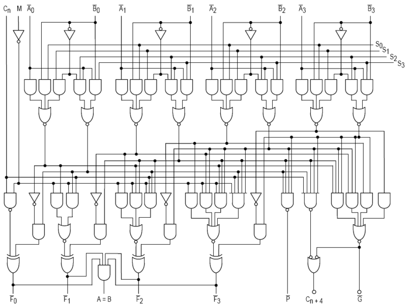
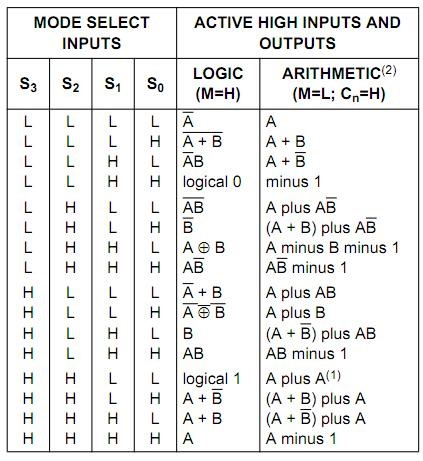

## 14.15 Aritmeticko-logická jednotka (ALU) {#14-15-aritmeticko-logick-jednotka-alu}

Asi nejsložitější obvody, které můžete stvořit kombinační technikou, jsou násobičky a aritmeticko-logické jednotky (ALU). Takové obvody mívají většinou dva vícebitové vstupy, jeden vícebitový výstup, a k tomu sadu řídicích vstupů, které určují, jakou operaci obvod právě dělá. Většinou mívá i jakési „vedlejší výstupy“, třeba přenos nebo informaci o tom, že jsou si čísla rovna.

Reálným příkladem takového obvodu je obvod 74181\. Tento obvod zpracovává dva čtyřbitové vstupy (A0-A3 a B0-B3) a nabízí sadu funkcí pro sčítání, odčítání, logické operace či posuny, a to s přenosem i bez přenosu. Funkce se vybírají pomocí čtyřbitového řídicího vstupu S0-S3\. Pro zajímavost se podívejme na schéma:

CC BY-SA 3.0, Link

Sčítání dvou čísel zabralo tomuto obvodu 22 nanosekund. Verze „Schottky“ 74S181 sčítala dvě čísla 11 nanosekund, rychlá verze 74F181 sedm nanosekund. Rychlost byla dána rychlostí přepínání hradel a tvořila technologický limit – nějaké „zvyšování kmitočtu“ nepomohlo. Důvod je ten, že sčítačka sčítá všechny pozice najednou, a jediné, co ji brzdí, je právě zmíněný technologický limit, který se projeví jako zpoždění při přenosu z nižšího řádu do vyššího.

Funkce se volily jednak pomocí výběru S0-S3 a dále pak vstupem, který přepínal logické a aritmetické instrukce (M). Obvod pracoval buď v normálním režimu, nebo v negovaném. Za normálního režimu dokázal následující operace (Cn je přenos z nižšího řádu):

Násobení nevedeme... Násobilo se buď postupně, nebo existovala hardwarová násobička – velmi specializovaná součástka. Pro vícebitové operace se zapojovalo několik těchto obvodů vedle sebe a propojovaly se pomocí přenosu Cn. Protože zpoždění signálu mohlo ovlivnit výsledek, používal se obvod 74182 pro „předvídání přenosu“.

Předvídání přenosu je postup, kdy pomocí jednoduché kombinační logiky rychle tipneme, zda výsledek „přeteče“, a dál s tímto odhadem pracujeme, takže pro většinu případů získáme výsledek rychleji.

Aritmeticko-logická jednotka je základem každého moderního procesoru. Dnes už je integrovaná přímo na čipu, ale v dřevních dobách let 60\. a 70\. se opravdu skládala z hradel, později z takovýchto málobitových jednotek vedle sebe.

##### 15 Sedmisegmentovky LED {#15-sedmisegmentovky-led}
