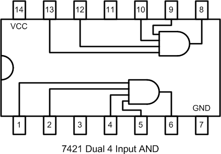

## 14.5 Mimochodem, když máme NAND, co ty ostatní? {#14-5-mimochodem-kdy-m-me-nand-co-ty-ostatn}

Už víme, že 7400 je čtveřice hradel NAND. V první kapitole jsme používali i obvod 7404, což je šestice invertorů.

Co ta ostatní hradla? Máme někde invertory, hradla NOR, AND, XOR? Máme někde třívstupová hradla? Čtyřvstupová?

Máme! Nejlépe je najdete v různých přehledech rodiny 74xx, ale protože jsou tak různě na přeskáčku, tak jsem si řekl, že bude dobře, když si je tu shrneme a ukážeme si i zapojení. S dovolením tedy – velký přehled hradel!

| Funkce | Varianta | Základní | Schmitt | OC |
| --- | --- | --- | --- | --- |
| OR | 4 dvouvstupová hradla | 7432 |  |  |

Vývody základní verze

| Funkce | Varianta | Základní | Schmitt | OC |
| --- | --- | --- | --- | --- |
| NOR | 4 dvouvstupová hradla | 7402 | 74232 | 7433 |

Vývody základní verze

| Funkce | Varianta | Základní | Schmitt | OC |
| --- | --- | --- | --- | --- |
| NOR | 3 třívstupová hradla | 7427 |  |  |

Vývody základní verze

| Funkce | Varianta | Základní | Schmitt | OC |
| --- | --- | --- | --- | --- |
| AND | 4 dvouvstupová hradla | 7408 |  | 7409 |

Vývody základní verze

| Funkce | Varianta | Základní | Schmitt | OC |
| --- | --- | --- | --- | --- |
| AND | 3 třívstupová hradla | 7411 |  | 7415 |

Vývody základní verze

| Funkce | Varianta | Základní | Schmitt | OC |
| --- | --- | --- | --- | --- |
| AND | 2 čtyřvstupová hradla | 7421 |  |  |

Vývody základní verze

| Funkce | Varianta | Základní | Schmitt | OC |
| --- | --- | --- | --- | --- |
| NAND | 4 dvouvstupová hradla | 7400 | 7424 | 7401 |

Vývody základní verze

| Funkce | Varianta | Základní | Schmitt | OC |
| --- | --- | --- | --- | --- |
| NAND | 3 třívstupová hradla | 7410 |  | 7412 |

Vývody základní verze

| Funkce | Varianta | Základní | Schmitt | OC |
| --- | --- | --- | --- | --- |
| NAND | 2 čtyřvstupová hradla | 7420 | 7413 | 7422 |

Vývody základní verze

| Funkce | Varianta | Základní | Schmitt | OC |
| --- | --- | --- | --- | --- |
| NAND | 1 osmivstupové hradlo | 7430 |  |  |

Vývody základní verze

| Funkce | Varianta | Základní | Schmitt | OC |
| --- | --- | --- | --- | --- |
| XOR | 4 dvouvstupová hradla | 7486 |  | 74136 |

Vývody základní verze

| Funkce | Varianta | Základní | Schmitt | OC |
| --- | --- | --- | --- | --- |
| NOT | 6 invertorů | 7404 | 7414 | 7405 |

Vývody základní verze

V tabulce jsou kromě základních typů uvedené i typy se Schmittovým obvodem na vstupu. O něm jsme si už říkali – slouží k ochraně obvodů před signály, které nejsou dostatečně strmé. Další sloupec ukazuje obvody s otevřeným kolektorem na výstupu. V tuto chvíli to nechme stranou, později v této kapitole si o nich povíme víc.
