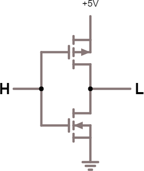

## 16.3 MOS, CMOS {#16-3-mos-cmos}

Až do této chvíle jsme si popisovali obvody, nazývané jako „bipolární“. To proto, že používají takzvané _bipolární tranzistory_ NPN. Místo bipolárních tranzistorů můžeme ale použít tranzistory MOSFET. Už jsem je představoval, tak to jen bleskem zopakuju: FET znamená Field-Effect Transistor, MOS odkazuje na jeho uspořádání: Metal-Oxid-Semiconductor. Na rozdíl od bipolárních tranzistorů, řízených protékajícím proudem, jsou tranzistory MOS řízeny napětím. V praxi to znamená, že vstupem takového obvodu teče téměř nulový proud a chová se tedy jako by měl (téměř) nekonečný odpor.

N-MOS se spíná pozitivním napětím řídicí elektrody (gate) proti společné (source). Technologie P-MOS to má přesně obráceně. Technologie MOS má mnoho výhod, a jednou z nich je to, že se na stejnou plochu křemíkového čipu vejde víc logiky. Proto se obvody TTL dělaly nanejvýš ve středním stupni integrace (MSI – čítače, dekodéry, multiplexery). Vyšší stupeň integrace (LSI, VLSI), potřebný pro složitější obvody včetně mikroprocesorů, vznikaly technologií MOS. Nejprve šlo o P-MOS, ale později přišla rychlejší NMOS, bohužel s vyšším odběrem.

Pokud se v logickém prvku zkombinovaly obě tyto technologie, vznikl CMOS (Complementary MOS).

Vidíte, že díky použití dvou rozdílných tranzistorů, které jsou zapojené „proti sobě“, získáváme téměř ideální invertor, kterým v klidovém stavu neteče téměř žádný proud. Spotřeba je tedy nula nula nic. Ovšem – jen teoreticky. V praxi je vlivem technických nedokonalostí a parazitních kapacit situace spíš takováto:

Při přepínání krátkodobě vyskočí proud protékající obvodem. Na druhou stranu oproti hradlům TTL je to vysloveně nic. Obvody CMOS (řady 40xx) mají proti TTL mizivou spotřebu, mohou pracovat v širokém rozmezí napájecího napětí, ale na druhou stranu jsou pomalejší a jejich úrovně jsou nekompatibilní s TTL.

Pokud obvody CMOS napájíme 5 V, je pro ně logická 0 na vstupu v rozmezí 0 V až 1,3 V. Logická 1 je 3,7 V až 5 V. Na výstupu je v log. 0 maximálně 0,2 V, v log. 1 pak minimálně 3,7 V. Vstupy CMOS mají hodně velké „zakázané pásmo“ (1,3 V až 3,7 V), a střední hodnota (prahové napětí pro přepnutí) je okolo 2,5 V – tedy už v oblasti, kde je TTL logická 1.

Naštěstí v dnešní době technologie pokročila dopředu., a dnešní moderní CMOS jsou mnohem rychlejší, a třeba řada HCT má napěťové úrovně kompatibilní s TTL a představuje tak reálně „to nejlepší z obou světů“.

##### 17 „Plnou parou vzad!“ – „Ale jak daleko?“ {#17-plnou-parou-vzad-ale-jak-daleko}
