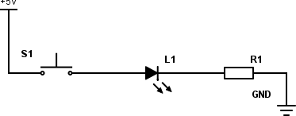
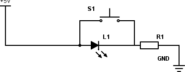
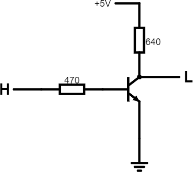
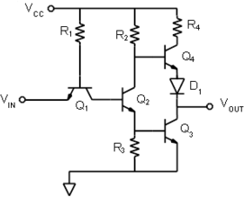

# 16 Jak vypadá hradlo uvnitř {#16-jak-vypad-hradlo-uvnit}

Tahle kapitola není povinná. Nemusíte ji znát, ale je dobré, když se k ní třeba za čas vrátíte. V ní totiž zjistíte, jak jsou hradla udělaná „vevnitř“. Jak je poskládané z těch tranzistorů či čeho, jaký je rozdíl mezi TTL a CMOS, co se děje, když se něco děje, proč se řídicí signály často používají negované, proč se k obvodům zapojuje odrušovací kondenzátor…

Tranzistor je prvek, který je vlastně základním stavebním kamenem celé číslicové techniky. Na rozdíl od analogové, kde máme tranzistory rádi, protože zesilují slabé signály, tak v číslicové spíš využíváme toho, že tranzistor se za jistých podmínek sepne pro procházející proud, a to podle proudu, který prochází bází.

Základní prvek je invertor. Musíme nějak dokázat, aby na výstupu byl proud, pokud na vstupu není, a obráceně.

Začneme úplně od lesa. Zapojte si do série tlačítko, LED a rezistor tak, aby LED svítila, když zmáčknete tlačítko. Máte? Nějak takhle to bude:

A teď výzva: Zapojte to tak, aby to fungovalo obráceně, totiž aby LED ZHASLA, když zmáčknete tlačítko.

_Chvíle pro přemýšlení..._

_Ještě chvíle pro přemýšlení..._

Máte to?

Napovím: Proud jde cestou menšího odporu. A co má menší odpor – tlačítko, nebo dioda? Navíc jsme to probírali už u fotorezistoru a detektoru tmy!

Dobře, tak takhle:

Když tlačítko pustíte, jde proud přes rezistor do diody. Když tlačítko zmáčknete, teče místo toho většina tím tlačítkem.

No, a teď využijeme toho, že tranzistor je vlastně takový „proudem řízený spínač“. Postavte si toto:

Princip je jednoduchý: Když je na vstupu logická 0 (L), tedy vstup je spojen (více méně) se zemí, je tranzistor zavřený, a proud teče přes rezistor 640 ohmů z napájecího napětí na výstup. Jakmile na vstup přivedeme log. 1 (H), tranzistor se otevře a spojí výstup se zemí. Na výstupu bude tedy logická 0.

[eknh.cz/rtlinverter](https://eknh.cz/rtlinverter)

Hradlo NAND bude na podobném principu:

[eknh.cz/rtlnand](https://eknh.cz/rtlnand)

Pokud tranzistory zapojíme paralelně, namísto sériově, získáme hradlo NOR.

[eknh.cz/rtlnor](https://eknh.cz/rtlnor)

Takovéhle logické elementy opravdu existovaly. Říkalo se jim RTL – Resistor-Transistor Logic – a už jsem psal, že byly použité například v naváděcím počítači Apolla. Měly ale obrovskou spotřebu (podívejte se, jaké proudy tečou hradlem NAND, když jsou oba tranzistory otevřené), nebyly moc odolné proti rušení atd. Vývoj proto přinesl další technologii, a tou byla TTL, neboli transistor-transistor logic.

Výhodou TTL proti RTL je nižší spotřeba a větší rychlost. Nevýhodou pak to, že potřebujete výrazně vyšší počet tranzistorů na logickou funkci. Na výše uvedeném invertoru je to vidět – tranzistor úplně vlevo, připojený emitorem ke vstupu (Q1), slouží ke spínání centrálního tranzistoru (Q2). Pokud je vstup na nízké logické úrovni, teče proud skrz první tranzistor ven (ano, teče proud ze vstupu…) Při napájecím napětí 5 V a omezovacím odporu R1 o velikosti 100k jde o necelých 50 uA. Centrální tranzistor Q2 je tak uzavřen, a proud teče přes rezistor R2 do báze tranzistoru Q4\. Ten je tak otevřen, a na výstup je přes R4 a D1 přivedeno napájecí napětí. Q3 je uzavřen díky odporu R3 v bázi.

Pokud na vstup přivedeme logickou 1 (H), dostane se toto napětí na bázi Q2, který se otevře. Proud nyní putuje přes R2 a Q2 do báze Q3\. Q4 je tedy zavřený, Q3 otevřený, a výstup je propojen přes něj se zemí.

Toto řešení výstupu pomocí dvou tranzistorů, rezistoru a diody se nazývá též _totem_. Připomíná Darlingtonovo zapojení, které dovoluje spínat velké proudy. Díky tomu lze výstup zatížit poměrně velkou zátěží. U standardní řady TTL lze na jeden výstup hradla připojit až deset vstupů.
