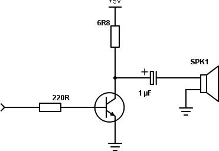
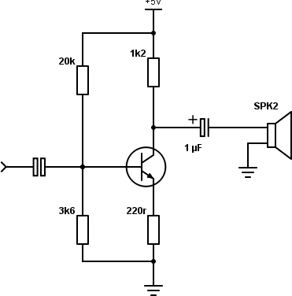
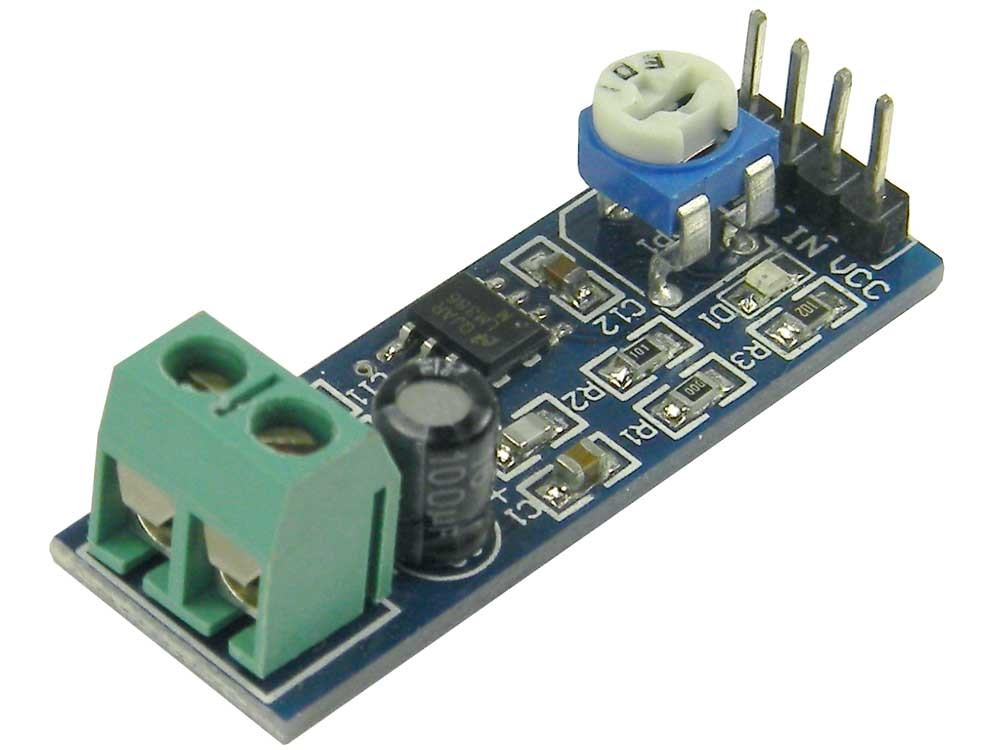
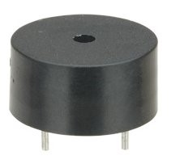
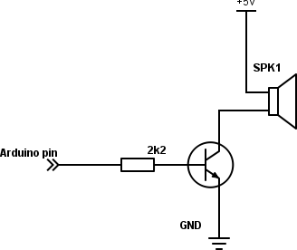

## 17.1 Ještě pípat! {#17-1-je-t-p-pat}

Takový parkovací senzor ale většinou taky pípá, to aby řidič nemusel sledovat displej a mohl se soustředit na couvání. Otázka tedy zní: Jak udělat zvuk? Jak udělat to pípání?

Asi víte, že zvuk je vlnění, přenášené hmotou, že podle počtu kmitů za sekundu člověk rozlišuje výšku tónu. Možná nevíte, že tón o dvojnásobné frekvenci vnímáme jako o „oktávu vyšší“, ale můžete si to sami vyzkoušet s plastovým pravítkem a stolem.

Máte? A jste v tiché kanceláři, kde to vzbudí pořádnou nevoli u kolegů? Pokud ano, tak jděte raději vedle. Položte pravítko na stůl tak, aby bylo ve vzduchu třeba svou polovinou. A drnkněte. Slyšíte ten rachot? Tak, a když teď posunete pravítko tak, aby přesahovala jen čtvrtina, uslyšíte rachot o oktávu vyšší. Kytaristi to znají – když stisknou strunu E přesně uprostřed, bude hrát zase E, ale o oktávu výš.

No dobře, a co tedy my s elektronikou? Jak můžeme udělat zvuk? Máme na výběr několik možností. Jedna z možností je reproduktor se zesilovačem. Bez zesilovače to není moc dobrý nápad, protože reproduktor potřebuje velký proud (má malý odpor).

Samozřejmě existuje jednoduché zapojení tranzistorového zesilovače pro reproduktor. Na webu naleznete desítky jednoduchých zapojení, která budou vypadat třeba nějak takto:

Zkušený elektronik v nich odhalí hned několik nectností (například chybějící oddělovací kondenzátor na vstupu) a z hlavy nakreslí mnohem vhodnější zapojení:

Takovéhle zapojení má mnohem menší zkreslení, teplotní stálost, nižší šum a je „čistší“ než to předchozí, ale ty hodnoty rezistorů nespadly odněkud shůry, ty si musíte poměrně zdlouhavě spočítat podle napájecího napětí a typu tranzistoru…

Hodnoty rezistorů jsem se jako mladý elektrotechnik učil počítat, a zařekl jsem se, že to v téhle knize nebudu dělat. Já vás nechci zmučit počítáním něčeho, co si můžete koupit hotové v různých obchodech s elektronickými moduly. Hledejte „audio amplifier module“, třeba s obvodem LM386:

Do zelených svorek zapojíte reproduktor. Čtyři piny na opačné straně jsou označené „GND – GND – IN – VCC“. Krajní dva (GND a Vcc) slouží pro napájecí napětí reproduktoru (5 až 12 voltů), prostřední dva (GND a IN) jsou audio vstup. GND připojte na společnou zem s Arduinem, IN na některý z datových pinů v Arduinu. _Vynechte piny 0 a 1, ty slouží ke komunikaci, a kdybyste připojili zesilovač na ně, asi byste se při programování nestačili divit. Ale klidně si to zkuste…_

Tak, tohle by bylo. Dejme tomu, že jste zapojili zesilovač na pin 4\. Jak teď udělat pípnutí?

No, asi vás to nepřekvapí: použijte zase stejný kód jako pro blikání LEDkou, jen místo delay(1000) použijte třeba delay(1) – parametr funkce delay() říká, kolik milisekund se má čekat, pokud budete před každým přepnutím čekat 1 ms, bude celková doba jednoho taktu rovna (zhruba) 2 ms, tedy frekvence bude okolo 500 Hz (f {Hz} = 1 / T {s}).

Nechte cyklus proběhnout třeba pětsetkrát – tím získáte jednosekundové pípnutí tónem o výšce 500 Hz, což je tón, zhruba odpovídající komornímu H (komorní A je tón s frekvencí 440 Hz, ten náš je o kousek vyšší).

Druhá možnost je použití piezobzučáku. Vypadají jako takové malé válečky s otvorem a dvěma nožičkami.

Takových bzučáků je mnoho typů – některé vyžadují vyšší napětí, třeba 12 voltů, další se spokojí s pěti volty. Některé z nich při zapojení stejnosměrného napětí pískají samy na nějaké frekvenci, dané konstrukcí, jiné fungují jako maličké reproduktorky. Velké množství konstrukcí je připojuje přímo k Arduinu na digitální piny.

Já bych tu byl trochu opatrnější a zvolil bych způsob, při kterém se bude spínat větší proud, který… aha, už víte? Že už je to pro vás obnošená vesta? To rád slyším. Tak jak to bude?

No, pro spínání použijeme tranzistor (správně), zvolíme běžný NPN, protože ten se spíná kladným napětím proti zemi, a použijeme to nejjednodušší zapojení, kde tranzistor nezesiluje proud, jen funguje jako spínač, protože to potřebujeme. Tedy nějak takto:

Mezi Arduinem a tranzistorem je ten rezistor proč? Aha? No protože Arduino pustí na výstup ve stavu logické 1 svých 5 voltů, a bez vhodného omezení by tekl maximální proud. S rezistorem jeho velikost omezíte – rezistor 2K2 pustí při 5 voltech něco málo přes 2 mA, což je proud bezpečný a Arduino to ustojí!

Pamatujte si, že jediným pinem by neměl téct proud větší než 20 mA, a že není rozumné pouštět do mnoha pinů najednou velký proud, protože snadno překročíte interní maximální proudy a Arduino se vám bude zbytečně přehřívat, nebo se dokonce spálí.

##### 18 Zpětná vazba {#18-zp-tn-vazba}
