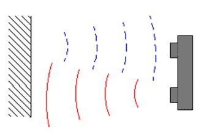
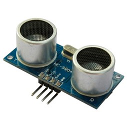
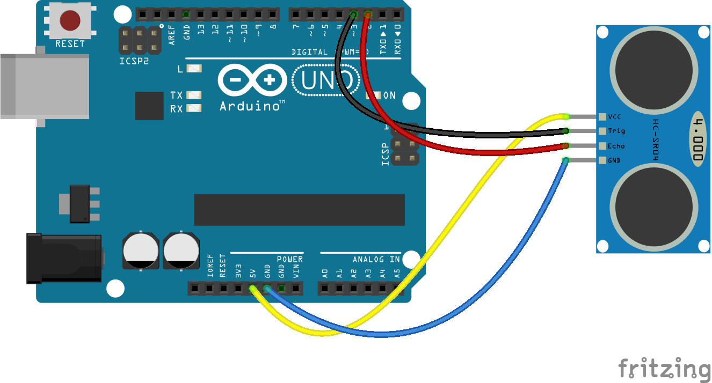

# 17 „Plnou parou vzad!“ – „Ale jak daleko?“ {#17-plnou-parou-vzad-ale-jak-daleko}

Ne, nezbláznil jsem se, nebojte… Chtěl jsem vás jen nečekaným titulkem připravit na další pokus. Na chvíli si zase odpočineme od kombinačních obvodů a postavíme si něco s Arduinem.

Asi víte, jak funguje takzvaný parkovací asistent v autě. Je to takové nenápadné zařízení na palubní desce, které ukazuje, jak daleko za zadním nárazníkem máte překážku – tedy jiné auto, zeď, chodce, …

Fungování takového zařízení je jednoduché: v nárazníku jsou namontované reproduktory, které vysílají zvukový signál. Ten se odrazí od překážky a vrátí se zpět. Reproduktor v tu chvíli funguje jako mikrofon, odraženou vlnu zachytí a převede ji na impuls. Řídicí elektronika jen počítá čas, který uplyne od vyslání impulsu („pípnutí“) do jeho příchodu zpátky.

Říkáte si, že zvuk letí hodně rychle? No, jak se to vezme. Rychlost šíření zvuku ve vzduchu záleží na mnoha faktorech, ale zhruba lze říct, že za jednu sekundu uletí 340 metrů. Což se zdá jako velká vzdálenost, ale když si uvědomíte, že v elektronice pracujeme běžně s mnohem kratšími časy, třeba milisekundami, a že takové Arduino udělá 16 operací každou mikrosekundu, tak to zas tak závratná rychlost není, že? Za jednu milisekundu zvuk urazí tedy pouhých 34 centimetrů. A když si uvědomíte, že musí letět k překážce a zpátky, tedy urazit dvě cesty, tak vám vyjde, že pokud se zvuk vrátí za jednu milisekundu, tak je překážka vzdálená pouhých 17 centimetrů.

Parkovací asistent většinou používá čtyři takové senzory, které slouží zároveň jako reproduktor i mikrofon. Pro amatérské konstrukce jsou dobře dostupné senzory HC-SR04, které používají dvojici reproduktor-mikrofon.

Tyto levné moduly jsou uzpůsobené pro napájení 5 V (vstupy GND a VCC), a mají dva další vývody: Trig, kterým se spouští ono „písknutí“, a Echo, které oznamuje, že mikrofon přijal signál. Délka pulsu na výstupu Echo odpovídá naměřené vzdálenosti. Modul pracuje s ultrazvukem na frekvenci 40 kHz, což je vysoko nad tím, co dokáže slyšet lidské ucho (to slyší tóny zhruba v rozsahu 20 Hz až 20 kHz).

Postavit si měřič vzdálenosti s takovým modulem a Arduinem je velmi snadné – stačí propojit vývody Trig a Echo s datovými piny a zapojit napájení podle obrázku.

Já zapojil Echo na pin 2 a Trig na pin 3.

Obslužný program má jen pár řádků – ve funkci Setup je potřeba nastavit správně vstupy a výstupy, a ve smyčce pak posílat pulsy, dlouhé 10 mikrosekund na vstup Trig (pin 3) a čekat na odpověď na pinu 2\. K tomu slouží funkce pulseIn(), která měří délku pulsu (v mikrosekundách).

<pre class="kod">#define ECHOPIN 2 // Echo pin z HC-SC04 na pin 2 </pre>

<pre class="kod">#define TRIGPIN 3 // Trig pin z HC-SC04 na pin 3 </pre>

<pre class="kod">void setup() { </pre>

<pre class="kod">    //Nastaví sériovou komunikaci </pre>

<pre class="kod">    Serial.begin(9600); </pre>

<pre class="kod">    //Nastaví pin 2 jako vstupní </pre>

<pre class="kod">    pinMode(ECHOPIN, INPUT); </pre>

<pre class="kod">    //Nastaví pin 3 jako výstupní </pre>

<pre class="kod">    pinMode(TRIGPIN, OUTPUT); </pre>

<pre class="kod">    digitalWrite(TRIGPIN, LOW); </pre>

}  

<pre class="kod">void loop() { </pre>

<pre class="kod">    // Vyšle impuls do modulu HC-SR04 </pre>

<pre class="kod">    digitalWrite(TRIGPIN, HIGH); </pre>

<pre class="kod">    delayMicroseconds(10); </pre>

<pre class="kod">    digitalWrite(TRIGPIN, LOW); </pre>

<pre class="kod">    // Spočítá vzdálenost </pre>

<pre class="kod">    float distance = pulseIn(ECHOPIN, HIGH); </pre>

<pre class="kod">    distance= distance*0.017315f; </pre>

<pre class="kod">    // odešle informace na sériový port </pre>

<pre class="kod">    Serial.print(distance); </pre>

<pre class="kod">    Serial.print(„\n„); </pre>

<pre class="kod">    //počká 1 sekundu </pre>

<pre class="kod">    delay(1000); </pre>

<pre class="kod">}</pre>
