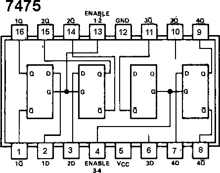
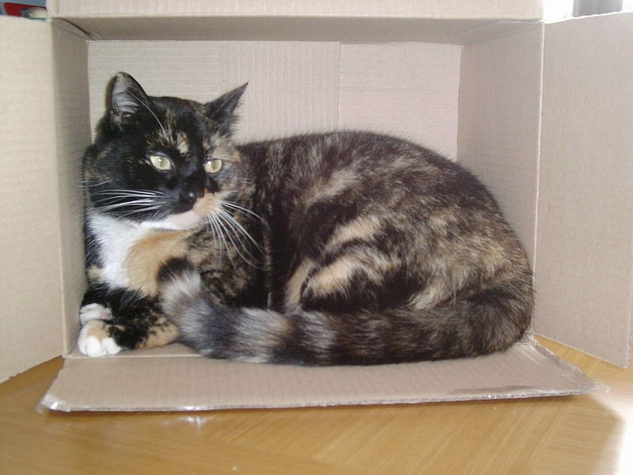

# 18.12 {#18-12}

Reálný latch 7475

Myslím, že vás nepřekvapí, když vám prozradím, že i latch existuje v podobě integrovaného obvodu. Ten nejznámější má označení 7475 a obsahuje dvě dvojice latchů, vždy se společným vývodem E pro každou dvojici.

Tento obvod má o dva vývody víc, než ty, s nimiž jsme se až doteď setkávali (má pouzdro DIP16, předchozí obvody měly DIP14), a taky nedodržuje pravidlo pro napájení. Ostatní obvody, s nimiž jsme se až dosud potkávali, měly napájení „vpravo dole zem“ a „vlevo nahoře napájení“ – tento obvod to má jinak! Zem je na vývodu 12, napájení na vývodu 5, tedy zhruba uprostřed pouzdra.

Proč to výrobce takto udělal? Snad proto, aby nás zmátl? Ne, tak to není. Ve skutečnosti je ten důvod ukrytý ve vnitřní struktuře čipu, kdy se při návrhu ukázalo, že je mnohem snazší navrhnout tento čip tak, že bude mít napájení nikoli v rozích, ale po stranách…

Jsou situace, kdy bude použití 7475 vhodnější pro daný účel. Ovšem obecně platí, že klopné obvody, které jsou řízené úrovní (latche), mohou do systému při nevhodném použití zanést nejednoznačnosti a hazardní stavy, a proto je bezpečnější používat klopné obvody řízené hranou.

19

Panna, nebo orel?

19

Panna, nebo orel?

To takhle sedíte u počítače a přemýšlíte: Mám napsat teď kapitolu o posuvných registrech, nebo raději nějakou praktickou konstrukci? Jak se rozhodnout? Co třeba hodit mincí?

Problém je, pokud jste moderní člověk s bezhotovostními penězi. To si můžete tak akorát hodit platební kartou, a to, uznejte sami, není ono. Můžete si taky pustit počítač a naprogramovat si házení mincí… Anebo si můžete postavit elektronickou házecí minci.

Jako správní nadšenci do číslicové techniky se pustíme do té poslední varianty. Racionální hlas uvnitř hlavy ironicky podotýká, že je to varianta sice nejdražší, zato zabere nejvíc času. Nadšenecký hlas ale říká: No a co? Aspoň se u toho něco naučím!

Zapojení bude jednoduché. Budou tam dvě LED, a bude svítit vždy jen jedna z nich. Pokaždé, když obsluha zmáčkne tlačítko, tak se jedna z nich rozsvítí. Která? No, to by mělo být náhodné!

Zařízení samozřejmě nemusíme používat nezbytně nutně jen na házení mincí. Hodí se třeba i pro chovatele Schrödingerovy kočky, kde poměrně kvalitně simuluje otvírání krabice, a pro spoustu dalších zásadních životních rozhodnutí. Sice nedokáže simulovat stav „mince padla na hranu“, „mince zapadla mezi prkna v podlaze“ a „mince zůstala viset ve vzduchu“, ale na hrubou náhradu to jistě stačí.

Tak. Princip máme. Jak to teď celé poskládat? Vyjdeme od konce, tedy od těch zobrazovacích LEDek. Je potřeba, aby zůstávaly v jednom ze dvou stavů. Tady by se hodilo mít třeba něco jako – jo, něco jako klopný obvod D, který má dva výstupy, Q a /Q, které jsou vždy takříkajíc „v opozici“. No a k nim připojíme ty dvě LED, jednu z nich označíme „panna“ a druhou „orel“ (ti, co si staví Schrödingerovu krabici, si LED označí „živá číča“ a „mrtvá číča“).

Zobrazování bychom měli taky. Teď co s tím tlačítkem?

Vzpomeňte si na kapitolu, kde jsme si představovali obvod 7474 – dvojici klopných obvodů typu D. Mají dva synchronní vstupy, totiž D a CLK. A vstup CLK funguje tak, že propustí do obvodu stav na vstupu D, a to ve chvíli, kdy se na tomto vstupu změní úroveň z log. 0 do log. 1, což je přesně to, co potřebujeme. Přesně tohle totiž udělá naše tlačítko, pokud ho zapojíme na + 5 V – jakmile ho obsluha stiskne, změní se stav z 0 V na + 5 V. To je ta „vzestupná hrana“, která spustí požadovanou akci.

Teď ještě tu náhodu. Jak to zařídit?