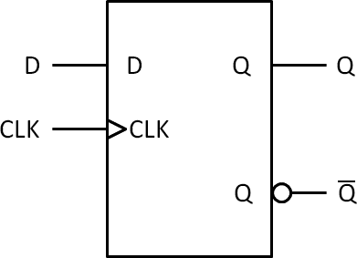

## 18.10 Symbol pro klopný obvod {#18-10-symbol-pro-klopn-obvod}

Už jste si mohli všimnout, že jakmile poskládáte složitější obvod, tak někdo (no dobře, jsem to já) přiběhne a udělá z něj „black box„, obdélník, kde popíše, jaké jsou vstupy (vlevo) a jaké jsou výstupy, a je to.

Stalo se to i s vaším klopným obvodem D. Všimněte si, že vstupy D a CLK jsou vlevo, a u CLK je malá šipka. Ta označuje, že vstup má funkci hodinového vstupu, synchronizace. Dokonce podle směru šipky (do obvodu / z obvodu) můžeme poznat, jestli jde o hodinový vstup spouštěný vzestupnou hranou nebo sestupnou hranou. Kroužek u vstupu nebo výstupu značí negovaný signál, tedy takový který je aktivní v logické 0.

Po pravdě: v technických normách naleznete spoustu speciálních symbolů, které dokáží označit, že daný vstup je například asynchronní a má Schmittův obvod. V praxi, a zejména v amatérských schématech, se setkáte s tak zjednodušenými značkami, že jste vůbec rádi, když autor vyznačí kolečkem invertovaný vývod, a šipka u hodin bývá vrchol snahy. Sice to vzbuzuje úšklebek u odborníků, kteří jsou zvyklí na  jednoznačnost a u zkoušek na škole vás za špatně nakreslený symbol vyhodí, ale – život je takový, a vy máte dvě možnosti: buď budete nadávat na toho, kdo to kreslil, nebo přijmete fakt, že nic a nikdo není dokonalé. Doporučuju druhý přístup.
