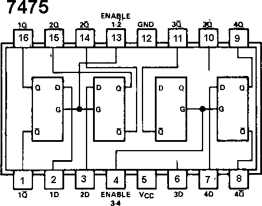

## 18.12 Reálný latch 7475 {#18-12-re-ln-latch-7475}

Myslím, že vás nepřekvapí, když vám prozradím, že i latch existuje v podobě integrovaného obvodu. Ten nejznámější má označení 7475 a obsahuje dvě dvojice latchů, vždy se společným vývodem E pro každou dvojici.

Tento obvod má o dva vývody víc, než ty, s nimiž jsme se až doteď setkávali (má pouzdro DIP16, předchozí obvody měly DIP14), a taky nedodržuje pravidlo pro napájení. Ostatní obvody, s nimiž jsme se až dosud potkávali, měly napájení „vpravo dole zem“ a „vlevo nahoře napájení“ – tento obvod to má jinak! Zem je na vývodu 12, napájení na vývodu 5, tedy zhruba uprostřed pouzdra.

Proč to výrobce takto udělal? Snad proto, aby nás zmátl? Ne, tak to není. Ve skutečnosti je ten důvod ukrytý ve vnitřní struktuře čipu, kdy se při návrhu ukázalo, že je mnohem snazší navrhnout tento čip tak, že bude mít napájení nikoli v rozích, ale po stranách…

Jsou situace, kdy bude použití 7475 vhodnější pro daný účel. Ovšem obecně platí, že klopné obvody, které jsou řízené úrovní (_latche_), mohou do systému při nevhodném použití zanést nejednoznačnosti a hazardní stavy, a proto je bezpečnější používat klopné obvody řízené hranou.

##### 19 Panna, nebo orel? {#19-panna-nebo-orel}
