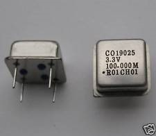
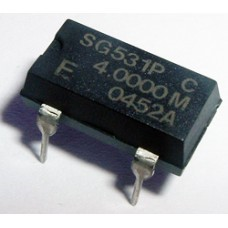
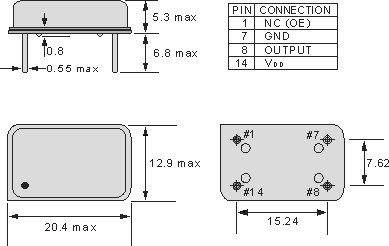

## 18.3 Krystalový oscilátor DIL {#18-3-krystalov-oscil-tor-dil}

Většinou platí, že když je něco v elektronice šikovné a užitečné, tak se objeví někdo, kdo to bude vyrábět. Totéž platí i pro krystalové oscilátory.

Krystal potřebuje ke své práci invertor a několik dalších součástek. Proto se, logicky, nabízí varianta „uzavřít to všechno do jednoho pouzdra“. Nějak takto:

Nebo takto:

Nejčastěji tedy v podobě pouzder DIL8 nebo DIL14, ačkoli jsou osazené jen čtyři. Vývody 7 a 14 bývají většinou napájecí, stejně jako třeba u 7400, vývod 8 (křížem naproti zvýrazněnému vývodu 1) bývá výstup, vývod 1 není zapojen, nebo funguje jako „povolovací“ (1 = oscilátor běží).

Takovéto oscilátory se vyrábějí v širokém rozmezí frekvencí, od 1 MHz po stovky MHz. Vyrábějí se i v provedení „low voltage“, v provedení pro povrchovou montáž a v dalších.
