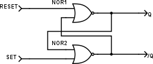
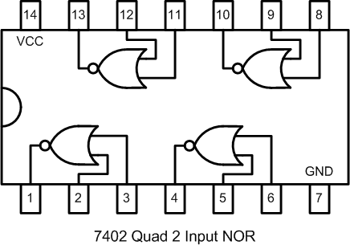

## 18.6 Bistabilní klopný obvod R-S {#18-6-bistabiln-klopn-obvod-r-s}

Můžeme v našich experimentech se zaváděním zpětné vazby pokračovat. Zkusíme to s dvouvstupovým hradlem, kdy do jednoho vstupu zapojíme výstup hradla, a na druhý budeme přivádět log. 1\. Moc zajímavé to není. Co si takhle vzít dvě hradla a zapojit je křížem? Nějak takhle

Zapojte si obvod 7402 podle tohoto schématu. Pozor – obvod má jinak vstupy a výstupy hradel, než má 7400! Podívejte se do datasheetu nebo na následující obrázek:

Nyní pozor, opět bude přemýšlení. Zkusíme si tak nějak z hlavy zjistit stav na výstupu hradla NOR1\. Dejme tomu, že vstup, označený Reset, je v log. 0\. Co bude na výstupu z hradla? To záleží na hodnotě druhého vstupu, a ten je připojený na výstup hradla NOR2\. Jeho hodnota záleží na tom, co je na vstupu Set (dejme tomu, že i tam je 0) a na tom, co je na druhém vstupu... který je připojený na výstup NOR1... který... a jsme v nekonečné smyčce…

Ale dejme tomu (_dejme tomu!_), že na výstupu NOR2 je logická 0\. Na výstupu NOR1 bude tedy 1 (0 NOR 0 = 1). Tato jednička je přivedena na vstup NOR2\. Společně s nulou na vstupu Set dají dohromady nulu na výstupu NOR2 (1 NOR 0 = 0). Obvod je takto stabilní. Q je 1, not Q (označil jsme ho /Q) je 0, oba vstupy jsou nulové.

Co se stane, když na vstup Reset přivedu 1? Na vstupech NOR1 teď bude 1 a 0, výsledek bude tedy 0 a Q se změní na 0\. Tato nula se ale přenese i na vstup hradla NOR2, kde spolu s nulou od vstupu Set vytvoří jedničku na výstupu NOR2 (0 NOR 0 = 1). Na výstupu /Q bude tedy 1\. Tato jednička se přenese na NOR1, s jedničkou ze vstupu RESET vytvoří zase nulu, takže se na výstupu nic nemění, a tento stav bude trvat po celou dobu, co bude na vstupu Reset logická 1.

A co se stane, když se Reset teď vrátí do logické 0? Ve světě kombinačních obvodů by platilo, že pro určitou kombinaci vstupních hodnot (Reset = Set = 0) je vždy jen jedna platná kombinace hodnot výstupních. Se zpětnou vazbou to tak úplně neplatí. Chvilku se nad tím zamyslete, třeba si i namalujte, kde jsou ty jedničky a nuly... Už to vidíte? Já to radši zvýrazním:

Obvod zůstává ve stavu, v jakém byl předtím!

Všimněte si, že u obvodů se zpětnou vazbou, tedy takových, kde je na vstup nějakým způsobem zapojený některý z výstupů, musíme už brát v úvahu něco, čemu se říká _předchozí stav_. Zatímco dosud jsme se setkávali s obvody, kde se změna neuvažovala, respektive bralo se, že je okamžítá a vždy dopředná, v obvodech se zpětnou vazbou může mít obvod cosi jako „vnitřní stav“. To  kombinační obvody, které jsme probíral v minulé kapitole, nemají. Kombinační obvod sám o sobě nemá žádný vlastní stav, a jeho výstup je vždy závislý pouze na stavu vstupů v daném okamžiku.

Zkuste si chování takového obvodu prozkoumat. Co se stane, když přivedete 1 na Set? Co když budou na obou vstupech nuly? Co když budou na obou vstupech jedničky?

| Reset | Set | Q | /Q |
| --- | --- | --- | --- |
| 0 | 0 | Qn-1 | /Qn-1 |
| 0 | 1 | 1 | 0 |
| 1 | 0 | 0 | 1 |
| 1 | 1 | 0(X) | 0(X) |

Symbolem „Qn-1“ se označuje „stav předtím„. Pokud je reset i set roven 0, udržuje obvod předchozí stav. Vstup Set nastaví jedničku na výstupu Q, vstup Reset nastaví na výstupu 0\. Výstup /Q je „negovaný Q“. Co se stane, když aktivujete oba vstupy, Set i Reset? Obvod se dostane do takzvaného „zakázaného stavu“, též hazardního. Proč hazardní? Představte si, že ze stavu „Set = Reset = 1“ přejdou oba vstupy naráz do stavu 0\. Co se stane s výstupy? Správně, začnou kmitat. V reálu ale kmitat nezačnou, v reálu se vzhledem k různým nedokonalostem a asymetriím překlopí jeden výstup do 1 a druhý do 0\. Který? No, to je právě to, co nelze předvídat, proto „hazardní stav“. Konstruktéři se proto snaží důmyslnými zapojeními předejít tomu, aby se na vstupech takového klopného obvodu objevily zakázané hodnoty.

### 18.6.1 Klopný obvod s hradly NAND {#18-6-1-klopn-obvod-s-hradly-nand}

Co se stane, když hradla NOR nahradíte hradly NAND? Zkuste si nahradit obvod 7402 obvodem 7400\. A pozor, musíte jej pozapojovat jinak, v obvodu 00 jsou hradla „otočená“!

Jak označíte vstupy u takového obvodu?

Po troše zkoumání přijdete na to, že takový obvod funguje, jako by měl invertované vstupní signály – klidový stav je 1, aktivní 0, takže by bylo fér vstupy označit jako /R a /S
