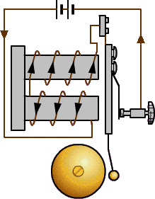

# 18 Zpětná vazba {#18-zp-tn-vazba}

Když už jsme tu nakousli to pípání a bzučení – pamatujete se na staré elektrické domovní zvonky? Tam byl elektromagnet a kovová kotva, která břinkala do toho kovového zvonivého objektu. Jakmile se pustil proud, elektromagnet přitáhnul kotvu – ale tím se zároveň přerušil obvod, takže elektromagnet pustil, kotva se vrátila zpět, ale tím opět sepnula obvod, takže elektromagnet přitáhnul...

Výsledek tedy byl ten, že s určitou frekvencí, danou mechanickými vlastnostmi té kotvy, především její setrvačností, střídalo zařízení dva stavy.

[eknh.cz/zvnk](https://eknh.cz/zvnk)

A teď myšlenkový pokus, ano? Máme invertor. Víme, že když má na vstupu 0, má na výstupu 1\. Když má na vstupu 1, má na výstupu 0\. Zkrátka je vždycky v opozici, asi jako ten elektromagnet s kotvou u zvonku... Co kdybychom ho donutili, aby byl v opozici se sebou samotným?! Vytvořili bychom paradox? Zakázaný stav? Nestvořili bychom časoprostorovou trhlinu? Nebo by to fungovalo jako ten zvonek?

No, schválně si to představte. Na vstupu je 0\. Tedy na výstupu je 1\. Tu přivedeme na vstup, takže na výstupu bude 0\. Tu přivedeme na vstup, takže na výstupu bude 1\. Tu přivedeme na vstup, takže... Takže se to celé buď ustálí v nějakém stavu „ani ryba, ani rak, logická hodnota 0.5“, nebo se to rozkmitá, že?

Bé je správně! Invertor má totiž taky určité dynamické vlastnosti, stejně jako ta kotva, a nepřepíná úplně hned, chvilku mu to trvá. Jakou chvilku? No, u toho starého dobrého TTL invertoru 7400 to bylo okolo 10 ns. Řada 74ALS má okolo 4 ns, řada 74S okolo 3 ns, „rychlá“ řada Fast (74F) přepne za 2.5 ns. Nízkoodběrová řada 74L měla zpoždění 33 ns (používám minulý čas, protože i tato řada je dnes minulostí). Ve skutečnosti to bylo ještě složitější, protože zpoždění se lišilo podle toho, jestli se přepíná z 0 do 1, nebo z 1 do 0, ale to můžeme v našem případě zanedbat.

Většinou nevadí, když do zapojení dáte místo obvodu 74LS00 třeba obvod 74ALS00 nebo 74L00\. Nějak to fungovat bude. Ale u složitějších (a rychlých) obvodů může pomalejší kus způsobovat velmi výrazné změny funkce (většinou směrem k horšímu, jak jinak). Někdy to platí i obráceně – že zapojení, které stavíte, buď schválně, nebo v důsledku „race condition“, bude fungovat pouze s pomalejší řadou, protože autorovi zpoždění někde k něčemu pomohlo.

Pokud je zpoždění 10 nanosekund, bude frekvence, na které to celé kmitá, rovna 1/t, tedy 100 MHz. Což je hodně moc. Já vím, že s 2.4 GHz rádiem a třígigovými procesory v notebooku vám to nepřipadá, ale v číslicové technice, kde se budeme pohybovat my, je vrcholem tak těch 24 MHz pro procesor 8052, ale ještě častěji spíš 16 MHz v Arduinu. Staré procesory běží na 2 MHz, popřípadě 4 MHz. Takže pokud se něco rozkmitá na 100 MHz, věští to problémy.
