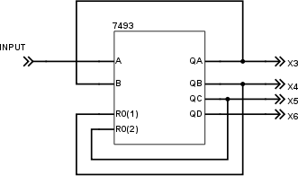

### 19.1.1 {#19-1-1}

Jaké hodnoty RC zvolit, když vím jen to, že součin má být XYZ?

To je dobrá otázka. Něco podobného vyprávěl Feynman ve své knize vzpomínek, když líčil, jak kombinoval ozubená kola, aby dostal určitý poměr. Starší zkušený technik mu dal radu: „Vezmi katalog ozubených kol, vynech kola s příliš velkým počtem zubů a s příliš malým počtem zubů, a z těch středních hodnot to nějak nakombinuj!“

Dělejte to úplně stejně. Vyhněte se hodnotám příliš nízkým i příliš vysokým, a pokud to jde, použijte „zlatý střed“. A vždy začněte tím, co máte doma. Já bych sáhnul po kondenzátoru 100 nF, protože těch mám doma dost, a hlavně proto, že mám výrazně méně hodnot kondenzátorů (vlastně jen 100n, 33p a pak elektrolyty) než rezistorů (těch mám asi 30 základních hodnot).

Jak to vychází pro 100 nF?

R = 0,00045 / 0,0000001 = 4500\. Tedy odpor 4k5\. Ten nemám, sáhnu tedy po odporu 4k7\. Bude to nějak moc vadit?

f = 1 / (2,2 × 4700 × 0,0000001) = 967 Hz (zhruba).

Což je hodnota přijatelná, v toleranci – ono je jedno, jestli to bude 1 kHz, nebo 0,967 kHz, důležité je, že to je „dost rychle na to, aby člověk nedokázal vychytat frekvenci“.

Kdybych neměl 4k7, dám tam 3k3, výsledná frekvence bude f = 1 / (2,2 × 3300 × 0,0000001) = 1377 Hz, tedy necelých 1,4 kHz.

Dobrá. Tohle všechno je OK, ale co kdybych chtěl tu frekvenci fakt přesnější? Měl bych hledat přesné rezistory a kondenzátory? Mohl bych, ale byla by to marná práce, protože oscilátor, založený na kondenzátoru a rezistoru, se bude velmi pravděpodobně rozlaďovat. Jistější by bylo použít obvod 555, který má díky teplotním kompenzacím přesnější chod, a úplně nejpřesnější by bylo vzít krystalový oscilátor. S největší pravděpodobností byste frekvenci 1,000 kHz nesehnali, tak by nezbývalo, než použít frekvenci vyšší a pak ji podělit.

[eknh.cz/pnor](https://eknh.cz/pnor)

19.2

Střída

Do tohoto okamžiku jsem tak nějak mlčky předpokládal, že když má oscilátor frekvenci 1 Hz, tak že to znamená nejen to, že každý kmit (tj. logická 0 a logická 1) trvá jednu sekundu, ale i to, že jsou obě hodnoty stejně dlouhé, totiž že je půl sekundy logická 0 a půl sekundy logická 1\. Nějak takhle:

Jenže ona to nemusí být pravda. Co když to bude vypadat třeba takhle? Čtvrtinu sekundy logická 1, tři čtvrtiny 0\. Stále platí, že frekvence je 1 Hz – náběžné hrany pulsů přicházejí po sekundě jako předtím, ale výsledek vypadá jinak:

A co teprve takovýhle signál?

Taky náběžná hrana každou sekundu, ale signál je v logické jedničce jen mizivý zlomek sekundy. Kdybyste svůj generátor „panna-orel“ krmili takovýmto signálem, co by tak asi vyšlo? Správně, padala by pořád jen jedna hodnota.

Faktoru, který popisuje, jestli má pravidelný signál poměr trvání jedniček a nul stejný, nebo různý (a jak moc různý) se říká střída (anglicky duty cycle, někdy se to překládá i jako „plnění“). Když je signál tak hezky rovnoměrný jako na prvním obrázku, říkáme, že má střídu 1:1, nebo plnění 50 %. Ten pod ním bude mít 25 % (nebo 1:3), ten na posledním obrázku třeba 1 %.

Za chvíli si řekneme, jak zajistit střídu 1:1, ale nejdřív se pojďte podívat, jak to vypadá a co se děje, když se mění střída.

Sice bychom mohli experimentovat s obvodem 555 a sluchátkem a poslouchat, jak se zvuk mění z takového nijakého bučení (1:1) na ostrý „techno“ zvuk u stříd okolo 1:4 a pak na jemné bzučení. Jenže to už bychom hodně odbočili od číslicové techniky.

Můžete si to přesto zkusit: [eknh.cz/pwma](https://eknh.cz/pwma) – jsou tu čtyři generátory se stejnou frekvencí, ale různou střídou. Nechte emulátor chvilku běžet, aby měly audiovýstupy dostatek dat k přehrávání (naplní se ukazatel u „audio out“), a pak si pomocí tlačítek Play vpravo přehrajte jednotlivé zvuky.

Teď použijeme světlo a Arduino. Arduino Uno má LED na pinu 13, už jste si s ní blikali, a teď se k blikání vrátíme. Ve smyčce loop() je dvakrát volána funkce delay(1000). Co když to změníme tak, že u prvního bude delay (100), u druhého delay (1900)? Celkové zpoždění zůstane stejné, 2000 milisekund, ale změní se právě střída. LED bude buď „probleskovat“, nebo „pohasínat“.

Fajn, a teď zvýšíme frekvenci – tedy snížíme hodnoty u delay. Obě na desetinu. Třeba na 10 a 190\. Dioda probleskuje velmi rychle, a to s frekvencí 5 Hz. Jdeme dál, ještě o desetinu. Budeme mít 1 a 19\. Dioda teď bliká tak rychle, že už oko nevidí jednotlivé záblesky, ale zdá se, jako by slabě svítila pořád. Zkusme teď změnit střídu na 50 % – tedy 10 a 10\. LED bude blikat se stejnou frekvencí, ale bude mnohem více času trávit ve stavu „svítí“. Oku se tedy bude zdát, že svítí s větším jasem.

Když poměry dob změníte třeba na 19:1, bude LED zase blikat, ale bude 19 milisekund ve stavu „svítí“ a 1 milisekundu ve stavu „nesvítí“. Výsledek bude vypadat jako ještě větší jas!

Právě jste si vyzkoušeli, jakým způsobem měnit jas LED, i když máte k dispozici jen hodnotu 0 nebo 1!

19.3

PWM

Je to sice velký objev pro člověka, ale malý krok pro lidstvo. Lidstvo totiž tuhle techniku dávno zná, a nazývá ji PWM, což je z anglického Pulse Width Modulation, neboli Pulsně-šířková modulace. Jako že modulujeme (měníme) šířku pulsu. (Zmíněné Arduino má tuhle vlastnost zabudovanou, má na to funkci analogWrite.)

PWM umožňuje pomocí změny střídy dávkovat množství energie, které do zařízení přiteče. Pomocí PWM se dá dobře měnit jas žárovky či LED (ano, stmívání světel funguje přesně na tomto principu), pomocí PWM se mění výkon topné spirály v elektrickém sporáku i výkon ohřevu v mikrovlnce (všimněte si, že při různých výkonech mikrovlnka střídavě hučí a nehučí – to vždycky na určitou část pracovního cyklu řídicí jednotka zapíná a vypíná mikrovlnnou lampu.) Jde v podstatě o nejjednodušší způsob, jak z digitálního světa udělat „alespoň trochu“ analogový výstup. Jsou samozřejmě i lepší způsoby, ale k nim se dostaneme později.

19.4

Dělení kmitočtů

Už jsem tu zmínil, že existuje jednoduchá technika, díky níž můžeme jakýkoli pravidelný signál s libovolnou střídou změnit na signál se střídou 1:1\. Jak na to?

Tak, jedna možnost je měřit, za jak dlouho po sobě přijdou dvě náběžné hrany, a pak na výstup pouštět signál se sestupnou hranou posunutou přesně do poloviny tohoto intervalu. Což je teoreticky správné řešení, ale takhle se to zkrátka nedělá, protože to je řešení náročné. Existuje totiž jednodušší cesta.

Opět si vzpomeňte na náš klopný obvod typu D a na jeho vlastnost, popsanou slovy „změna stavu proběhne při změně hodinového vstupu z 0 na 1“ (tedy při náběžné hraně hodinového pulsu). A teď si představte, že na vstup D přivedeme výstup /Q – tedy negovaný. Vlastně vytvoříme zpětnou vazbu na druhou. Na začátku je třeba obvod ve stavu 0\. Na výstupu Q bude 0, na /Q 1\. Ta je zároveň připojená na vstup D. Při náběžné hraně vstupu CLK se obvod překlopí do log. 1, na výstupu Q bude 1, na /Q bude 0… Při další náběžné hraně se obvod opět překlopí do 0…

Vidíte, že je úplně jedno, jestli je střída vstupního signálu 1:1 nebo 1:3 – pokud přicházejí náběžné hrany pravidelně, překlápí se klopný obvod s poloviční frekvencí proti vstupu. Pokud máte na vstupu 10 kHz, na výstupu bude 5 kHz, a vedlejší efekt bude ten, že dosáhnete přesné střídy 1:1\. A proto se často používá tento postup při získávání časových pulsů v číslicové technice. Některá zapojení jsou totiž náročná na dodržení přesné střídy, a proto se používají oscilátory, které kmitají na vyšší frekvenci, která je pak dělena na požadovanou hodnotu.

A jako vedlejší efekt jsme si právě ukázali jedno ze zásadních zapojení, totiž dělič kmitočtu.

[eknh.cz/del2](https://eknh.cz/del2)

Můžete druhou půlku obvodu 7474 zapojit jako dělič kmitočtu u vašeho hodomincomatu. Sice se frekvence přepínání sníží na polovinu, zato budou oba stavy trvat stejně dlouho, a při stisknutí tlačítka budou pravděpodobnosti obou stavů stejné.

19.4.1

Násobení kmitočtu?

Dělení kmitočtu bychom měli pořešené, a co takhle násobení? Šlo by to nějak? Šlo. Sice to sami dělat nebudeme, ale určitě se s tím časem někdy setkáte, tak si to ve stručnosti popíšeme, ať víte…

Existuje složitá součástka, která se jmenuje fázový závěs. Anglicky se to označuje Phase-Locked Loop a zkracuje se to na PLL. Fázový závěs dokáže generovat signál tak, aby měl fázi shodnou se vstupním signálem (zjednodušeně řečeno aby chodily vzestupné i sestupné hrany ve stejný okamžik). Pokud se vstupní (též referenční) a výstupní signál „rozladí“, změní frekvenci výstupu tak, aby jej opět synchronizoval se vstupem.

Představte si teď, že do zpětné vazby zařadíme třeba děličku 1:64\. Znamená to, že PLL bude generovat kmitočet 64 × vyšší než je referenční.

PLL se používají u některých jednočipů, kde slouží ke generování vysokého pracovního kmitočtu, kontrolovaného relativně pomalým krystalem. U složitých logických polí (FPGA) bývá hned několik PLL, jimiž můžeme ze vstupního kmitočtu, třeba 50 MHz, vygenerovat celou škálu hodinových signálů.

Výhoda takového řešení je, že můžete přepínáním děličů a násobičů změnit pracovní frekvenci obvodu bez změny krystalu (snížení frekvence se používá ke snižování odběru). Takto získaný kmitočet je navíc dostatečně přesný, takže není potřeba krystalů s vysokými frekvencemi, které se obtížně vyrábějí.

19.5

Klopný obvod T

Když u předchozího obvodu do cesty hodinovému pulsu zapojíme hradlo AND, získáme tak klopný obvod typu T (Toggle).

Pravdivostní tabulka takového obvodu je prostá: Pokud je T = 0, zůstává klopný obvod stále ve stejném stavu. Pokud je T = 1, tak se s každou náběžnou hranou hodin přepne.

| T | Qn | Qn+1 | Funkce při náběžné hraně Clk |
| --- | --- | --- | --- |
| 0 | 0 | 0 | Drží hodnotu |
| 0 | 1 | 1 | Drží hodnotu |
| 1 | 0 | 1 | Přepíná |
| 1 | 1 | 0 | Přepíná |

Klopný obvod T se používá pro konstrukci čítačů a děliček frekvence, jak si hned za chvíli ukážeme.

19.6

Klopný obvod J-K

Nebojte, tento je poslední, a zmíním se o něm jen pro úplnost. Zas tak často se totiž v praxi nepoužívá… Dřív se z těchto obvodů skládaly například čítače, ale dnes už jsou takové obvody dostupné v integrované podobě, takže se s ryzím obvodem J-K skoro nepotkáte.

Klopný obvod J-K je vlastně kombinací jednoduchého klopného obvodu R-S a klopného obvodu typu T. Pokud jsou J a K v logické 0, drží obvod svůj stav. Pokud je J = 0 a K = 1, nastaví se obvod do logické 0\. Pokud je J = 1 a K = 0, nastaví se obvod do logické 1\. No a konečně pokud jsou oba vstupy v log. 1, přepne se s každým hodinovým pulsem obvod do opačného stavu, než byl předtím.

I tento klopný obvod najdete v řadě 74xx – nejznámější jsou typy 7470 a 7472\. U těchto obvodů jsou vstupy J a K dokonce trojité – /J0, J1, J2 a /K0, K1, K2\. Jeden je negovaný, dva obyčejné, a uvnitř se skládají pomocí hradla AND: K = /K0 AND K1 AND K2\. K tomu, aby byl vstup K aktivní, musí nastat kombinace K0 = 0, K1 = 1, K2 = 1\. Obdobně pro vstup J.

Klopné obvody tvoří základ veškerých složitějších číslicových strojů. Jejich zásadní vlastností je, že si dokáží pamatovat, a tím do systému vnáší prvek času. „Něco“ se stane v pravidelných intervalech, „něco“ se stane až poté, co se stalo něco jiného…

20

Čítače

20

Čítače

Musím se vám k něčemu přiznat. Když jsem jako desetiletý chlapec dostal do ruky katalog integrovaných obvodů Tesla a viděl jsem obvody, které se jmenují „čítače“, tak jsem si říkal: „Asi udělali chybu, asi tam mělo být napsáno počítače,“ a fakt jsem se těšil, že tohle už je to ono. No, není. Trochu mě to mrzelo, ale jen chvilku, brzo jsem totiž zjistil, že čítače jsou opravdu šikovné součástky.

Představte si, že vezmete několik „děliček kmitočtů“ a zapojíte je za sebe. Nějak takto:

[eknh.cz/cit3](https://eknh.cz/cit3)

Vstupy T jsou připojené na Vcc – napájecí napětí, takže jsou ve stavu log. 1 a obvod funguje jako dělička kmitočtu.

Na vstup pak přivedeme hodinový signál. Co se stane?

Na výstupu A bude hodinový signál s polovičním kmitočtem, na výstupu B se čtvrtinovým, na výstupu C s osminovým… A když se podíváte na stav na vývodech CBA v čase, uvidíte opakující se vzorec:

111–110–101–100–011–010–001–000–111

…

Tedy v dvojkovém kódu 7 – 6 – 5 – 4 – 3 – 2 – 1 – 0 – 7 – 6 atd.

Když vezmete data z negovaných vývodů, dostanete vzestupnou sekvenci:

[eknh.cz/citn](https://eknh.cz/citn)

Právě jste stvořili dvojkový (binární) tříbitový asynchronní čítač. Pokud budete jeho tři vývody považovat za tři bity informace, bude se s každým pulsem na vstupu hodnota na výstupu zvyšovat o 1 a bude postupně střídat hodnoty 0 až 7 stále dokola.

Když přidáte další klopný obvod do řady, získáte čtyřbitový čítač, který bude mít hodnoty 0 – 15\. Takhle můžete skládat čítače za sebe, každý další klopný obvod zvýší počet hodnot na dvojnásobek. Patnáctibitový čítač tak bude nabývat hodnot 0 až 32767…

K čemu to může být dobré kromě dělení frekvence? Co třeba k počítání nějakých událostí? Třeba když budete počítat pulsy s frekvencí 1 Hz, získáme hodiny.

Nojo, říkáte si, ale hodiny se přeci nepočítají do osmi, ale do šedesáti sekund, šedesáti minut a 24 hodin. Co s tím?

20.1

Čítač s nulováním

Pokud u klopných obvodů vyvedete vstup /CLR (tedy nulovací), získáte možnost kdykoli celý čítač „vynulovat“ a počítat opět 0 – 1 – 2 – 3…

Co kdybychom u našeho čítače zapojili nulovací vstup tak, že se nastaví ve chvíli, kdy vývody B a C budou 1? Prostě přes hradlo AND – respektive NAND, protože vstup /CLR je aktivní v 0:

Co se stane? Čítač bude postupně na vývodech CBA procházet stavy 000, 001, 010, 011, 100, 101, a pak vstoupí do stavu 110\. V tu chvíli se na vývodu hradla NAND objeví log. 0 (B NAND C), a tím se uvede do stavu 000\. Takovému zapojení se říká čítač se zkráceným cyklem – v tomto případě jsme zkrátili cyklus na šest kroků, 000 až 101, tedy desítkově 0 až 5.

Technicky samozřejmě platí, že se na vývodech objeví i stav 110, ale ten je tam jen velmi krátkou dobu, která odpovídá rychlosti hradla NAND a nulovacího vstupu. U běžných zapojení můžete takový stav ignorovat a zanedbat.

Máme tedy čítač, který čítá od 0 do 5\. Stejným způsobem můžete zkrátit čtyřbitový čítač tak, aby počítal 0 – 9:

Výborně, máte tím pádem pořešené dělení desíti a dělení šesti. Když zapojíte za sebe děličku 10 a děličku 6, získáte děličku 60… Představte si teď, že na vstup zapojíte ten zmiňovaný hodinový signál s frekvencí 1 Hz. Co získáme? Ano, z prvního děliče budou jednotky sekund (0-9), z druhého desítky (0-5). Po hodnotě 59 bude následovat 00…

[eknh.cz/hod](https://eknh.cz/hod)

20.2

Čítače v praxi

Čítače se samozřejmě, jak jinak, vyrábí i jako integrované obvody v řadě 74xx. Dva nejběžnější jsou 7490 a 7493\. Jeden z nich je čtyřbitový asynchronní binární, druhý čtyřbitový asynchronní desítkový (to jako že počítá 0-9). Který je který? Mnemotechnická pomůcka: 7490 má na konci 0, stejně jako 10 má na konci nulu, takže 7490 je desítkový, 7493 je binární (vlastně „šestnáctkový“).

Oba obvody mají stejné zapojení vývodů, jen u typu 7490 je zapojený vnitřní resetovací obvod pro stav 1010 (= 10 v desítkové soustavě), čímž se zkracuje cyklus, a má navíc vstupy R9.

Všimněte si několika věcí: nulovací vstup není jeden, jsou dva, a jsou uvnitř zapojeny s hradlem NAND, takže k vynulování je potřeba stav R0(1) = R0(2) = 1\. Což se nám hodí, viz výše – až budeme zkracovat cyklus na 6 hodnot, tak nemusíme zapojovat už nic navíc.

U čítače 7490 jsou navíc dva vstupy, označené R9(1) a R9(2). Funkce je obdobná vstupům R0: pokud jsou oba v log. 1, tak se čítač nastaví do stavu 9 (1001).

Další věc je zase zapojení napájecích vývodů. Tyto obvody opět nedodržují tradiční napájení, podobně jako obvod 7475, tak je na to třeba dát pozor.

No a poslední věc, na kterou musím upozornit, je ta, že čítače nejsou plně čtyřbitové. Jsou uvnitř vlastně dva, jeden jednobitový, jeden tříbitový. První má hodinový vstup CKA (někdy jen A) a výstup QA, druhý má vstup CKB (někdy značený jen B) a výstupy QB, QC a QD. Pokud chceme, aby obvod fungoval tak, jak jsem ho popsal, tedy jako čtyřbitový, zapojuje se výstup QA na vstup CKB.

Pro zajímavost – takhle vypadaly katalogové informace z katalogu Tesla v 80\. letech:

Můžete si za sebe zapojit desítkový čítač 7490 a za něj binární čítač 7493 se zkráceným cyklem na 6\. Využijte k tomu oba vstupy R0:

Na hodnoty 0 až 5 ale stačí jen tři bity, můžete proto využít jen tříbitový čítač B a výstupy QB, QC a QD:

Všimněte si, že jsem nevyužitý vstup A připojil k napájecímu napětí. Už jsem to zmiňoval, a připomenu to znovu: Nevyužité vstupy nikdy nenechávejte „bimbat“ jen tak ve vzduchu, vždy je připojte buď k zemi, nebo k napájecímu napětí.

20.3

Hrací kostka

Máme ten čítač 7493, a víme, jak ho zapojit tak, aby dělil šesti. Co tak bychom mohli…?

No jasně: Můžeme rozšířit náš mincovrhostroj a udělat z něj hrací kostku. Takovou tu klasickou z Člověče, nezlob se.

Na vstup čítače pustíme ten generátor pulsů 1 kHz, na výstupu se bude rychle měnit 0 – 1 – 2 – 3 – 4 – 5, a my podle toho zobrazíme odpovídající počet teček. Jak na to?

Pojďme si nejdřív postavit „binární kostku“. Výstup budeme zobrazovat pomocí tří LED. Na vstup připojíme náš generátor kmitů, ale pro začátek ho necháme kmitat pomaleji, ať můžeme zkontrolovat, že čítač dělá, co dělat má.

Tip: Nemusíte vždy stavět oscilátor z obvodu 7404, rezistoru a kondenzátoru. Pro tyto testy můžete použít Arduino a jednoduchý příklad Blink. Z pinu 13 (nebo z kteréhokoli jiného) si můžete odebírat potřebný signál, jehož frekvenci i střídu nastavíte pomocí konstant delay(). V takovém případě je nejlepší brát napájecí napětí přímo z Arduina. Pokud budete zbytek obvodu napájet jiným zdrojem, nezapomeňte spojit vodivě zemní napájecí vodiče pro oba obvody!

Použijte obvod 7404 a obvod 7493\. Když zvolíte velkou kapacitu C1 a velký odpor R4, bude oscilátor kmitat dost pomalu na to, aby bylo vidět, jak se přepínají stavy na LEDkách. Není to úplně naprosto dokonalá kostka, protože výsledek musíte číst binárně, ale základ máte položený!

Teď můžete zrychlit a zapojit tlačítko. Pokud bude stisknuté, bude čítač rychle střídat hodnoty 0-5\. Jakmile ho pustíte, zůstane na čítači poslední hodnota.

Do zapojení jsem přidal i rezistor R5, protože – kdo to ví? Ano? Přesně tak! Bez rezistoru R5 by byl vstup B „ve vzduchu“, pokud by tlačítko nebylo stisknuté. Proto je tam rezistor R5, který v tu dobu na vstup B přivede logickou 0\. Jakmile je tlačítko stisknuté, tak „slabou nulu“ z R5 přebije výstup z oscilátoru. Jak velký ten rezistor má být? No, můžeme to spočítat z výstupních proudů 7404, ale takové „bastličské pravidlo“ říká: Na místo pullup nebo pulldown dej rezistor 10k, když to bude moc, uber, když málo, přidej. A věřte nebo ne – pro většinu zapojení to je naprosto vhodná hodnota.

Je to podobné empirické pravidlo, jako je u „rezistoru k LED“. Pokud to nepotřebujete nějak extra přesně, nezáleží vám na tom, jak jasný svit bude, a pokud zapojujete LEDku k číslicovým obvodům, dejte 330 ohmů. To je „bezpečný rezistor“, který bude pro 99 % LED fungovat.

Tip: Pokud tuto knihu čtete během studia na technické škole, tak prosím svému vyučujícímu neříkejte, že „tam dáte 10k, protože jste to četli“, pracujte tak, jak po vás vyučující chce, a správnou hodnotu si spočítejte! Totéž platí, pokud budete navrhovat a oživovat složitější zapojení. Ovšem pro jednoduché projekty toho typu, jaké si předvádíme my, si vystačíte s výše zmíněnými empirickými pravidly.

Takhle nějak by mohlo vaše zapojení „binární kostky“ na nepájivém poli vypadat. Dokud držíte tlačítko, budou lehce svítit všechny LED (ta vpravo víc). Jakmile tlačítko pustíte, uvidíte jeden z šesti možných stavů.

Proč ta vpravo svítí víc? Odpověď se skrývá v binárních číslech. Střídají se stavy 000, 001, 010, 011, 100 a 101\. Během těchto šesti taktů svítí LED vpravo v plné polovině stavů (001, 011, 101). Prostřední LED svítí třetinu doby (010,011), levá taky (100,101). Vzpomeňte si na kapitolu o PWM. Tady je pravá LED buzena polovinu doby, zbývající jsou buzeny třetinu doby.