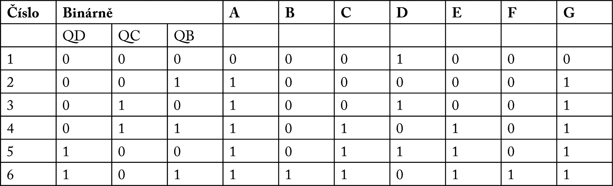

### 20.3.1 {#20-3-1}

Reálná kostka

Opravdová hrací kostka není binární. Číslo se ukazuje pomocí kombinace 1 až 6 teček ve známém obrazci.

Označíme si jednotlivé tečky (je jich sedm) pomocí písmen, takto:

| A |  | E |
| --- | --- | --- |
| B | D | F |
| C |  | G |

Uděláme si další tabulku, aby bylo jasno, co kdy svítí. V tabulce jsem zapsal i binární vyjádření, tedy stavy, které jsou na výstupu čítače 7493.

Všimněte si jedné zajímavé věci. Některé tečky jsou spolu spojené. Třeba vždy, když svítí A, tak svítí i G. Když svítí B, tak svítí i F. No a C svítí vždy společně s E.

Prostřední tečka (D) se objevuje u kombinací 000, 010 a 100.

D = not QB

Diagonální LED A a G se rozsvěcí ve všech případech, kromě jedničky (což je pro nás stav 000). Můžeme tedy jejich stav zapsat jako logický součet (OR) všech tří vstupních bitů:

A = G = QB or QC or QD

Vodorovné LED (B a F) se rozsvěcí pouze v jednom jediném případě, totiž když je hodnota 6 (pro nás stav 101). Zobrazíme je tedy tehdy, když bude vstup QD i QB v logické 1.

B = F = QB and QD

Druhá diagonála, tvořená diodami C a E, je aktivní pouze pro čísla 4, 5 a 6\. Pro nás to jsou hodnoty 011, 100 a 101\. Jak bude vypadat výraz pro tuto kombinaci?