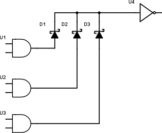

### 20.3.3 {#20-3-3}

Montážní OR

Vůbec nevím, jestli vám to prozrazovat, protože to je opravdu ošklivé řešení, ale na druhou stranu: někdy se hodí, a určitě na něj v nějakém zapojení narazíte, tak je dobře ho znát.

Montážní OR je jeden ze dvou případů, kdy u číslicových obvodů spojíme vývody k sobě. Ale neuděláme to jako Pat a Mat, že bychom je humpolácky spojili dohromady, to ne. Půjdeme na to jinak.

Připomeňme si znovu fungování TTL hradel. Pokud je na výstupu logická 1, je výstup připojený uvnitř k napájení (Vcc) a proud teče ven. Pokud je výstup v logické 0, je tentýž výstup uvnitř hradla spojený se zemí, a proud teče dovnitř. Já vím, že to může znít divně, ale je to tak.

Pro vstupy platí analogická situace: pokud je vstup nějak propojen s napájením, teče proud do vstupu a tvoří logickou 1\. Pokud je vstup spojen nějak se zemí, teče proud uvnitř obvodu z Vcc přes tranzistor do vstupu a vstupem ven.

Pokud bychom natvrdo spojili dva výstupy, nic by se nestalo – pokud by byly oba ve stejné úrovni. Pokud by ale jeden byl v 1 a druhý v 0, tak by z toho v 1 tekl proud do toho v 0, a výsledek by byl nesmyslný.

Naštěstí máme součástku, která umí zařídit, aby proud tekl jen jedním směrem. Pamatujete? Ano, je to dioda. Takže když mezi výstupy hradel a „bod spojení“ zapojíme diody, zařídíme tím, že proud poteče jen jedním směrem.

Máme tu tři hradla U1 až U3, a jejich vývody jsme spojili přes diody. Výsledek je připojen na vstup hradla U4\. Co se teď stane?

Pokud jsou všechny tři výstupy hradel U1-U3 v logické 0, proud by rád tekl z U4 do vstupů těchto hradel, ale nemůže, brání mu v tom diody. Takže na vstupu U4 je logická 0.

Když některé z hradel, třeba U1, přepne do log. 1, proud se z výstupu dostane přes diodu D1 do bodu spojení a na vstup hradla U4, ale už nemůže odtékat zpátky přes výstupy hradel U2 a U3, protože tomu brání diody D2 a D3.

Výsledná funkce takového zapojení je „log. 1, pokud je alespoň jeden ze vstupů v logické 1“ – tedy funkce OR.

Výhoda takového zapojení je jediná: můžeme jednoduše vytvořit OR s několika vstupy jen pomocí diody, nemusíme k tomu vyplýtvat integrovaný obvod.

Nevýhodou takového zapojení může být třeba to, že na diodách vzniká úbytek napětí, který může posunout hodnoty napětí do zakázaného pásma. Tomu můžeme předejít tím, že použijeme diody s nízkým úbytkem (např. Schottkyho). Jsou i další nevýhody, například to, že dioda má nějakou nenulovou kapacitu, takže může ovlivnit vysokofrekvenční signály atd. Ale někdy holt výhoda jednoduchosti převýší nad nevýhodami, a proto se s „montážním OR“ čas od času setkáte.