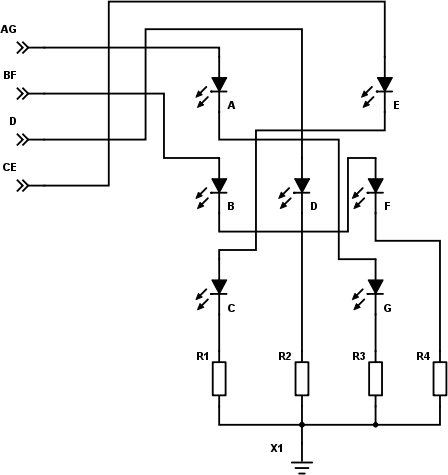

### 20.3.4 {#20-3-4}

Zobrazovací obvod hrací kostky

Zapojme si tedy sedm LED tak, aby dávaly dohromady stejné obrazce, jako jsou na hrací kostce. Využijeme toho, že některé jsou vždy ve stejném stavu (A a G, B a F, C a E) a zapojíme to třeba takto:

A teď otázka: Mohu to takto zapojit? Mohu zapojit dvě LED za sebe (sériově)? Brání mi v tom něco?

Může mi v tom teoreticky zabránit úbytek napětí na diodě. Když zapojím dvě za sebe, a na každé vznikne úbytek 2 volty, tak bude celkový úbytek 4 volty, což je ještě OK. Třetí LED by vyžadovala už zvýšení napájecího napětí, s ní bychom se do pěti voltů nevešli.

(A co když je zapojím vedle sebe, co se stane?)