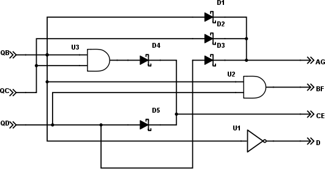
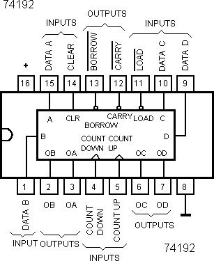
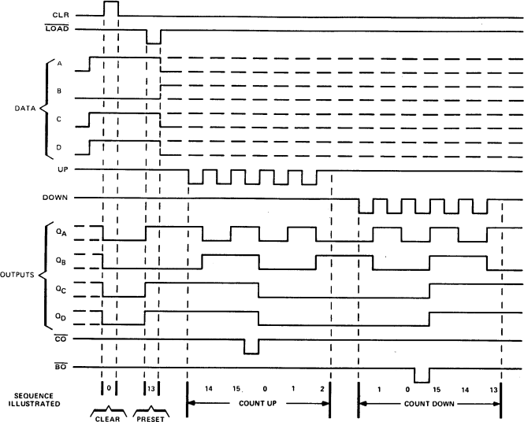
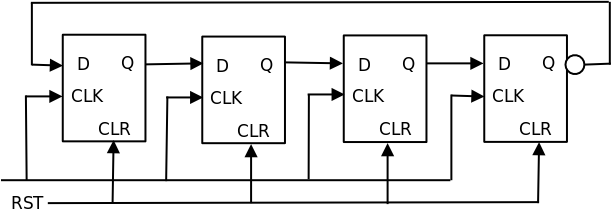

### 20.3.5 {#20-3-5}

Dekodér hrací kostky

Chybí teď ta podstatná část, totiž jak ze signálů QB, QC a QD z čítače udělat požadované signály AG, BF, CE a D.

U D to mám nejjednodušší, ten připojím přes invertor U1 (mám ho třeba v oscilátoru 7404) na QB.

Signál AG vytvořím třeba montážním OR pomocí tří Schottkyho diod (D1, D2, D3) ze signálů QB, QC a QD.

Pro signál BF musím použít hradlo AND (U2), třeba obvod 7408\. Sloučím signály QB a QD.

Signál CE vygeneruju tak, že pomocí hradla AND (U3) spojím signály QB a QC, a výsledek pomocí montážního OR spojím se signálem QD (diody D4, D5).

Zde je opravdu na místě použít Schottkyho diody, které mají malý úbytek napětí. Nezapomeňte na to, že kvůli zapojení LED do série potřebujeme na vstupu alespoň 4 volty. Kdybychom použili normální diody s úbytkem 0,7 voltu, bylo by to už dost na hraně.

Existuje řešení problému s napětím? Co třeba zapojit dvojice LED ne sériově, za sebe, ale paralelně, vedle sebe? Snížili bychom potřebné napětí na polovinu, ale vzrostl by zase potřebný proud. Najděte si v datasheetu obvodu 7493, kolik proudu je schopen dát na vývodech při stavu log. 1 – bude se to lišit pro obvody 74LS93, 7493, 74ALS93 a třeba 74HCT93\. Většinou platí, že u obvodů HC(T) bývá maximální proud okolo 20 mA. U typu 74LS93 to je, pro zajímavost, 16 mA. Ale není dobré součástky napínat na mezní hodnotu. Když navrhneme rezistor tak, abychom odebírali 10 mA, bude na každou diodu připadat 5 mA, což je dostatečný proud. Rezistor tak bude mít velikost R = U / I, tedy 5 / 0,01 = 500 ohmů. Použijte rezistor nejbližší vhodné hodnoty, tedy 470 ohmů...

Zkuste si zapojit takovou kostku na nepájivém kontaktním poli. A až si dostatečně zaházíte, podíváme se na další čítače.

20.4

Další čítače

Ukázali jsme si zatím takzvané asynchronní čítače – na vstup je přivedený signál, a ten se postupně šíří vnitřními klopnými obvody z jednoho do druhého. Takže se hodnota mění sice rychle, ale přesto postupně, což může někdy vadit. Proto se v takových situacích používají takzvané synchronní čítače – ty mají zavedený jednotný časový signál pro všechny stupně, takže se všechny výstupy mění naráz.

U obvodu 7490 jsme viděli kromě nulovacích vstupů R0 i nastavovací vstupy R9\. Obecnější verze čítačů umožňuje nastavit libovolnou hodnotu – říká se tomu „čítač s přednastavením“ (preset).

Některé čítače umí čítat nahoru (0 – 1 – 2 – 3 – 4 …) i dolů (7 – 6 – 5 – 4…).

Kombinací všech zmíněných funkcí oplývají čítače 74192 a 74193\. Opět jde o čtyřbitové čítače – typ 193 je binární, typ 192 desítkový.

Obvod má dva hodinové vstupy, CountUp a CountDown. První funguje jak jsme zvyklí a vyvolává čítání vzhůru. CountDown vyvolává čítání dolů. Čítače mají čtyři výstupy: QA, QB, QC, QD. Navíc mají i výstupy „/Carry“ a „/Borrow“ – /Carry označuje, že čítač příštím pulsem přejde ze stavu 15 do stavu 0 (respektive ze stavu 10 do stavu 0 u desítkového). Signál je negovaný, takže tuto skutečnost oznámí, logicky, nulou. Podobnou funkci má signál /Borrow – oznamuje, že čítač je ve stavu 0, a při dalším pulsu CountDown přejde na nejvyšší hodnotu (15, resp. 10). Tyto výstupy se používají k řetězení čítačů za sebe, pokud chcete získat vícebitový čítač.

Další vstup je známý nulovací vstup, zde označený CLR – Clear. Vynuluje celý čítač.

Poslední pětice vstupů jsou vstupy A, B, C, D a /LOAD. Signál /LOAD říká, že se do čítače má zapsat hodnota ze vstupů A, B, C, D. A protože je /LOAD negovaný, děje se tak při změně úrovně z 1 (klidový stav) do 0 (aktivní stav).

Vím, že někdy obrázek vydá i za 273 slov, tak se podívejme, jak funkci obvodu 74193 popisuje graficky datasheet:

No dobře, uznávám, tento obrázek není právě krystalickou ukázkou, ten v hlavě začátečníka vydá sice za 273 slov, ale většina z nich je „cože?“ Ale protože takových obrázků jsou plné datasheety, pojďme tomu dát trochu práce.

V grafu jsou vyznačeny časové průběhy signálů. Vlevo jsou signály popsané – máme tam CLR, /LOAD, datové vstupy, výstupy, signály UP a DOWN a výstupy přenosu. Graf zachycuje průběhy ve významných okamžicích – neznamená to, že to takto musí jít za sebou, to ne!

Jako první je událost CLEAR. Vidíte, že nastala příchodem pulsu na vstup CLR a měla vliv na výstupy QA až QD. Ty předtím mohly mít jakýkoli stav (naznačeno přerušovanou čárou v log. 1 i log. 0), ale jakmile přišla vzestupná hrana CLR, tak se na těchto výstupech nastavila 0.

Vedle je popsána událost PRESET. Všimněte si, že CLR je v log. 0 a přišla sestupná hrana na vstupu /LOAD. S ní se výstupy QA až QD nastavily podle stavu na vstupech A až D. (Tady je to trošku nejednoznačné, protože stejné úrovně jsou nakreslené na vstupech i pro událost CLEAR; správně by měly být čárkované, protože na nich při nulování nezáleží.)

Další události, jaké jsou znázorněné, probíhají při CLR = 0 a /LOAD = 1\. Na hodnotě vstupů A – D nezáleží. Nejprve se ukazuje, co se děje při pulsech na vstupu UP (= čítání nahodu, count up), poté co dělají pulsy na vstupu DOWN. Sledujte, jak se mění hodnoty na výstupech, všimněte si hlavně kdy se mění (při vzestupné hraně signálů UP a DOWN), všimněte si, jak reagují signály /CO a /BO (přenos, resp. výpůjčka)…

20.5

Ještě nějaké čítače?

Samozřejmě, že jsou na skladě. Třeba takový Johnsonův čítač.

Představme si řetěz obvodů typu D, podobně jako u výše zmíněných čítačů. Každý vstup D je připojen na výstup Q předchozího obvodu. Vstup D prvního obvodu v řadě je zapojen na invertovaný výstup /Q posledního obvodu.

Všechny klopné obvody mají spojený vstup CLK, a všechny mají vyvedený vstup CLR (Reset).

Začíná se od stavu 0000, a čítač nabývá postupně hodnot 0000, 0001, 0011, 0111, 1111, 1110, 1100, 1000 – a pak zase od 0000\. Počítá tedy v takzvaném „Johnsonově kódu“…