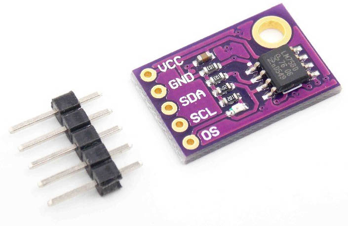

### 20.5.2 {#20-5-2}

Grayův kód

Další podobný kód je kód Grayův. Vychází z binárního kódu, ale čísla jsou přeuspořádaná tak, že mezi dvěma po sobě následujícími stavy se také mění hodnota právě jednoho jediného bitu:

| Hodnota | Binárně | Grayův kód |
| --- | --- | --- |
| 0 | 0000 | 0000 |
| 1 | 0001 | 0001 |
| 2 | 0010 | 0011 |
| 3 | 0011 | 0010 |
| 4 | 0100 | 0110 |
| 5 | 0101 | 0111 |
| 6 | 0110 | 0101 |
| 7 | 0111 | 0100 |
| 8 | 1000 | 1100 |
| 9 | 1001 | 1101 |
| 10 | 1010 | 1111 |
| 11 | 1011 | 1110 |
| 12 | 1100 | 1010 |
| 13 | 1101 | 1011 |
| 14 | 1110 | 1001 |
| 15 | 1111 | 1000 |

Grayův kód se používá místo binárního tam, kde by případná změna více bitů nemusela proběhnout přesně ve stejný čas. Navíc se poměrně snadno převádí na binární a zpět, pomocí operace XOR. Pokud si bity binárního kódu označíme jako b3-b0 a Grayova kódu jako g3-g0, tak převodní vzorce jsou jednoduché:

g0 = b0 XOR b1

g1 = b1 XOR b2

g2 = b2 XOR b3

g3 = b3 XOR 0 = b3

Tedy vždy jako XOR daného bitu a bitu o řád vyššího (u nejvyššího bereme nulu).

Představte si, že máte cosi, co se otáčí, a vy chcete vědět, jakým směrem je to natočené. Pro jednoduchost řekněme, že vám to stačí znát s přesností plus minus 45 stupňů. Připevníte k otáčivé věci kolo, to si rozdělíte na osm segmentů, a protože osm hodnot zakódujete do tří bitů, tak si uděláte tři soustředné kružnice. A v nich si některé segmenty vybarvíte a jiné ne, takže pak budete moci prostým způsobem, třeba optickým snímačem, určit, jak je kolo natočeno.

První pokus bude vypadat nějak takto:

Jenže stačí drobná nepřesnost, a hned v pozici „nahoře“ vám vznikne přechod 001 – 011 – 010, popřípadě 001 – 000 – 010\. Když použijeme Grayův kód, nic takového nehrozí:

20.6

Rotační enkodér

Samozřejmě, že se takovéhle věci používají i v praxi. Těm součástkám se říká rotační enkodéry (rotary encoder), a často se používají pro ovládání různých zařízení. Vypadají jako potenciometry, ale mohou se točit „donekonečna“, a většinou cítíte jemné vrčení, když jimi otáčíte.

Taková součástka má uvnitř podobný kotouček s Grayovým kódem. Má dva vývody, na kterých se střídají hodnoty 00 – 01 – 11 – 10, nebo 00 – 10 – 11 – 01, to podle směru otáčení. Na jednu otáčku mívají typicky 20 kroků, a navíc bývají kombinovány s tlačítkem, takže lze zařízení ovládat pomocí otáčení do dvou směrů a mačkání tlačítka.

Jak takové signály číst? No, jsou dva možné způsoby. Buď budete vzorkovat oba signály a podle přechodové funkce zkoušet, jestli se ovladač otáčí doleva nebo doprava. No a nebo se podíváte na graf průběhů výše a dojde vám to…

Stačí signál A nazvat „hodinovým“ (CLK) a hlídat, kdy se změní z 0 na 1 (viz obrázek). V ten okamžik přečtěte stav na vstupu B (nazvu ho datovým, DT). Pokud je 1, znamená to otáčení jedním směrem, pokud 0, znamená to otáčení druhým směrem. Za domácí úkol si zkuste, co se stane, když vstupy A a B prohodíte.

Já vím, tohle je trošku divoké na představivost, ale to půjde… Sledujte okem první řádek, signál A, a hledejte vzestupnou hranu – tedy změnu 0-1\. Jakmile ji najdete, podívejte se, jakou hodnotu má právě v tu chvíli signál B. Když jedete okem zleva doprava, tak vzestupné hrany přicházejí vždy ve chvíli, když je na vstupu B logická 1\. Když to zkusíte v protisměru a pojedete okem zprava doleva, přijde změna 0-&gt;1 vždy ve chvíli, kdy je vstup B v logické 0.

20.7

Čítač s dekodérem 1-z-10 typu 744017

Už jsem tu zmínil, že kromě TTL řady 74xx existovala i řada CMOS 40xx, v níž bylo několik velmi zajímavých obvodů. Protože konstruktéři tyto obvody používali a museli řešit přizpůsobení úrovní mezi CMOS a TTL, sáhli výrobci k řešení: vyrobili funkčně a vývodově shodné obvody.

Příkladem takového obvodu může být 4075, což je trojice třívstupových hradel OR, a její TTL ekvivalent 744075 (74HCT4075). Zajímavý obvod je 4017, v TTL verzi jako 744017 – např. 74HCT4017\. Tento obvod kombinuje pětibitový Johnsonův čítač (tedy s deseti hodnotami) a dekodér 1-z-10, takže má deset výstupů, pro každou hodnotu jeden. Což se může hodit v nejrůznějších situacích.

Obvod má nulovací vstup R, hodinový vstup CLK a povolovací vstup /CE – pokud je neaktivní (=1), čítač ignoruje vstup CLK, pokud je aktivní (=0), vstup CLK funguje. Z výstupů Q0 až Q9 je aktivní právě jeden, podle aktuálního stavu. Negovaný výstup /CO (Carry Out) je neaktivní (=1) pro hodnoty 0 až 4, pro hodnoty 5-9 je aktivní (=0).

U tohoto čítače můžeme zkrátit periodu velmi snadno – chceme-li například omezit hodnoty na 0-5, propojíme výstup Q6 s resetovacím vstupem.

Pokud jej použijeme pro naši hrací kostku, nebudeme potřebovat další integrovaný obvod, namísto toho použijeme pouze montážní OR, protože:

D = Q0 or Q2 or Q4

AG = Q1 or Q2 or Q3 or Q4 or Q5

BF = Q5

CE = Q3 or Q4 or Q5

20.8

Počítadlo k autodráze

Neejn k autodráze, samozřejmě. Můžet ho použít kdekoli, kde je potřeba počítat, kolikrát se něco stane.

U autodráhy třeba průjezd autíčka. Když už se závodí, tak ať je jasné, kdo projel kolik kol. Jak na to?

No, bude potřeba zjistit, že autíčko projelo nějakým měřicím bodem. Možností je, jako vždy, několik, ale nejjednodušší bude spolehnout se na staré dobré světlo. Šel by sice použít třeba mechanický spínač, ale předpokládám, že by autíčko mohlo mít trošku problém a ve vysoké rychlosti by mohlo vyletět z dráhy. Světlo bude lepší.

Když světlem, tak jak? Buď můžete vzít LED, tu dát na jednu stranu dráhy, na druhou naproti dát fotorezistor, a pak sledovat, kdy dojde k zatmění. Pardon, k zastínění. Pro zvýšení citlivosti můžete dát na obě součástky malé plastové trubičky a nasměrovat je přesně proti sobě, aby je tolik neovlivňovalo okolní světlo.

Druhá možnost je použít takzvané reflexní snímače, známé též pod označením „detektory přiblížení“ (anglicky „optical reflective sensor“, případně „line tracking sensor“ – třeba typ TCRT5000). Technicky to je LED a fototranzistor v jednom bloku:

Pokud nemáte autíčka úplně černá, tak fototranzistor zachytí světlo, odražené od jeho povrchu, a dokáže tak detekovat průjezd.

Zapojení takového snímače je jednoduché: LED připojte přes rezistor k napájecímu napětí. Fototranzistor zapojte podobně jako tlačítko, tedy kolektor přes pull-up rezistor cca 10 kΩ k napájecímu napětí, emitor k zemi, a výsledek odebírejte z kolektoru. Na výstup dejte, kvůli snazšímu zpracování signálu, Schmittův klopný obvod (třeba v invertoru 7414).

Za normálního stavu LED svítí, ale na fototranzistor nic nedopadá. Fototranzistor je tedy zavřený, na vstup invertoru jde přes rezistor 10k napájecí napětí, tedy log. 1, a na výstupu je logická 0\. Jakmile se před senzor dostane autíčko, LED osvítí jeho povrch, odražené světlo sepne fototranzistor, tím se na vstup Schmittova obvodu dostane zem, a na výstupu bude 1.

S touto informací už můžete dál pracovat. Nejjednodušší je zase připojit Arduino s displejem, počítat pulsy a zobrazovat je na displeji.

Pojďme ale zvolit „staré dobré obvodové řešení“. Existuje totiž obvod, který v sobě kombinuje desítkový čítač, dekodér pro sedmisegmentovky a budič. Jeho označení je SN74143\. Když se podíváte do datasheetu, zjistíte, že je to přesně to, co potřebujeme.

Plni nadšení ho jdete koupit, a zjistíte, že ho pravděpodobně neseženete. V katalogu už je označen jako „Obsolete“ a už se ani nevyrábí.

Podobný obvod se ale stále vyrábí v CMOS řadě 40xx, tentokrát s označením CD4026\. V pouzdru DIP16 je desítkový čítač, dekodér a budič.

Vstup 1 slouží k přivedení vstupních pulsů. Vstup 2 (clock inhibit) slouží k přerušení čítání. Připojte ho na zem (nechceme přerušovat). Vstup 3 (display enable) slouží ke zhasínání displeje. Nechceme, proto jej připojte na napájecí napětí. Výstup 4 nechte být (odpovídá hodnotě na vstupu 3), výstup 5 taky (pokud nebudete dávat dva čítače za sebe, abyste získali vícemístné počítadlo). Vývody 6, 7, 9, 10, 11, 12, 13 odpovídají jednotlivým segmentům LED sedmisegmentovky, Vss je zem a Vdd je napájení (CMOS můžete napájet až 15 volty). Vstup 15 je RESET, ten si připojte přes tlačítko na napájecí napětí, a k němu pulldown rezistor. Získáte tak možnost vynulovat počítadlo. Vývod 14 ponechte být.

Sedmisegmentovku (zvolte typ „se společnou katodou“) připojte samozřejmě přes oddělovací rezistory. Zapojte si to takto na kontaktním poli, jako vstup dejte zase tlačítko s pulldown rezistorem, a zkoušejte, jestli vše počítá jak má.

Proč se společnou katodou? Protože pak má sedmisegmentovka vyvedené anody od segmentů a katody spojené do jednoho vývodu. Jednotlivé segmenty svítí, když se na ně přivede napájení. Sedmisegmentovky se společnou anodou to mají obráceně, ty svítí, když se vývod segmentu propojí se zemí. Šly by použít, ale museli byste buď zapojit invertory, nebo tranzistory.

Když se začtete do datasheetu, zjistíte, že vstupy CLOCK a CLOCK INHIBIT mají na vstupu Schmittův klopný obvod, takže můžeme ten invertor vynechat. Hurá, o jeden obvod méně.

Problém je, že teď naše čidlo má na výstupu 1 a průjezd autíčka způsobí 0, zatímco obvod 4026 očekává naopak vzestupné pulsy. Ale lze to vyřešit velmi elegantně: v datasheetu naleznete vnitřní schéma obvodu. V něm uvidíte, že vstupy CLOCK a CLOCK INHIBIT jsou vlastně stejné, jen INHIBIT je negovaný. Uvnitř jsou pak spojené hradlem AND. Takže můžeme připojit výstup senzoru na CLOCK INHIBIT, a CLOCK zapojit na napájecí napětí. Za normálního stavu tak bude na vnitřních hodinách 0 (protože CLOCK INHIBIT=1), jakmile projede autíčko, vypne se CLOCK INHIBIT (=0), a tím se uvnitř obvodu vytvoří vzestupná hrana.

Pokud zjistíte, že jeden průjezd autíčka vyvolá vícero impulsů, můžete zkusit buď umístit senzor jinam, nebo třeba polepit autíčko stříbrnou fólií, popřípadě na výstup z čidla dát kondenzátor, který odfiltruje rychlé pulsy a sleje je do jednoho. Čítači to, díky Schmittovu obvodu, vadit nebude.

21

Posuvné registry

21

Posuvné registry

Vraťme se teď myšlenkami o kousek zpátky. Johnsonův čítač… Klopné obvody typu D, zapojené za sebou… máte? Co to trochu zobecnit?

Představte si takovéhle zapojení. S každým pulsem hodin se do levého klopného obvodu zapíše informace ze vstupu Data In, do druhého obvodu se zapíše předchozí informace z prvního, do třetího se zapíše informace z druhého… No a nakonec po čtyřech pulsech hodin se zapíšou čtyři bity hezky postupně do všech klopných obvodů. Nějak takhle – představte si, že po každém řádku přijde puls na vstup Clock:

| Data In | Q1 | Q2 | Q3 | Q4 |
| --- | --- | --- | --- | --- |
| 0 | x | x | x | x |
| 1 | 0 | x | x | x |
| 0 | 1 | 0 | x | x |
| 1 | 0 | 1 | 0 | x |
| 1 | 1 | 0 | 1 | 0 |
| 0 | 1 | 1 | 0 | 1 |
| x | 0 | 1 | 1 | 0 |

Všimněte si, že vlastně takto bereme bity, které jdou za sebou, sériově, po jednom vodiči Data In, a převádíme je do paralelní podoby.

Takovému uspořádání se říká posuvný registr – důvod je asi jasný: každý puls hodin posouvá informaci uvnitř o jednu pozici dál. Tento typ se označuje jako SIPO: Serial In, Parallel Out, tedy sériově dovnitř, paralelně ven.

Samozřejmě existují i opačné registry PISO. Mají několik datových vstupů (většinou 4 nebo 8), pak signál, kterým se zapíše tato informace do vnitřních klopných obvodů, a pak hodiny, které posílají jednotlivé bity na výstup Q. Jeho zapojení je ale o něco složitější.

Kombinací obého dostáváme hybridní registry SISO-PISO-SIPO, tedy takové, které mohou mít vstupy i výstupy obojího typu. Častá kombinace je SISO-SIPO, tedy registry, které mají sériový vstup i výstup, a k tomu paralelní výstup. Lze je totiž snadno zapojit za sebe a poskládat tak třeba dvacetibitové převodníky.

K čemu je taková věc dobrá? No, třeba když potřebujete přenést signál na delší vzdálenost, tak je dobré převést jej nejprve na sériovou podobu, tedy na proud bitů, přenést je hezky po jednom, a pak opět poskládat dohromady do celých slov.

Proč?

Víte co, pojďme si zatím říct něco o komunikačních rozhraních, pak to bude třeba jasnější.

22

Paralelní a sériová rozhraní

22

Paralelní a sériová rozhraní

Začnu zase jazykovou vsuvkou. Za socialismu se politika promítala do všeho, a i naprosto nenápadné věci byly vlastně politické. Například v technice se soudruhům nelíbilo velké množství anglických výrazů v názvosloví, a snažili se je nahrazovat českými. Tak vzniklo třeba sousloví „stykové rozhraní“. Kdybyste tápali, co to je – je to „interface“. Anglické slovo je složené ze dvou výrazů, „inter“, tedy mezi, a „face“, tedy obličej. S trochou obrazotvornosti vidíte přenos informací, který se odehrává mezi dvěma obličeji. Stykové rozhraní zní spíš jako něco ze sexuologie, ale je to totéž. Některé výrazy byly ještě mnohem horší, třeba takový magnetoskop – složenina podle vzoru „magnetofon“, která měla nahradit prohnilý západní termín „video“ – a po právy vymřely. Ze stykového rozhraní nám zůstalo alespoň to rozhraní, i když se běžně používá i počeštělá verze anglického výrazu interfejs. Jazyk si s tím poradí, přidá koncovky, zavede flexi, a tak můžeme běžně číst o interfejsech a pracovat s interfejsem.

Ale to jen na okraj.

Od počátku číslicové techniky se ukázala potřeba nějak přenášet vícebitová data. Představme si osmibitový mikroprocesor – musí nějak komunikovat s pamětí a dalšími obvody. Nejjednodušší je přenášet osmibitová data po osmici vodičů. A přesně to se dělalo.

Datové vodiče se jmenovaly D0 až D7, a všechno, co mělo nějak přebírat data z procesoru, se posílalo po těchto osmi vodičích.

Dohromady se jim říkalo (a říká stále ještě) datová sběrnice. Proč sběrnice? Protože se k těmto vodičům připojovalo více zařízení (paměť RAM, paměť ROM, vstupně-výstupní obvody atd.) najednou, a ty samotné vodiče jako by sbíraly data z různých zařízení. Samozřejmě – aby se obvody nepraly o to, kdo bude na datové vodiče posílat informace (vzpomeňte si, co jsme si říkali o připojování výstupů logických obvodů k sobě), tak jsou všechny vybavené třístavovým výstupem, tedy takovým, který umožňuje odpojení vývodu, a procesor si vždy řekne, které zařízení má komunikovat.

Abychom se z toho ve schématech nezbláznili, jak taháme osm drátů kolem dokola, tak namalujeme jednu tlustou čáru, řekneme, že pro nás představuje třeba osm vodičů D0-D7, a pak jen malujeme součástky a říkáme, jak se mají napojit:

Protože po takovéhle sběrnici jde těch osm bitů vedle sebe osmi vodiči, tak říkáme, že se jedná o paralelní přenos dat.

Má své výhody – třeba že přenášíme osm bitů najednou. Má ale i své nevýhody: musíme opravdu fyzicky natáhnout osm spojů, což je někdy protivná činnost a snadno se na nějaký zapomene. Druhá, větší nevýhoda je, že takto můžeme přenášet data jen na krátké vzdálenosti. Pomocí obyčejných vodičů tak na desítky centimetrů, pomocí speciálních kabelů třeba i na metr a půl, ale na delší vzdálenosti se přenos rapidně horší – dochází k chybám, k rušení, k velkému útlumu, navíc všechny nectnosti rostou s tím, jak roste rychlost přenášených dat (tedy frekvence změn). Pak už ani pořádně stíněné kabely nepomohou.

Co v takovém případě? Pak je lepší sáhnout po sériovém přenosu dat. K němu vám stačí jen pár vodičů – dva, tři, čtyři, podle typu přenosu. Se sériovým přenosem sice přenášíte data pomaleji než paralelně (máte typicky jen jeden datový vodič místo osmi), ale lépe se stíní, je odolnější proti rušení, můžete jej proto vést na delší vzdálenost…

Typickým příkladem bylo připojování tiskáren – kdysi se používalo paralelní rozhraní, známé jako Centronics. V počítačích PC bylo skryté pod označením LPT – starší počítače, ještě tak z roku 2005, ho mají na základní desce, později se už nepoužívalo. Kabely k paralelnímu rozhraní byly tlusté, krátké a drahé.

Některé tiskárny proto používaly sériové rozhraní RS-232 což je známý COM port. Takové rozhraní si v principu vystačí se třemi vodiči: data do zařízení, data ze zařízení a uzemnění. Kabel pro sériové rozhraní mohl mít třeba pět metrů, dražší a kvalitnější i víc.

Sériové rozhraní se používá dodneška pro připojení většiny periferních zařízení k počítači. Nemýlíte se, známé USB znamená Universal Serial Bus, a je to přesně stejný princip přenosu dat, jen vylepšený tak, aby bylo možno připojit víc zařízení naráz a používat delší kabely.

Sériový přenos se používá i v průmyslu – možná jste se setkali s rozhraním RS-485\. Dokonce i přenos videosignálu po kabelu HDMI, kterým máte pravděpodobně připojený monitor k počítači nebo třeba herní konzoli k televizi, probíhá, jak jinak, sériově.

I počítačové sítě dnes většinou fungují na principu sériového přenosu dat –Ethernet, tedy „ten kabel na sítě“, přenáší data po dvou dvojicích vodičů (další dvě dvojice jsou nepoužité).

Aby se zlepšila odolnost proti rušení indukcí, používá se u sériových rozhraní, která přenášejí data na větší vzdálenost, takzvaný „diferenciální přenos“ – jeden signál není přenášen jedním vodičem, ale kroucenou dvojicí vodičů, z nichž jeden přenáší signál, druhý jeho negaci. Přijímač pak oba vodiče porovná, a z nich dekóduje zpět přenášený signál. Vychází se z předpokladu, že případné rušení zasáhne oba vodiče stejně – oběma buď přidá, nebo ubere – ale rozdíl zůstane stejný.

Paralelní rozhraní se používá tam, kde je potřeba obrovská rychlost a stačí krátké vzdálenosti – typicky mezi procesorem a pamětí. Dříve se používalo i pro připojení dalších komponent, jako grafické karty nebo disků. Dnes se postupně přešlo i u disků a karet na sériové rozhraní (u disků SATA – Serial ATA, u karet PCI-Express, což je taky sériové rozhraní). Důvodem je zvyšování přenosové rychlosti – u sériové sběrnice je možné dosáhnout řádově vyšších rychlostí a frekvencí bez přeslechů a problémů s časováním, což trochu kompenzuje fakt, že přenášíme míň bitů najednou.

| Vlastnost | Paralelní | Sériové |
| --- | --- | --- |
| Počet najednou přenášených bitů | více (typicky 8, 16) | Většinou jen jeden |
| Přenosová rychlost | Nižší | Vyšší |
| Vzdálenost, na jakou je možno přenášet data | Menší | Větší |
| Odolnost k rušení | Malá | Větší |

V elektronické praxi se potkáte nejčastěji se sériovými sběrnicemi SPI, I2C, RS-232 (někdy označované jako UART nebo jen Serial) a 1-Wire. Paralelní rozhraní mají z často používaných komponent snad jen některé displeje. Většina ostatní techniky – senzory, aktuátory, paměti, paměťové karty atd. – používají sériová rozhraní. Důvody jsou nejen ty výše zmíněné, ale třeba i to, že řídicí obvody – jednočipy, mikrokontroléry – mohou snadno pomocí dvou či tří vývodů připojit hned několik zařízení. Pro paralelní rozhraní by bylo potřeba vývodů osm, či spíš devět (osm datových plus jeden, který říká „teď něco udělej!“)

Tak, a teď vážně: Kde bychom tak mohli použít posuvný registr? Něco mě napadá…

22.1

Buzení displeje ze sedmisegmentovek

Když to vezmete kolem a kolem, je takový displej ze sedmisegmentovek velice náročná záležitost. Představte si čtyřmístný displej. Každá sedmisegmentovka má osm vývodů, to máte 32 vývodů, ani nemrknete…

Ve skutečnosti se ale takto vícemístné sedmisegmentovky nezapojují. Zapojují se tak, že mají spojené všechny segmentové vstupy (a-g a tečku), tedy 8 vývodů, a pak jsou vyvedené společné anody / katody pro každou pozici. Nějak takto:

Pro N pozic stačí tedy 8 + N vývodů – pro čtyřmístný displej 12.

Na používání takového displeje musí být určitý trik. Je jasné, že nemůžeme zobrazovat všechno najednou – nemáme jak. Používá se proto řešení jiné: přivedeme na segmentové vstupy kombinaci pro první pozici, a aktivujeme společný vývod pro pozici 1\. Necháme ji chvilku svítit, a pak totéž opakujeme pro druhou, třetí, … pozici. Říká se tomu multiplexované řízení displeje. Pokud takhle blikáme dostatečně rychle, lidské oko nevidí, že vždy svítí jen jedna sedmisegmentovka a zdá se mu, že svítí celý displej. „Dostatečně rychle“ znamená alespoň padesátkrát za sekundu. K tomu se opět používají buď specializované obvody, nebo se to nechá na jednočipu, který má dostatečný výkon, aby se tímhle zabýval. Bohužel, takový displej sebere hodně vývodů (třeba těch 12), a když máte jednočip s dvaceti vývody, moc vám jich už nezbývá.

Technická poznámka: pro buzení takových displejů je vhodné použít tranzistorový budič. Pokud každý segment chce proud třeba 5 mA , tak vám při rozsvícené „osmičce“ poteče společným vývodem 35 mA, a to je víc, než je většina jednočipů schopna a ochotna poskytnout.

Co dělat v situaci, kdy:

•

blikání displeje, byť rychlé, je na závadu (třeba je snímané kamerou)

•

nemáte sdružený displej, ale opravdu čtyři sedmisegmentovky

•

chcete ušetřit počet nutných signálů?

22.2

Posuvný řadič SIPO 74HCT595

Jak už z mezititulku tipujete, půjde asi zas o nějaký skvělý integrovaný obvod. A přesně tak to je!

74595 je obvod, který se skládá z osmibitového posuvného registru a osmibitového klopného obvodu typu D.

Všimněte si, že posuvný registr má sériový vstup A, sériový výstup SQh, hodinový vstup Shift Clock, též SRCLK (náběžná hrana posouvá informace v registru) a nulovací vstup /RESET. Díky tomu můžeme po dvou signálech (Serial In a Clock) poslat do posuvného registru osm bitů tak, jak potřebujeme. Náběžnou hranou na vstupu Load (Latch Clock, RCLK – každý výrobce značí vývody jinak, ale význam je stejný) přeneseme stav posuvného registru do klopných obvodů D. Ty budou tento stav pouštět na výstup a zároveň jej budou držet až do příští náběžné hrany na RCLK.

Obvod má ještě vstup /OE, kterým můžeme vývody odpojit, pokud je to potřeba.

Díky tomu, že posuvný registr má i sériový výstup, můžeme těchto obvodů zapojit za sebe několik. Vstupy SRCLK a RCLK můžeme propojit navzájem, a výstup jednoho sériového registru zavedeme na sériový vstup druhého.

Pomocí tří vodičů (Serial In, SRCLK a RCLK) tak můžeme ovládat teoreticky neomezené množství registrů. Každý registr má k dispozici osm výstupů…

Ke každému registru můžeme (přes rezistory) připojit sedmisegmentovku. Výstupy mají budiče a jsou schopné dodávat 6 mA. Celý obvod je navíc poměrně rychlý a dokáže pracovat na frekvenci 25 MHz.

Pojďte si to zapojit. Jen obvod 74595 a sedmisegmentovku. Bude se to celé budit z Arduina. Aspoň se pocvičíte v práci se sériovými daty.

Schéma a zdrojový kód najdete na [eknh.cz/595](https://eknh.cz/595)

A teď pojďte, zapojte si ještě jednu sedmisegmentovku hned vedle té, co jste si zapojili teď. Použijte další obvod 74595, zase osm rezistorů, propojte sériový výstup prvního registru se vstupem druhého, spojte SRCLK a RCLK, upravte kód…

Pamatujte: pokaždé, když bojujete s malým počtem dostupných pinů, zvažte použití podobného řešení. Pokud budete potřebovat vícebitové řešení, popř. obsloužit i vstupy, zvažte použití obvodů MCP23xxx od Microchip, např. MCP23008 (8 bitů, I2C), MCP23S08 (8 bitů, SPI), MCP23017/MCP23S17 (16 bitů) atd.

23

Sériová komunikace

23

Sériová komunikace

Co jsem v předchozí kapitole nakousl, to teď rozvedu. Sériová komunikace je totiž velmi používaná věc a téměř všechny moderní elektronické komponenty používají právě tento způsob komunikace, kdy jsou vícebitové informace (většinou osmibitové) přenášeny po bitech postupně za sebou.

Sériová komunikace si proto vystačí s jedním, dvěma, třemi či čtyřmi vodiči pro data, plus jedním vodičem pro zem. Společná zem je podstatná věc pro spojování zařízení, bez ní nám jednak chybí společný vztažný bod pro měření napětí, jednak při spojení tečou úplně zbytečné proudy, které mohou přetěžovat vstupní obvody. Mimochodem, všimli jste si někdy, že například u konektorů USB jsou některé kontakty delší?

Důvod je prostý – delší vývody jsou napájení, takže při zasouvání se nejprve vodivě propojí napájecí obvody, a teprve potom se připojí datové signály.

Sériových rozhraní je několik druhů. Liší se od sebe nejen počtem vodičů, ale i schopnostmi a rychlostí.

23.1

Sériová sběrnice SPI

Asi nejjednodušší na pochopení je sběrnice SPI (z anglického Serial Peripheral Interface). Tímto rozhraním bývají vybavené různé paměti nebo některé senzory.

U rozhraní SPI je vždy jeden řídicí obvod (Master) a jeden či více periferních obvodů (Slave). Master řídí celou komunikaci a pomocí signálů /SlaveSelect určuje, se kterým periferním zařízením se právě pracuje.

Obecně vypadá komunikace tak, že master aktivuje signál /SlaveSelect pro ten obvod, s nímž chce komunikovat, a uvede jej do log. 0 (je to invertovaný signál).

Poté, co je obvod vybraný, začne Master na výstupu SCLK (Serial Clock) posílat hodinové pulsy, a zároveň na výstupu MOSI posílá data od nejnižšího bitu.

Jak na straně masteru, tak na straně slave zařízení jsou použity posuvné registry. Master pošle do zařízení požadované informace, nejčastěji příkaz a nějaké parametry, a jakmile skončí přenos, uvede vstup /SlaveSelect opět do neaktivního stavu.

Sběrnice SPI je plně duplexní, to znamená, že v ten samý čas mohou jít data jak ve směru MASTER -&gt; SLAVE, tak i v opačném, tedy z periferie do řídicího zařízení. K tomu slouží druhý vodič, MISO.

Vodiče MISO a MOSI se mohou začátečníkům plést, proto si pamatujte, co to znamená: MISO je Master In, Slave Out, MOSI je Master Out, Slave In.

Stačí nám tedy tři komunikační vodiče – SCLK, MOSI a MISO, a k tomu jeden „výběrový“ signál pro každé zařízení.

Ale aby to nebylo tak jednoduché, tak si můžeme vybrat, jestli se bity čtou se vzestupnou nebo sestupnou hranou, a jestli jsou hodiny v klidovém stavu v log. 1, nebo v log. 0\. Protokol se nastavuje většinou pomocí konfigurace SPI rozhraní (např. v procesoru). Zařízení mívají dané, jaký typ komunikace používají.

Konfigurační bit CPOL udává polaritu hodin (Clock Polarity). 0 znamená, že hodiny jsou v klidu ve stavu log. 0, CPOL = 1 znamená, že hodiny jsou invertované (ve stavu 0). Konfigurační informace CPHA udává, při které hraně se čtou informace (Clock Phase). Pokud je to 0, čte se informace při přechodu z neaktivního stavu hodin do aktivního (což je vzestupná hrana u CPOL 0, sestupná u CPOL 1). Pokud je CPHA rovno jedné, je to ta druhá hrana. Rozlišujeme tedy čtyři různé módy SPI.

| SPI mode | CPOL | CPHA | Význam |
| --- | --- | --- | --- |
| 0 | 0 | 0 | Hodiny jsou v klidu v 0, vzorkuje se při přechodu 0—&gt;1 |
| 1 | 0 | 1 | Hodiny jsou v klidu v 1, vzorkuje se při přechodu 1—&gt;0 |
| 2 | 1 | 0 | Hodiny jsou v klidu v 0, vzorkuje se při přechodu 1—&gt;0 |
| 3 | 1 | 1 | Hodiny jsou v klidu v 1, vzorkuje se při přechodu 0—&gt;1 |

Pokud budete mít štěstí, nebudete muset nic z toho řešit a vystačíte si s módem 0.

Některá zařízení pro sběrnici SPI neposílají žádná data, proto u nich nemusíme zapojovat MISO. Některá zase mají možnost vyvolat přerušení – tedy upozornit na to, že se něco stalo, a že by tomu měl master věnovat pozornost.

Takováto sběrnice může přenášet data velmi rychle, až v řádech megabajtů za sekundu. Samozřejmě jsme limitováni kvalitou vedení a jeho délkou, ale teoreticky lze dosáhnout velmi velkých rychlostí. Některá zařízení, převážně moderní sériové paměti, používají mód, kdy dokážou přenášet během jednoho hodinového pulsu dva nebo čtyři bity najednou (samosebou je potřeba víc vývodů MOSI/MISO). Takový přenos se označuje jako Dual SPI, popřípadě Quad SPI (QPI, nebo také SQI).

Sběrnici SPI používá celá řada periferií – především už zmíněné sériové paměti RAM / EEPROM / FLASH. Pomocí SPI lze pracovat s paměťovými kartami typu SD. Dále SPI používají některé ovladače displejů, nebo různé senzory. SPI definuje pouze to, jakým způsobem probíhá komunikace fyzicky, neříká, jaké informace se mají jak posílat. To je na obslužném software. Naštěstí to najdeme v datasheetu.

SPI je standard, který definovala Motorola na konci 80\. let, ale používá se dodnes. Někteří výrobci v datasheetu uvádí, že jejich zařízení umí SPI, jiní jsou kryptičtější, a snad v obavách z případných sporů nazývají toto rozhraní jinak – třeba 4-wire Serial.

23.2

Sériová sběrnice I2C

I2C je z anglického Inter-Integrated Circuit a mělo by se to správně číst I squared C, nesprávně I two C. V našich luzích a hájích běžně uslyšíte „í-dva-cé“ („ájsquérdsí“ ani „í-na-druhou-cé“ se moc neuchytilo). Navíc je I2C ochranná známka společnosti Philips, která tento standard vyvinula, takže mnozí výrobci sice používají naprosto stejný typ sběrnice, se stejnými parametry a stejným ovládáním, ale cudně ji označují jinak, aby se vyhnuli použití chráněné značky. Kupříkladu Atmel označuje ve svých dokumentech tuto sběrnici jako TWI – Two Wire Interface.

Na první pohled vypadá I2C velmi podobně jako SPI, jen má míň vodičů. Kromě země si vystačí s pouhými dvěma vodiči, datovým SDA a hodinovým SCL.

Opět platí, že máme jeden „master“ obvod (může jich být i víc, ale nejčastěji je jeden) a k němu připojené periferní obvody. Každý periferní obvod má, na rozdíl od SPI, vlastní sedmibitovou adresu, tedy v rozsahu 0 až 127\. Adresy nejsou úplně libovolné, většinou jsou pevně dané výrobcem – či alespoň jejich část. Pokud chceme zapojit dva obvody stejného typu naráz, musí podporovat možnost zapojit je na různé adresy. Jak vidno, sedm bitů není příliš mnoho, navíc některé kombinace jsou vyhrazené pro speciální použití, a tak se pomalu prosazuje novější standard s desetibitovými adresami.

Ve všech zařízeních jsou vývody SDA a SCL navrženy „s otevřeným kolektorem“. Už jsme se s tím setkali, vzpomeňte si: takový výstup je buď ve stavu 0, nebo ve stavu „odpojeno“. Výhodou je, že můžeme takové vývody spojovat dohromady, nevýhoda je, že potřebuje pull-up rezistor, aby mohla být na vedení za klidového stavu logická 1\. Další výhoda takového zapojení je, že vývod může být zároveň výstup i vstup. Pokud funguje jako výstup, je buď 0, nebo „odpojen“. Pokud má fungovat jako vstup, nechává se „odpojen“, a obvod „naslouchá“, jestli je na vedení 0, nebo 1.

Komunikaci opět zahajuje master, a to tím, že na vývod SDA pošle logickou 0 (říkáme, že vývod „stáhne k zemi“), a poté (to je důležité!) stáhne i hodinovou linku SCL. Tím vytvoří takzvaný „startovní signál“ (Start Condition). Následně master začne vysílat hodiny, a zároveň nastavuje na vodič SDA data (postupně od nejvyššího bitu k nejnižšímu – zde je rozdíl proti SPI).

Přenos dat vždy začíná tím, že je přenesena sedmibitová adresa (A6 – A0) a bit R/W, který říká, zda bude následovat čtení ze zařízení (1), nebo zápis do zařízení (0). Během té doby všechna zařízení naslouchají a čtou adresu. Pokud je adresa jiná, než jejich, opět se odpojí a čekají na STOP signál (stop condition), kdy se při SCL=1 změní SDA z 0 na 1\. Pokud je adresa stejná, zařízení se připraví na přenos dat.

Poté nechá master datovou sběrnici odpojenou, začne naslouchat a pošle ještě jeden hodinový puls. Zařízení, které rozpoznalo svou adresu, stáhne SDA k zemi, tedy vyšle log. 0, a tím potvrdí připravenost komunikovat (říkáme tomu puls ACK – z Acknowledge, neboli potvrzení). Master tento bit sleduje, a pokud přijme 0, ví, že je vše OK. Pokud ale během devátého hodinového pulsu najde na SDA hodnotu 1, znamená to, že žádné zařízení nerozpoznalo svou adresu.

Po této výměně následuje vlastní přenos dat, a to buď z masteru do periferie, nebo opačným směrem. V obou případech ale časování řídí master. Když je přeneseno vše, co přeneseno mělo být, uvolní master sběrnici tím, že nejprve „pustí“ SCL (a pullup rezistor jej vytáhne k log. 1), a poté uvolní i SDA. Tím všechna zařízení na sběrnici poznají, že nastal konec přenosu.

Sběrnice I2C umožňuje i některé zajímavé činnosti, například poslat desetibitovou adresu, pokud ji zařízení podporují. Master nemusí přenos ukončovat „stop stavem“, ale může znovu zahájit vysílání dalším startem a opětovným vysláním adresy. Existuje i možnost „natažení času“ – pokud je periferní zařízení příliš pomalé a trvá mu delší dobu, než má k dispozici data, udělá takový trik: samo stáhne hodinový signál k 0, čímž naznačí masteru, že má chvíli počkat. Když je pak připravené, tak opět hodinovou linku uvolní, master zjistí, že je volno, a pokračuje v přenosu.

Přenos dat probíhá po této sběrnici základní rychlostí 100 kHz, tedy 100 kbit / sec. Většina zařízení umí pracovat i s rychlostí 400 kHz. Zařízení standardu High Speed mohou komunikovat s frekvencí 3,4 MHz. Nejnovější ultra fast zařízení používají, stejně jako SPI, vedení bez pull-up rezistorů, ovšem komunikují pouze jednosměrně.

| Vlastnost | SPI | I2C |
| --- | --- | --- |
| Rychlost | Závisí na zařízení, teoreticky neomezená, prakticky omezená fyzikálními limity (délka vedení, jeho kvalita apod.) | 100 kbit/s 400 kbit/s 3,4 Mbit/s (pouze nové obvody) |
| Počet vodičů | 1 × hodinový signál 2 × datový signál 1 řídicí vodič pro každé zařízení Společná zem | 1x hodinový signál 1x datový signál Společná zem |
| Počet připojených zařízení | Teoreticky neomezený, prakticky omezený potřebou mít pro každé zařízení jeden řídicí signál | Teoreticky neomezený, prakticky omezený adresováním zařízení. V případě připojení více obvodů stejného typu je třeba vyřešit, aby každý měl svou adresu. Pokud to obvod neumožňuje, nelze jich připojit víc. |

23.3

Prakticky…

Pojďte si zase něco připojit! Jako první si připojíme k Arduinu nějaký senzor – třeba digitální teploměr LM75A. Používá sběrnici I2C. Nemusíme nějak složitě řešit přenosový protokol, protože naštěstí Arduino, respektive použitý jednočip ATmega, má specializované obvody, které se  postarají o správný přenos dat, posílání start / stop signálů i hodin.

Zásadní otázka je: Kde LM75A sehnat? Trochu hloupé je, že tento obvod máme k dispozici pouze v pouzdrech pro povrchovou montáž. Ale naštěstí některé e-shopy nabízejí takzvaný „breakout board“ (hledejte „LM75 Breakout“). Vlastně jde o miniaturní destičku, kde je připájený tento obvod, a jsou zde vývody vyvedené tak, aby je bylo možné připojit k nepájivému kontaktnímu poli či propojovacím vodičům.

Všimněte si popisků: VCC a GND je napájení, GND zem, tedy záporný pól, VCC kladný pól. SDA a SCL jsou signály sběrnice I2C. Na destičce jsou připojené i pullup rezistory mezi VCC a SDA / VCC a SCL. Což je dobré, nemusíte se o ně starat. Poslední vývod je OS. Co to je?

Podíváme se do datasheetu, kde najdeme nejen odpověď na tuto otázku (je to signál „Overtemperature Shutdown“ – signál, který je aktivní, pokud teplota překročí nastavenou mez), ale i jiné důležité věci.

Například že obvod lze napájet pěti volty, že v rozsahu - 20 °C až + 100 °C je jeho přesnost +/- 2 °C, a že jeho sedmibitová adresa je „1001xxx“. Přesněji 1 – 0 – 0 – 1 – A2 – A1 – A0\. Hodnoty A2, A1 a A0 záleží na to, jako jsou zapojené tři vstupy se stejným označením (piny 7, 6 a 5). U většiny breakoutů budou připojené k 0, ale ještě si to ověřte u svého kousku. Pokud je tomu opravdu tak, je adresa 1001000, neboli 0x48 hexadecimálně.

Zároveň se dozvíme, jak do zařízení zapisovat a jak z něj číst. Tady je dobré poznamenat, že většina zařízení se sběrnicí I2C se tváří jako svého druhu „paměť“ – jako by byly uvnitř rozdělené na paměťové buňky, ke kterým se přistupuje, čte se z nich a zapisuje do nich.

Obvod LM75 má čtyři registry, kterými se nastavuje jeho funkce, a ve kterých jsou připravená data ke čtení. Adresy jsou následující:

| Adresa | Jméno | R/W | Funkce |
| --- | --- | --- | --- |
| 0 | Temp | Pouze pro čtení | Naměřená teplota (16 bitů) |
| 1 | Conf | Čtení i zápis | Konfigurace obvodu (8 bitů) |
| 2 | Thyst | Čtení i zápis | Hystereze pro teplotní poplach (Overtemperature Shutdown) (16 bitů) |
| 3 | Tos | Čtení i zápis | Teplota pro teplotní poplach (16 bitů) |

Zápis dat probíhá tak, že master vyšle START, poté adresu obvodu (0x48), poté číslo registru, se kterým chce komunikovat, a pak už následují data pro zápis. Při čtení se postupuje o něco složitěji: master vyšle start, pak adresu obvodu 0x48, pak číslo registru, ze kterého chce číst, nato následuje opět start, adresa obvodu (ale s nastaveným příznakem „čtení“), a pak master naslouchá a obvod posílá data.

V Arduinu je vyvedená sběrnice I2C přímo na konektorech, buď nahoře u dat, nebo se používají vývody A4 (SDA) a A5 (SCL) u Arduina Uno. U Arduina Mega to jsou vývody 20 (SDA) a 21 (SCL). Zkontrolujte si, pokud máte jiné Arduino, jak je tomu u vás.

Propojte čtyřmi vodiči breakout modul s Arduinem – vývody GND, Vcc (na + 5 V), SDA a SCL.

Arduino má pro sběrnici I2C speciální knihovnu, která se jmenuje Wire. V dokumentaci naleznete přesný popis, zde jen odkážu: [www.arduino.cc/en/reference/wire](https://www.arduino.cc/en/reference/wire)

Základní funkce jsou begin(), která připraví celý subsystém TWI. Komunikace začíná zavoláním funkce beginTransmission(addr) – vlastně jde o vyslání signálu Start a adresy – a ukončuje se endTransmission(). Pokud požadujete data, používá se funkce requestFrom(addr).

Pro zápis se používá následující sekvence:

Wire.begin();

…

Wire.beginTransmission(adresa);

Wire.write(číslo registru);

Wire.write(data);

…

Wire.endTransmission();

Pro čtení se používá modifikovaná sekvence:

Wire.begin();

…

Wire.beginTransmission(adresa);

Wire.write(číslo registru);

Wire.endTransmission();

Wire.requestFrom(adresa, počet bajtů které budeme číst);

data = Wire.read();

…

Pro práci se senzorem LM75 najdete několik knihoven pro Arduino, ale doporučuju, abyste si zkusili nejprve jak vypadá samotná komunikace. Zkuste třeba přečíst dva bajty z registru 0, tedy aktuální teplotu. V datasheetu najdete, jak se posílá informace o teplotě, v jakých jednotkách a s jakou přesností.

Schéma a zdrojový kód najdete na [eknh.cz/lm75](https://eknh.cz/lm75)

23.4

EduShield a displej

EduShield obsahuje rovnou dvě zařízení, připojená na sběrnici I2C. Jedno z nich jsou hodiny reálného času DS1307 – k nim se za chvíli dostaneme. Druhé zařízení je budič sedmisegmentového displeje. Jestli se ptáte, jaký to je typ, že byste si to našli v datasheetech, tak vás musím rovnou upozornit, že neuspějete – místo konkrétního obvodu je tam naprogramovaný jednočip ATtiny2313, který funguje jako I2C slave. Poslouchá na adrese 0x27 a jediné, co s ním můžete dělat, je zapsat jeden byte do jedné z adres 0, 1, 2, 3.

Komunikační protokol je extrémně jednoduchý: pošlete dva bajty. První je adresa (0 – 3) která zároveň odpovídá pozici na displeji (0 vlevo, 3 vpravo). Druhý je bajt, který říká, co má na dané pozici svítit. Není použitý žádný kód, žádné sofistikované převody, jednotlivé bity zkrátka říkají, jaké segmenty mají svítit. Nejvyšší bit je desetinná tečka, nejnižší segment A. Tedy hodnota 0x00 celou pozici zhasne, hodnota 0x7F rozsvítí všech sedm segmentů („osmička“), hodnota 0xFF udělá totéž i s desetinnou tečkou, hodnota 0x06 rozsvítí segmenty B a C (a ty dohromady dají znak „jednička“)…

Schéma a zdrojový kód najdete na [eknh.cz/edudis](https://eknh.cz/edudis).

23.5

RS-232, UART, Serial…

Před mnoha lety jsem psal do jednoho časopisu článek, kde jsem zmínil tento standard pouze v souvislosti s formátem posílaných dat. Dostal jsem velmi rozhořčený mail od jednoho čtenáře, který mě plísnil za terminologickou nedbalost, protože RS-232 zahrnuje mnohem víc věcí, než jen formát dat, a že třeba takový hnusný novotvar, jako je „RS-232 TTL“ je naprostý terminologický nesmysl. „Ať se ti pisálci, kteří to takto používají, podívají do normy, aby viděli, že jen matou lidi!“

Já vám tedy na úvod hlásím, že nic takového, jako „RS-232 TTL“ de iure ani „de technická norma“ neexistuje, ale pisálci nám to drze ignorují a používají to, a proto vás seznámím s existencí podobných pojmů a při té příležitosti zopakuju, že se můžete, až budete hledat něco na webu, dočíst leccos – a nebude to vždy podle norem.

RS-232 je starý standard sériového přenosu dat, používaný už v 60\. letech (poslední varianta RS-232C pochází z roku 1969). Oproti výše zmíněným sběrnicím spolu mohou komunikovat vždy pouze dvě rovnocenná zařízení (žádné není master a komunikaci může zahájit libovolné z nich). Dříve se toto rozhraní hojně používalo i v počítačích, po roce 2000 ustoupilo výkonnějšímu USB. V průmyslu se s ním ale setkáte nadále, navíc stejný princip přenosu se používá dodnes, i když v modifikované variantě, i v číslicové technice. Třeba ve vašem smartfonu je zařízení, které se jmenuje GSM modem, a s ním si, věřte nebo ne, interně procesor povídá přesně tímto způsobem.

Principiálně šlo o obousměrnou komunikaci po dvou vodičích. Na každém zařízení byl vývod RxD (pro příjem, receive) a TxD (pro vysílání dat, transmit). Výstup TxD jednoho zařízení se propojuje se vstupem RxD druhého zařízení, a opačně. Třetím nutným vodičem byla, jako všude, zem (GND).

Kromě těchto datových vodičů se používaly i řídicí vodiče, pomocí nichž signalizovalo jedno zařízení druhému, že požaduje data, nebo že je připraveno vysílat data. Šlo o signály RTS (Request to Send – počítač oznamuje, že bude posílat data), CTS (Clear to Send – zařízení potvrzuje, že počítač může poslat data), DSR (Data Set Ready – zařízení je připraveno), DTR (Data Terminal Ready – počítač je připraven), RI (Ring Indicator) a DCD (Data Carrier Detected). Poslední dva se používaly především u telefonních modemů, kde signalizovaly příchozí spojení a navázání komunikace. Dnes se tyto signály používají převážně u některých zařízení v průmyslu; většina komunikace se odehrává jen po datových vodičích. Někdy jsou řídicí signály používané k úplně jiným účelům (například u Arduina je signál DTR použit ke vzdálenému RESETu).

Standard RS-232 definoval nejen to, jak má komunikace vypadat, ale i jakému napětí odpovídá jaká hodnota. Vězte, že pro datové signály platilo, že logická 0 představuje napětí + 3 až + 15 voltů proti zemi, logická 1 bylo napětí - 3 až - 15 voltů. Pro řídicí signály platily údaje přesně opačné.

U počítačů se používaly hodnoty + 12 V a - 12 V, především proto, že toto napětí bývá k dispozici. Firma Maxim vyráběla (a vyrábí) převodníky RS-232 na úrovně TTL (tedy 0 a 5 V), kde jsou zabudované nábojové pumpy a invertory, které si vyrábějí z 5 V napájecího napětí potřebné hodnoty 10 V a -10 V.

RS-232 může pracovat buď v synchronním, nebo v asynchronním módu. U synchronních se posílají i hodinové pulsy, u asynchronních, což bývá nejčastější případ, musí být obě zařízení nastavena tak, aby používala stejnou rychlost. Datový přenos pak vypadá tak, že vysílací zařízení pošle bit 0 (START bit), pak osm datových bitů od nejnižšího k nejvyššímu, a pak bit 1 (STOP). Linka je v klidu v log. 1.

Jenže nic není tak snadné a jednoduché. RS-232 může používat kromě osmi datových bitů i sedm. Může, a nemusí, používat paritní bit, který doplní počet jedniček v přeneseném bajtu na sudý počet. Nebo na lichý. Někdy se mohou poslat dva STOP bity (oba log. 1). A teď otázka za sto bodů: Jak přijímač pozná, jestli vysílač posílá paritu, jaká to je, kolik bitů se přenáší a kolik STOP bitů bude?

Schválně, tipnete si?

Správně: Nijak! Tyto parametry musí být nastavené předem. Proto třeba v dokumentaci zařízení naleznete, že komunikuje rychlostí 9600 Bd formátem 8-N-1\. 8 znamená 8 datových bitů, N značí No parity (tedy neposílá se paritní bit) a 1 je STOP bit.

Rychlost udává, s jakou frekvencí se posílají jednotlivé bity. Teoreticky může být libovolná, ale v praxi se používají dodnes násobky čísla 150\. Tedy 150, 300, 600, 1200, 2400, 4800, 9600, 19200, 38400, 57600 a 115200\. Rychlost 150 znamená, že se přenášelo 150 bitů za sekundu, tedy maximální frekvence signálu (pokud se vysílalo „10101010“) odpovídala 150 Hz. Počet bitů za sekundu (bps, bits per second) tedy odpovídá takzvané modulační rychlosti, která se udává v baudech (Bd). Mluvíme proto o přenosu rychlostí (např.) 9600 Bd.

Ovšem pozor, neznamená to, že se za sekundu přenese 9600/8 = 1200 bytů! Nezapomeňte, že na 8 datových bitů připadá jeden START bit (0) a alespoň jeden STOP bit (1), takže maximální přenosová rychlost je ve skutečnosti 9600/10 = 960 bytů za sekundu.

Dnes se v praxi používají rychlosti od 2400 výše. Nejčastěji to bývá 9600 u pomalých zařízení, kde nedává smysl vysoká přenosová rychlost. U rychlejších se setkáme nejčastěji s rychlostmi 19200 a 115200.

V mezititulku jsem zmínil i zkratku UART. Je to zkratka z Universal Asynchronous Receiver / Transmitter, což bylo označení součástek, které v počítačových systémech měly na starosti sériovou komunikaci po rozhraní RS-232\. Dokázaly poslat a přijmout data, a procesor je mohl nakonfigurovat podle potřeby na různou délku dat, na různou paritu i na různou rychlost. Existovaly i součástky USART (Universal Synchronous / Asynchronous Receiver / Transmitter), které dokázaly používat i synchronní přenos, tj. s hodinovým signálem. Nám dodneška zůstalo toto označení, které se významově rozšířilo a označuje obecně výše popsaný způsob komunikace.

Uvnitř systémů by se nevyplácelo měnit 0 – 5 voltů na - 12 / + 12 voltů, a proto se používá standardní TTL konvence (0-5). Tomuto způsobu se někdy říká UART TTL, popřípadě nesprávně RS-232 TTL. Není to nic víc ani míň, než výše popsaný způsob komunikace, ovšem upravený tak, že 0 je 0 V a 1 je 5 V.

Kde se tato komunikace používá? No, na to, jak je stará, tak je stále při síle a hodně častá. Výhodou je její jednoduchost a nenáročnost. Hodně pomohlo i to, že USB definuje standard CDC, kde je možné tento způsob přenosu dat „zabalit“ do USB. Pokud USB zařízení implementuje tento standard, vidí ho počítač jako „virtuální sériový port“.

Známé jsou USB převodníky od firmy FTDI, např. FT232\. Podobný obvod je použitý i v Arduinu, je připojen na piny 0 a 1 (všimněte si nápisů RX a TX) a slouží k programování Arduina přes Arduino IDE.

Po tomto sériovém rozhraní komunikují například GPS jednotky, komunikují takto GSM modemy, některé WiFi moduly, Ethernetová rozhraní nebo třeba moduly pro síť Sigfox používají právě tento protokol… Proto má většina mikrokontrolérů zabudovaný obvod UART. Ostatně pokaždé, když v Arduinu napíšete Serial.write, tak na pozadí proběhne výše popsaný proces, z jednočipu po vývodu TxD odejdou data, přijdou na vstup RxD u převodníku UART/USB a jsou poslána po USB do počítače.

23.6

Převodník USB na sériové rozhraní

Mimochodem, když už jsem to nakousnul – takové převodníky USB na sériové rozhraní jsou velmi užitečná věc, a klidně si jeden, dva pořiďte. Samozřejmě, nejlepší jsou ty s originálními obvody FTDI a s vyvedenými signály DTR a RTS, ovšem jejich cena nebývá moc příznivá. Naštěstí existují levnější alternativy s čipy Silabs CP210x nebo Prolific PL2303.

V nejjednodušší podobě má takový převodník vyvedenou zem, napětí 5 V (z USB) a 3,3 V (stabilizovaných), a vývody TxD a RxD.

Já ale doporučuju dát si trochu víc práce a najít takový, který má vyvedené i další signály. Bude třeba o dolar dražší, ale využijete ho například pro programování některých zařízení, které potřebují signál RESET. Klíčová slova: USB to TTL converter DTR.

23.7

1-Wire

Co myslíte, šlo by ještě nějaké vodiče ušetřit? Určitě ano! Co třeba po jednom jediném vodiči?

Výrobce Dallas Semiconductors přesně takovou sběrnici navrhl, a nazval ji 1-Wire. Ve skutečnosti tedy používá vodiče dva (ten druhý je samozřejmě zem), ale data, data jdou jen po jednom drátu. Princip je podobný jako u sběrnice I2C – každé zařízení má vlastní adresu a komunikace využívá principu otevřeného kolektoru – tedy pomocí rezistorů se komunikační linka udržuje ve stavu 1, a zařízení, popřípadě „master“, ji stahuje k 0\. Na rozdíl od I2C se zde nepoužívá hodinový signál. Místo něj je použito přesné časování datových pulsů.

Dallas Semiconductors (DS) je snad jediný výrobce, který pro tuto sběrnici vyrábí periferní zařízení, a tak není tato sběrnice moc rozšířená. Mikrokontroléry pro ni nemají specializovaný komunikační obvod, komunikace se řeší softwarově, ale přesto je dobré se o této sběrnici zmínit, a to ze dvou důvodů.

Jednak proto, že pro tuto sběrnici existují zajímavá zařízení – kromě malých pamětí nebo teploměrů i speciální „iButtony“, které se používají v zabezpečovacích zařízeních, pro kontrolu přístupu apod.

iButton může obsahovat buď unikátní číslo (ID), nebo například paměť pro data či pro šifrovací klíč.

Zajímavé na iButtonu je, že má pouhé dva vývody. Zem a data. Jak je to možné a kde je napájení? Je použitý takový fígl, a to je druhý důvod, proč se o 1-Wire zmínit. Fíglu se říká „parazitní napájení“. Obvod využívá toho, že komunikační linka je tažena pomocí rezistoru k napájecímu napětí, a čerpá z ní napájecí napětí, které si ukládá do kondenzátoru. Když se pak se zařízením komunikuje, pracuje zařízení právě na tuto nastřádanou energii. Řídicí procesor může takovým zařízením pomoci tím, že je ve volných chvílích připojí natvrdo na napájecí napětí, tedy nikoli přes pull up rezistor, a tím zrychlí jejich nabíjení.

24

Paměti

24

Paměti

Od komunikačních technologií se zase na chvíli vrátíme k součástkám. Vzpomínáte na klopný obvod D? Klopný obvod D umožňuje dělat spoustu zajímavých věcí. Už jsme ho viděli jako dělič kmitočtu, viděli jsme ho jako posuvný registr i jako čítač, no a jeho další funkci si řekneme právě teď.

Víme, že si klopný obvod D pamatuje poslední zapsanou hodnotu a drží ji na svém výstupu až do chvíle, než vzestupná hrana na hodinovém vstupu nezmění vnitřní stav.

Představme si, že takových obvodů zapojíme šestnáct do matice 4 × 4\. Nějak takhle:

Nahoře jsou čtyři datové vstupy D0-D3, dole jsou čtyři datové výstupy Q0-Q3, a vlevo je velký dekodér (demultiplexer) 2-na-4 (nebo 1-z-4, jak chcete). Každá buňka je zapojená takto:

Podle kombinace na vstupech A0, A1 je vybrán jeden z adresních řádků Y0, Y1, Y2, Y3\. Tyto řádky jsou připojené na vstup ADDR každé buňky v řádku. Vstup ADDR řídí třístavový budič U3 na výstupu. V řádku, který má nastavený ADDR na 1, se tak výstup Q každého klopného obvodu připojí na odpovídající vývod Qx (výstupy v ostatních řádcích budou odpojené). Na vývodech Q0-Q3 tak bude k dispozici kombinace z příslušných klopných obvodů. Říkáme, že tím „čteme z paměti“.

Pokud přivedeme na vstup WRITE puls, tak se na vybraném řádku (ADDR = 1) dostane přes hradlo AND na hodinový vstup registru D. Do tohoto obvodu se tedy zapíše stav na příslušném vstupu Dx. Říkáme, že tím „zapisujeme do paměti“.

To, co jsme teď stvořili, se jmenuje „statická paměť RAM“.

Dovolte mi malé opáčko: Paměti dělíme v zásadě na dva druhy: RAM (Random Access Memory, což je historický a nepřesný název, přesněji jde o RWM – Read Write Memory), tedy paměti, ze kterých lze číst a do kterých lze i zapisovat, a ROM (Read Only Memory), tedy paměti, ze kterých lze jen číst. Ta první zhruba odpovídá pracovní paměti ve vašem počítači, ta druhá svou funkcí připomíná třeba vylisovaná datová CD.

Paměti ROM udržují informaci i poté, co je obvod vypnutý, na rozdíl od (většiny) pamětí RAM. Paměti RAM obvykle o svůj obsah přijdou ve chvíli, kdy je odpojeno napájecí napětí.

Z klopných obvodů a dekodérů můžeme stvořit paměť RAM, která si pamatuje, co je do ní zapsáno, ale jen dokud je přivedené napájecí napětí. Jakmile se vypne a znovu zapne, bude stav náhodný.

V řadě TTL se vyráběly obvody 7481 a 7484, které fungovaly plus mínus stejně, jako to výše popsané zapojení. Dokázaly uložit 16 bitů, ale moc se s nimi nesetkáte. Častěji se používal například obvod 7489.

24.1

7489 – 64 bitů RAM

Šestnáctipinové pouzdro ukrývá statickou paměť RAM s kapacitou 64 bitů, uspořádanou do 16 slov po 4 bitech (říkáme, že je organizovaná „16 × 4“). To znamená, že bude mít čtyři datové vstupy, čtyři výstupy (podobně jako náš obvod na předchozích stránkách), čtyři adresové vstupy (A0-A3, dohromady dokážou adresovat 16 pozic), vstup /CS (Chip Select) a /WE (Write Enable). /CS povoluje práci s pamětí – pokud je neaktivní, tedy log. 1, pamatuje si paměť zapsaná data, ale má odpojené výstupy a ignoruje datové i adresové vstupy. Pokud je /CS aktivní (=0), je na výstupech hodnota, zapsaná v paměti na adrese, dané kombinací adresových vstupů A0-A3\. Tady je rozdíl proti našemu zapojení – výstupy jsou negované, takže pokud zapíšete na adresu 0 hodnotu 0011, přečtete 1100.

Zápis probíhá tak, že na adresové vstupy přivedeme požadovanou adresu, na datových vstupech nastavíme požadovaná data, povolíme práci s pamětí nastavením /CS do aktivního stavu, a pak pošleme puls na vstup /WE – povolení zápisu.

Tyto informace jsem si nevymyslel ani mi je neprozradili staří mudrci při tajném rituálu – jsou napsané v datasheetu, dokonce graficky, aby to bylo úplně jasné. Pojďte se podívat (výrobce značí vstup CS jako ME – Memory Enable):

Vlevo vidíme čtení, vpravo zápis, graficky vyjádřené, co a jak se mění, a navíc najdete vyznačené i některé časy. Například jak dlouho to trvá od změny adresy do okamžiku, kdy jsou na výstupu data. U typu 7489 to trvá maximálně 60 nanosekund (tPHL, tPLH). Dozvíte se třeba to, za jakou dobu po CS (respektive ME) můžete posílat zapisovací puls (tSETUP – 10 nanosekund min.) a jak dlouhý ten puls musí být (tWP – 20 nanosekund).

Obvod 7489 se používal v různých řadičích s mikroprogramem apod. V prvních osmibitových počítačích se využívala statická paměť 2114 s organizací 1024 × 4 – tedy dvě takové paměti vedle sebe měly kapacitu 1 kilobajt (1024 × 8bit). Byla podobná předchozím obvodům, ale měla jednu významnou změnu: Datové vývody byly zároveň vstupy i výstupy.

24.2

Dynamická RAM

V osmibitových počítačích byly běžné kapacity pamětí v řádech desítek kilobajtů. Dnes už není problém sehnat statické RAM, které mají kapacitu klidně 128 kB (128k × 8) nebo větší, ovšem na začátku 80\. let to tak snadné nebylo.

Statické paměti, tedy takové, které ukládají data v klopných obvodech, jsou sice hodně rychlé, ale mají zásadní nevýhodu: jsou drahé. Na plochu čipu se vejde poměrně malá kapacita, takže tehdejší technologie byly omezené. Výrobci hledali způsob, jak kapacitu polovodičové paměti zvýšit, a nakonec přišli s dynamickou RAM.

Dynamická RAM nevyužívá klopný obvod, vystačí si místo toho s jediným tranzistorem MOSFET. Informace je uložena v kondenzátoru. Ten vzniká jako vedlejší efekt izolované řídicí elektrody tranzistoru a jeho kapacita je extrémně malá.

Výhoda je jasná: na plochu, kam se vejde jeden klopný obvod statické paměti RAM, se u dynamických vejde násobně víc paměťových buněk.

Nevýhody to má dvě. Zaprvé: při každém čtení se data vymažou. To řeší řídicí obvod paměti, který při čtení uloží data do vyrovnávací paměti a z ní je rovnou zapíše zpět. Zadruhé: náboj se samovolně vybíjí.

Druhý problém je podstatnější. Řeší se tak, že se neustále celá paměť postupně čte. Při čtení se zapisují data zpět, a tím se náboj obnovuje (Refresh).

Výsledkem tohoto tanečku je, že paměť potřebuje speciální obvody, které se starají o to, aby byla neustále čtena, a že v důsledku toho všeho je o něco pomalejší než statická RAM.

Asi by takovou věc nikdo nepoužíval, nebýt toho, že takové paměti jsou v porovnání cena / kapacita mnohem výhodnější než SRAM.

Běžné osmibitové počítače v 80\. letech používaly právě dynamické RAM – díky jejich nízké ceně mohly být stroje vybavené klidně kapacitou 64 kB, i víc. Nižší rychlost nevadila, ony tehdejší procesory nebyly taky bůhvíjak rychlé, tak rychlost pamětí stačila.

V moderních počítačích se používají vylepšené paměti DRAM – SDRAM a DDR SDRAM, které mají gigabitové kapacity a většinou mívají i obvod automatického obnovování (autorefresh). Problém s rychlostí se řeší pomocí kombinace DRAM a rychlé statické RAM jako cache.

24.3

ROM, PROM a další

Občas je zapotřebí mít paměť, která udržuje nějaká pevně daná data. Může to být tabulka konstant, může to být i nějaký napevno zadaný program. Takové paměti se říká ROM, z anglického Read Only Memory, neboli paměť pouze pro čtení.

Úplně nejjednodušší paměť ROM dostanete, když v tom výše uvedeném schématu nahradíte klopné obvody, které si pamatují data, prostými propojkami, buď na log. 1, nebo na log. 0\. Zbytek, tedy adresový dekodér a budiče výstupu, zůstane stejný. Signál pro zápis a datové vstupy ale budou zbytečné.

Logická otázka je: Jak se tam ta data zapíšou? Ne, vážně: kde se tam vezmou ty propojky? Odpověď zní: Udělá je tam výrobce při výrobě. Pokud si takový obvod chcete objednat, musíte dát výrobci data, jaká tam má nahrát. Samozřejmě se s tím výrobce nebude mazat, když po něm budete chtít dva obvody. Ale pokud jich budete chtít desetitisícové série, jistě se dohodnete.

Proto se paměti ROM moc neprodávaly – každý chtěl jiná data atd. Snad jediná výjimka byly paměti ROM, které obsahovaly ASCII znaky v matici 5 × 7, a používaly se v alfanumerických displejích.

Později výrobci nabídli paměti, které nazývali PROM – Programmable ROM. Ty obsahovaly jemné drátové propojky, které bylo možné určitým postupem a za použití vyššího napětí (většinou 12 voltů) přepálit, a tím naprogramovat jejich obsah. Jednou naprogramovaná paměť PROM už tedy nešla smazat a přeprogramovat znovu. (Funkce je tedy obdobná, jako u zapisovatelných CD a někdy se označuje jako paměť WORM – Write Once, Read Many.)

Paměť PROM byla velmi populární nejen pro ukládání řídicích programů, ale i pro vytváření logických kombinačních obvodů. Nevěříte? Sledujte!

Velmi populární paměť PROM měla označení 74188 a byla organizovaná jako 32 × 8 (32 byte). Má pět adresových vstupů a osm adresových výstupů. Představte si, že jste potřebovali navrhnout složitější logickou funkci. Buď jste mohli kombinovat hradla, anebo – v případě, že kombinační obvod využíval max. 5 vstupů a max. 8 výstupů – jste vzali tuto paměť, a prostě jste všechny možné kombinace do takové paměti zapsali, „vypálili“, a pak jste ji použili jako náhradu klidně desítky hradel.

Tato technika se používala až do doby, než přišly specializované obvody – programovatelná logická pole. Ty umí o něco sofistikovanější operace, můžete je i přeprogramovat (typ GAL), a postupně přišly velmi komplikované obvody typu CPLD a FPGA – v nich můžete vytvořit velmi složité obvody, doslova celé systémy na čipu (SoC – System on a Chip).

PROM tedy koupíte prázdnou a naprogramujete si ji sami. Bohužel jen jednou. Jakmile je naprogramovaná, už s ní nehnete, protože jednou přepálenou propojku už nescelíte. Tuto nevýhodu odstranily až paměti EPROM (Erasable PROM), což jsou paměti, které bylo možno nejen naprogramovat, jako PROM, ale poté i smazat pomocí ultrafialového záření a naprogramovat znovu. K tomu, aby bylo možné tyto paměti mazat, byly vybaveny skleněným okénkem nad čipem.

Po pamětech EPROM přišly EEPROM, tedy „Electrically Erasable PROM“. Technicky obdoba EPROM, ale obsah nebylo nutné mazat ultrafialovým světlem. Pomocí speciální sekvence se nastaví, jaká oblast má být smazána, a obsah se smaže přímo za chodu zařízení, není potřeba paměti vyjímat a mazat pod UV lampou.

Další generaci po EEPROM známe jako FLASH. Technologie FLASH dále vylepšuje EEPROM – jsou rychlejší, mají menší spotřebu, vyšší kapacitu, ale nevýhodou je, že po určitém počtu zápisů, řádově nižším než u EEPROM, ztrácí svou funkci. Navíc nelze zapisovat úplně libovolně; při zápisu je vždy smazán celistvý blok paměti.

Nevýhodou mazatelných PROM (EPROM, EEPROM, FLASH) je i to, že časem zapomínají. Ten čas se měří sice na roky a desítky let, ale i tak – když dnes dostanete do ruky třeba starý počítač z 80\. let minulého století, ve kterém byly použity méně kvalitní paměti EPROM, může se stát, že jejich obsah už bude poškozený. Za nějaký čas to čeká i dnešní FLASH.

24.4

To nejlepší z obou světů

Máme tedy řadu pamětí ROM, do nichž lze data s určitými omezeními zapisovat, jako do paměti RAM. Jejich nevýhoda je, že jsou pomalejší než RAM. Z druhé strany máme paměti RAM, které jsou rychlé, ale zase po výpadku napájení zapomenou uložená data (jsou volatilní). Z tohoto směru zase přišla snaha výrobců udržet výhody RAM a nějak zajistit, aby výpadek napájení nesmazal zapsaná data, tedy vytvořit takzvanou nonvolatilní RAM (NVRAM). Nejjednodušší způsob je zajistit, aby napájení nikdy nevypadlo – třeba výrobce pamětí Dallas Semiconductors integroval do pouzdra i malou baterii, která fungovala jako záložní. Nevýhoda je jasná – každá baterie se po čase vybije, takže ani tyto paměti neudrží svůj obsah výrazně dlouho.

V posledních letech se na trh dostaly ve větší míře paměti, které využívají pro uložení dat namísto elektrického náboje jiný princip. Paměti FRAM (Ferroelectric RAM) využívají ferroelektrickou vrstvu (feroelektrikum lze, zjednodušeně řečeno, přeměnit na permanentní magnet pomocí elektrického pole). FRAM využívají této vlastnosti a ukládají data tím, že mění polaritu takových látek. Při čtení se nastavuje buňka paměti na 0\. Pokud už předtím byla 0, neděje se nic, pokud předtím byla 1, vznikne krátký puls, který logika vyhodnotí. Další paměti na podobném principu jsou MRAM (Magnetoresistive RAM), kde se při čtení využívá měření elektrického odporu.

Tyto paměti jsou prozatím „to nejlepší z obou světů“. Životnost dat v nich uložených je vyšší než u FLASH a EEPROM, udržují si data i po vypnutí napájecího napětí, zároveň jsou rychlé jako RAM, jsou odolnější vůči radiaci a lze je přepisovat téměř donekonečna (výrobce Texas Instruments udává u svých pamětí řádově 100-1000 bilionů zápisových cyklů). Na druhou stranu mají zatím stále menší kapacitu než FLASH (míněno „na trhu dostupné čipy“) a jsou dražší.

Když si shrneme výhody a nevýhody jednotlivých typů:

FLASH: levné, nonvolatilní (pamatují si i bez napájení), zápis poměrně pomalý, čtení rychlé, nízká spotřeba, ale velmi omezený počet záznamových cyklů (typicky 10 000 – pracuje se ale na vylepšení technologie)

EEPROM: levné, nonvolatilní, zápis pomalejší než u FLASH, čtení rychlé, spotřeba vyšší než FLASH, vyšší počet záznamových cyklů (okolo 100 000). 

RAM: levné, volatilní (potřebují napájení, aby si udržely data), zápis i čtení velmi rychlé, spotřeba nižší než u FLASH, počet zápisů neomezený.

MRAM, FRAM: dražší, nonvolatilní, zápis zhruba stejně rychlý jako u RAM, čtení také, spotřeba se pohybuje mezi RAM a FLASH, počet záznamových cyklů v řádech stovek bilionů.

Praktický tip: Co tedy použít, pokud ve svém zařízení potřebujete ukládat někam třeba naměřená data? Nejlevnější řešení s největší kapacitou nabízí FLASH (tuto technologii využívá třeba SD karta). Na druhou stranu musíte počítat s možnými chybami a ošetřit je, navíc při častějším přepisování dat paměť brzy odejde. Pokud potřebujete často zapisovat a mazat, zvažte použití EEPROM. Nevýhodou je zase vysoká spotřeba a pomalý zápis, takže u zařízení, která chrlí rychle data, budete stejně potřebovat nějakou verzi rychlé paměti RAM, do níž si uložíte data, a pak je najednou zapíšete do trvalejší paměti. Pokud potřebujete často a rychle zapisovat a mít nízkou spotřebu, využijte paměť RAM se záložním napájením. Riziko je, že po čase se i záložní akumulátor vybije a vy na to přijdete třeba až ve chvíli, kdy paměť zapomene data. Pokud potřebujete spojit všechny výhody, tj. nízkou spotřebu, vysokou rychlost zápisu a čtení a dlouhodobé uchování dat bez napájení, zvolte FRAM nebo MRAM. Nevýhodou je cena a malá dostupná kapacita těchto pamětí.

24.5

Několik tipů k pamětem

Pokud budete používat polovodičové paměti, hodí se vám pár tipů.

Tak například: ve světě pamětí a podobných specializovaných obvodů už většinou opustíme naši oblíbenou řadu 74xx a obvody TTL. Každý výrobce si vyrábí vlastní obvody v různých konfiguracích. Pro svoje konstrukce pravděpodobně nebudete používat třeba SDRAM a podobné ultramoderní kousky. S největší pravděpodobností sáhnete po sériových pamětech, které si představíme za chvilku. Ale kdybyste náhodou někdy stavěli něco se staršími procesory, tak si pamatujte:

PROM se dají stále sehnat, možná by šlo jimi nahradit složitější kombinační obvody, ale jednou naprogramovaná PROM se už moc opravit nedá. Jednodušší a lepší bude použít obvody GAL.

EPROM jsou už hodně výběhové paměti. Můžete je sehnat ve výprodejích, ale počítejte s tím, že nemusí fungovat, a taky s tím, že pro jejich mazání potřebujete ultrafialovou výbojku.

EEPROM jsou lepší volba, už jen proto, že se stále vyrábějí. Pro amatérské konstrukce jsou vhodné typy 28C64 (8k × 8), 28C256 (32k × 8) a 28C010 (128k × 8). Všechny tyto typy se vyrábějí i v pouzdrech DIP.

FLASH jsou vyráběny v řadě 39F – např. 39F010 (39SF010 – S označuje standardní napájení 5 V, L nízké 3,3 V) s kapacitou 128k × 8, 39F020 a 39F040 (256k × 8 a 512k × 8).

Paměti SRAM si výrobci značí ledasjak, ale vždy lze najít alternativu. Jen je potřeba spíš sledovat parametry, než hledat nějakou logiku v číslování. Oblíbené paměti jsou např. 6264 (8k × 8), 62256 (32k × 8) a pak 128k × 8 (např. AS6C1008), 256k × 8 (AS6C2008) a 512k × 8 (AS6C4008)

Ve starých PC AT se daly najít rychlé cache paměti SRAM, většinou organizované jako 32k × 8 apod. Jejich výhodou byla velká rychlost, nevýhodou velká spotřeba.

Zajímavé jsou takzvané „dual port“ paměti. Mají dvě sady adresních, datových i řídicích vývodů, takže se tváří jako dvě paměti, ovšem sdílejí společnou paměťovou strukturu. Používají se například jako video RAM – z jedné strany k nim může přistupovat procesor a zapisovat, a z druhé strany může nezávisle videoprocesor číst a zobrazovat data.

24.6

Jak se zapisuje do EEPROM či FLASH?

Paměti EEPROM (a také FLASH) jsou „elektricky mazatelné a přepisovatelné“. Jak se to dělá?

Paměť EEPROM má, podobně jako RAM, signál /WE – Write Enable, který slouží k zápisu dat. Můžete zapsat až 64 bajtů naráz. Paměť si je uloží do vnitřních registrů, a pak je začne zapisovat do paměťových buněk. Zápis je poměrně pomalý, může trvat podle typu paměti až 10 milisekund. Když budeme zapisovat vždy plný počet 64 bajtů naráz, a každý zápis bude trvat těch maximálních 10 ms, zapíšeme za jednu sekundu něco přes jeden kilobajt. U osmi kilobytů (28C64) to bude ještě snesitelné, ale u 128k paměti (28C010) budeme zapisovat přes 10 sekund (tato paměť dokáže zapsat v jednom cyklu až 128 bajtů).

Na druhou stranu dlouhá zápisová doba nevadí, protože paměť by neměla být často přepisována. Ostatně výrobce uvádí zaručený počet přepisů 100 000 – pokud ji přepíšete víckrát, není zaručeno, že ještě bude fungovat.

Ovšem představte si, co by se stalo, kdyby nějaký program „zdivočel“ a začal přepisovat paměť EEPROM. To by nebylo vůbec hezké. Proto mají EEPROM možnost ochrany paměti, a to jak hardwarovou, tak softwarovou. Pomocí speciální posloupnosti zápisů, která je u každé paměti jiná, se paměť „zablokuje“ nebo „odblokuje“ pro zápis.

Příklad: U EEPROM AT28C64B (8k × 8) se softwarová ochrana zapne takto:

1.

zapíšete 0xAA na adresu 0x1555

2.

zapíšete 0x55 na adresu 0x0AAA

3.

zapíšete 0xA0 na adresu 0x1555

Poté máte možnost zapsat až 64 bajtů, a poté je paměť „uzamčena“. Víc podrobností najdete, jak jinak, v datasheetu.

U pamětí FLASH je situace obdobná, ovšem zápis je výrazně rychlejší. Paměť FLASH je typicky rozdělena do sektorů, např. po 4 kB (vezměme si jako příklad paměti 39F010 / 39F020, 39F040), a vždy před tím, než do daného sektoru začnete zapisovat, musíte si jej předem smazat. Smazání sektoru zabere zhruba 18 milisekund, smazání celé paměti zabere 70 ms.

Jak se takové smazání zařídí? Samozřejmě vás asi nepřekvapí, že se zapisují nějaké dané hodnoty na určité adresy. Pokud takové zápisy přijdou v přesně daném pořadí, spustí se daná operace. Například smazání celé paměti spustí šestikroková sekvence zápisů:

1.

0xAA na 0x5555

2.

0x55 na 0x2AAA

3.

0x80 na 0x5555

4.

0xAA na 0x5555

5.

0x55 na 0x2AAA

6.

0x10 na 0x5555

FLASH mívají ještě menší počet cyklů smazání/zápis než EEPROM. Proto je potřeba u aplikací, které intenzivně zapisují, s tímto faktorem počítat a přizpůsobit mu styl zápisu, aby se rovnoměrně využívaly všechny buňky (např. FAT nebude moc vhodný způsob, protože neúměrně často přepisuje první sektory). U některých aplikací bude lépe z téhož důvodu sáhnout po NVRAM – tedy po takových pamětech, které jsou typu SRAM a jsou zálohované baterií.

24.7

Sériové paměti

Až dosud jsem hovořil o klasických pamětech RAM, ROM atd. Takové paměti mají N adresových vstupů A0-An, M datových vývodů D0-Dm, kapacitu 2N adres krát 2M bitů, a pro větší kapacitu logicky potřebujete větší pouzdro s větším počtem vývodů. Tyto paměti mají totiž paralelní rozhraní. Jestli si pamatujete, co jsme si říkali v kapitole o rozhraních, tak totéž v bledě modrém platí i o těchto pamětech: nesnesou příliš dlouhé datové/adresové vedení, rychlost přenosu dat je teoreticky neomezená, a lze je připojovat snadno přímo na sběrnici procesoru.

To je také mimochodem odpověď na to, proč mají paměťové moduly do PC tolik pinů – kvůli rychlosti používají paralelní přenos, takže třeba moduly DDR3 DIMM používají 240 vývodů…

Pro malé systémy s jednočipovými řadiči se jako vhodná alternativa ukázaly sériové paměti. Technicky jde o stejnou paměť RAM, EEPROM, FLASH, ale používá sériové rozhraní, takže se vejde klidně do pouzdra s osmi vývody.

Dovolte tabulku:

| Rozhraní / Typ | RAM | EEPROM | FLASH |
| --- | --- | --- | --- |
| SPI | 23xx | 25xx | 25Fxx |
| I2C | 47xx (SRAM+EEPROM) | 24xx |  |
| Microwire |  | 93xx |  |

Shrnul jsem sériové paměti podle typu a rozhraní. Třetí do sbírky, Microwire, je vlastně podmnožina SPI (umožňuje pouze SPI Mode 0 – viz popis SPI).

Asi největší portfolio těchto pamětí má v době psaní knihy společnost Microchip. Podržím se tedy jejich rozdělení a značení.

Sériové paměti se značí dvojčíslím, které udává typ paměti a rozhraní, viz tabulka, pak jedním či více písmeny, která udávají podtyp, popř. napájecí napětí, a opět číslem, které udává kapacitu. Kapacita se nejčastěji udává v kilobitech, takže si nezapomeňte číslo podělit osmi, abyste dostali kapacitu v kilobajtech.

Písmena jsou nejčastěji L, C nebo LC (standardní paměti s napájením 2,5 – 5 V), AA (nízkonapěťové 1,8 – 5 V), A (s napětím 1,7 – 2,2 V). U pamětí pro I2C se setkáte i s písmenem F, které znamená, že paměť umí pracovat i s přenosovou frekvencí 1 MHz (bez F používají většinou 400 kHz).

Čísla udávající kapacitu mají tento význam (u EEPROM a SRAM):

| Kapacita (kilobit) | Kapacita (kilobajt) | Kód |
| --- | --- | --- |
| 1 | 0,125 (128 byte) | xx01 |
| 2 | 0,25 (256 byte) | xx02 |
| 4 | 0,5 (512 byte) | xx04 |
| 8 | 1 | xx08 |
| 16 | 2 | xx16 |
| 32 | 4 | xx32 |
| 64 | 8 | xx64 |
| 128 | 16 | xx128 |
| 256 | 32 | xx256 |
| 512 | 64 | xx512 |
| 1024 | 128 | xx1024, xx1025, xx1026, xxM01 |

U sériových FLASH se pohybujeme v trochu jiných dimenzích:

| Kapacita (kilobit) | Kapacita (kilobajt) | Kódh |
| --- | --- | --- |
| 512 | 64 | xxF512 |
| 1024 | 128 | xxF010 |
| 2048 | 256 | xxF020 |
| 4096 | 512 | xxF040 |
| 8196 | 1024 (1 MB) | xxF080 |
| 16384 | 2048 (2 MB) | xxF016 |
| 32768 | 4096 (4 MB) | xxF032 |
| 65536 | 8192 (8 MB) | xxF064 |

Paměti s větší kapacitou a rozhraním SPI mají většinou i možnost využít dvou nebo čtyř datových vodičů najednou (SDI, SQI) – kvůli zrychlení přenosu.

Sériové paměti jsou zároveň poměrně levné, podle typu a kapacity okolo 50-90 Kč. Díky pouzdru s osmi vývody je většinou nebývá problém sehnat i v provedení DIP, tedy naprosto ideální pro amatérské použití.

Zásadní nevýhoda je, že to nejsou „jednoduché paměti“, kam přivedete adresu po sběrnici a dostanete „v reálném čase“ data. Vždy musíte udělat několik kroků, a i v tom nejjednodušším případě čtení dat musíte poslat do paměti požadovanou adresu, a pak přečíst data. Vhodné zařízení pro komunikaci je tedy mikrokontrolér…

Ale dosti planých řečí, pojďme si to zkusit zapojit.

25

Sériová paměť prakticky

25

Sériová paměť prakticky

Pojďme si připojit sériovou paměť a něco s ní dělat. Co? Pojďme si třeba ukládat naměřená data do sériové paměti EEPROM, připojené přes sběrnici I2C.

Arduino Uno má samozřejmě vyvedené signály SDA a SCL pro sběrnici I2C. Překladač pro Arduino navíc nabízí knihovnu Wire, která právě se sběrnicí I2C pracuje. Navíc umí zapnout interní pull-up rezistory, takže není potřeba připojovat ehterní. Připojení sériové paměti je tak otázka jen několika propojovacích vodičů.

Použijte paměť z řady 24LC – třeba 24LC01, ale klidně i jakoukoli jinou s větší kapacitou. Budeme si ukazovat princip, ne konkrétní řešení.

Paměti 24LCxx mají následující zapojení vývodů:

Vývody 1, 2 a 3 nastavují adresu. Už jsem se zmiňoval, že zařízení na sběrnici I2C mají svou sedmibitovou adresu, a že u některých ji lze změnit. Sériové paměti EEPROM mívají jako základní adresu 0x50, a tři nejnižší bity lze nastavit pomocí vstupů A0-A2\. Konkrétní čip tedy může být nastaven tak, aby se hlásil na jedné ze sedmi adres 0x50 – 0x57\. Pokud máte na jedné sběrnici jen jednu paměť, tak připojte všechny vstupy A na zem, paměť tak bude mít adresu 0x50.

Na zem připojte i vývod 7 – WP (Write protect). Pokud je připojen k zemi, může se do paměti zapisovat, pokud je spojen s napájecím napětím, je zápis zakázán.

Teď zbývá jen připojit napájecí napětí a signály pro I2C, tedy SDA a SCL. Na konci knihy, v přílohách, najdete takzvaný „pinout“, neboli rozložení vývodů Arduina včetně speciálních funkcí. A tam zjistíte, že SCL je vyveden na pin A5 a SDA na pin A4\. propojení pak vypadá nějak takto:

Pro zápis do této paměti stačí poslat po sběrnici I2C nejprve adresu obvodu (tedy výše zmíněných 0x50), poté adresu v paměti (dva bajty, nejprve vyšší), a nakonec požadovaný bajt k zápisu. Nezapomeňte po zápisu počkat dostatečně dlouhou dobu – EEPROM zapisují pomalu.

void writeEEPROM(unsigned int address, uint8_t data)

{

Wire.beginTransmission(0x50);

Wire.send((int)(address &gt;&gt; 8)); // MSB

Wire.send((int)(address &amp; 0xFF)); // LSB

Wire.send(data);

Wire.endTransmission();

delay(5);

}

Při čtení pošlete adresu stejně jako při zápisu, ale pak namísto poslání bajtu k zápisu jeden bajt přečtěte:

uint8_t readEEPROM(unsigned int address)

{

uint8_t data = 0xFF;

Wire.beginTransmission(0x50);

Wire.send((int)(address &gt;&gt; 8)); // MSB

Wire.send((int)(address &amp; 0xFF)); // LSB

Wire.endTransmission();

Wire.requestFrom(0x50,1);

if (Wire.available()) data = Wire.receive();

return data;

}

Schéma a zdrojový kód najdete na [eknh.cz/eep](https://eknh.cz/eep)

26

Hodiny reálného času

26

Hodiny reálného času

V EduShieldu je použitý speciální druh paměti DS1307 – má pouhých 64 bajtů, a navíc se v prvních osmi bajtech údaje mění… Což takhle zní jako pěkná hloupost, že? Ve skutečnosti je to tak, že v prvních osmi bajtech je uložena informace o aktuálním čase a datu…

Obvod DS1307 je označován jako RTC – Real Time Clock (hodiny reálného času). Obvod se připojuje k zařízení opět pomocí sběrnice I2C a funguje úplně stejně jako výše zmíněná paměť – nabízí 64 adres pro uložení dat. Ovšem prvních osm bajtů má speciální význam:

Při čtení z adresy 00 přečtete vždy sekundy. Nejvyšší bit na adrese 0 se jmenuje Clock Halt, a pokud do něj zapíšete 1, hodiny budou stát. Jakmile do něj zapíšete 0, hodiny se rozběhnou.

Na adrese 1 jsou minuty, na adrese 2 hodiny (bit 6 přepíná mezi 12 a 24hodinovým režimem).

Adresa 3 říká, jaký je den v týdnu, adresa 4 udává den v měsíci, adresa 5 měsíc a na adrese 6 jsou roky. Adresa 7 obsahuje řídicí slovo, kterým můžete nastavit funkci budíku. Bližší informace najdete, jak jinak, v datasheetu.

Zvídavé mozky už chystají otázku: A jak to, že ten obvod ví, kolikátého dneska je?

Odpověď je jednoduchá: Při prvním zapojení do něj zapíšete aktuální datum a čas. Takhle jednoduché to je.

Ovšem, ptá se zvídavec dál: Jak je možné, že si to ten obvod pamatuje i když vypnu proud? Nebo to musím při každém zapnutí nastavit?

Milé zvídavé uklidním: Žádný zázrak se neděje. K obvodu lze připojit malý článek, baterii, která vydrží takový obvod napájet několik let, a zároveň je u něj připojený krystal, který kmitá na frekvenci 32,768 kHz, a tím udržuje přesný čas. Tedy, zas tak úplně přesný není, může se s reálným rozejít i o několik minut za měsíc, ale na většinu běžných aplikací to stačí. Pokud potřebujete vyšší přesnost, použijte obvod DS3231, který se posune maximálně o několik minut ročně, a popřípadě můžete ještě hodiny pravidelně seřizovat vnějším signálem, třeba z GPS nebo z internetu.

Schéma a zdrojový kód najdete na [eknh.cz/rtc](https://eknh.cz/rtc)

27

Paměťové karty

27

Paměťové karty

Arduino se často používá jako takzvaný data logger, tedy zařízení, které někde leží, sbírá data ze senzorů a zaznamenává si je pro další zpracování.

Otázka je: Kam si je zaznamenává?

Samozřejmě, může si je zaznamenávat do vnitřní paměti, ale tam se jich moc nevejde. Druhá možnost je použít externí paměť EEPROM. No a třetí možnost je využít standardní paměťovou kartu typu SD, naformátovanou na souborový systém FAT (FAT16 / FAT32).

Taková paměťová karta se k Arduinu připojujue jako zařízení na sběrnici SPI – používá tedy signály MOSI, MISO, SCK a Slave Select. MOSI, MISO a SCK mají v Arduinu pevná místa, SS připojte třeba na pin 4 – to je častý způsob.

Mimochodem – SD karty vyžadují napájení 3,3 voltu, ale naštěstí různé adaptéry „SD Card for Arduino“ obsahují převodníky úrovní a stabilizátor:

Pro Arduino existuje knihovna SD, která výrazně zjednodušuje práci s těmito kartami. Při inicializaci stačí zavolat metodu SD.begin(cs), kde cs je číslo pinu, kam jste připojili Slave Select pro SD kartu.

Pomocí metody SD.open pak otevřete soubor pro zápis nebo čtení, stejně jako u normálního PC, a pomocí funkcí print, println, read a write zapisujete a čtete data.

Pokud bude vaše zařízení intenzivně zapisovat na SD kartu, tak se souborovému systému FAT vyhněte (při každé změně zapisuje do několika málo sektorů) a použijte kvalitní karty „průmyslového typu“ (které mají garantovaný vyšší počet zápisových cyklů, ovšem také výrazně vyšší cenu). S „obyčejnými“ SD kartami při nevhodně vyřešeném zápisu např. každou sekundu narazíte na limit bezpečně po několika dnech.

Schéma a zdrojový kód najdete na [eknh.cz/sdcard](https://eknh.cz/sdcard)

28

Logický analyzátor, logická sonda

28

Logický analyzátor, logická sonda

V této knize nechci jen ukazovat zapojení a vysvětlovat, jak fungují, ale také dát pár tipů na zajímavé součástky a nástroje, které se vám budou hodit.

Jedním takovým nástrojem je logická sonda (logical probe). Můžete ji sehnat za cenu okolo 200 Kč. Vypadá zhruba takto:

Červený a černý přívod zapojíte na napájení zkoumaného obvodu (černý je zem), a pomocí hrotu se můžete dotýkat různých míst v obvodu a zjišťovat, jestli je v tom kterém místě logická 0, nebo logická 1\. Sonda dokáže rozpoznat i to, že se napětí mění, tedy že se pravděpodobně dotýkáte místa, kde probíhají nějaké hodinové pulsy nebo signál. Složitější logické sondy mají i akustickou signalizaci, přepínání mezi TTL a CMOS nebo detekci náběžných a sestupných hran.

Druhý nástroj, který se může hodit, je logický analyzátor. Můžete ho sehnat za mnoho desítek tisíc jako samostatné zařízení s displejem a spoustou funkcí, ale pro běžné použití naleznete i jednoduchou verzi, připojenou přes USB k počítači – vypadá jako na následujícím obrázku:

Takový analyzátor stojí zhruba sto korun. Připojíte jej k počítači přes USB. K ovládání můžete použít například open source programy Sigrok / PulseView (je potřeba správně nastavit ovladače, viz dokumentace).

Pro vlastní měření propojte zem analyzátoru se zemí měřeného obvodu. Můžete měřit až osm signálů najednou (CH0 až CH7). Připojte vývody do míst, která chcete měřit, a spuštěním měření (Capture) logický analyzátor začne sledovat průběhy v těchto bodech.

Logický analyzátor je velmi užitečná pomůcka pro zkoumání, zda v obvodu funguje vše jak má, popřípadě proč to nefunguje. Na displeji vidíte průběhy signálů v čase. Můžete si například změřit šířku pulsů, podívat se, zda následují po sobě tak, jak mají, lepší software umí například pracovat se sběrnicemi I2C nebo SPI a rovnou ukázat, jaká data po jakém vodiči šla…

29

Elektronika a svět kolem nás

29

Elektronika a svět kolem nás

V této prakticky zaměřené kapitole shrnu nejrůznější způsoby, jakými elektronické konstrukce komunikují se světem. Zmíním jak dosud neprobrané způsoby, tak i ty, kterými jsme se už zabývali. Primárně se zaměřím na způsoby, jak taková zařízení připojit k číslicovým obvodům.

29.1

Ovládáme přírodu elektronikou

Do této podkapitoly patří situace, kdy potřebujeme elektronikou nějak působit na svět okolo sebe, ať už mechanicky, nebo jinak.