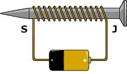
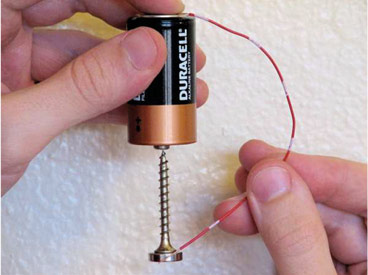

### 29.1.1 {#29-1-1}

Elektromagnety

Elektromagnet vznikne tím, že cívce dáme jádro z magneticky měkkého kovu. Princip je jednoduchý: Prochází-li proud, je okolo cívky magnetické pole. Když proud vypneme, pole zaniká. Elektromagnetem lze ovládat kovové mechanické části, různé závory, zámky, ventily atd.

Pro elektromagnety platí vše, co jsem výše napsal o elektromotorech: připojujeme je vždy přes budič a s ochrannou diodou.

Nemáte elektromagnet? Snadná pomoc, stačí kousek izolovaného drátu a hřebík. Omotejte drát okolo hřebíku, a na jeho konce připojte napětí. Hřebík začne fungovat jako magnet.

Když celou tuhle sestavu postavíte na výšku tak, že hřebík bude zasunutý třebas jen do třetiny cívky a zapnete proud, cívka vtáhne hřebík dovnitř. Pokud má malou sílu, znásobte počet závitů (třeba naviňte druhou vrstvu přes první.

Mimochodem, pokud máte k dispozici silný neodymový magnet – bývají to takové malé kovové válečky – můžete si pomocí hřebíku (nebo šroubu), monočlánku a kousku drátu udělat jednoduchý motor. Viz obrázek.

Jak to funguje? Procházející proud vyvolá magnetické pole, které se bude, obrazně řečeno, „přetlačovat“ s magnetickým polem magnetu. A protože je celá konstrukce lehká a má jen minimální tření, bude i malé magnetické pole stačit k tomu, aby se vše otáčelo.