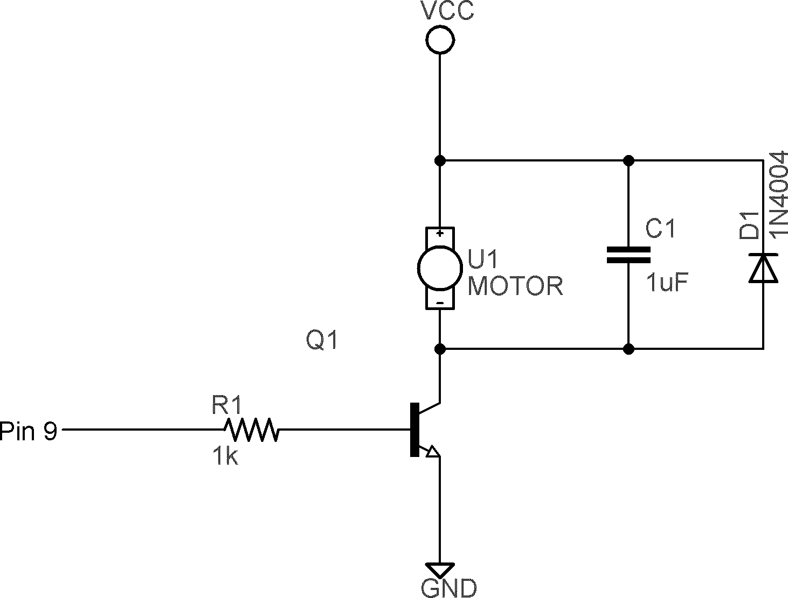
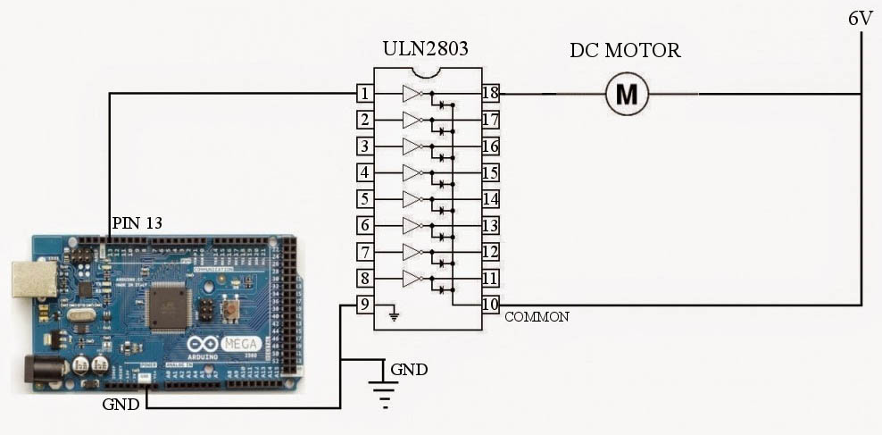
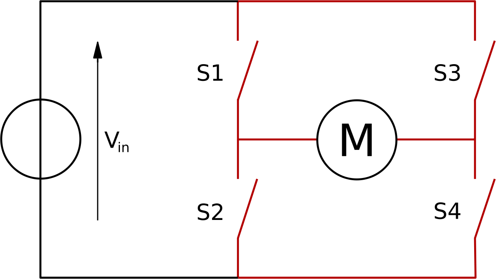
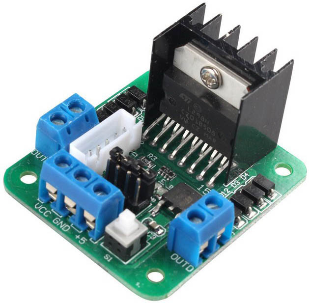

### 29.1.2 {#29-1-2}

Motory

Pokud potřebujete něčím otočit nebo něco posunout, zvolíte nejspíš elektromotor. Elektromotorů je obrovská škála, od těch nejmenších modelářských až po obrovské elektromotory v lokomotivách.

Elektromotor se skládá ze dvou částí, ze statoru a rotoru. Jsou různé typy a různá uspořádání těchto dvou částí. Nejčastěji se používá uspořádání, v němž je pevná část (stator) tvořena permanentním magnetem a otáčivá část (rotor) cívkou. Proud, procházející cívkou, vytváří okolo této cívky také magnetické pole, které cívkou točí tak, aby její severní pól byl co nejblíž jižnímu pólu pevného magnetu. Pokud v tu chvíli změníme směr proudu, tekoucího cívkou, její magnetické pole se otočí, přepóluje, a pevný magnet ji odpuzuje. Cívka se tedy opět pootočí…

V praxi bývá na rotoru cívek víc, většinou tři nebo šest, ale může jich být i víc.

U stejnosměrného motoru se používá speciální část, nazvaná komutátor, která se stará právě o přepojování napětí tak, aby se pravidelně měnil proud cívkami. Rychlost otáčení takového motoru je úměrná velikosti proudu, který jím protéká.

Existují i motory bez této součásti (bezkomutátorové, brushless), u nichž musí vnější elektronika řídit proud jednotlivými cívkami, a podle frekvence přepínání těchto cívek lze přesně řídit rychlost motorku. S takovými motory se setkáme tam, kde je na závadu případné jiskření, které hrozí u komutátorů, popřípadě tam, kde je dobré mít možnost ovládání otáček – například ve větráčcích u počítačů.

Motor nemusí být jen stejnosměrný, může fungovat i na střídavý proud, ovšem pak bývá jinak zapojen. Může mít uspořádání obrácené, tj. stator složený z cívek a rotor s permanentním magnetem. Místo permanentního magnetu může být rovněž použita cívka… Typů je nepřeberné množství.

Pro nás je důležité, že motor je zařízení, které používá cívky. Cívka má tu vlastnost, že při odpojení proudu v ní zaniká magnetické pole, a zanikající magnetické pole v ní zpětně naindukuje proud opačného směru. Pokud bychom připojili cívku přímo k vývodu číslicového obvodu, tak při jejím vypnutí by tekl velký proud opačné polarity do vývodu číslicového obvodu, a tím by ho téměř jistě zničil.

Proto se motory (ale i další zařízení s cívkami) připojují k číslicovým obvodům zásadně s paralelně připojenou ochrannou diodou v závěrném směru. Navíc platí, že motory potřebují poměrně velké proudy, které číslicové obvody nejsou schopné poskytnout, takže se zapojují přes speciální budiče. A taky se snažte vyhnout tomu, abyste zapojovali motory přes nepájivá kontaktní pole. Ta nejsou stavěná pro velké proudy, a mohlo by dojít k poškození, tak prosím opatrně.

Nejjednodušší budič je obyčejný tranzistor, o němž víme, že malým proudem dokáže spínat velký proud.

Další možnost je použít specializovaný obvod (například ULN2803), který obsahuje osm budičů a osm ochranných diod, takže můžete jedním takovým obvodem spínat až osm motorů.

Těmito způsoby můžete motor zapnout a vypnout. Pokud jej potřebujete ovládat sofistikovaněji, třeba zapínat v obou směrech otáčení, použijete takzvaný H můstek (H bridge).

Toto zapojení umožní připojit motor v obou směrech – buď kombinací S1 + S4, nebo kombinací S2 + S3\. Pokud jsou všechny spínače rozpojené, je motor navolno, pokud jsou sepnuté např. S2 a S4, je motor zabržděn.

Samozřejmě místo spínačů mohou být použité tranzistory, nebo opět specializovaná součástka – integrovaný H můstek. Můžete ho koupit už jako celou desku, i s konektory.

Na obrázku vidíte takový integrovaný H můstek, řídicí vstupy od elektroniky a výkonové konektory pro zapojení motorů. U těchto můstků je časté, že vlastní spínací element (integrovaný obvod nebo výkonový tranzistor) má zabudované chladiče.