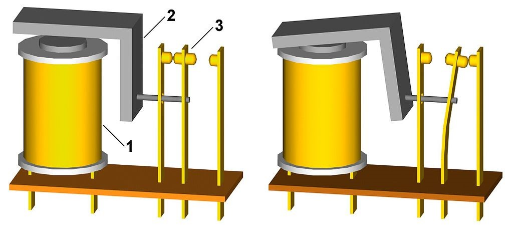

### 29.1.3 {#29-1-3}

Relé

Relé je zase cívka, k níž je přes mechanismus připojena trojice vývodů. Když je cívka (1) bez proudu, jsou spojeny dva z nich (společný a NC). Když cívkou protéká proud, přitáhne k sobě mechanickou kotvu (2), a ta přepne vývody (3) tak, že jsou spojené jiné dva (společný a NO).

CC-BY-SA, autor Teslaton

Relé je velmi stará elektrická součástka, ale používá se dodnes. Umožňuje jednak spínat velké proudy i napětí, včetně střídavého (není problém pomocí 5 V relé spínat 230 V síťové napětí), a zároveň elektricky odděluje řídicí část od spínané. Pokud chcete elektronikou spínat například lampičku do zásuvky, použijte relé, protože tím fyzicky oddělíte vlastní elektroniku od silového napětí.

Vzhledem k tomu, že jde o součástku elektromechanickou, musíme počítat s tím, že přepnutí nějakou dobu trvá. K nějakému spínání vysokou frekvencí, v intervalech sekundových a kratších, není relé vhodné.

A protože řídicím elementem je opět cívka, tak při připojování k elektronice nesmíme co? No nesmíme ji připojit přímo, vždy přes budič a s ochrannou diodu. Viz výše.