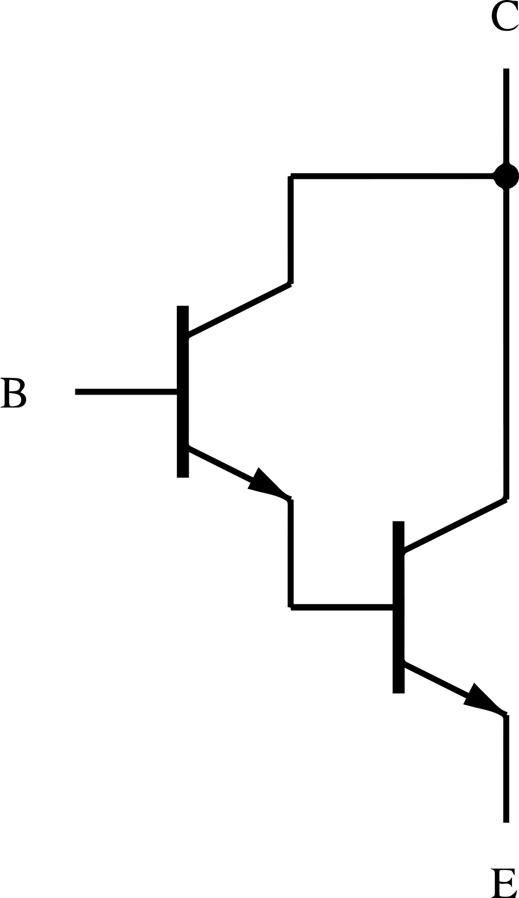

### 29.1.4 {#29-1-4}

Darlington, FET, Tyristor

Další spínací prvky, podobné relé, ovšem bez výhody elektrického oddělení obou zařízení, zato s výhodou přímého připojení na výstupy číslicových obvodů, jsou například výkonové tranzistory, tyristory a triaky.

Často používaným zapojením tranzistorů pro spínání velkých proudů je takzvané Darlingtonovo zapojení. Už jsme si jej představili, pro připomenutí schéma:

Takto zapojená dvojice tranzistorů se chová jako jeden tranzistor s mnohem větším proudovým zesilovacím činitelem, tedy dokáže velmi malými proudy spínat velmi velký proud. Výše zmíněný obvod ULN2803 používá vnitřně právě takovéto tranzistory v Darlingtonově zapojení.

Ke spínání velkých proudů můžeme použít i výkonové tranzistory MOSFET. U těchto tranzistorů se, jak víme, nespíná procházejícím proudem, ale přivedeným napětím. Spínací proud je v řádech mikroampérů, spínaný proud i několik ampérů.

Dřív se často používaly i spínací prvky tyristory a triaky. Principiálně jsou podobné tranzistorům, ale mají víc N-P přechodů. Dodneška se používají ve specializovaných oblastech, ale v amatérské mikroelektronice se častěji setkáte s výkonovým MOSFETem či relé.