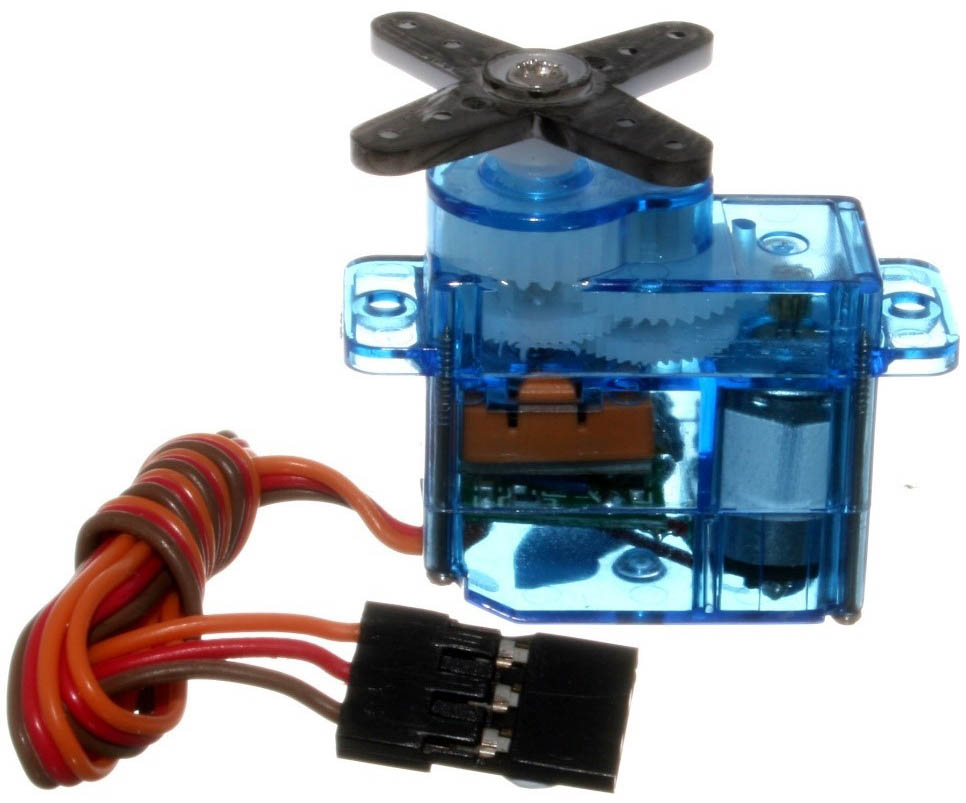
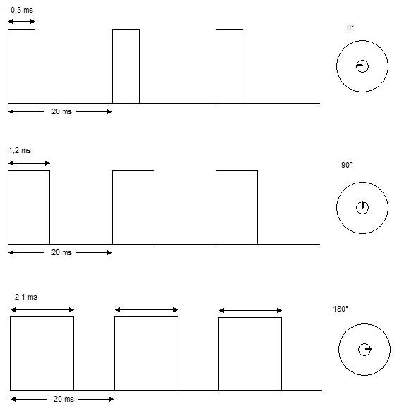

### 29.1.5 {#29-1-5}

Servo

Servo je speciálně upravený elektromotor se zpětnou vazbou a soustavou převodů, které se otáčí v rozsahu 240° (někdy 180°, někdy i 360°). Často se s nimi potkáte v různých hobby robotech, kde pohybují rameny, popřípadě v modelech, kde nastavují například křidélka nebo kormidlo u lodi. Výhodou serva je možnost přesně nastavit natočení osy.

Servo mívá tři vstupy – zem, napájecí napětí a řídicí vstup. Serva se řídí pomocí PWM signálu, kde šířka pulsu určuje natočení osy:

K ovládání serv se používají specializované obvody, které mají rozhraní (např.) I2C a dokážou ovládat až 16 serv. Opět platí, že takové obvody často seženete jako hotové moduly i s konektory.