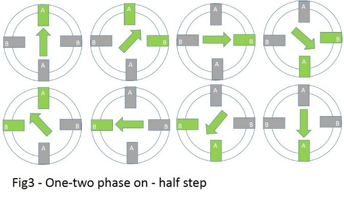

### 29.1.6 {#29-1-6}

Krokový motor

Krokový motor je vlastně obyčejný elektromotor, který má vyvedené jednotlivé cívky. Ovládací elektronika postupně spíná jednu po druhé a tím otáčí osou po malých krocích.

Ve skutečnosti mívají takové motory třeba 200 kroků na jednu otáčku. Krokové motory se používaly třeba v tiskárnách pro přesný posun vozíku. Dnes se používají ve 3D tiskárnách, kde zaručují totéž: přesný posun předmětu a trysky.

Krokový motor je opět zařízení s cívkou, takže zase platí: nepřipojovat napřímo, jsou na to speciální obvody. Hledejte „stepper motor driver“.