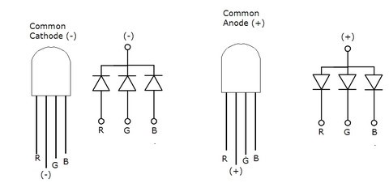

### 29.1.7 {#29-1-7}

Světlo

Jako zdroj světla jsme si dlouhá léta vystačili s žárovkou. V číslicové technice se žárovka moc nehodí, protože potřebuje poměrně velký proud, a to i když je maličká. Tam ji nahradily LED.

Když ale přesto budete potřebovat ovládat žárovku, použijte k tomu buď tranzistor (žárovky do 12 voltů), nebo relé (pro žárovky s velkým výkonem).

Dnes jsou dostupné i výkonové LED. Počítejte ale s tím, že takové LED potřebují vyšší napětí a přesně daný proud. Pro některé účely můžete použít i laserové LED – podobné těm, co jsou v laserových ukazovátkách. Ovšem u takových LED je potřeba dodržet proud i napětí; obyčejné připojení na 5 V je pravděpodobně zničí.

U výkonnějších zdrojů světla počítejte s nutností chlazení. I když jsou LED… Minimálně pasivním chladičem (což jsou různě žebrované hliníkové profily), pokud je to nedostatečné, budete muset použít ventilátor.

Zajímavá součástka, která je i v EduShieldu, je RGB dioda. Jde vlastně o tři barevné LED (červená, zelená, modrá) v jednom pouzdru, buď se společnou anodou, nebo se společnou katodou. Taková součástka může měnit barvu vyzařovaného světla v širokém rozmezí – například smícháním červeného a zeleného světla získáte světlo žluté apod. RGB LED se používají v různých barevných displejích nebo v osvětlovacích páskách.

V EduShieldu je použito zapojení se společnou anodou. Znamená to, že společný vývod je připojen k napájecímu napětí a k tomu, aby se dioda rozsvítila, je zapotřebí připojit vstupy R, G, B k zemi (logická úroveň 0).