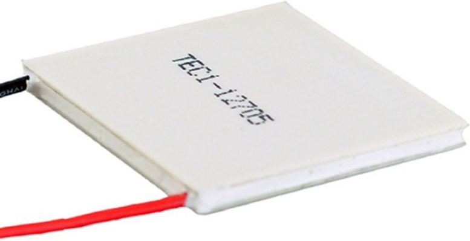

### 29.1.8 {#29-1-8}

Peltierův článek, topná spirála

Zajímavá součástka je Peltierův článek. Ten využívá takzvaného Peltierova jevu: když prochází proud rozdílnými vodiči, zapojenými sériově, tak se jedna z jejich styčných ploch zahřívá, druhá ochlazuje. Peltierovy články se vyrábějí nejčastěji jako čtvercové keramické destičky s rozměry 10 × 10 až 60 × 60 milimetrů, většinou kolem 3 milimetrů silné, s dvěma vývody. Pokud skrz takový článek necháte procházet proud, např. z 12 V zdroje, jedna jeho plocha se zahřívá, druhá ochlazuje. Až to budete zkoušet, tak doporučuju nesahat na článek přímo – já držel dva články při testu v ruce, a byla to opravdu hloupost, protože ten rozdíl teplot mezi chladnou a teplou částí je i u malých článků třeba 40 °C, a navíc je téměř okamžitý po zapnutí napětí.

Když budete teplou část chladit větrákem, můžete na chladné snadno dosáhnout teplot pod bodem mrazu, a obráceně – když budete zahřívat chladnou část, dosáhnete na teplé snadno bodu varu. Peltierův článek se označuje též TEC – Thermoelectric Cooler.

Topit můžete ale i jinak. Většinou tam, kde to nepotřebujete a nechcete (integrované obvody, tranzistory, rezistory). Takové teplo ale není moc užitečné. Pokud potřebujete něco ohřívat, zvolte topnou spirálu. Ano, stejnou, jaká je v elektrických vařičích, rychlovarných konvicích a podobných spotřebičích. Topná spirála je obyčejný drát z kovové slitiny s daným odporem, stočený do spirály (někdy i vícenásobně) a izolovaný. Pokud tímto rezistorem prochází proud, mění se v teplo (vzpomeňte na Ohmův zákon a vzorec pro výpočet výkonu).

Pokud budete něco z toho ovládat číslicovými obvody, tak vždy přes relé.