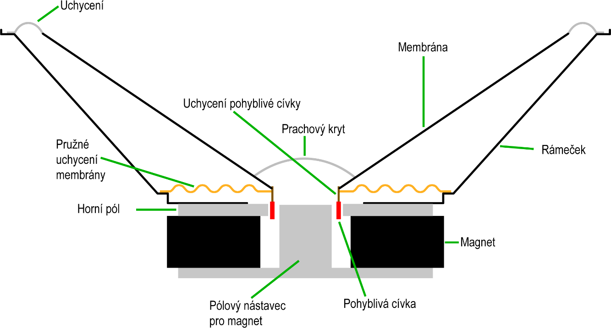

### 29.1.9 {#29-1-9}

Reproduktor

Reproduktor slouží k přeměně elektrického proudu na zvuk. Zvuk, jak asi víte, je mechanické vlnění, které se šíří hmotou, včetně vzduchu. K tomu, aby vznikl zvuk, je zapotřebí mechanického chvění nějakého předmětu – třeba struny, blány (u bubnu), jazýčku u pískacích hraček, popřípadě vzduchového sloupce (píšťaly). U reproduktoru se chvěje tenká papírová membrána. Chvění vzniká tak, že k membráně je připevněná cívka, která je umístěna mezi silné magnety. Když se mění proud cívkou, mění se její magnetické pole, cívka je více či méně zatahována do magnetu, a vzniká tak chvění, které se přenáší na membránu, a membránou do vzduchu.

CC-BY-SA, autor Iain

Můžete vynechat magnet, cívku udělat stabilní a membránu kovovou. Při vhodně zvolené pružnosti bude proud cívkou přitahovat membránu, a ta bude zase rozechvívat vzduch. Takto pracují sluchátka.

Zase platí: když chcete připojit sluchátko nebo reproduktor, musíte počítat s tím, že obsahují cívku, podobně jako u motorů a elektromagnetů. Reproduktory navíc mají malý odpor, takže potřebují velké proudy. Sluchátka mají odpor větší, ale i tak je dobrý zvyk zapojit je přes tranzistor a ještě odfiltrovat stejnosměrné napětí kondenzátorem. Jde to i bez toho, ale výsledný zvuk je pak zkreslený.

Funguje to i obráceně? Funguje. Když budete mluvit do sluchátka nebo reproduktoru, bude se v cívce indukovat napětí, které můžete zpracovat a převést na digitální informaci. Toto je princip elektromagnetického mikrofonu. Existují i jiné typy – uhlíkový mikrofon mění svůj odpor, kondenzátorový mění svou kapacitu, piezoelektrický generuje napětí mechanickou deformací krystalů…

29.2

Příroda ovládá elektroniku

Stejně jako je někdy potřeba, aby elektronika ovládala svět okolo nás, tak bývá potřeba, aby naopak nějak reagovala ona na to, co se kolem ní děje. Třeba na to, že uživatel stisknul tlačítko nebo že vzrostla teplota.