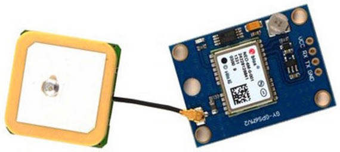

### 29.2.12 {#29-2-12}

GPS

Co bylo před dvaceti lety fantazií ze stránek populárně-naučných magazínů, to je dnes leckdy běžně dostupnou realitou. Jako příklad můžu jmenovat třeba GPS – systém geolokace pomocí družicového signálu. Vlastně extrémně složité zařízení, které přijímá signál z družic, u nichž jsou známy přesně jejich pozice, a z posunu signálu dopočítává přesnou pozici přijímače, tedy zeměpisnou délku, šířku i nadmořskou výšku.

Takové přijímače nejsou úplně nejlevnější, stojí i několik set korun, ale jsou bez problémů dostupné i pro amatérské konstrukce. Navíc mnohé z nich dokáží využít kromě amerického systému GPS i ruský Glonass a evropský Galileo.

Připojení takových přijímačů je navíc extrémně jednoduché, protože naprostá většina z nich používá jednosměrné sériové rozhraní UART s rychlostí přenosu 4800 Bd. Přijímač posílá neustále informace o pozici a dalších hodnotách pomocí takzvaného protokolu NMEA. Jedná se o velmi jednoduchý protokol, co řádek, to informace. Přijímač posílá různé typy informací, ta, která vás asi bude zajímat nejvíc, začíná znaky „$GPRMC“ a za nimi je 11 hodnot, oddělených čárkami. Například takto:

$GPRMC, 225446, A,4916.45, N,01511.12, E, 000.5, 054.7, 090717, 020.3, E*68

•

225446 je čas měření – 22:54:46 UTC

•

A informuje, jestli je měření platné – A = Valid position, V = Warning

•

4916.45,N Šířka 49 deg. 16.45 min. North (severní)

•

01511.12,E Délka 15 deg. 11.12 min. East (východní)

•

000.5 Rychlost vůči Zemi (v uzlech – knots, 1 knot = 1.852 km/h)

•

054.7 Azimut pohybu

•

090711 Datum měření (UTC)

•

020.3,E Magnetická odchylka 20.3 stupňů východně

•

*68 Kontrolní součet

Kromě vět GPRMC posílá přijímač i další (GPGSA – seznam dostupných družic, GPGSV – informace o pozici viditelných družic apod.), které ale asi nebudete využívat.