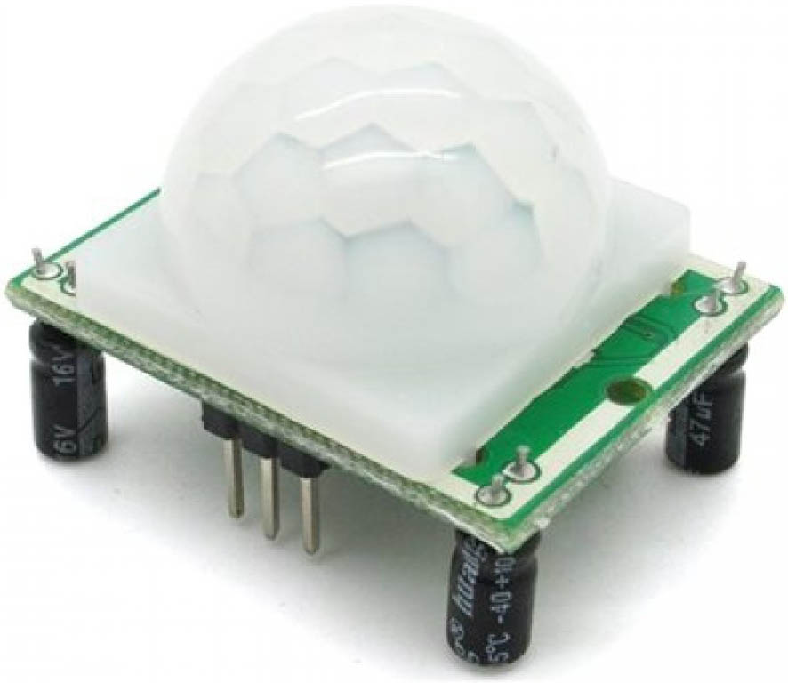

### 29.2.13 {#29-2-13}

Pohyb osob (PIR)

Zajímavé čidlo, kterým tento přehled uzavřu, je pasivní infračervené čidlo pohybu (Passive Infra Red – PIR). Čidla PIR jsou nápadná svým zakrytováním – ve skutečnosti jde o Fresnelovu čočku, která zaostřuje infračervené záření z okolí na snímací prvek. Vlastní element je zase polovodičová součástka, která je citlivá na infračervené světlo. To vyvolává změnu napětí, ta je detekována citlivým tranzistorem typu FET a dále zpracovávána.

PIR se používají pro detekci toho, že je nablízku člověk. Lidské tělo totiž vyzařuje, jako každý teplý objekt, infračervené záření. U lidského těla má toto záření vlnovou délku 9,4 μm. jsou tedy často používané pro detekci pohybu osob, ať už vítaného (např. u spínání osvětlení v garáži), nebo nevítaného (poplachové systémy).

Nevýhodou může být přílišná citlivost – pokud je příliš velká, zachytí čidlo i menší živočichy, například kočku či psa. Hodně záleží i na místě instalace čidla – případné proudění teplého vzduchu může čidlo zmást.

30

Meteostanice

30

Meteostanice

Jako bych to neříkal! Stačí málo, neopatrné slovo, a už se staví meteostanice. Tak pojďme na to, ať to máme z krku...

Použijeme Arduino. Ne že by to nešlo bez něj, ale s ním je to výrazně, asi tak 83 ×, jednodušší.

Co se bude měřit? Navrhuju teplotu, tlak a vlhkost. Výšku a rosný bod necháme stranou.

Naměřené hodnoty budeme zatím posílat po sériovém rozhraní do počítače. Později si upravíte a vylepšíte…

30.1

Výběr součástek

Víte, že každý projekt by měl začínat pečlivým zvážením použitých součástek. Projděte si tedy prosím nabídku výrobců senzorů a vyberte vhodné typy senzorů, které splní všechny požadavky, jaké na meteostanici budete mít. Až najdete vhodné typy, tak pečlivě prozkoumejte, jak se připojují a jak se s nimi pracuje. Pak sestavte prototyp – už máte dostatek informací k tomu, abyste věděli, co si počít s teploměrem se sběrnicí I2C například…

Ano, takto vypadá správný postup. Až budete vyrábět meteostanice ve velkém, postupujte prosím takto. A taky si k tomu nastudujte mnohem víc věcí, než vám v téhle knize prozradím já. Všechno to spočítejte a udělejte to pořádně.

Ale já vám prozradím něco, za co mě odborníci svorně proklejí. Prozradím vám totiž

30.2

Špinavej trik

Zastávám názor, že vynaložené úsilí by mělo být úměrné očekávanému výsledku, a že věci by měly být funkční a dobré dostatečně pro zamýšlené použití. Jinými slovy – když stavím zeď, nebudu si brát mikrometr, abych všechno důkladně změřil. Když budu měřit venkovní teplotu, nebudu kvůli tomu pořizovat ultrapřesný teploměr s přesností 0,01 °C. A když si stavím pro radost, tak použiju to, co:

•

vyhovuje mým potřebám,

•

dá se to dobře koupit,

•

už to někde někdo zkusil, použil a napsal o tom.

Tedy v případě meteostanice budu chvíli googlit a zjistím, že lidé nejčastěji používají součástky, co se jmenují DHT11 nebo DHT22 (měří vlhkost a teplotu) a BMP180 (měří teplotu a atmosférický tlak). Zjistím, že pro ně jsou desítky příkladů, jak je zapojit k Arduinu, a taky to, že jsou velmi snadno dostupné v e-shopech jako moduly, které stačí propojit vodičem s Arduinem, a dají se i naskládat na nepájivé kontaktní pole.

Jasně, profesionální zařízení bych takto nestavěl – ale nikdo tu nemluvil o profesionálním zařízení. Od začátku je tu řeč o nadšeneckém kutění pro radost.

Tento přístup vyvolává v některých opravdových odbornících záchvaty agresivního odporu: „je to čuňárna, to není elektronika, to je takové náhodné patlání něčeho, co najdu na webu, ten člověk si říká elektronik, ale ve skutečnosti tomu nerozumí…“ Na druhou stranu můžete díky tomuto přístupu rychle vyzkoušet nějakou myšlenku, nápad, ověřit, jestli to bude fungovat, postavit prototyp, a celé to zvládnete za jedno odpoledne.

Důležitou poznámku tu ale udělám: Když studujete na webu nějaké cizí zapojení či kód, asi začnete tím, že to zkopírujete a zkusíte spustit. Ale pak následuje velmi důležitá část, a tu nepřeskakujte: Snažte se pochopit, co se tam děje a jak to funguje!

Když autor použije někde tranzistor, ptejte se sami sebe: jakou tam má funkci? Co by se stalo, kdyby… Mohl bych použít nějaký jiný? A když tady čeká 10 milisekund, proč to tak je? Jaký měl důvod, že čeká? A můžu to zapojit na jiné piny?

Klást si otázky a odpovídat na ně je to nejcennější, co můžete s cizími příklady udělat. Tupě okopírovat to dokáže i cvičená opice. Já vás ale prosím, apeluju, naléhám na vás a žádám vás: Nedělejte to! Vždy berte nějaký hotový příklad jako inspiraci pro vlastní experimenty. Do cizích knihoven se podívejte, abyste viděli, co se děje pod kapotou. Držte se tohoto přístupu, a věřte mi: naučíte se spoustu věcí, a bude to zábavné učení.

Ostatně, i sami profesionálové staví také z ověřeného – když je potřeba zesílit audiosignál, použijí „zapojení první volby“, tedy tranzistor se společným emitorem, vyzkouší, ověří, a pokud nevyhovuje, tak teprve vymýšlejí jiná důmyslná zapojení.

30.3

Stavíme z polotovarů

To byl takový morální apel, a teď se vraťme k meteostanici.

DHT22 i BMP180 jsou součástky, které jsou dostatečně popsané, zdokumentované, je k nim dostatek knihoven… Vy obvykle začínejte prosím s tím, že si zkusíte připojit jednu z nich, podívat se na příklady, vyzkoušíte, že vám to funguje, popřípadě proč ne, pak totéž s druhou…

Teď si to zkusme ale jinak. Třeba s tím barometrem BMP180\. Když se na modul s touto součástkou podíváte, najdete většinou čtyři vývody: Vcc, GND, SDA a SCL. Co to znamená?

Vcc a GND je jasné, to je napájení. SCL a SDA napovídá, že se bude zařízení připojovat přes sběrnici I2C. Najděte si datasheet pro BMP180 a ověřte si, že to je opravdu tak.

V datasheetu si všimněte, že napájecí napětí je 3,3 voltů. To by mohl být problém – jenže naštěstí moduly s BMP180 obsahují stabilizátor napětí – je to ta miniaturní černá součástka se třemi vývody:

Letmým googlením najdete i schéma takového modulu:

Vidíte, že je tam stabilizátor, který sníží napájecí napětí 5 V z Arduina na požadované 3,3 V. Pak vidíte, že jsou použité i pull-up rezistory na 3,3 V pro sběrnici I2C. Budeme ji moci připojit k Arduinu, když víme, že to používá 5 V?

No, vzpomeňte si na popis sběrnice I2C: logická 0 je zajištěná tím, že zařízení připojují jednotlivé linky k zemi, logická 1 je zajištěná právě pomocí pull-up rezistorů. Taky víte, že 3,3 V je dostatečné napětí pro logickou 1 i pro zařízení, pracující s pěti volty, takže v tomto ohledu je to bezpečné. Může se tam někudy dostat + 5 voltů? Teoreticky ano, pokud bude na téže sběrnici připojené zařízení s pull-upy na + 5 V, nebo pokud budou zapojené interní pull-upy. Jinak ne.

V datasheetu je dále popsána přesně funkce celého obvodu – jak se adresuje, kde jsou jaké informace, jak se zadávají kalibrační údaje a spousta dalších věcí. A to je přesně okamžik, kde vám doporučím nevynalézat kolo a použít hotovou knihovnu. Vhodné jsou knihovny od výrobců takových modulů – nejčastěji Sparkfun nebo Adafruit.

Pokud najdete knihovnu BMP085, nebojte se – to je starší verze téhož, a v popisu většinou najdete, že umí i BMP180

Součástí těchto knihoven bývá i příklad měření. Podívejte se do něj – zjistíte, že se tam pracuje s aktuální nadmořskou výškou – tedy s tou vaší. Proč? No protože změřený tlak je ten reálný, co je okolo vás, ale aby se tlaky snáze porovnávaly, přepočítávají se na hladinu moře. Přepočet je jednoduchý – počítá se, že na každý metr nadmořské výšky připadá pokles tlaku o 8 Pa (jen pro jistotu: standardní tlak 1013,25 hPa = 101,325 kPa = 101325 Pa).

Například knihovna Adafruit BMP085 Library obsahuje ukázku kódu:

#include &lt;Wire.h&gt;

#include &lt;Adafruit_BMP085.h&gt;

Adafruit_BMP085 bmp;

void setup() {

Serial.begin(9600);

if (!bmp.begin()) {

Serial.println(„Could not find a valid BMP085 sensor, check wiring!“);

while (1) {}

}

}  

void loop() {

Serial.print(„Temperature = “);

Serial.print(bmp.readTemperature());

Serial.println(„ *C“);

Serial.print(„Pressure = “);

Serial.print(bmp.readPressure());

Serial.println(„ Pa“);

delay(500);

}

V příkladu není použitý přepočet na hladinu moře, proto se nedivte, když výsledky budou výrazně nižší, než očekáváte. Můžete si výsledek přepočítat pomocí výše uvedeného vzorce, nebo použít funkci bmp.readSealevelPressure(altitude), kde altitude je nadmořská výška v metrech.

Kde zjistit svou nadmořskou výšku? Můžete použít třeba GPS, ale nejjednodušší způsob je ten, že se podíváte na mapu, tam bude u vaší pozice uvedena i nadmořská výška! Nebo zkuste [api.mapy.cz/view?page=altitude](https://api.mapy.cz/view?page=altitude)

Senzor dokáže změřit i nadmořskou výšku. Chcete vědět, jak to dělá? No, změří tlak, a předpokládá, že na hladině moře je standardních 101325 Pa. Což bývá málokdy, protože tlak se mění s počasím, rozdíl může být třeba 3 kPa během několika dní, a takový rozdíl představuje přes 350 metrů výškového rozdílu.

U pevné meteostanice bude lepší nastavit výšku odečtem z mapy natvrdo do kódu.

Druhý polotovar, DHT11 nebo DHT22, je nejjednodušší připojit podle standardního zapojení a využít hotovou knihovnu. Když se podíváte do datasheetů, zjistíte, že komunikace s těmito senzory není úplně jednoduchá, a pokud se vám zrovna nechce znovuvynalézat druhé kolo (a komu by se chtělo, když může ušetřený čas věnovat něčemu zajímavějšímu, než je opakování cizích chyb?), použijte ji.

Možné zapojení celé meteostanice ukazuje obrázek. Obvod DHT je připojen podle příkladu z knihovny DHT Simple na pin 2, snímač BMP180 je zapojen na sběrnici I2C. U DHT11 je zapojený i pull-up rezistor 10k.

Když oba příklady spojíme do jednoho, získáme tak kód, který bude vypisovat tlak, vlhkost a dvě různé teploty (jedna je z BMP180, jedna z DHT11). Můžete si vybrat, které budete spíš věřit, nebo je prostě zprůměrovat (anebo použít samostatný teploměr).

Mimochodem, měření teploty není tak triviální, jak vypadá. Teplotu ovlivňuje spousta věcí – například nezapomínejme, že součástky také „topí“. U Arduina to není tak extrémní, ale třeba ESP8266, o němž se ještě budeme bavit, dokáže velmi pěkně ohřívat okolí, i o několik stupňů. Teploměr by samozřejmě neměl být na přímém slunci, měl by být daleko od ploch, které mohou sálat, měl by okolo něho proudit volně vzduch, …

No a když máte data, co s nimi? Zatím si je můžete zpracovat v počítači, nebo je můžete ukládat na SD kartu (o tom jsme se už bavili…) Později si tohle celé vylepšíme o posílání dat na server…

Schéma a zdrojový kód najdete na [eknh.cz/meteo](https://eknh.cz/meteo)

31

Bezdrátový přenos dat

31

Bezdrátový přenos dat

Bezdrátový přenos můžete zařídit několika různými způsoby. Většinou se pod pojmem „bezdrátový“ myslí nějaký přenos pomocí radiových vln, i když technicky vzato do bezdrátového přenosu dat patří i třeba infračervený (znáte z vašich televizí) nebo ultrazvukový. Ale teď se chci věnovat radiovému přenosu.

Já se v této knize záměrně nechci věnovat vysokofrekvenční elektrotechnice – to je tak složitý a komplexní obor, že ho rád nechám stranou. To by ta kniha měla dvojnásobný rozsah…

Naštěstí můžete používat i věci, u nichž neznáte princip fungování. A pokud vám někdo říká, že ne, nevěřte mu, protože to byste nemohli ani zapnout automatickou pračku. Pro začátek stačí vědět, jak to použít a jaké jsou pravidla a limity.

Rádiové vlny patří, stejně jako třeba rentgenové paprsky, mikrovlny v troubě, světlo nebo ultrafialové záření mezi elektromagnetické vlnění. Možná vás to překvapí, ale princip rádiových vln a třeba světla je obdobný, liší se pouze svou frekvencí.

Někdy se setkáte také s označením „dlouhá vlna, krátká vlna“ apod. Má to spojitost s šířením elektromagnetických vln a jejich frekvencí. Délka vlny je technicky vzdálenost, kterou elektromagnetické vlnění urazí během jednoho „kmitu“. Čím vyšší kmitočet, tedy čím víc kmitů za sekundu, tím je kratší vlna. Elektromagnetické vlnění s frekvencí 299 MHz má tedy délku vlny zhruba 1 metr, rádiové vysílání v pásmu FM (87 – 108 MHz) má vlny délky (přibližně) 2,7 až 4 metry.

Viditelné světlo má frekvenci tak vysokou, že by bylo už nepraktické udávat ji v hertzech (přesněji v petahertzech, 1015), místo toho se používají praktičtější nanometry (zhruba 390-760 nm je pásmo viditelného světla, červené má vlnu nejdelší, tedy frekvenci nejmenší, směrem k fialové délka klesá, frekvence roste).

Zůstaneme ale u rádiových vln. Udělat vysílač, který bude vysílat rádiové vlny, není těžké. Stačí k tomu kousek drátu a přesně vyladěný oscilátor. Jenže vysílání není jen tak. Protože rádiové vlny využívá televize, rozhlas, záchranáři, armáda a kdoví kdo ještě, jsou pečlivě rozdělené do pásem a je určeno, kdo smí jaké frekvence používat. Pokud chcete provozovat rádiový vysílač, musíte mít přidělenou frekvenci. Tím je zajištěno, že nebudete nikoho rušit a nikdo nebude rušit vás. Když budete vysílat bez přidělené frekvence, poměrně brzy si na vás patřičné úřady posvítí.

Naštěstí existuje několik frekvenčních pásem, v nichž může používat rádiové vysílání každý, i bez patřičné licence, pokud dodrží některá pravidla, především maximální vysílací výkon. Říká se jim „rádiové kmitočty vymezené všeobecným oprávněním“, a vy si prosím pamatujte, že to jsou hlavně tato pásma:

•

27 MHz pro „CB stanice“ (Citizen Band – občanské pásmo),

•

433 MHz pro přenos dat,

•

868 MHz pro přenos dat (v USA se používá 911 MHz, pozor na to!),

•

2,4 GHz a 5 GHz pro přenos dat (např. WiFi).

Na těchto frekvencích byste neměli mít s homologovaným přístrojem, to podtrhuju, žádný problém. Frekvence 433 a 868 jsou nejčastější frekvence, které můžete pro vlastní konstrukce použít. Doporučuju nevynalézat kolo a nesnažit se navrhnout vlastní vysílací a přijímací modul! Kupte si hotové a existující, které dodržují frekvenci i maximální výkon.

Počítejte s tím, že povolený výkon vám postačí pro pokrytí oblasti v řádech desítek metrů na volném prostranství. Je to proto, abyste svým provozem nerušili ostatní. Rádiová frekvence je holt sdílený statek, něco jako společná místnost: hlasitý hovor dvou lidí bude rušit váš hovor s někým dalším. Proto se tato pásma dělí do přesnějších kanálů… Například v pásmu 433 MHz má kanál 1 frekvenci 433,075 MHz, kanál 2 má frekvenci 433,100 MHz, kanál 3 má 433,125 MHz atd., až kanál 69 má frekvenci 434,775 MHz. Teoreticky byste měli mít možnost naladit vysílač i přijímač na přesný kanál v rámci daného pásma a snížit tak pravděpodobnost, že budete kolidovat například s bezdrátovým zvonkem u sousedů, nebo s ovladačem jejich garážových vrat. Praxe je bohužel ale zase mnohem pestřejší než teorie, protože velké množství hlavně levných zařízení vysílá „jak se dá“, a hlavně v městech jsou tato pásma velmi zarušená vším možným, co na těchto frekvencích vysílá. Kdejaké bezdrátové teploměry, zvonky, ovladače kdečeho…

31.1

Vysílání na 433 MHz

A teď do toho přispějete i vy. Dvojice modulů vysílač-přijímač na 433 MHz za pár korun vypadá takto:

Vlevo přijímač (4 piny), vpravo vysílač (3 piny). Ještě k nim doporučím připojit anténu – bez ní bude spojení velmi špatné a dosah jen několik centimetrů. Staré radioamatérské přísloví říká, že dobrá anténa je lepší než sebesilnější vysílač – a je to tak.

Anténu si můžete buď vyrobit z kusu drátu (měla by mít délku 17,3 centimetrů, nebo 34,6 centimetrů – čtvrtina, respektive polovina vlnové délky), anebo ji můžete koupit. Popřípadě rovnou shánějte moduly i s anténou.

Oba moduly mají klasické napájecí piny GND a Vcc, a jeden datový (u přijímače jsou to ty dva prostřední piny – jsou uvnitř spojené, takže jako by to byl jeden).

V ideálním případě by to vše mělo fungovat tak, že když přivedete na vstup DATA vysílače logickou 1, vysílač začne vysílat radiové vlny 433 MHz. Přijímač je přijme a pošle na svůj datový výstup taky 1\. Tak tedy zní teorie. V praxi to funguje tak, že přijímač chytá spoustu signálů na stejné frekvenci, je velmi zarušený, a vy v tom šumu musíte najít svoje data. Dražší a lepší přijímače spoustu té černé práce odvedou za vás; bez nich vám nezbývá nic jiného, než navrhnout dobře přenosový protokol, tak, aby minimalizoval chyby. Tedy se synchronizačními pulsy, s kontrolními součty, po malých dávkách atd.

Můžete si zkusit takový protokol navrhnout a otestovat. Nebo můžete zkusit použít nějaký existující a ověřený – doporučím LightWaveRF, pro který jsou knihovny pro Arduino… Ale pravděpodobně zvolíte třetí cestu…

Schéma a zdrojový kód najdete na [eknh.cz/433](https://eknh.cz/433)

31.2

nRF24L01+

Kryptická zkratka označuje čip od Nordic Semiconductor, který v sobě integruje radiovou část na 2,4 GHz a základní logiku řízení síťového provozu. Připojuje se k řídicímu procesoru (například k Arduinu) přes sběrnici SPI a funguje jako transceiver. Toto slovo je složeno ze dvou slov: transmitter (vysílač) a receiver (přijímač). Ani nechci vymýšlet český překlad – vysjímač? Zkrátka umí data posílat i přijímat.

Opět existuje celá řada čínských klonů, které obsahují jiný čip – nejen s mnohdy horšími parametry, ale především i s jiným komunikačním protokolem. Naštěstí existují spousty knihoven, které tyto starosti vyřeší za vás (doporučím RF24). Jen asi nebudou fungovat dohromady dva různé klony, popřípadě klon a originál. Proto doporučím si připlatit za originál.

Každý modul může mít v jeden čas otevřeno až šest komunikačních kanálů (rour – „pipes“) a komunikovat s šesti dalšími moduly. Každá roura má svoje jméno – to má 5 bajtů. Všechny roury v jednom modulu musí mít jména, která se v prvních čtyřech bajtech shodují. Tedy například 0xDEADBEEF00, 0xDEADBEEF01 atd. Na jméno roury můžeme hledět jako na adresu spojení mezi dvěma moduly. K této adrese se odkazujete při volání vysílacích funkcí apod.

Při komunikaci si v jednom modulu otevřete rouru pro zápis se jménem (třeba) 0xDEADBEEF01, v druhém modulu (s druhým Arduinem, samozřejmě) si otevřete rouru pro čtení se stejným jménem. Na přijímači použijete funkci startListening(). Funkce isAvailable() vám řekne, jestli jsou dostupná data, a pokud ano, přečtete je metodou read(). Na vysílači použijete funkci write(). Pokud nenastavíte menší hodnotu, můžete jedním vysíláním přenést až 32 bajtů dat.

Což je dobrá zpráva. Meteostanice s dvaatřiceti bajty dat udělá nemálo parády, tam se vejde velké množství informací. Vlastně stačí přidat jen nRF24L01+ k našemu „meteoArduinu“…

Připojení je trošku nepřehledné, tak si pamatujte:

| CE (3) | Pin 9 |
| --- | --- |
| CS (4) | Pin 10 |
| SCK (5) | Pin 13 |
| MOSI (6) | Pin 11 |
| MISO (7) | Pin 12 |

Tip: Pro nRF24L01 se prodává malý adaptér, na němž je stabilizátor 3,3 V a omezovací rezistory pro datové signály. Doporučuju jej použít, pokud připojujete modul k Arduinu.

Na protější straně může být další Arduino a nRF24L01, které bude data číst a posílat po sériové lince do PC. Můžete použít klidně i Raspberry Pi nebo Turris Omnia, nRF24L01 připojit k němu a data rovnou zpracovávat. Později, v kapitole o displejích, si ukážeme zapojení jednoduchého grafického displeje k Arduinu – pokud připojíte i nRF24L01, získáte tak docela slušný displej pro meteostanici.

Schéma a zdrojový kód najdete na [eknh.cz/rf24](https://eknh.cz/rf24)

32

Procesory, počítače, mikrořadiče

32

Procesory, počítače, mikrořadiče

Od hradel jsme prošli přes kombinační obvody a klopné obvody až k čítačům, registrům a pamětem. Teď se dostáváme k poslední velké oblasti číslicové techniky, k procesorům a počítačům.

Po zkušenosti z předchozích kapitol už jistě tušíte, že ani procesory nebudou nic mystického a tajuplného. A ono taky ne – jde jen o kombinaci toho, co už známe. Nevěříte? To byste měli. Existují totiž lidé, kteří si opravdu postavili svůj procesor z těch integrovaných obvodů, s nimiž jsme se seznámili. Ostatně, před vznikem mikroprocesoru ani jiná cesta nebyla.

Co to je vlastně procesor? Obecně jde o součást systému, která umí několik věcí:

1.

Přečte z připojené paměti nějakou binární hodnotu.

2.

Podle této binární hodnoty vykoná instrukci, která spočívá buď v přesunu dat odněkud někam, nebo v jejich zpracování v aritmeticko-logické jednotce.

3.

Posune se k další adrese v paměti programu.

4.

Řídí provádění těchto instrukcí a ovládá připojená zařízení.

K tomu potřebuje několik základních částí:

•

Aritmeticko-logická jednotka (ALU). S ní jsme se už seznámili v kapitole o kombinační logice.

•

Registry pro udržení dat, s nimiž se pracuje. Asi vás nepřekvapí, že jde o naše staré dobré známé klopné obvody D.

•

Čítač instrukcí (PC – Program Counter). Technicky jde opravdu o jeden mnohabitový čítač s možností nulování a přednastavení hodnoty, tedy něco podobného, jako umí obvody 74193.

•

Dekodér instrukcí. To je zase jen kombinační obvod, který podle kódu instrukce aktivuje požadované součásti v požadovaném pořadí.

Procesory se původně stavěly z mnoha desek, plných tranzistorů, později z méně desek, plných integrovaných obvodů, později, jak se technologie zlepšovala, klesal počet nutných integrovaných obvodů, až počátkem 70\. let 20\. století pokročila technika natolik, že umožnila naprostou většinu funkce procesoru integrovat do jednoho nebo do několika málo pouzder. Zrodil se mikroprocesor.

Za úplně první mikroprocesor je považován obvod 4004 firmy Intel. Byl vyvinut pro kalkulátory. Brzy po něm přišla rozšířená verze 8008, a po něm první úspěšný mikroprocesor Intel 8080\. U něj se zastavíme podrobněji. Jednak proto, že z něj se postupnou evolucí vyvinuly šestnáctibitové procesory řady 80 × 86 (a z nich pak Pentia a Core a další dodneška používané mikroprocesory), jednak proto, že se na něm dají dobře ukázat základní principy funkce těchto obvodů, a v neposlední řadě i proto, že v osmdesátých letech byl tento procesor používaný ve většině tehdejších československých mikropočítačů (protože jeho klon vyráběla československá TESLA pod označením MHB8080A).

32.1

Mikroprocesor 8080A

Původní 8080 byl záhy nahrazen vylepšeným typem 8080A, který byl rychlejší. Jeho vnitřní uspořádání ukazuje následující schéma:

CC-BY-SA, autor Appaloosa

Uprostřed vidíte aritmeticko-logickou jednotku (ALU). Nalevo od ní (samozřejmě že je řeč o tom schematickém náčrtku) je pracovní registr – akumulátor a registr pro ukládání mezivýsledků. Nad ALU je blok příznakových bitů (Flag Flip Flops), pod ní kombinační logika pro převod mezi binárními a decimálními hodnotami. Napravo je registr pro instrukci a instrukční dekodér. Pravá část schématu obsahuje blok pracovních registrů, čítač instrukcí PC a další registry. Kromě těchto částí obsahuje procesor ještě obvody pro řízení datové sběrnice, pro řízení adresové sběrnice a obvody časování a řízení běhu procesoru.

Procesor je osmibitový, to znamená, že pracuje s údaji o šířce 8 bitů. Navenek komunikuje obousměrnou datovou sběrnicí D0-D7\. Směr komunikace určuje procesor podle toho, jestli potřebuje číst data, nebo je zapisovat. Procesor dokáže adresovat 64 kB paměti (k tomu sloužila adresová sběrnice s šestnácti signály A0-A15).

Z hlediska programátora jsou zajímavé právě pracovní registry B, C, D, E, H a L, registr A (zvaný akumulátor, to protože se v něm „akumulují“ výsledky), ve kterém se provádějí všechny aritmetické i logické instrukce, ukazatel zásobníku a registr příznaků, který říká, jak dopadla poslední operace, a který slouží k podmíněným skokům (například „skoč, pokud výsledkem předchozí operace je 0“).

Obvod 8080A se nejčastěji používal s dvojicí podpůrných obvodů 8224 a 8228\. První jmenovaný se staral o správné vytváření hodinových pulsů (8080A vyžaduje dva nepřekrývající se hodinové pulsy) a synchronizaci signálů, druhý jmenovaný se staral o řízení sběrnice a vytváření základních řídicích signálů /MEMR, /MEMW, /IOR a /IOW.

Signály /MEMR a /MEMW říkají, že procesor chce číst z paměti (MEMory Read) nebo do ní zapisovat (MEMory Write). Signály IOR a IOW oznamují, že procesor chce číst nebo zapisovat do obvodů pro vstup a výstup. Takovéto rozdělení umožňovalo využít celý prostor 64 kB pro paměť, a další prostor 256 adres pro různé periferie (k nim se ještě dostaneme).

Po spuštění procesoru se většinou vnější obvody postaraly, aby ze všeho nejdřív přišel signál RESET. Tento signál uvedl procesor do výchozího stavu, což technicky znamenalo především nastavit čítač instrukcí (PC) do stavu 0x0000\. Pak začal procesor provádět instrukce.

První hodinový puls se nazýval FETCH a jeho úkolem bylo vyzvednout kód instrukce z paměti. Řídicí logika v tomto cyklu přepne datovou sběrnici na vstup, na adresovou sběrnici pustí hodnotu čítače instrukcí PC a aktivuje signál /MEMR – čtení z paměti. Kdesi venku, mimo procesor, musí být připojená paměť, většinou EPROM nebo RAM, a v ní uložený program. Paměť je připojena na adresovou i datovou sběrnici, a povolovací vstup /CE je připojen právě na /MEMR. Když procesor tento signál aktivuje, paměť na výstup vystaví hodnotu, kterou má uloženou na dané adrese – v tomto případě na adrese 0000\. Technicky je to prostě jen osmibitová hodnota, například 0xD3 – binárně 11010011.

Procesor tuto hodnotu vidí na datových vstupech a uloží si ho do registru instrukcí. To je zase náš známý osmibitový klopný obvod typu D. Na jeho výstupu je připojen velmi složitý kombinační obvod, který z těchto osmi bitů pozná, co má udělat, a podle toho v dalších cyklech aktivuje jednotlivé vnitřní komponenty. Například na vstupy ALU připojí akumulátor a některý z pracovních registrů, na řídicí vstup ALU nastaví operaci „sečti“, a v dalším kroku uloží výsledek opět do akumulátoru. U některých instrukcí si může vyžádat další čtení z paměti nebo zápis do ní. Když vykoná procesor vše, co daná instrukce předepisuje, zvýší hodnotu PC o 1 a celý cyklus se opakuje. U některých instrukcí (skoky) se PC nezvyšuje, místo toho je do tohoto registru zapsána nová hodnota.