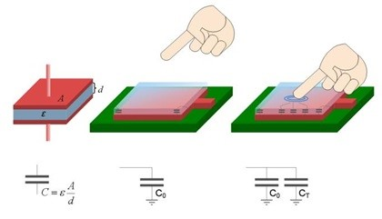

### 29.2.2 {#29-2-2}

Dotyk

Tlačítko potřebuje, aby člověk vyvinul nějaký tlak prstem a mechanicky tak posunul spínací element do požadované polohy. Existují ale obvody, které reagují na přiblížení či dotyk. Nejčastěji jsou postavené jako kondenzátor, a princip jejich funkce je ten, že přiblížení prstu vyvolá změnu kapacity.

