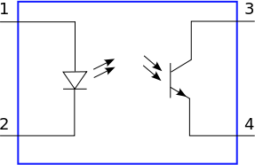
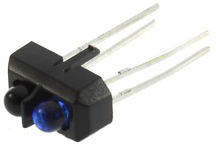

### 29.2.3 {#29-2-3}

Světlo – fotorezistor, fotodioda, line tracking

Princip fotorezistoru jsem už probíral. Citlivější a rychlejší snímání světla umožňují polovodičové fotodiody a fototranzistory. Opět se využívá citlivosti polovodiče na světlo.

Pokud potřebujete z nějakého důvodu oddělit dva obvody od sebe, můžete využít takzvaný optocoupler. Česky se používá termín optočlen. Jde o součástku, která v jednom pouzdru integruje LED a fototranzistor. LED funguje tak, jak jste zvyklí, a intenzita jejího světla otvírá nebo zavírá fototranzistor.

Optické oddělovače se používají například u dlouhých datových vedení, kde není zajištěno, že budou obvody na obou koncích připojené ke stejné úrovni země, a při prostém propojení by hrozilo zničení velkým proudem.

Dvojice LED – Fototranzistor se používá třeba i v detektorech přiblížení nebo ve světelných závorách. U snímačů přiblížení se obě součástky umístí vedle sebe. LED vysílá pravidelné pulsy, a pokud se přiblíží nějaký předmět, který dostatečně odráží světlo (třeba i prst), odrazí se puls i do fototranzistoru.

Samozřejmě takový detektor nebude moc fungovat, pokud k němu přiblížíte černé těleso, které, jak známo, moc světla neodráží (proto je ostatně černé). Tento efekt se používá například u robotů, kteří dokážou sledovat nakreslenou čáru. Robot svítí před sebe na zem, a několik fototranzistorů snímá odražené světlo. Pokud se neodráží žádné, znamená to, že u daného fototranzistoru je pravděpodobně nakreslená černá vodicí čára.