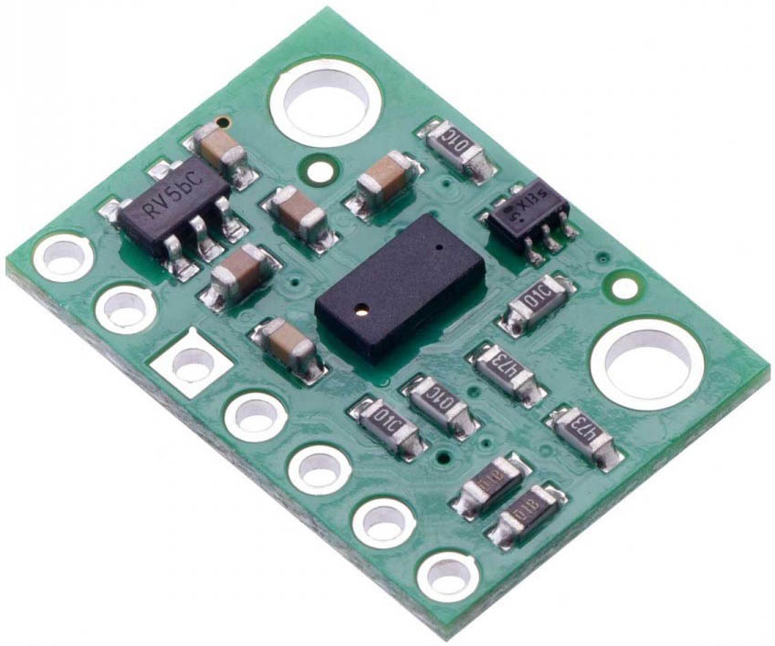

### 29.2.9 {#29-2-9}

Vzdálenost

Jednu z možností, jak měřit vzdálenost, jsme si už ukazovali – bylo to měření vzdálenosti pomocí ultrazvuku. Na podobném principu pracují i takzvané Time-of-Flight (ToF) senzory, ovšem místo (ultra)zvuku používají světelný paprsek. Jenže světlo letí mnohem rychleji, tak i přesnost měření musí být o hodně vyšší. Naštěstí zase existují součástky, které vše potřebné zařídí za vás.

ToF senzor je ta černá obdélníková součástka uprostřed, ta se dvěma malými otvory.