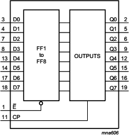
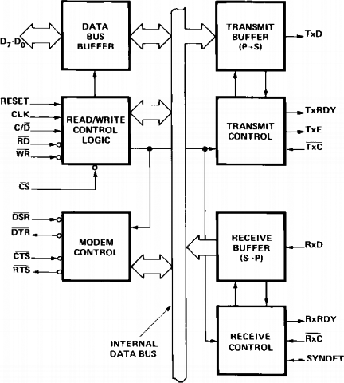

### 32.2.1 {#32-2-1}

Nemaskovatelné přerušení

Jiné procesory, třeba známý Z80, mají dva různé typy přerušení – maskovatelné a nemaskovatelné. Maskovatelné přerušení odpovídá tomu, co známe z procesoru 8080 (v procesoru Z80 máme k dispozici dokonce tři módy, což teď není podstatné).

Maskovatelné přerušení může programátor zakázat – „zamaskovat“ – pomocí speciální instrukce DI (Disable Interrupt). Tato instrukce nastaví vnitřní příznak v procesoru (technicky: zase jeden klopný obvod). Vstup /IRQ (Interrupt Request) je tímto příznakem „maskován“ – pokud je přerušení zakázáno, signál se nedostane dál a požadavek je ignorován. „Odmaskovat“ přerušení lze instrukcí EI (Enable Interrupt).

Kromě maskovatelného přerušení /IRQ existuje i signál nemaskovaného přerušení /NMI (Non Maskable interrupt). Tento signál vždy vyvolá přerušení, bez ohledu na instrukce DI/EI.

32.3

Periferie

Už několikrát to tu padlo – periferie. Co to vlastně je? Možná napoví český výraz vstupně/výstupní obvody (ostatně i v angličtině se označují jako I/O, tedy Input/Output). Technicky to jsou obvody, které jsou připojené na sběrnici procesoru, a které může procesor adresovat, zapsat do nich požadovaná data anebo naopak data přečíst.

Na rozdíl od paměti, která slouží jako velké úložiště, plné buněk, kam se data ukládají a z nichž se čtou, tak periferie mají podstatně pestřejší funkce. Když chcete k počítači připojit klávesnici, je to periferie. Periferie je třeba sériové rozhraní, nebo externí paměť… Periferie jsou všechny čidla a senzory. Zkrátka vše, co není procesor a pracovní paměť.

Technicky jsou tyto periferie připojené přes oddělovací obvody, které se postarají, aby na výstupech byla správná data, nebo naopak aby ta vstupní šla do systému pouze tehdy, když si o ně procesor řekne.

V roli takového nejjednoduššího obvodu si můžeme představit třeba osmici klopných obvodů typu D, například 74HCT377\. Tento obvod obsahuje osm registrů D se společným hodinovým vstupem CP a společným povolovacím vstupem /E. Pokud je /E neaktivní (=1), zůstává obvod stále ve stejném stavu a na výstupech udržuje předchozí zapsanou hodnotu. Pokud je /E aktivní (=0), tak náběžná hrana na hodinovém vstupu CP zapíše data ze vstupů D0-D7 do vnitřních klopných registrů. Odtamtud se pak objeví na výstupech.

32.4

Složitější periferie

V našem příkladu jsme použili jednoduchý obvod a stvořili jsme tak primitivní paralelní výstup. Na ten bychom mohli připojit, dejme tomu, nějaké řízení, nebo sedmisegmentovku, nebo něco takového.

Podobným způsobem, ale pomocí obvodu s třístavovými výstupy, bychom mohli udělat vstupní periferii (například s obvodem 74HCT244). A opravdu se tak dělaly. Ovšem bylo to velmi náročné na obvody i na konstruktéra.

Postupem času přišly složitější periferie, většinou programovatelné. Příkladem mohou být dva obvody, 8255 a 8251.

Obvod 8255 obsahuje tři obousměrné paralelní osmibitové porty PA, PB a PC, proto se označuje jako PIO – Parallel Input and Output. K procesoru se připojuje přes datovou sběrnici a dva adresové vstupy. Dále obsahuje vstup RESET a vstup /CS – známý Chip Select, který připojuje tento obvod ke sběrnici.

Ta nejzajímavější vlastnost obvodu 8255 je, že je konfigurovatelný. Podle kombinace na vstupech A0 a A1 procesor komunikuje buď s registry jednotlivých portů PA, PB, PC, nebo zapisuje a čte do/z osmibitového řídicího registru CWR. Pomocí zápisu do tohoto registru lze jednak ovládat přímo jednotlivé bity portu PC, ale také nastavit mód práce. Obvod totiž může fungovat jako tři nezávislé datové porty, ale také může rozdělit porty do dvou skupin (PA + polovina PC, PB + druhá polovina PC) a rozdělené signály portu PC využívat jako řídicí signály pro přenos dat, např. pro oznámení, že data byla přijata nebo naopak že je požadováno jejich převzetí apod.

Obvod 8251 se používal v osmibitových počítačích spolu s obvodem 8255\. Zatímco 8255 nabízí paralelní rozhraní, 8251 nabízí sériové rozhraní. V kapitole o rozhraních jsme si říkali, že se pro rozhraní RS-232 používaly obvody UART/USART – no a 8251 je právě USART, neboli Univerzální Synchronní / Asynchronní Přijímač a Vysílač (rozuměj: sériových dat).

S procesorem komunikuje tento obvod opět přes datovou sběrnici a pomocí řídicích signálů /RD, /WR. Obvod se připojuje na sběrnici ve chvíli, kdy je aktivní vstup /CE. Vstup C/D určoval, jestli se zapisují nebo čtou data (=0), nebo řídicí / stavové informace (=1). V praxi se připojoval k některému z adresních signálů, např. k A0\. Pokud byl obvod adresován například tak, že byl aktivní na adrese 0x20, a vstup C/D byl zapojen na A0, tak se adresou 0x20 přistupovalo do datového registru, adresou 0x21 do řídicího.

Ve schématu jsou vidět i všechny signály, o nichž jsme mluvili v kapitole o sériové komunikaci. Všechny ty DSR, DTR, CTS, RTS a podobné, které řídí, kdy se může vysílat a kdy ne. Vlastní datový přenos probíhal po linkách TxD, RxD – u synchronního přenosu se používaly i hodiny TxC, RxC.

Dalšími používanými periferiemi byly například čítače a časovače 8253 (nebo Z80-CTC). Tyto obvody obsahují programovatelné čítače, které dokázaly počítat nějaké vnější události, např. hodinové impulsy, a při splnění určité podmínky buď změnily signál na výstupu, nebo např. vyvolaly přerušení.

Mezi periferie se počítaly i zobrazovací jednotky. Některé displeje fungovaly naprosto transparentně, tj. zobrazovaly data, která byla někde v paměti, bez účasti procesoru, jiné bylo potřeba předem přepnout, nastavit do nějakého vhodného pracovního módu – tak fungovaly například videořadiče od Motoroly MC6845 (používané i v grafických kartách MDA a Hercules u IBM PC), nebo např. TMS9918 (výrobce Texas Instruments).

Další periferie, například vnější paměti apod., většinou nemívaly vlastní obvod a připojovaly se přes standardní rozhraní. Výjimkou byly floppy disky (diskety), které měly vlastní řadiče – známé typy Intel 8272, WD2797 nebo WD1793, které se používaly např. v disketových jednotkách, vyráběných pro počítač ZX Spectrum…

32.5

Jednočipový mikropočítač

Sedíte, držíte v ruce Arduino a říkáte si: Jak ono to funguje? Je tam taky nějaký procesor.

Jenže, jak ten procesor ví, co má dělat? Musí tam být někde uložený program, v nějaké paměti? A kde je ta paměť?

Že by to bylo všechno v tom jednom obvodu? ATmega328P je tam napsáno… Někde jsem četl, že se tomu říká jednočip – co to vůbec znamená?

Vězte, přátelé, že jste na správné cestě. V minulých kapitolách jsme si ukázali, jak funguje číslicový počítač. Je tam procesor, paměti, periferie… Logický vývoj tedy směřoval k tomu, že výrobci tyto části spojili, vytvořili na jednom čipu a ten strčili do jednoho pouzdra. A protože jsou základní části počítače, tj. procesor, paměti a periferie, na jednom čipu, říká se tomu „jednočipový mikropočítač“. Familiárně pak jednočip. Když budete hledat materiály v angličtině, nenechte se zmást: neříká se tomu singlechip, tohle slovo je vyhrazené pro něco trošku jiného, ale označení je microcontroller, v počeštěné podobě pak mikrokontrolér či mikrořadič.

Mikrokontroléry vznikly jen pár let po prvních mikroprocesorech. Většinou integrovaly existující procesor v nějaké modifikované podobě spolu s pamětí ROM a malou pamětí RAM, a k tomu i několik periferií, nejčastěji paralelní a sériové rozhraní a čítače / časovače. Ze začátku se vyráběly hlavně mikrokontroléry s paměťmi ROM a PROM, později i EPROM. Logicky s vývojem technologie přišly jednočipy s pamětí FLASH, a ty jsou dnes asi nejrozšířenější.

31.5.1

Harvard vs von Neumann

Tady je dobré místo na odbočku. Když jsme se bavili o tom, že paměť obsahuje program, který procesor vykonává, není to tak úplně jednoznačné. Existují dvě hlavní architektury, totiž von Neumannova, kde je operační paměť společná pro program a data, a harvardská, kde jsou paměti pro data a pro program oddělené. U jednočipů je častější architektura harvardská, u počítačů pro všeobecné použití zase von Neumannova.

U jednočipu, třeba toho arduinského ATmega328, je paměť RAM tedy určena pro ukládání zpracovávaných dat a zásobník, kód je v paměti FLASH (tedy de facto ROM). Vzhledem k tomu, že mikrokontroléry jsou primárně určené k tomu, aby dělaly jednu jedinou úlohu, která se po dobu jejich „života“ v daném zařízení nijak výrazněji nemění, tak je harvardská architektura docela vhodná. S touto architekturou můžete pro data a pro program zvolit také rozdílné typy pamětí – třeba mikrokontroléry PIC od Microchipu ze základní a střední řady (PIC10 – PIC16) zpracovávají osmibitová data, ale instrukce mají 12, resp. 14 bitů. Paměť FLASH je menší při stejné kapacitě než paměť SRAM, proto je ekonomičtější a výrobci tím snižují náklady.

32.6

Atmel AVR

Mikrokontrolér ATmega328 patří do rodiny mikrokontrolérů ATmega výrobce Atmel (v době psaní knihy už Microchip). Spolu s mikrokontroléry ATtiny, kde jsou mikrokontroléry s menší pamětí, patří do velké rodiny, označované AVR.

32.6.1

RISC

Jen pokud byste nevěděli – RISC znamená „Reduced Instruction Set Computing“, a vychází z poznatku, že většina programů využívá jen část bohaté instrukční sady standardních procesorů (CISC – Complex Instruction Set Computers). RISC proto redukují velké množství instrukcí, ponechávají jen ty základní, a snaží se je provádět co nejrychleji. RISCové stroje zpravidla ani nemívají některé registry vyhrazené pro konkrétní operace, ale bývají ortogonální, tj. jakákoli instrukce může použít jakýkoli registr.

AVR jsou osmibitové procesory s RISCovými rysy – mají omezenou 16bitovou instrukční sadu, 32 osmibitových registrů, s nimiž instrukce pracují, a většina instrukcí se provádí velmi rychle.

Když se podíváme konkrétně na typ, který je použit v Arduinu UNO: kromě procesoru AVR má 32 kilobyte FLASH, 2 kilobyte RAM a spoustu periferií, které se ovšem neadresují speciálním způsobem, ale tváří se, jako by to byly paměťové buňky.