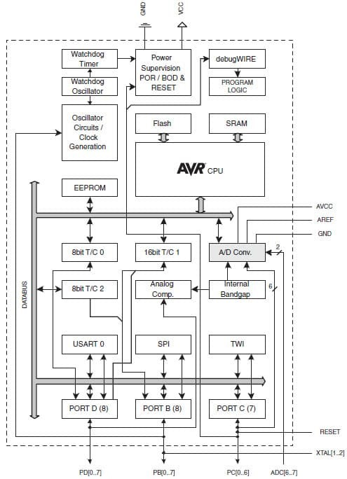

### 32.6.2 {#32-6-2}

Vnitřní uspořádání ATmega328

Zdroj: Atmel

Na schématu vidíte vnitřní uspořádání čipu ATmega328\. Uprostřed je samotný mikroprocesor AVR, spolu s pamětí FLASH a statickou RAM. Ve spodní polovině schématu jsou nakreslené periferie: tři porty (PD, PB a PC), obvod pro sériovou komunikaci USART, obvod, který komunikuje po sběrnici SPI a obvod TWI (Two-Wire Interface), který ovládá sběrnici I2C (toto označení se nepoužívá, kvůli tomu, že jde o registrovanou známku jiného výrobce). Všechny tyto periferie jsou nám už známé.

Nad nimi se nachází tři čítače / časovače (Timer / Counter), které může programátor využít k nejrůznějším účelům, od počítání událostí po úlohy typu „vyvolej přerušení za X časových pulsů“. Dále je zde připojena malá paměť EEPROM, určená pro ukládání údajů, které mají být k dispozici i po případném výpadku napájení. Sadu periferií uzavírá analogově-digitální převodník, což je komponenta, která umí převést vstupní napětí v určitém rozsahu na desetibitové číslo.

V horní části se nachází obvody Watchdog a BOD. Obvod Watchdog slouží k tomu, aby se jednočip nedostal do nekonečné smyčky, ze které by neměl úniku. Programátor může tento obvod zapnout, a pak musí na různá místa programu dát instrukce, které řeknou watchdogu, že program běží, jak má. Pokud po určený čas nepřijme watchdog takové potvrzení, má se zato, že program zhavaroval, a vyvolá se reset.

BOD (někde zvaný i BOR) je obvod, který hlídá takzvaný Brown-Out stav (Brown Out Detection / Brown Out Reset). Pokud napájecí napětí klesne pod určitou mez, výrobce nezaručí, že obvod bude fungovat správně. Proto obvod BOD takový stav hlídá, a pokud klesne napájecí napětí pod výrobcem stanovenou bezpečnou mez, procesor vynuluje. Zároveň se stará o reset po zapnutí napájecího napětí.

Poslední částí mikrokontroléru ATmega328 je debugWIRE – je to rozhraní, které umožňuje pomocí SPI a signálu RESET uvést procesor do speciálního stavu, kdy je možné zapisovat do interní FLASH. K tomu je potřeba externí obvod – programátor.

U Arduina tento obvod není. Místo toho je využita schopnost zapisovat do FLASH programově. Od výrobce Arduina je v paměti FLASH nahraný krátký program, zvaný bootloader. Tento program se spustí po každém resetu, a jeho úkol je prostý: čeká, jestli po sériovém portu nepřicházejí nějaká data. Pokud během určeného časového intervalu nepřijdou, předá řízení nahranému programu. Pokud data začnou chodit, zapisuje je do vnitřní FLASH, a tím vlastně obvod přeprogramuje.

32.7

Další mikrokontroléry

Atmel AVR je velmi široká rodina osmibitových mikrokontrolérů, která zahrnuje maličké obvody ATtiny s pár kilobajty FLASH, často s pouhými osmi vývody, a na druhé straně spektra jsou obrovské čipy s 256 kB FLASH, 8 kB RAM a až 86 datovými piny. Řada AVR má i pokračovatele, AVR32, což je 32bitová architektura, ovšem ta už není tak rozšířená.

Důvodem je to, že v oblasti 32bitových mikrokontrolérů naprosto dominují procesory a mikrokontroléry, založené na jádru ARM.