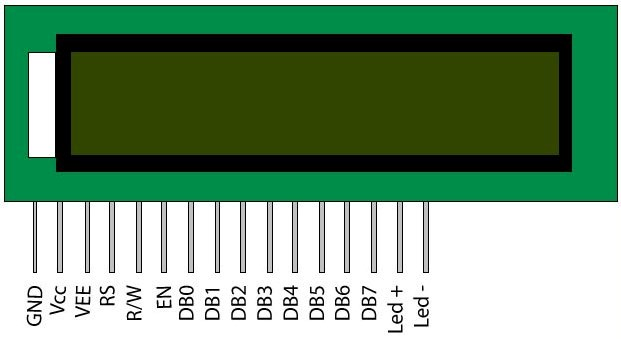
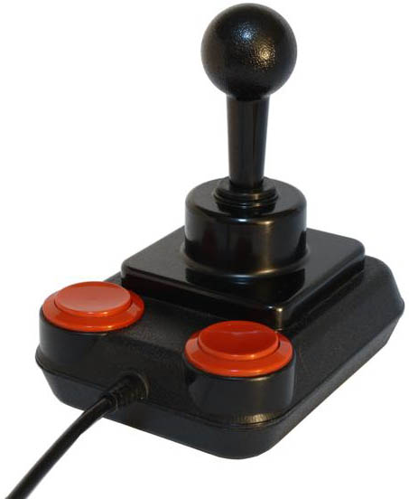

### 32.7.3 {#32-7-3}

8051/8052

Ani Intel nemohl stát stranou. Poté, co vyvinul a úspěšně nabídl řadu 8048 (hned několik modelů, co se lišily podle velikosti a typu paměti) přišel s řadou 8051/8052\. I tato řada dodneška žije a používá se v nejrůznějších mikrokontrolérech. Jádro 8051 se u různých výrobců dočkalo vylepšení či zrychlení, a i přes některé podivnosti a nectnosti, jaké toto jádro má, zůstává dodnes používané. Jeho velkou výhodou totiž je, že jej zná velké množství vývojářů a existuje dostatek vývojářských nástrojů.

32.8

Tak málo nožiček…

a přitom tolik funkcí, že? Když se díváte na Arduino, tak si říkáte: Převodníky, tři porty, sériové rozhraní, kde to má všechno vývody?

Téměř všechny mikrokontroléry totiž používají jeden trik: jejich vývody mají většinou několik funkcí, a programátor spolu s návrhářem vybírají, jaké funkce použijí. Obvykle platí, že periferie typu sériové rozhraní mají pevně dané vývody, a pokud nejsou použité, tak jejich vývody fungují jako normální I/O porty.

Příkladem mohou být piny 27 a 28 u ATmega328\. Na Arduinu jsou připojeny jako analogové vstupy 4 a 5, ale zároveň mohou sloužit jako komunikační piny SCL a SDA pro sběrnici I2C. Pokud ale nepoužíváme I2C a zrovna neměříme napětí na analogových pinech, fungují tyto dva vývody jako datové vývody portu PC, konkrétně PC4 a PC5\. Podobné to je s piny 2 a 3 – buď po nich probíhá komunikace přes UART (TxD, RxD), nebo fungují jako piny PD0 a PD1 portu PD.

Obyčejné datové piny mohou pracovat v několika režimech – výstup, vstup, a protože spousta obvodů pracuje s otevřeným kolektorem, kdy je potřeba zapojit pull-up, tak bývá tento rezistor zapojený už přímo v jednočipu a lze ho volitelně zapnout (input pullup).

32.9

Programování jednočipů

Víme, že v jednočipu je paměť FLASH a v ní je uložený program. Víme, že některé konstrukce (Arduino třeba) a některé jednočipy mají k dispozici program, který umožní po startu zkontrolovat sériovou linku, jestli náhodou někdo nepožaduje zápis. (Podobný systém používaly například mikrokontroléry Dallas Semiconductors, které měly jádro 8051, a kromě standardní paměti měly i zabudovaný program „monitor“, který umožňoval jednoduchou práci po sériové lince.)

Pokud jednočip takovou možnost nemá, je potřeba jej naprogramovat jinak. Možná vás to překvapí, ale třeba u AVR i PIC se tak děje způsobem, který je velmi podobný zápisu do sériové FLASH po sběrnici SPI. Podrobnosti jsou uvedeny vždy v datasheetu, ale většinou je nějakým způsobem využit signál /RESET, který uvede čip do stavu, kdy naslouchá na sběrnici SPI a pokud přijdou správná data, započne programování.

Starší jednočipy potřebovaly, podobně jako paměti EPROM, vyšší napětí, typicky 12 voltů. Toto vysoké napětí se přivedlo na signál RESET a signalizovalo, že bude následovat programování.

Novější jednočipy od tohoto způsobu ustoupily. Důvod byl jednoduchý: díky tomu, že se nepřivádělo napětí 12 V, ale pouze 5 V, mohly čipy za určitých okolností zůstat zapojené v obvodu a být naprogramovány přímo na místě. Tomuto programování se někdy říká In-Place Programming nebo In-Circuit Serial Programming (ICSP / ISP).

Arduino lze dokonce přeprogramovat speciálním firmware tak, aby fungovalo jako programátor pro jednočipy AVR, a to právě v režimu ICSP.

Jiné jednočipy, především ty s jádrem ARM, mají takzvané „JTAG“ obvody. Toto rozhraní funguje podobně jako výše zmíněné ICSP. Navíc mívá toto rozhraní schopnost ovládat procesor za běhu, přerušit jeho práci, přečíst vnitřní stav registrů a zjistit stav na vstupech a výstupech, takže se používá i pro ladění programů.

Další výrobci navrhují další a další způsoby, jak programovat jednočipy a jak ladit programy. Tyto způsoby jsou většinou nekompatibilní, takže pokud budete používat více rodin jednočipů, budete mít zároveň i několik programovacích rozhraní a programátorů, většinou poměrně drahých.

33

Displeje

33

Displeje

Vlastně až dosud jste používali pro výstup dat buď prostou LED, nebo jednoduchý sedmisegmentový displej, popřípadě jste posílali data na sériové rozhraní. Teď si pojďme ukázat některé vyspělejší displeje.

33.1

Znakový displej 1602, 2004

Dobře známý je displej, pro který se vžilo označení 1602 – 16 znaků, 2 řádky. Určitě jste ho už někde viděli, a když ne tento, tak jeho většího bratříčka 2004 (20 znaků, 4 řádky).

Vyrábí se v různých barevných provedeních, nejčastěji jako černé znaky na žlutozeleném pozadí, nebo jako bílé znaky na modrém pozadí, popř. modré na bílém pozadí. Tyto displeje obsahují řadič typu Hitachi HD44780, pro který existuje řada knihoven.

Skvělé na těchto displejích je, že jsou velmi jednoduché na ovládání – stačí osmibitová datová sběrnice (DB0-DB7), několik řídicích signálů (RS, R/W, EN) a jeden potenciometr pro nastavení jasu (Vee).

Což se lehce napíše a hůř provede, protože Arduino zas tolik digitálních výstupů nemá, a každý přijde vhod. Naštěstí mají tyto displeje možnost pracovat ve čtyřbitovém režimu. Čtyři nižší bity se připojí k zemi, a komunikuje se pouze přes horní čtyři bity (D4-D7). Navíc lze vynechat i  řídicí vstup R/W, který říká, zda se z displeje čte (1), nebo do něj zapisuje (0), a napevno určit, že do řídicího obvodu displeje se bude jen zapisovat.

Pak už zbývá jen šest vodičů: čtyři datové, jeden povolovací (EN) a jeden, kterým se říká, jestli se posílá řídicí instrukce (RS=0), nebo znaky ke zobrazení na displeji (RS=1).

Obvod je potřeba nejprve přepnout do čtyřbitové komunikace – pomocí sekvence speciálních příkazů. Jakmile je displej správně nastaven, stačí jen posílat ASCII kódy znaků, které se mají zobrazit, a posílat je po čtyřech bitech, nejprve vyšší, pak nižší. Pomocí některých řídicích kódů lze nastavit, kam se má další znak zapsat, popřípadě vytvořit několik vlastních znaků a používat je (symboly, znaky s diakritikou, …)

Arduino má naštěstí knihovnu, která se jmenuje LiquidCrystal, a ta se postará o vše potřebné.

A kromě knihovny vám může pomoci ještě jeden fígl – hledejte „1602 I2C expander“. Vypadá to nějak takto:

Tento modul je uzpůsobený pro připojení k displeji 1602 nebo 2004\. Postará se o správné řízení datových i řídicích signálů, obsahuje trimr pro nastavení jasu, omezovací rezistor pro podsvícení, zkrátka vše, co je k těmto displejům potřeba. A to nejlepší nakonec: displej bude fungovat jako každá jiná periferie na sběrnici I2C! (A samozřejmě i pro tuto variantu existuje knihovna, LiquidCrystal_I2C).

Schéma a zdrojový kód najdete na [eknh.cz/1602](https://eknh.cz/1602)

33.2

Grafický displej 12864

Předchozí displeje byly znakové. Sice interně používají matici bodů pro každý znak, ale kromě možností nadefinovat si několik málo znaků „po svém“ nemáte jak zobrazit třeba graf.

Tuto nevýhodu odstraňují grafické displeje. Pokračovatelem výše uvedených displejů je displej 12864 – číslo udává, že má rozlišení 128 × 64 bodů.

Tyto displeje jsou opět jednobarevné, nejčastěji černá kresba na pozadí podsvíceném bíle nebo zeleně, popřípadě bílá kresba na modrém pozadí… Rozhraní je většinou podobné předchozím modelům, ale některé displeje mají možnost přepnout se do sériového rozhraní (SCK + MOSI). Samozřejmě existují i expandéry – moduly, které tyto displeje připojí na sběrnici I2C.

33.3

Další displeje

Před lety se objevily ve výprodejích velmi levné displeje z mobilních telefonů, například ze starých Nokií 5110 atd. Tyto displeje mívají vlastní řídicí obvod, s nímž se komunikuje buď přes SPI, nebo po I2C. Nadšenci začali tyto displeje připojovat k jednočipům, protože byly levné a snadno řiditelné. Dnes je k dispozici velké množství modulů s takovými displeji, většinou za pár desítek korun (v českých e-shopech za jednotky stokorun), a se širokou škálou možností – s různým rozlišením, s různým rozhraním, barevné i monochromatické, LCD i OLED, někdy i s dotykovou vrstvou… Často je na stejném modulu například i slot pro SD kartu se SPI rozhraním.

K těmto displejům je vždy třeba přistupovat opatrně. Naprostý „noname“ bude asi těžké oživit, pokud nevíte, jaký řídicí obvod používají. Nejjistější je držet se takových, pro které si najdete dostatek literatury, a nejlépe hotových knihoven. Mohu doporučit hledat displeje s řadiči ILI9340 a ILI9341, pro ně je dostatek knihoven, jak pro ovládání, tak i pro kreslení grafických prvků, psaní znaků atd.

33.4

Bezdrátový displej k naší meteostanici

V kapitole o bezdrátovém spojení jsem slíbil, že si ukážeme, jak připojit malý grafický displej k Arduinu spolu s modulem nRF24L01\. Použijeme malý OLED displej s rozlišením 128 × 64 a s rozhraním I2C. V ideálním případě má takový modul jen čtyři vývody:

Někdy mívají vyvedené i signály pro sběrnici SPI. Vy ale klidně použijte I2C.

Zapojení asi nemůže být jednodušší:

A zbytek je už, jak se říká, obyčejná programátorská nádeničina. Přečíst data a aktualizovat displej, ke všemu jsou knihovny, no a kdybyste už fakt nevěděli, tak nezapomeňte:

Schéma a zdrojový kód najdete na [eknh.cz/rfdis](https://eknh.cz/rfdis)

34

Klávesnice

34

Klávesnice

Pojďme se podívat zase na jedno praktičtější téma.

Už víme, jak jednočip naprogramovat, aby něco dělal. Už jsme si i různé informace četli a zobrazovali. Ale co když chceme, aby ho někdo ovládal?

Možností je několik. Pokud vám postačí tři základní pokyny (nahoru, dolů, potvrdit), můžete použít rotační enkodér (už jsme si ho představovali).

Ovšem sázka takříkajíc „na jistotu“ je tlačítko. Pokud je potřeba víc pokynů, pak tedy víc tlačítek, respektive rovnou celou klávesnici.

Za chvíli vám ukážu různé způsoby připojení více tlačítek, ale teď probereme ten nejrozšířenější způsob zapojení – „do matice“. Používal se u domácích počítačů, používal se u osobních kalkulaček a používá se dodnes i v klávesnicích pro PC.

Představme si, že máme N vodičů svisle a M vodičů vodorovně. Třeba v matici 4 × 4 budeme mít čtyři sloupce (Col1-Col4) a čtyři řádky (Row1 – Row4), nějak takto:

Do míst, kde se sloupce a řádky kříží, připojíme tlačítka. A dál?

Jednotlivé řádky a sloupce připojíme na osm pinů mikrokontroléru. Dejme tomu, že řádky (Row) zapojíme jako vstupy s pull-up rezistory, sloupce (Col) jako výstupy. Klidový stav je takový, že na všech výstupech Col jsou log. 1, tlačítka jsou rozpojená a na vstupech Row je také log. 1 (díky pull-upu). Procesor či jednočip musí takovou klávesnici pravidelně „scannovat“ tím, že postupně jeden sloupec po druhém nastavuje do logické 0 a čte stav na vstupech Row. Pokud je to 1111, znamená to, že v daném sloupci žádné tlačítko není stisknuté. Pokud bude některé stisknuté, objeví se na příslušném řádkovém vstupu taky logická 0\. Díky tomu program přesně zjistí, která tlačítka jsou stisknutá.

Pro 16 tlačítek potřebujeme 8 vodičů. To možná nevypadá jako velká výhra, ale třeba u počítače ZX Spectrum, které mělo 40 tlačítek, stačilo k jejich obsluze pouhých 13 vodičů (8 řádků × 5 sloupců, ovšem fyzicky uspořádané jako 4 × 10).

Výhoda takového uspořádání je i ta, že nemusíte na každý bod dávat mechanické tlačítko, které je poměrně drahé. Můžete použít dvě membrány, na nichž jsou nakreslené vodivé spoje, křížené v místech tlačítek, a mezi nimi je distanční vložka, která drží v klidu obě vrstvy kousek od sebe. Teprve když v místě křížení zatlačíme, spojí se obě cesty…

Tomuto typu klávesnice se říká membránová. I když třeba v ZX Spectru byl na ní položený gumový hmatník, byla to uvnitř jen a pouze membrána. Dokonce i většina levnějších PC klávesnic má uvnitř membránu. Nevěříte?

Pouze ty dražší mají v sobě opravdová tlačítka.

34.1

Šetříme vývody

Maticové uspořádání je fajn, především díky tomu, že maticově uspořádaná tlačítka můžeme snadno číst přímo jednočipem, bez dalších obvodů.

Pokud ale chceme ušetřit ještě nějaké vývody, nezbude než sáhnout po podpůrných obvodech. Třeba náš oblíbený 74LS138, neboli dekodér 1-z-8\. Našich zmiňovaných 16 tlačítek bychom mohli zapojit do matice 2 × 8, řádek by se vybíral binární kombinací na vstupech A0-A2, a četly by se dva sloupce. Dohromady pět vodičů. V případě klávesnice ZX Spectra (5 × 8) by nám stačilo 8 vodičů celkem (3 pro výběr řádku, 5 pro čtení sloupce).

Můžeme ušetřit ještě víc – existovaly obvody, zvané prioritní enkodér, které dokázaly obsluhovat celé pole tlačítek a na výstupu přímo oznamovaly kód, jaké tlačítko bylo stisknuto. Nevýhodou bylo, že tyto obvody byly drahé, málo dostupné a neřešily situaci, kdy uživatel stisknul několik tlačítek naráz (Ctrl Alt Del by asi neprošlo).

Když se podíváte na klávesnici PC, vidíte přes sto tlačítek, a přitom jen několik vodičů. Je to jednoduché: v klávesnici je speciální obvod, který neustále kontroluje matici tlačítek a po sériové lince posílá informaci o změnách – které tlačítko bylo stisknuto, které puštěno. V prvních PC klávesnicích byl v této roli použit jednočip 8048...

34.2

Připojujeme klávesnici od PC

Dnes už se setkáváme převážně s klávesnicemi, připojenými přes USB, ale dají se koupit i starší typy, které používaly rozhraní PS/2\. Tyto klávesnice jsou vhodné i pro amatérské použití s jednočipy, protože mají jednoduchý komunikační protokol: po sériové lince klávesnice posílá kódy stisknutých a puštěných kláves. Jde v podstatě o synchronní sériový přenos s paritním bitem. Používá k tomu dva signály – hodiny a data (oba jsou s otevřeným kolektorem, takže jsou nutné pull-upy). Trochu nepraktické je, že hodinové pulsy generuje sama klávesnice, takže obsluhující procesor nemá pod kontrolou, kdy se přenáší data. Pokud mikrokontrolér neumí pracovat se synchronním sériovým rozhraním s paritou (USART), což pravděpodobně nebude umět, musíte klávesnici zapojit tak, aby její hodinový výstup KBDCLK dokázal vyvolat přerušení, v jeho obsluze přečíst stav na datovém pinu a poskládat si jednotlivé bity zpět do celých bajtů.

Až budete připojovat PS/2 klávesnici k mikrokontroléru, bude se vám hodit podobný adaptér – jde jen o PS/2 konektor s vyvedenými vývody.

Schéma a zdrojový kód najdete na [eknh.cz/ps2.](https://eknh.cz/ps2.)

34.3

Matice tlačítek

Ovšem ne vždy je potřeba plná klávesnice. Někdy stačí i míň kláves, například číslice a několik funkčních tlačítek. Dají se sehnat například membránové klávesnice 5 × 4 či 5 × 5, lze sehnat i malé klávesničky 4 × 4, 5 × 4, a některé e-shopy nabízejí například i sadu 16 tlačítek a 8 sedmisegmentovek – a navíc s čipem, který se stará o obsluhu klávesnice i zobrazovače, takže k mikrokontroléru připojujete celý blok přes SPI.

Historické okénko: U počítačů, zvaných „jednodeskové“, se často používaly maticové klávesnice a sedmisegmentové displeje. Některé takové počítače využívaly toho, že princip multiplexovaného displeje, kdy je potřeba vybírat pozice jednu po druhé, se dobře doplňuje s obsluhou klávesnice, kde se taky kontrolují řádky jeden po druhém, a tak často spojovaly výběr pozice na displeji s řádkem klávesnice, a během zobrazování zároveň četly klávesnici.

34.4

Postavte si třeba… kalkulačku?

Našel jsem hezké moduly s šestnácti tlačítky a osmimístným displejem, a když jsem přemýšlel, co z nich postavit, napadla mě, logicky, kalkulačka. Dnes existují dva hlavní způsoby stavby kalkulačky… Ne, pojďme si to říct jinak: Existují dva způsoby, jak přijít ke kalkulačce.

Zaprvé: Buď použijete tu, co máte v počítači, v mobilu, v lednici nebo kdekoli jinde, popřípadě si koupíte některou z 572 modelů, co mají v obchodech, vietnamskými večerkami počínaje. Anebo zadruhé – nějakou si postavíte.

My budeme stavět, protože nás baví elektronika. Dnes existují dva hlavní způsoby stavby kalkulačky. Jeden je opravdu retro, při něm použijete staré kalkulačkové obvody (MHB7001, MC14007), druhý je modernistický, pod heslem pokud to můžu poskládat z hotových modulů z eBay za dolar až pět včetně poštovného, tak to poskládám z modulů!

Já si takhle vyhlédl modul na fotografii. Je tam osm osmisegmentovek a šestnáct tlačítek a připojuje se to přes SPI, tedy tři dráty (+ 2 na napájení). Až ho budete hledat na eBay či AliExpressu, hledejte „keyboard display TM1638“.

Všimněte si, jak jsem ho k Arduinu připojil.

Na Arduinu najdete speciální konektor s šesti piny (2 × 3), označený ICSP. Je tam + 5 V a zem, jsou tam tři datové vývody (11, 12 a 13) a RESET. Pokud zrovna nehodláte programovat jednočip, tak jsou volné a jsou natvrdo připojené na piny, kde je vyvedené rozhraní SPI.

Zmíněný modul používá k řízení tlačítek a displeje čínský obvod TM1638\. Existuje datasheet, ale v podobné situaci je nejjednodušší podívat se, jestli už není hotová knihovna pro Arduino. Většinou už ji někdo udělal. Stejně jako v tomto případě.

Všechno propojte, z knihovny otevřete příklad tm1638qyf, změňte nastavení vývodů tak, aby odpovídalo našemu zapojení, a spusťte. Nelekněte se, pokud začne displej zuřivě blikat – to je naprogramované demo!

Práce s klávesnicí je jednoduchá: knihovna vrátí šestnáctibitové číslo, kde co bit, to tlačítko. Nejnižší bit odpovídá tlačítku 1, které je „vlevo nahoře“…

Kalkulačka potřebuje 10 tlačítek pro číslice. Zbývá jich 6\. Jedno tlačítko zabere „=“, zbývá jich pět. Takže máme prostor pro čtyři základní matematické operace, a to poslední tlačítko bude „C“ – tedy tlačítko na smazání chyby.

Namapujeme si je takto:

První pokus mi ukázal, že obvod by sice měl odstranit zákmity, ale nějak se mu to nedařilo, takže jsem si je ošetřil sám.

Druhý krok byla jednoduchá funkce: Když zmáčknu tlačítko s číslicí, objeví se na displeji a přidá se k už napsanému číslu. Je to jednoduchá operace: Z = 10 × Z + n. Jestli nevěříte, zkuste si to: Mám na displeji 123, zmáčknu čtyřku, výsledek by měl být 1234, a to je přeci těch původních 123 × 10 + (zmáčknutá) 4! Do téže funkce přidám omezení počtu míst (na sedm, osmou pozici nechám volnou pro symbol „mínus“).

Tlačítko C prostě jen vynuluje pracovní registr (a na displeji se objeví 0).

Až budete implementovat vlastní matematiku, bude se vám hodit pár tipů. Není to úplně triviální, jak by to na první pohled mohlo vypadat. Nezapomeňte, že kalkulačky pracují s infixovou notací, to znamená že 2 + 3 se zadává jako série stisknutí tlačítek 2, +, 3 a =. Algoritmus je tedy takový:

•

Pokud uživatel stisknul číslici, přidej ji jako nejnižší řád k tomu, co je na displeji.

•

Pokud uživatel stisknul C, nastav displej na 0.

•

Pokud uživatel stisknul nějakou operaci, poznamenej si ji. Pak proveď předchozí uloženou operaci, ulož si mezivýsledek do registru X a zobraz ho. Zároveň při dalším stisknutí číslice nejprve vynuluj displej.

•

Pokud uživatel stisknul „=“, tak proveď poslední uloženou operaci, výsledek si ulož do registru X a zobraz ho.

K tomu jen poznámka: Kalkulačka nezohledňuje (v téhle verzi) prioritu operátorů, to si můžete vyřešit za domácí úkol.

Kalkulačka potřebuje několik pracovních registrů: jednak registr X na uložení mezivýsledku, pak registr „op“ na uložení zvolené operace, a konečně registr Z, kde je obsah displeje.

Takhle z popisu by to mohlo vypadat, že při stisku tlačítka s nějakou operací se vlastně vykonává ta předchozí, a když se nad tím zamyslíte, tak to tak opravdu je. Ta aktuální se ukládá „na příště“ a provádí se ta předchozí. Tlačítko „=“ je v podstatě stejné jako jakákoli jiná operace, jen s tím rozdílem, že „na příště“ se uloží operace „nedělej nic, jen zkopíruj displej do mezivýsledku!“

Čistě pro formu si zkuste pár cvičení: upravit kalkulačku tak, aby zvládala prioritu operátorů, upravit ji tak, aby umožňovala zadat záporná čísla, upravit ji na RPN, …

RPN (Reversed Polish Notation, obrácená polská notace) je takový zápis matematických operací, kde se nejprve zadávají čísla, a teprve poté operátory. Například 2 + 3 × 4 se s RPN zadá jako 2 3 4 × +. Čísla se průběžně ukládají na zásobník, operátory si ze zásobníku berou argumenty a vrací tam výsledky.

Schéma a zdrojový kód najdete na [eknh.cz/calcuino](https://eknh.cz/calcuino)

35

Osm tlačítek na třech vodičích

35

Osm tlačítek na třech vodičích

A nejen to. Proč? No, máme v ruce Arduino, to má 14 datových vývodů, 6 analogových. To není moc. Zapojíte k tomu dvě čidla, SD kartu, displej – a kam připojíte tlačítka?

Maticové uspořádání může hodně ušetřit – pro 16 tlačítek potřebujete 8 vodičů, pro 40 tlačítek 13 vodičů, ale to může být stále hodně. Naštěstí je pár triků…

35.1

Multiplexior / Demultiplexor

Pamatujete na kapitolu o číslicové technice? Multiplexor vybírá jeden z mnoha vstupů, a ten posílá na výstup, demultiplexor (dekodér) zase aktivuje jeden z několika výstupů.

Představme si tedy matici 8 × 8 tlačítek. Buzení řádků zařídí náš oblíbený 74LS138 – stručně zopakuju: obvod má tříbitový vstup a osm výstupů, které jsou v log. 1 kromě toho, jehož číslo odpovídá tříbitovému číslu na vstupech.

Osm sloupců bude zase připojeno na multiplexor, třeba 74HCT151\. Tento obvod má pro změnu osm datových vstupů, tři vstupy adresy a dva výstupy, Y a /Y. Na výstup je připojen ten vstup, jehož číslo… a tak dál…

Takže potřebujete tři vývody na výběr řádku, tři vývody na výběr sloupce, a jeden vstup, který řekne, jestli dané tlačítko je nebo není stisknuté. 64 tlačítek tak obsloužíte pomocí 3 + 3 + 1 = 7 signálů. Na poloviční počet tlačítek stačí 6 vodičů…

A co na to jít ještě jinak?

35.2

PISO a SPI

V kapitole o posuvných registrech jsme si představili obvody PISO – jde o posuvné registry s paralelním vstupem a sériovým výstupem. Jako příklad si vezměme obvod 74HCT165\. Jde o osmibitový posuvný registr PISO.

Datové vstupy jsou označené D0 až D7\. Vstup /PL nahraje do registru aktuální stav na těchto datových vstupech. Výstup Q7 odpovídá nejvyššímu bitu posuvného registru (tedy po nahrání D7), /Q7 je, nepřekvapivě, jeho negace. Náběžná hrana na vstupu CP (Clock Pulse) posune obsah registrů ve směru 0-&gt;1-&gt;2-&gt;3-&gt;4-&gt;5-&gt;6-&gt;7, nejvyšší bit je tedy zahozen, na jeho místo přichází nižší… (Programátorsky řečeno: jde o posun doleva.)

Vstup /CE povoluje hodinový vstup (Clock Enable). Pokud je aktivní, tedy log. 0, tak vše funguje tak, jak jsem popsal, pokud je neaktivní (log. 1), tak jsou hodinové pulsy CP ignorované.

Konečně poslední vstup, DS (Data Serial input) slouží k sériovému zápisu do registru. Díky tomu můžete tyto obvody snadno řetězit – výstup Q7 jednoho obvodu připojíte na vstup DS druhého…

Když potřebujete obsloužit například 16 tlačítek, zřetězíte dva obvody 74HCT165 a na datové vstupy připojíte tlačítka s pull-upy, třeba takto (nakreslil jsem jen jedno tlačítko…)

Stačí pouhé tři vodiče. Signálem /LOAD načtete stav tlačítek do registrů. Na výstupu MISO je k dispozici stav tlačítka 7 u spodního obvodu, postupnými pulsy na vstupu CLK se na výstup MISO dostávají další tlačítka…

Nevýhodou je, že každé tlačítko potřebuje vlastní pull-up rezistor a že načítání nějakou dobu trvá.

Co myslíte – jde to dotáhnout ještě do většího extrému?

35.3

Analogová cesta

Jde! Co by nešlo. Představte si takový rezistorový dělič, třeba ze čtyř rezistorů se stejnou hodnotou, k němuž jsou připojená tlačítka do společného bodu, který je přes pátý rezistor stejné hodnoty připojený k napájecímu napětí. Nějak takto:

Za normálního stavu, pokud není žádné tlačítko stisknuté, je na výstupu napájecí napětí 5 V přes rezistor R5.

Když stisknete tlačítko S5, bude výstup připojen přímo na zem, a bude tam tedy rovných 0 voltů.

Když stisknete tlačítko S4, půjde proud přes rezistor R5, tlačítko S4 a rezistor R4 k zemi. Na výstupu bude 2,5 voltů, protože stiskem S4 vznikne dělič R : R, a jelikož jsou oba odpory stejně velké, bude výsledné napětí polovina napájecího.

Analogicky při stisku S3 bude dělič v poměru R:2R (R5 proti R3 + R4), tedy na výstupu bude cca 3,33 V.

Stisk S2 znamená dělení v poměru R:3R, tedy cca 3,75 V. Tlačítko S1 pak nastaví dělič na poměr R:4R, a výsledkem by mělo být napětí 4 volty.

No, a když výstup připojíte k analogovému vstupu Arduina, tak pomocí analogRead můžete číst přímo hodnoty stisknutých tlačítek. Dokonce můžete vynechat i R5 a použít interní pull-up – pinMode(A0, INPUT_PULLUP).

Takže nakonec obsluhujete pět tlačítek pouhým jedním vstupem! Samozřejmě, takovéhle řešení má svoje limity: analogový převodník není nekonečně přesný, rezistory také nebývají přesné, navíc se „rozlaďují“ teplem, takže pět tlačítek je takové rozumné maximum.

Ale když už jsme na to narazili – existuje takové hezké zapojení, kdy pomocí rezistorů převádíte digitální signál na analogový. Samozřejmě existují velmi přesné součástky, digitálně-analogové převodníky (DAC), které tuhle práci dělají za vás. Dokonce jsou i v podobě malých obvodů, řízených třeba přes I2C nebo SPI. Ale když není zbytí, lze použít i jednoduché zapojení, které se nazývá R-2R.

35.4

R-2R

Označení vyjadřuje, že se zapojení skládá z rezistorů dvou typů: s nějakým odporem R, a s dvojnásobným odporem 2R. V praxi se volí třeba 10k a 20k (ten není v základní řadě E6 ani E12, ale v řadě E24 už ano). Popřípadě se zapojují dva rezistory s hodnotou R do série.

Vidíte, že jsou zde čtyři digitální vstupy D0-D3, připojené přes rezistory 2R k rezistorovému děliči z rezistorů R, který je připojen k zemi u nejnižšího bitu rezistorem 2R. Není ale problém tento „žebřík z rezistorů“ (tak se tomu zapojení také říká: R-2R ladder) nastavit o další bity…

Dá se spočítat, jak takové zapojení funguje, ale já se omezím na tvrzení, že každý digitální vstup, který je v logické 1, přispěje určitou částí k výslednému napětí. D3 přispěje napětím U/2, D2 napětím U/4, D1 napětím U/8 a D0 napětím U/16\. Což je výhodné, protože výsledné napětí se pohybuje od 0 do 15/16 napájecího napětí a přesně odpovídá binárnímu vyjádření na digitálních vstupech.

Pokud naskládáte další R-2R členy, zvětšíte tím počet bitů, a tím i přesnost převodu.

Kdysi, v dřevních dobách PC, se tímto způsobem vytvářely zvukové výstupy: osmibitový R-2R převodník, připojený na paralelní port, stačil na přehrávání monofonní hudby. Tyto převodníky byly známé pod názvem Covox, a jeho schéma bylo velmi jednoduché:

Zpátky k našim tlačítkům: pokud bychom je připojili k R-2R „žebříku“, mohli bychom teoreticky zvýšit přesnost převodu a z ADC v Arduinu číst přímo hodnoty tlačítek jako bity převedeného čísla. V praxi bych do takového řešení ale nešel – u osmi tlačítek by stisku každého odpovídaly čtyři hodnoty, a to bych se bál, že rušení a nepřesné hodnoty součástek způsobí nespolehlivé fungování.

Každopádně vidíte, že fantazii se meze nekladou, a kdyby bylo nejhůř, tak i těch několik tlačítek můžete připojit na jeden vodič.

36

Joystick

36

Joystick

V dobách osmibitových počítačů byl joystick velmi důležitou periferií, bez níž se neobešel žádný hráč. Technicky jde o rukojeť, k níž jsou připojena čtyři tlačítka do kříže, a jedno, dvě či tři „akční“ tlačítka.

CC-BY-SA, autor Kshade

Při pohybu rukojetí se spínaly jednotlivé spínače pro směry nahoru, dolů, doleva a doprava. Při šikmých pohybech se sepnuly dva najednou. Při puštění vrátil systém pružinek rukojeť do středové polohy. Práce s takovým joystickem byla extrémně jednoduchá – stačilo jen číst stav pěti, šesti či sedmi spínačů, a podle toho programem reagovat.

Modernější joysticky neobsahují spínače, ale dvojici potenciometrů. Jeden snímá naklonění páky v ose X, druhý v ose Y. Výstup tedy není digitální (nahoru / dolů), ale analogový – lze změřit velikost odchylky od středové pozice.

Tyto joysticky znáte například z ovladačů pro herní konzole. Dají se ale sehnat i v podobě malých modulů – jen destička a joystick. Takové moduly pak mívají pět vývodů: vstupy GND a Vcc pro připojení země a napájecího napětí, analogové výstupy X a Y, které jsou připojené k jednotlivým potenciometrům, a digitální výstup SW, který je připojen k tlačítku uvnitř joysticku (klobouček lze totiž zmáčknout, a tím vyvolat nějakou funkci).

Připojení k Arduinu je opět prosté – analogové výstupy připojíme k analogovým vstupům, tlačítko k některému digitálnímu vstupu… Před použitím je dobré změřit, jaké hodnoty Arduino přečte na pinech A0 a A1 při maximální výchylce všemi směry, a jaká hodnota je pro joystick v klidu, a podle toho přepočítat naměřená data na použitelné hodnoty (říká se tomu kalibrace joysticku).

Zkuste si spojit toto zapojení třeba s už dříve uvedeným grafickým displejem. Pomocí pohybu joysticku můžete kreslit po displeji, případně ovládat kurzor. Ovšem naprogramování už nechám na vás…

Jen pro jistotu připomínám, že tlačítko je jen obyčejný spínač, který spíná k zemi, a že je nezbytně nutné mít tedy co? Ano, je nezbytně nutné mít pull-up rezistor! Buď externí, přímo připojený, nebo povolit interní pull-up rezistory v Arduinu.

Schéma a zdrojový kód najdete na [eknh.cz/joydis](https://eknh.cz/joydis)

37

ESP8266 WiFi

37

ESP8266 WiFi

V původní osnově této knihy, kterou jsem napsal před třemi lety, byla v tomto místě kapitola o připojování Arduina k internetu přes kabel (Ethernet). Ne že by to nešlo – jde to samozřejmě stále, ale mezitím přišly nové součástky, které umožnily za nižší cenu udělat připojení bezdrátové, pomocí WiFi.

Průkopníkem těchto součástek byl obvod ESP8266 – asi tím nejdůležitějším faktorem, který napomohl jejich rozšíření, bylo, že moduly stojí okolo dvou, tří dolarů, což je neuvěřitelně nízká cena. Poměrně brzy se objevily i překladače pro tento čip, další programovací jazyky (Lua, JavaScript, Python, BASIC, …) a další moduly

37.1

Moduly ESP8266

Moduly s tímto obvodem se brzy objevily v několika variantách. První byl modul, dnes označovaný jako ESP-01, připojovaný přes osm pinů:

ESP-01 byl nejjednodušší, nejlevnější a používal se především jako periferie – připojuje se přes sériové rozhraní (většinou rychlostí 115200 Bd) a veškerá komunikace s internetem se odehrává pomocí speciálních příkazů („AT příkazy“).

Například když pošlete do ESP8266 sekvenci znaků „AT+CWLAP\n“ (bez uvozovek, velká písmena), oscannuje si dostupné WiFi sítě a vrátí seznam jejich identifikátorů.

K WiFi síti se připojíte pomocí AT+CWJAP = „moje-sit“,„moje-heslo“

Po úspěšném připojení k WiFi AP můžete zkusit navázat spojení se serverem: AT+CIPSTART = „TCP“,„192.168.0.1“,„80“

Pak můžete přenášet data: AT+CIPSEND = délka dat, a samotná data…

Naštěstí není potřeba používat tento způsob, existují knihovny, které AT příkazy zapouzdřují a navenek dovolují pohodlnou práci pomocí funkcí vyšší úrovně.

Připojení tohoto modulu přímo k Arduinu nedoporučuju – modul je určen pro napětí 3,3 voltů, a snadno jej spálíte. Použijte buď převodník úrovní, nebo specializovaný shield s tímto modulem, kde je převodník už zabudovaný.

37.2

Převodník napěťových úrovní

Velmi užitečná věc ve chvíli, kdy potřebujete propojit obvody s různou logikou – nejčastěji třeba 5 V Arduino a 3,3 V senzory. Existuje jednoduché zapojení, které dokáže konvertovat logické signály z jedné úrovně do druhé, a potřebuje k tomu pouze jeden tranzistor MOSFET:

LV a HV je nízké (low) a vysoké (high) napájecí napětí, LV1, respektive HV1 jsou vstupy / výstupy v patřičných úrovních. Převodník funguje obousměrně.

[eknh.cz/lcnv](https://eknh.cz/lcnv)

Naštěstí nemusíte sestavovat a pájet převodníky, existují jako hotové moduly, nejčastěji pro čtyři signály, nebo pro osm signálů:

Na jedné straně, tam, kde je LV, se připojují signály obvodu 3,3 V, na straně HV se připojují 5 V. LV a GND (resp. HV a GND) slouží k připojení napájecího napětí.

Připojení ESP8266 přes takový převodník je opravdu hračka:

Všimněte si, že modul je zapojený tak, jak byste čekali, tedy RxD na TxD a vice versa, jen je mezi Arduino a ESP vložen převodník úrovní.

Upozornění: Když budete takto zapojené Arduino programovat, pravděpodobně nastane chyba. Důvodem je to, že programování Arduina probíhá přes sériový port, a pokud je na tomtéž sériovém portu připojen jiný obvod, který má tendenci komunikovat (a to ESP8266 má!), tak ruší přenos dat, a programování skončí s chybou. Řešení je v takovémto případě před programováním modul ESP8266 odpojit!

Pro ovládání ESP8266 opět existuje celá řada knihoven, které zapouzdřují příkazy tak, aby práce byla co nejjednodušší.

37.3

WeMos D1 Mini, NodeMCU

Samotný procesor ESP8266 je poměrně výkonný a nabízí i několik datových pinů. Logicky se tedy nabízí možnost použít přímo tento modul místo Arduina. Jde to, s drobnými omezeními (např. ESP8266 má pouze jeden A/D převodník).

Asi nejlepší pro takovou práci jsou moduly NodeMCU a WeMos D1 Mini.

Oba tyto moduly obsahují základní modul ESP8266 a několik součástek, které slouží pro připojení k počítači přes USB. K těmto modulům existuje široká škála nástrojů a doplňků – například pro modul WeMos D1 Mini existují shieldy s displejem OLED, s barevlou LED, s teploměrem, pro SD kartu, shield s relé, s obvody pro napájení z baterií, pro ovládání motorů a další…

Výhoda je, že nejste odkázáni jen na Arduino – na webu naleznete návody, jak do těchto modulů nahrát například firmware pro Python nebo jazyk Lua. Vytvoření nějakého toho „internetu věcí“ je pak otázka doslova pár minut.

37.4

Bezdrátový teploměr s WiFi

Tentokrát opustíme bezpečný svět Arduina UNO a použijeme výše zmíněný modul WeMos D1 Mini spolu s moduly BMP180 (ten už známe) a SHT30 – tento modul měří teplotu a relativní vlhkost a připojuje se přes sběrnici I2C. Modul SHT30 je o něco přesnější než DHT11/DHT22, ale především používá standardní sběrnici I2C.

Poskládání takového teploměru je otázka několika minut, napsání softwaru také. Naštěstí existuje způsob, jak takovouto sestavu přímo programovat přes Arduino. Dovolte odbočku:

37.5

Instalace podpory ESP8266 do Arduino IDE

1.

Nainstalujte ovladače pro USBtoUART převodník, který je v kitech WeMos a jejich klonech – bývá to CH340.

2.

V Arduino IDE vyberte z menu Soubor – Vlastnosti, a do pole „Správce dalších desek URL“ přidejte adresu [arduino.esp8266.com/stable/package_esp8266com_index.json](http://arduino.esp8266.com/stable/package_esp8266com_index.json) (Pokud tam už nějaké záznamy máte, přidejte tento a oddělte jej čárkou)

3.

V menu Nástroje – Vývojová deska vyberte Manažér desek

4.

Vyberte desku ESP8266 (můžete použít filtrovací pole nahoře)

5.

Po nainstalování vyberte desku WeMos D1 Mini

Příklady jsou v sekci Příklady z knihoven, klíčové slovo ESP8266\. Dokumentaci naleznete na [esp8266.github.io/Arduino/versions/2.3.0/](http://esp8266.github.io/Arduino/versions/2.3.0/)

37.6

WiFi Manager

Podpora pro WiFi je u desek D1 Mini v prostředí Arduino naprosto excelentní. Stačí zadat jméno WiFi sítě, heslo, připojit se… Jenže co když nechcete nechávat heslo ke své wifi síti v kódu, nebo budete instalovat zařízení někde, kde je síť, ke které zatím nemáte údaje? Snadná pomoc, použijte skvělou knihovnu WiFi Manager ([github.com/tzapu/WiFiManager](https://github.com/tzapu/WiFiManager))

Tato knihovna nabízí, mimo jiné, funkci autoConnect(ssid); Při prvním zapnutí se ESP8266 zapne jako access point, a vy se k němu můžete připojit jako k jakémukoli jinému access pointu – třeba přes smartfon. Pak stačí otevřít prohlížeč a zadat adresu 192.168.4.1 a otevře se stránka s nastavením wifi manageru, kde nastavíte jméno sítě a heslo. Po úspěšném nastavení si WiFiManager tyto údaje uloží k dalšímu použití, a celé zařízení restartuje.

Pokud knihovna po startu objeví uložené údaje, zkusí se k takové síti připojit, už jako klient. Uspěje-li, spustí se hlavní program. Neuspěje-li, opět se přepne do AP módu a funguje jako server s nastavovací stránkou.

37.7

Klient / server?

Zásadní otázka u našeho teploměru je: Klient, nebo server? Odpověď záleží na tom, jestli:

•

chcete data nějak zpracovávat, třeba na serveru

•

máte dostatek volných WiFi kanálů, tedy bydlíte někde na samotě

•

se chcete jen lokálně podívat, třeba z mobilu, kolik je stupňů.

Pokud pro vás platí poslední případ, a zároveň nejste někde v hustě osídlené oblasti se spoustou aktivních WiFi, zvolte způsob „server“. Naprogramujte ESP8266 jako server, napište jednoduchou webovou stránku a v ní aktualizujte hodnoty teploty, vlhkosti a tlaku. Pak se k takovému teploměru připojíte jako k libovolnému access pointu a pomocí prohlížeče sledujete data.

V opačných případech zvolte postup „client“. Ovšem znamená to, že někde (u vás doma, v routeru, v domácím serveru, nebo v internetu kdesi) musí běžet server, k němuž se teploměr bude pravidelně připojovat a hlásit naměřené údaje. Do podrobností se tu nebudu pouštět, to záleží asi na vkusu každého z vás, jaké řešení zvolí.

Existují služby (asi nejznámější je Thingspeak), které po registraci nabízejí jednoduché serverové API pro zasílání hodnot. Na webu můžete data prohlížet, zobrazovat v grafech, nebo exportovat pro další zpracování.

Další možností je vlastní server, buď s HTTP REST API, nebo (lépe) s MQTT brokerem. MQTT je de facto standard pro posílání zpráv ve světě Internetu věcí (IoT). Jde o jednoduchý a datově nenáročný protokol pro posílání zpráv a jejich přijímání, založený na architektuře pub-sub (Publisher – Subscriber). Podrobnější popis je mimo záběr této knihy, zájemce odkážu například na svůj web Iotta.cz, kde se MQTT věnuji.

Schéma a zdrojový kód najdete na [eknh.cz/esp](https://eknh.cz/esp).

38

Low Power

38

Low Power

S rozvojem technologií, vznešeně nazývaných „internet věcí“ (IoT, Internet of Things) se do popředí zájmu dostala spousta aspektů. Například bezpečnost, ergonomie, nové technologie pro komunikaci, ale především dvě slůvka: Low Power. Česky hovoříme o nízkoenergetických zařízeních, o zařízeních s malou spotřebou atd. Ale internetem věcí to nezačalo, kdepak. Na počátku těchto snah byly různá přenosná zařízení, od kalkulaček přes rádia až k notebookům, tabletům a smartfonům.

U stolního počítače se s tím lidé nějak smířili. 300 nebo 400 wattů, to už nějak překousnou. Mimochodem, víte, co se s většinou té energie stane? Ano, promění se v teplo. Pokud jste někdy byli v serverovně, tak to znáte. Ostatně i jeden stolní počítač dokáže v malé místnosti slušně zatopit.

Jenže co projde stolnímu počítači, to neprojde notebooku nebo tabletu. Proto přišly na řadu jednak technologie pro zvýšení kapacity baterií, ale také postupy na snížení odběru.

Takových postupů je v zásadě několik. Zaprvé: používat pokud možno CMOS technologii, která má v klidu (to podtrhuju) velmi nízký odběr. Zadruhé: snížit napájecí napětí. 3,3 voltů už je standard, ale lze jít ještě níž. Zatřetí: zpomalit práci.

Jistě si pamatujete, že nejvíc proudu teče obvodem tehdy, když mění svůj stav, když se tranzistory překlápějí. Vyšší hodinový kmitočet znamená tedy i vyšší spotřebu. Moderní procesory i mikrořadiče proto umožňují přepnout hodinovou frekvenci na naprosté minimum, třeba v řádech kilohertzů, nebo se zastavit úplně – takzvané deep sleep módy. Z takového stavu se procesor probudí buď po uplynutí nějaké doby, nebo po příchodu vnějšího impulsu (dotyk displeje, stisknutí tlačítka, příchod dat, …) Poté se procesor přepne na pracovní frekvenci, událost rychle obslouží a zase se uspí.

Technikou uspávání lze odběr snížit i o několik řádů. Pokud třeba měříte venkovní teplotu, asi není potřeba skutečný „real time“ přístup, stačí změřit teplotu jednou za několik minut a údaj někam poslat. Takto může zařízení běžet na jednu baterii i několik let, pokud zvolíte vhodný energeticky nenáročný způsob přenosu dat. Ne, WiFi není energeticky nenáročný způsob!

Samozřejmě, uspávání nestačí, když vám teče proud jinudy. Nejčastější příčinou rychlého vybíjení jsou zapomenuté LED – sice mají nízký odběr ve srovnání s jinými zdroji světla, ale i tak je to stále hodně. U low power zařízení je potřeba se s odběrem dostat někam k mikroampérům, a 10 mA, tekoucích LEDkou, je vlastně „hrozně moc“ proudu.

Takové Arduino Micro je docela slušné zařízení, které by se dalo použít pro low power zapojení, jenže obsahuje „power LED“, tedy LEDku, která indikuje, že je zařízení napájené. Pokud tuto LED odstraníte, ušetříte většinu spotřeby.

Dalším místem, kudy protékají cenné miliampéry proudu úplně zbůhdarma, jsou stabilizátory napětí. Pokud nejsou LVDO (Low Voltage Drop Out), popřípadě Ultra LVDO, tak pro svou vlastní činnost spotřebují velké množství energie i v případě, že se žádná energie neodebírá (takzvaný klidový proud).

Klasický stabilizátor 7805, který se používá už desítky let pro stabilizaci napájecího napětí na 5 V, potřebuje na vstupu alespoň 7 voltů a sebere pro svou vlastní potřebu 5 až 8 miliampérů (hledejte v datasheetu parametr, nazvaný Quiescent Current, IQ). Stabilizátor MCP1703 se spokojí s napěťovým rozdílem do 1 V a pro svou potřebu si vezme dva mikroampéry. Stabilizátory z řady TPS783xx mají úbytek napětí okolo 150 mV a vlastní spotřebu 500 nanoampérů.

Samotná spotřeba není jediným faktorem, co ovlivňuje výdrž zařízení na baterie. Důležitým faktorem je i maximální odebíraný proud. Některé bezdrátové technologie a náročnější senzory se sice umí uspat k téměř nulovému odběru, ale po probuzení potřebují velmi velký proud. GSM modul, který se ve vašem mobilním telefonu připojuje k mobilní síti, si v klidu vystačí s mikroampéry. Při komunikaci potřebuje řádově desítky až stovky miliampérů, ale při úvodním připojování, vyhledávání sítě a přihlašování se do ní si vezme až 2 A. Sice jen na krátký okamžik, ale baterie musí být schopna tento prudce zvýšený odběr pokrýt.

Když je baterie starší, tak už nebývá schopna takhle velké proudy dodat. Proto se občas stane, že při navazování spojení nebo při přehlašování k jiné základně vzroste odebíraný proud tolik, že vezme vše, co baterie dává, tím pádem poklesne napětí pod mez, která je pro procesor bezpečná, a zařízení se restartuje. Bohužel se po restartování opět telefon chce přihlásit k síti, opět vzroste spotřeba, a telefon se dostane do série neustálých resetů.

To mimochodem vysvětluje i příčinu toho, proč se úplně vybitý telefon často musí nejprve nějakou dobu nechat nabíjet, než ho lze zapnout: protože nabíječky, zejména ty levnější, nejsou schopné dodat tak velké proudy.

Takové situace se řeší buď používáním úspornějších telekomunikačních metod (bezdrátové spojení v bezlicenčním pásmu 433 / 868 MHz, Sigfox), nebo pomocí kondenzátorů s velkou kapacitou, které jsou schopné krátkodobě dodat velmi veký proud. Ovšem kondenzátory se samovolně vybíjejí, a tak mohou představovat další místo, kudy vám poteče proud a bude zvyšovat odběr.

Zajímavé technologie, které mohou pomoci při napájení nízkopříkonových zařízení, se skrývají pod označením energy harvesting. Slouží k získávání energie ze zdrojů, jako je okolní teplota, proudění kapalin, rádiový signál, světlo, otřesy a podobně. Některá zařízení, určená pro voperování do lidského těla, dokáží získávat energii i z krevního cukru. Speciální obvody dokáží i velmi malé množství takto získané energie efektivně zpracovat a uložit do baterií či kondenzátorů.

38.1

Solární články

Boom solárních elektráren přinesl kromě negativních dopadů i některé pozitivní, a jedním z nich je výrazné zlevnění solárních – přesněji fotovoltaických – článků. Se zařízeními „na sluneční baterie“ se můžete setkat v nejrůznějších situacích, od smysluplných (napájení inteligentních autobusových zastávek nebo autonomních komunikačních zařízeních v místech, kam nelze moc dobře dovést elektřinu) až po samoúčelné, a někdy i vysloveně podivné. Díky rapidnímu poklesu cen si můžete i poměrně výkonné a velké fotovoltaické panely pořídit za ceny v řádech desítek korun.

Fotovoltaické články jsou v podstatě velkoplošné polovodičové diody, kde vlivem energie zvenčí vzniká elektrické napětí. Vzpomeňte si na jeden z prvních experimentů v této knize, kdy jste svítili na LED jasným světlem a měřili vznikající napětí. Tak fotovoltaický článek je založený na stejném principu, jen na větší ploše.

Nevýhodou FV článků je poměrně malá účinnost – u těch, které za levno koupíte, to bude v jednotkách procent, průmyslové mívají okolo 15 %, experimentální laboratorní články dosahují účinnosti 30-40 procent. Ale i tak lze malé solární panely použít k napájení low power zařízení.

Fotovoltaický článek funguje vlastně jako baterie – má kladný a záporný pól, a když na něj dopadá světlo, tvoří se mezi nimi napětí. Problém je, že účinnost záleží i na dalších faktorech, jako je úhel dopadajícího světla nebo teplota článku. Pokud vás třeba napadlo zvýšit účinnost tím, že před článek předřadíte lupu, která koncentruje větší množství dopadajícího světla, je to nápad v zásadě dobrý, ale myslete na to, že spolu se slunečním svitem koncentruje čočka i teplo, a článek se snadno přehřeje, popřípadě spálí.

Napájení z fotovoltaických článků vyžaduje trochu víc přemýšlení, než jen: semhle plus, semhle mínus… Intenzita světla, a tedy i množství dodané energie, kolísá v průběhu dne – vlivem oblačnosti, nebo i vlivem toho, jak Slunce putuje po obloze a světlo tak dopadá z různých úhlů (samozřejmě je možnost vybavit solární panel zařízením, které jej bude natáčet podle směru svitu, ale to spotřebuje rovněž nějakou energii…) Navíc v noci nebude produkovat fotovoltaický článek téměř žádnou energii, protože v noci bývá většinou v našich zeměpisných šířkách tma.

Proto je dobré za FV článek zapojit nějaké zařízení, které dokáže jímat vyrobenou energii – například NiMH baterii (přes Schottkyho diodu, aby proud netekl zpátky do článků), Li-Ion baterii (přes specializované moduly, určené k nabíjení takových baterií), nebo takzvaný Supercap (superkondenzátor, anglicky supercapacitor, s kapacitami v desítkách až stovkách Faradů).

Pozor na Li-Ion baterie – například oblíbeného typu 18650! Mají sice velkou kapacitu a spoustu dalších dobrých vlastností, ale jsou velmi citlivé na správné zacházení a na přesné nabíjení specifikovaným napětím a proudem. Pokud překročíte povolená nabíjecí napětí a proudy, začnou v bateriích probíhat chemické reakce, které mohou vyústit až ve zničení článku, popřípadě k jeho prasknutí, požáru a explozi – navíc lithium a jeho sloučeniny jsou poměrně agresivní.

39

Sigfox

39

Sigfox

Přemýšlel jsem, čím tuto knihu ukončit. Neříkám uzavřít – tato kniha nemá nic uzavřít, ale naopak spoustu věcí otevřít, naťuknout a nechat vás, abyste se sami rozhlédli, kam vás to nejvíc táhne.

Původní plán byl takový, že kniha skončí tím, že si postavíte vlastní počítač s procesorem Zilog Z80\. Ale v průběhu psaní jsem na vás, čtenáře, myslel, a říkal jsem si: Proč vlastně tuhle knihu čtete? Chcete si stavět vlastní historické počítače (jako já; mě to velmi baví), nebo chcete stavět, co já vím, domácí automatizaci? A pak jsem si přiznal, že správně bude asi ta druhá možnost.

Samozřejmě se nevzdávám. Už teď si v hlavě sumíruju druhý díl, pracovně nazvaný „od breadbordu k VHDL“, a v něm zájemcům prozradím, jak si navrhnout vlastní mikroprocesor, jak postavit vlastní počítač s osmibitovým procesorem, jak ho naprogramovat, jak ho emulovat… Ale taknějak cítím, že to asi nebude masová záležitost!

Takže mi bylo jasné, že někde u procesorů nabereme trochu jiný směr, spíš do té automatizace a IoT-iky. A v tom případě bude nejlíp ukončit kapitolu nějakou žhavou novinkou, něčím, co opravdu frčí… (A doufám, že se čtenáři v roce 2027 nebudou na adresu mého výběru poťouchle smát.)

Volba padla na komunikační technologii Sigfox.

39.1

Co je to Sigfox?

Sigfox je bezdrátová technologie pro posílání dat, původem z Francie, ovšem s čím dál větším pokrytím po celém světě. Na rozdíl od GSM a podobných má určité specifické rysy. Zaprvé: má dlouhý dosah. Český operátor SimpleCell staví ve spolupráci s T-Mobile základnové stanice, v současnosti (srpen 2017) mají pokrytou celou Českou republiku a pokrývají část Slovenska. Díky dlouhému dosahu na pokrytí vystačí poměrně málo stanic. V testovacím provozu byly k dispozici čtyři, umístěné v Praze, a pokrytá byla většina Prahy a část Středočeského kraje, ovšem podle testů bylo možné za příznivých okolností poslat zprávu až ze Sněžky. Operátor udává dosah 200 kilometrů na přímou viditelnost, 50 kilometrů v terénu a 2-5 kilometrů ve městě, samozřejmě v závislosti na kvalitě antény.

Dalším rysem je nízký výkon. Sigfox využívá pásmo 868 MHz, kde je povolený nejvyšší vysílací výkon 25 mW, což je zhruba výkon dálkového zamykání od aut. Přenosová rychlost je 100 bitů za sekundu a maximální velikost přenášeného paketu dat je 12 bajtů. Odvysílání jedné zprávy trvá 4-6 sekund a denně můžete poslat až 140 takových zpráv.

Poměrně kuriozní omezení vyplývá z faktu, že Sigfox využívá při přenosu velmi přesné časování (velmi úzké pásmo), takže se může stát, že pokud by se zařízení pohybovalo větší rychlostí (např. auto za jízdy po dálnici, vlak apod.), tak rušení, způsobené pohybem vůči přijímači, způsobí, že zpráva nebude doručena. Proto se například v zařízeních pro sledování polohy používá postup, kdy se vysílá pouze tehdy, pokud je zařízení v klidu.

Z popisu je jasné, že technologie není vhodná pro použití v oblastech, kde je potřeba neustále přenášet velké objemy dat. Vhodná je spíš pro statická zařízení, typu senzorů nebo zabezpečovacích zařízení, které v pravidelných intervalech posílají zprávy o stavu, popřípadě alerty o výjimečné situaci. Sigfox umožňuje kromě vysílání ze zařízení do sítě (upstream) i příjem zprávy (downstream). Příjem zprávy je možný pouze na vyžádání a proběhne vždy po vyslání zprávy. Není tak možné třeba na dálku „probudit“ zařízení vysíláním nějaké zprávy. Downstream se používá typicky pro přenos nějakých konfiguračních informací. Přenos dat není nijak zaručen – dal by se přirovnat k síťovému protokolu UDP.

Každá zpráva je vyslána třikrát na třech náhodných frekvencích a putuje k vysílačům, které ji přijmou a zašlou na servery provozovatele. Ty ověří její validitu (např. podle toho, kolika vysílačům se podařilo zprávu zachytit) a zpřístupní zprávu klientovi. Zpráva je dostupná přes API a můžete si nastavit její předání na server klienta pomocí HTTP callbacku. Co se dál bude dít, je už plně na vás.

Sigfox má i řadu výhod. V první řadě je to nízká cena: moduly stojí řádově jednotky dolarů, samotná služba vyjde řádově na jednotky až desítky korun měsíčně. Druhou výhodou je velmi nízký odběr zařízení – na jednu baterii by mělo vydržet mnoho let. Navíc je spousta oblastí, kde není potřeba přenášet velké objemy dat. Ale i tam, kde se využívá jiná metoda bezdrátového přenosu, může být výhodné implementovat Sigfox jako záložní komunikační kanál, po kterém lze minimálně předat informaci, že se něco děje. V neposlední řadě je výhodou „globální roaming v ceně“ – pokud se vaše zařízení ocitne v jiné zemi, kde má Sigfox pokrytí, funguje zcela bez problémů.

K dispozici jsou čipy i vývojové moduly ([makers.sigfox.com/](http://makers.sigfox.com/)), zajímavou možnost představují moduly SiPy od výrobce Pycom ([www.pycom.io/product/sipy/](https://www.pycom.io/product/sipy/)), různé shieldy pro Arduino, popřípadě vývojová deska Smart Everything, která je kompatibilní s Arduinem a obsahuje kromě modemu Sigfox i spoustu senzorů.

39.2

Cloudový teploměr se Sigfoxem

Pojďme tu vaši meteostanici posunout o další úroveň výš. Udělejme z ní meteostanici, připojenou do sítě Sigfox.

Můžete k tomu zvolit hned několik postupů. Můžete použít třeba desku SmartEverything ([www.smarteverything.it/](https://www.smarteverything.it/)), která je vybavená snímačem teploty, tlaku, vlhkosti, osvětlení i modulem pro Sigfox. (Kromě toho má třeba i akcelerometry, gyroskop, Bluetooth nebo NFC, ale to nebudeme potřebovat).

K desce je dostupná celkem slušná dokumentace, a co je nejdůležitější – podpora pro Arduino IDE a spousta příkladů.

Začněte tím nejjednodušším příkladem, a tím je poslání obligátního Hello přes Sigfox. Jenže než to uděláte, je potřeba zaregistrovat vaše zařízení v rozhraní Sigfox ([backend.sigfox.com](http://backend.sigfox.com)). Postup není úplně přímočarý, naštěstí existují manuály a postupy (pokusím se jeden udržovat na webu [elektrokniha.cz](http://elektrokniha.cz)).

Po registraci na backendu Sigfox můžete zkusit poslat testovací zprávu, obligátní „Hello, world“ – a nezapomeňte, že jedna zpráva Sigfox je dlouhá 12 bajtů, takže žádné velké vypisování se nekoná.

12 bajtů představuje 96 bitů informace, a je tedy jasné, že je na místě přemýšlet nad nějakou vhodnou kompresí dat. Posílat třeba teplotu jako posloupnost znaků „-25.3°C“ znamená velkou neefektivitu.

Pro Sigfox je potřeba množství přenášených dat osekat na co nejmenší počet bitů. Ideálně převést na celá čísla a snížit možný rozsah. Například u tlaku – pokud budete posílat tlak v hPa, tak můžete buď posílat celá čísla v rozsahu 970 až 1060, což zabere 11 bitů, nebo můžete naměřenou hodnotu snížit např. o 950, čímž dostanete rozsah 20 až 110, s nímž se vejdete do sedmi bitů.

Kde jsem vzal čísla 970 a 1060? To jsou minimální a maximální hodnoty tlaku, naměřené na území Česka a Slovenska za celou dobu měření.

Totéž platí pro další veličiny. Například u teploty je rozumné zaokrouhlit ji na desetiny (a i tak pravděpodobně budete mimo garantovanou přesnost), tedy vynásobit hodnotu deseti a zahodit desetinnou část. A opět se hodí buď prostý posun, třeba udělat + 60, čímž se hodnota 0 stane teplotou - 60 °C. Další možnost je ušetřit ještě pár bitů a udělat kompresi adaptivní, například pro rozsahy 0 až 30 s přesností na jedno desetinné místo, pro teploty mimo tento rozsah třeba s přesností ± 2 °C – ale vždy záleží na konkrétní aplikaci a na tom, co můžete zanedbat a co je naopak nutné přenést.

Po přenesení naměřených hodnot nezapomeňte procesor i desku uspat pomocí příslušných funkcí – nemá smysl, aby celý systém běžel v době, kdy se neměří. Vzhledem k tomu, že se Sigfoxem můžete poslat jednu zprávu každých 10 minut, tak desku klidně uspěte na celých deset minut, po probuzení změřte všechny hodnoty, odešlete, a zase nechte desku spát.

Další možnost, místo poměrně drahé desky SmartEverything, je použít třeba devkit od Thinxtra:

Tento devkit můžete připojit k různým kitům, nejen k Arduinu, a dokonce i přímo k PC přes USB. Pokud ho připojíte ke své meteostanici na Arduinu (pamatujete? DHT22 a BMP180), můžete snadno místo Serial.println() posílat data via Sigfox na server k dalšímu zpracování. Ale nezapomeňte opět na dlouhý a vydatný spánek, alespoň těch 10 minut.

Sigfox jako takový umí být opravdu low power. Pokud minimalizujete množství energie, které se propálí zbytečně, například ve stabilizátorech nebo v LED, pokud budete uspávat tak, jak máte, a probouzet jen na nezbytně nutnou dobu, získáte zařízení, schopné práce na baterii po dobu několika desítek měsíců.

39.3

Co s daty v Sigfoxu?

Veškerá data, co přes Sigfox pošlete, skončí v backendu této služby – je to centralizovaná cloudová služba, a všechna data protékají skrz server provozovatele. Za normálních okolností tam skončí, a vy si je můžete přečíst nebo exportovat. Ovšem backend Sigfox nabízí i možnost zprávy přeposlat – používá k tomu zase jednoduché http(s) volání GET s možností předat data surová, nebo jednoduše parsovaná. K tomu získáte i informace o pozici vysílače, o síle signálu, přesném čase vyslání zprávy atd.

Sigfox umožňuje i zpětný přenos dat, ale nikde není zaručeno, že se data na zařízení opravdu dostanou. Zpětný přenos funguje pouze jako doplněk vysílání (de facto odpověď na vysílání). Je vhodný maximálně pro nějaké servisní informace, přepínání módů apod. Rozhodně nemůže fungovat jako regulerní zpětný kanál, např. pro ovládání zařízení.

Důležité u sítě Sigfox je, že není garantováno doručení zprávy. Zpráva se vysílá několikrát, aby se zvýšila pravděpodobnost, že bude zachycena, ale pokud se tak nestane, nikdo se to nedozví – ani zařízení, ani příjemce.

Schéma a zdrojový kód najdete na [eknh.cz/sigfox](https://eknh.cz/sigfox)

40

Šťastnou cestu…

40

Šťastnou cestu…

Naše společná cesta světem mikroelektroniky se tady rozchází, ovšem doufám, že nekončí. Věřím, že pro vás to byly jen první nesmělé krůčky, a snad to nebyl ztracený čas. Že teď už víte, jak ty cool elektronické obvody stavět – a nejen to! Už umíte číst schémata, umíte je i nakreslit, umíte si poskládat složitější obvody ze základních součástek, a hlavně: nebojíte se, že něco zkazíte.

Samozřejmě, že něco zkazíte. Ale každý, když se učil a začínal, spoustu věcí zkazil, bez toho to nejde. Nesmíte se tím nechat zviklat, a nesmíte si nechat svou snahu znechutit od lidí, co si tímtéž prošli tak dávno, že už zapomněli, jaké byly jejich vlastní začátky, a dnes se na začátečníky dívají skrz prsty.

Jestli vás číslicová technika zaujala, tak tato kniha splnila svůj účel. Teď už je to na vás a na vašem dalším zájmu. Ještě toho musíte spoustu nastudovat, spoustu si toho zjistíte sami, a třeba se číslicová technika stane vaším koníčkem. Dobrým začátkem mohou být webové stránky k této knize – [www.elektrokniha.cz.](https://www.elektrokniha.cz)

Já vám přeju, ať toho po cestě pokazíte co nejmíň. A k tomu vám dopomáhej následující desatero:

•

Pozor na zkraty! Někdy to jen tak lehce zajiskří, nebo se jen zahřeje rezistor, a největší škoda je jen vysoký odběr nebo vybitá baterie. Ovšem většinou bývá hůř, něco se začne pálit, a pak může snadno dojít k neštěstí. A to platí i pro „neškodných pět voltů“.

•

LED vždy s rezistorem! Ano, existují situace, kdy není nutný, ale vy ho prosím pro jistotu vždy zapojte, nic tím nezkazíte.

•

Než něco v obvodu změníte, vždy ho nejdřív vypněte! Přepojování „za živa“ může velmi snadno vyústit v problém a zničení součástek.

•

Pozor na kondenzátory! Když vypnete obvod, neznamená to vždy stoprocentně, že v něm není nikde žádné napětí. Pokud jsou v obvodech kondenzátory, může být napětí přítomno ještě několik sekund, někdy i desítek sekund, po vypnutí napájení.

•

Pořiďte si multimetr a měřte! Sice jsem zažil starého ostříleného elektrikáře, který měl fázovku za zbytečnost a zkoušel přítomnost napětí ve vodiči krátkým dotekem prstu („Když to uděláš rychle, tak to jen zabrní“ – ale on taky docela dost pil…), ale vy to fakt nedělejte. Změřením snadno poznáte, jestli je všude to, co tam má být, nebo se někdy dozvíte i úplně zajímavé věci o obvodech. Navíc změřit rezistor bývá rychlejší než dešifrovat proužkový kód. No a v neposlední řadě ta chvilka přemýšlení nad naměřenou hodnotou může zachránit cenný obvod.

•

Uzemněte se a vývodů citlivých součástek se nedotýkejte prsty. Dvacetkrát se nic nestane, po jednadvacáté zapojíte tranzistor MOSFET, a nic, obvod nefunguje. Dlouho pak zkoumáte, čím to je, až zjistíte, že je tranzistor zničený.

•

Kreslete schémata jednoduchá a přehledná. Nejde o evangelium a přesné dodržování kánonů – když dává smysl, aby nějaký signál postupoval zprava doleva a nahoru, tak to tak nakreslete, ale pouze když to dává smysl! Přehlednost schématu je důležitější věc, než rigidní lpění na poučkách. U číslicové techniky používejte i schematické značky pro sběrnice, ušetří hodně místa ve schématu.

•

Motory, relé, elektromagnety, serva a další součástky, v nichž jsou cívky, připojujte k číslicovým obvodům vždy s ochrannou diodou a přes tranzistorový budič. K tomu asi není zapotřebí nic dodávat.

•

Pozor na součástky pro 3,3voltovou logiku! Některé komponenty či moduly jsou určené pro napájecí napětí 3,3 voltu. Pokud je zbytek obvodu navržen pro 5 V napájení, budete muset pravděpodobně použít převodníky úrovní. Výjimkou jsou takzvané „5 V tolerantní“ součástky.

•

Pozor na společnou zem! Když spojujete dva obvody, dbejte na to, abyste vždy spojili jejich „zem“ – tedy většinou záporný pól napájení. Bez tohoto propojení nebudou mít obvody jasno v tom, co je dohodnutá nulová úroveň napětí, a spojení nebude fungovat!

#### Přílohy {#p-lohy}