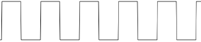
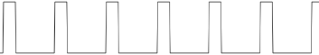
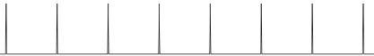

## 19.2 Střída {#19-2-st-da}

Do tohoto okamžiku jsem tak nějak mlčky předpokládal, že když má oscilátor frekvenci 1 Hz, tak že to znamená nejen to, že každý kmit (tj. logická 0 a logická 1) trvá jednu sekundu, ale i to, že jsou obě hodnoty stejně dlouhé, totiž že je půl sekundy logická 0 a půl sekundy logická 1\. Nějak takhle:

Jenže ona to nemusí být pravda. Co když to bude vypadat třeba takhle? Čtvrtinu sekundy logická 1, tři čtvrtiny 0\. Stále platí, že frekvence je 1 Hz – náběžné hrany pulsů přicházejí po sekundě jako předtím, ale výsledek vypadá jinak:

A co teprve takovýhle signál?

Taky náběžná hrana každou sekundu, ale signál je v logické jedničce jen mizivý zlomek sekundy. Kdybyste svůj generátor „panna-orel“ krmili takovýmto signálem, co by tak asi vyšlo? Správně, padala by pořád jen jedna hodnota.

Faktoru, který popisuje, jestli má pravidelný signál poměr trvání jedniček a nul stejný, nebo různý (a jak moc různý) se říká střída (anglicky duty cycle, někdy se to překládá i jako „plnění“). Když je signál tak hezky rovnoměrný jako na prvním obrázku, říkáme, že má střídu 1:1, nebo plnění 50 %. Ten pod ním bude mít 25 % (nebo 1:3), ten na posledním obrázku třeba 1 %.

Za chvíli si řekneme, jak zajistit střídu 1:1, ale nejdřív se pojďte podívat, jak to vypadá a co se děje, když se mění střída.

Sice bychom mohli experimentovat s obvodem 555 a sluchátkem a poslouchat, jak se zvuk mění z takového nijakého bučení (1:1) na ostrý „techno“ zvuk u stříd okolo 1:4 a pak na jemné bzučení. Jenže to už bychom hodně odbočili od číslicové techniky.

Můžete si to přesto zkusit: [eknh.cz/pwma](https://eknh.cz/pwma) – jsou tu čtyři generátory se stejnou frekvencí, ale různou střídou. Nechte emulátor chvilku běžet, aby měly audiovýstupy dostatek dat k přehrávání (naplní se ukazatel u „audio out“), a pak si pomocí tlačítek Play vpravo přehrajte jednotlivé zvuky.

Teď použijeme světlo a Arduino. Arduino Uno má LED na pinu 13, už jste si s ní blikali, a teď se k blikání vrátíme. Ve smyčce loop() je dvakrát volána funkce delay(1000). Co když to změníme tak, že u prvního bude delay (100), u druhého delay (1900)? Celkové zpoždění zůstane stejné, 2000 milisekund, ale změní se právě střída. LED bude buď „probleskovat“, nebo „pohasínat“.

Fajn, a teď zvýšíme frekvenci – tedy snížíme hodnoty u delay. Obě na desetinu. Třeba na 10 a 190\. Dioda probleskuje velmi rychle, a to s frekvencí 5 Hz. Jdeme dál, ještě o desetinu. Budeme mít 1 a 19\. Dioda teď bliká tak rychle, že už oko nevidí jednotlivé záblesky, ale zdá se, jako by slabě svítila pořád. Zkusme teď změnit střídu na 50 % – tedy 10 a 10\. LED bude blikat se stejnou frekvencí, ale bude mnohem více času trávit ve stavu „svítí“. Oku se tedy bude zdát, že svítí s větším jasem.

Když poměry dob změníte třeba na 19:1, bude LED zase blikat, ale bude 19 milisekund ve stavu „svítí“ a 1 milisekundu ve stavu „nesvítí“. Výsledek bude vypadat jako ještě větší jas!

Právě jste si vyzkoušeli, jakým způsobem měnit jas LED, i když máte k dispozici jen hodnotu 0 nebo 1!
