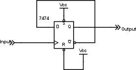
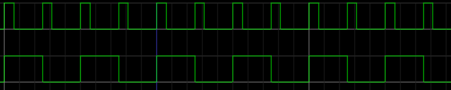
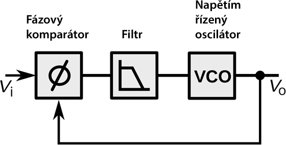

## 19.4 Dělení kmitočtů {#19-4-d-len-kmito-t}

Už jsem tu zmínil, že existuje jednoduchá technika, díky níž můžeme jakýkoli pravidelný signál s libovolnou střídou změnit na signál se střídou 1:1\. Jak na to?

Tak, jedna možnost je měřit, za jak dlouho po sobě přijdou dvě náběžné hrany, a pak na výstup pouštět signál se sestupnou hranou posunutou přesně do poloviny tohoto intervalu. Což je teoreticky správné řešení, ale takhle se to zkrátka nedělá, protože to je řešení náročné. Existuje totiž jednodušší cesta.

Opět si vzpomeňte na náš klopný obvod typu D a na jeho vlastnost, popsanou slovy „změna stavu proběhne při změně hodinového vstupu z 0 na 1“ (tedy při _náběžné hraně hodinového pulsu_). A teď si představte, že na vstup D přivedeme výstup /Q – tedy negovaný. Vlastně vytvoříme zpětnou vazbu na druhou. Na začátku je třeba obvod ve stavu 0\. Na výstupu Q bude 0, na /Q 1\. Ta je zároveň připojená na vstup D. Při náběžné hraně vstupu CLK se obvod překlopí do log. 1, na výstupu Q bude 1, na /Q bude 0… Při další náběžné hraně se obvod opět překlopí do 0…

Vidíte, že je úplně jedno, jestli je střída vstupního signálu 1:1 nebo 1:3 – pokud přicházejí náběžné hrany pravidelně, překlápí se klopný obvod s poloviční frekvencí proti vstupu. Pokud máte na vstupu 10 kHz, na výstupu bude 5 kHz, a vedlejší efekt bude ten, že dosáhnete přesné střídy 1:1\. A proto se často používá tento postup při získávání časových pulsů v číslicové technice. Některá zapojení jsou totiž náročná na dodržení přesné střídy, a proto se používají oscilátory, které kmitají na vyšší frekvenci, která je pak dělena na požadovanou hodnotu.

A jako vedlejší efekt jsme si právě ukázali jedno ze zásadních zapojení, totiž dělič kmitočtu.

[eknh.cz/del2](https://eknh.cz/del2)

Můžete druhou půlku obvodu 7474 zapojit jako dělič kmitočtu u vašeho hodomincomatu. Sice se frekvence přepínání sníží na polovinu, zato budou oba stavy trvat stejně dlouho, a při stisknutí tlačítka budou pravděpodobnosti obou stavů stejné.

### 19.4.1 Násobení kmitočtu? {#19-4-1-n-soben-kmito-tu}

Dělení kmitočtu bychom měli pořešené, a co takhle násobení? Šlo by to nějak? Šlo. Sice to sami dělat nebudeme, ale určitě se s tím časem někdy setkáte, tak si to ve stručnosti popíšeme, ať víte…

Existuje složitá součástka, která se jmenuje fázový závěs. Anglicky se to označuje Phase-Locked Loop a zkracuje se to na PLL. Fázový závěs dokáže generovat signál tak, aby měl fázi shodnou se vstupním signálem (zjednodušeně řečeno aby chodily vzestupné i sestupné hrany ve stejný okamžik). Pokud se vstupní (též referenční) a výstupní signál „rozladí“, změní frekvenci výstupu tak, aby jej opět synchronizoval se vstupem.

Představte si teď, že do zpětné vazby zařadíme třeba děličku 1:64\. Znamená to, že PLL bude generovat kmitočet 64 × vyšší než je referenční.

PLL se používají u některých jednočipů, kde slouží ke generování vysokého pracovního kmitočtu, kontrolovaného relativně pomalým krystalem. U složitých logických polí (FPGA) bývá hned několik PLL, jimiž můžeme ze vstupního kmitočtu, třeba 50 MHz, vygenerovat celou škálu hodinových signálů.

Výhoda takového řešení je, že můžete přepínáním děličů a násobičů změnit pracovní frekvenci obvodu bez změny krystalu (snížení frekvence se používá ke snižování odběru). Takto získaný kmitočet je navíc dostatečně přesný, takže není potřeba krystalů s vysokými frekvencemi, které se obtížně vyrábějí.
