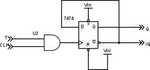
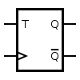

## 19.5 Klopný obvod T {#19-5-klopn-obvod-t}

Když u předchozího obvodu do cesty hodinovému pulsu zapojíme hradlo AND, získáme tak klopný obvod typu T (Toggle).

Pravdivostní tabulka takového obvodu je prostá: Pokud je T = 0, zůstává klopný obvod stále ve stejném stavu. Pokud je T = 1, tak se s každou náběžnou hranou hodin přepne.

| T | Qn | Qn+1 | Funkce při náběžné hraně Clk |
| --- | --- | --- | --- |
| 0 | 0 | 0 | Drží hodnotu |
| 0 | 1 | 1 | Drží hodnotu |
| 1 | 0 | 1 | Přepíná |
| 1 | 1 | 0 | Přepíná |

Klopný obvod T se používá pro konstrukci čítačů a děliček frekvence, jak si hned za chvíli ukážeme.
