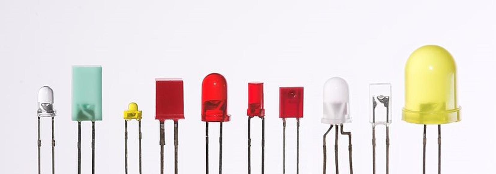
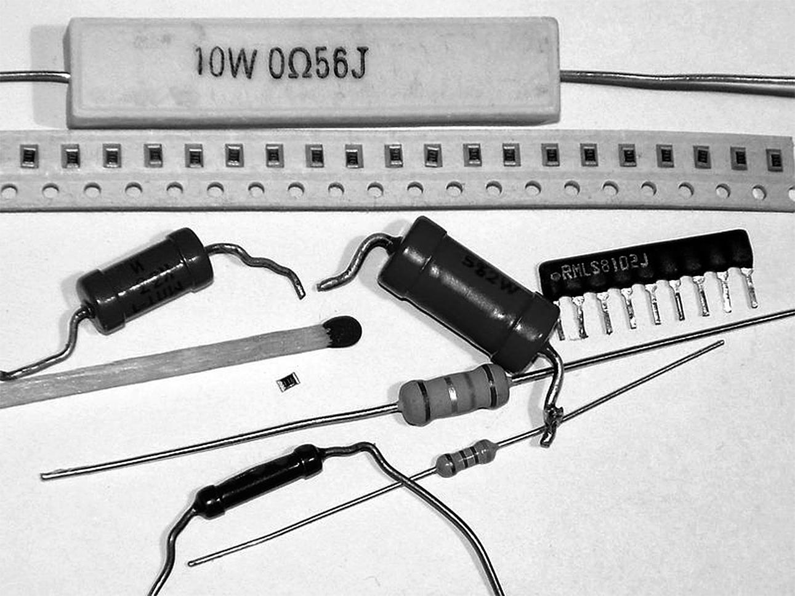
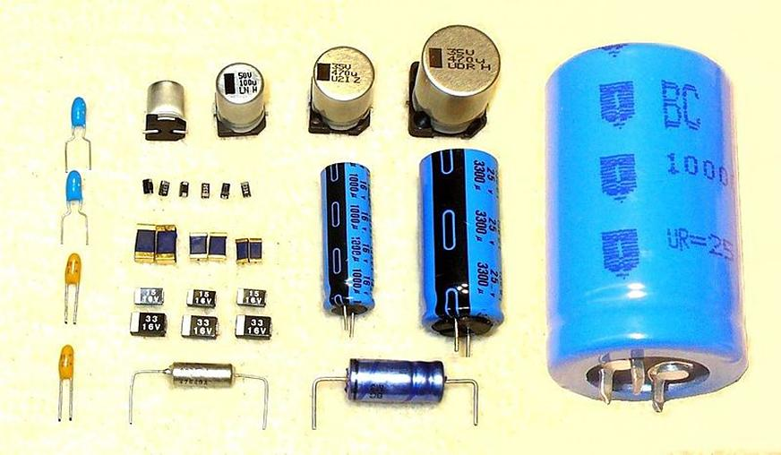
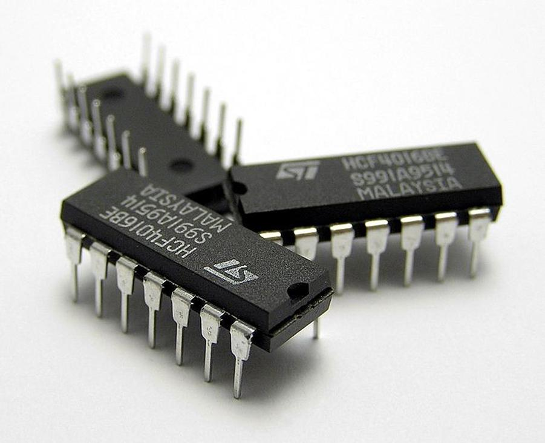

## 1.4 Nákupní seznam: Součástky pro blikač {#1-4-n-kupn-seznam-sou-stky-pro-blika}

Bez součástek se neobejdete. Bez součástek si ani nebliknete, ani nezapípáte, bez součástek neuděláte nic. Nebudete potřebovat žádné složité ani drahé ani příliš náročné. Do začátku vám jich stačí jen několik základních, které vás nepřijdou na víc než na několik desítek korun.

### 1.4.1 LED {#1-4-1-led}

Především jsou to LED. LED je akronym anglických slov Light Emitting Diode, tedy „světlo vyzařující dioda“. Neříkejte proto prosím „LED dioda“, protože říkáte vlastně „Světlo vyzařující dioda dioda“. Někteří obhajují slovní spojení „LED dioda„ kvůli tomu, že slovo „dioda“ můžete skloňovat: LED diodou, LED diody, … _Já s dovolením sklouznu k nespisovnému, ale používanému výrazu LEDka_.

Ale zpět k věci: LED jsou v nejrůznějších barvách, nejčastěji červená, žlutá, zelená, modrá a bílá. Jsou i vícebarevné diody, dvoubarevné, trojbarevné (RGB – červená, zelená, modrá) i čtyřbarevné (RGBW – jako předchozí, ale navíc s bílou). Jsou diody se zabudovaným řídicím obvodem, který umožňuje sofistikované řízení, např. v různých LED páskách. Ale ty potřebovat nebudete. Kupte si do začátku úplně obyčejné jednobarevné LED, třeba pět kusů od každé barvy. Jestli zvolíte průměr 5 mm, nebo 3 mm, to je jedno. Ty větší líp „sednou do ruky“ při manipulaci, ty menší zase snáze dáte vedle sebe. Já používám pětimilimetrovou verzi…

CC-BY-SA, autor Afrank99

### 1.4.2 Rezistory {#1-4-2-rezistory}

Další součástky, bez nichž se neobejdete, jsou rezistory. Dříve se jim říkalo také „odpory“. Jenže odpor je označení fyzikální veličiny (jednotka je ohm, značíme Ω), a pak to špatně vypadá, když říkáte „odpor s odporem 100 ohmů“. Asi jako „dvoumetrový metr“. Proto se používá označení „rezistor“.

Rezistory se třídí do různých skupin – podle výkonu, podle přesnosti, podle výrobní technologie... Pro naše potřeby postačí ty nejmenší, nejobyčejnější a nejlevnější, takže něco jako „uhlíkový rezistor 0,25 W“ nebo „metalizovaný rezistor 0,25 W“. V kusovém množství to jsou korunové položky. Existuje ale možnost nakoupit celé sady rezistorů, třeba 100–200 kusů s různými hodnotami odporů. Při nákupu z Číny vás celá taková sada vyjde třeba na dvacet korun (ovšem dodací lhůta je nepoměrně delší).

Pořiďte si pro první pokusy rezistory o odporu 330 ohmů (označují se 330R), 1000 ohmů (1K) a 10 000 ohmů (10K). Kdo chce, pořídí si i 220R, 2K2, 4K7, 22K, ať můžeme experimentovat. Od každé velikosti tak deset kusů, ale víc se rozhodně neztratí. (O značení a jednotkách si za chvíli povíme víc.)

### 1.4.3 Kondenzátory {#1-4-3-kondenz-tory}

Kromě rezistorů budete potřebovat i kondenzátory. Základní vlastností kondenzátorů je jejich kapacita, která se měří ve faradech (značíme F). Ještě začátkem 90\. let platilo, že nejčastější kapacity se udávají v pikofaradech, nanofaradech a mikrofaradech (bilióntina, miliardtina, milióntina), ovšem dnes jsou dostupné kondenzátory s kapacitou stovek faradů. V číslicové technice takové velké kapacity můžeme použít k napájení obvodů při výpadku, ale vy je teď potřebovat nebudete. Vystačíte si pro začátek s kapacitami 33 pikofaradů (pF), 100 nanofaradů (nF) a 10 mikrofaradů (µF; u tohoto se nenechte vylekat tím, že bude označený jako „elektrolytický“). Setkáte se taky se starším označením 33, 100K a 10M. Opět vezměte ty nejlevnější, na experimenty budou stačit. Kapacity 33 pF a 100 nF vypadají jako malý polštářek, 10 μf vypadá jako váleček.

### 1.4.4 Integrované obvody {#1-4-4-integrovan-obvody}

A když už jsme v tom, tak si kupte i dva integrované obvody. Jeden má označení 74HCT00, druhý 74HCT04\. Pokud nebude k dispozici HCT, kupte klidně LS nebo ALS (74LS00, 74ALS04, …) Pozor! Vybírejte takové, které jsou v pouzdře DIL (někdy značeno jako DIP). Takové můžete zastrčit do nepájivého kontaktního pole. Vyhněte se pouzdrům SO, ty jsou určené pro povrchovou montáž pájením.

Později budete potřebovat i další součástky – tranzistory, diody, integrované obvody. Jejich seznam najdete na konci knihy, abyste nemuseli kupovat každou součástku zvlášť. Teď si vystačíme s tím, co je výše napsané. Vážně!

Pojďme si tedy postavit ten blikač...

##### 2 Postavte si blikač – teď už to snad půjde lépe {#2-postavte-si-blika-te-u-to-snad-p-jde-l-pe}
