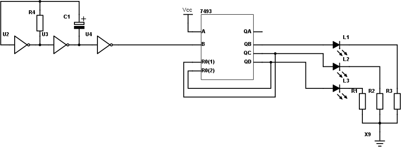
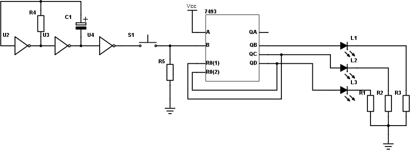
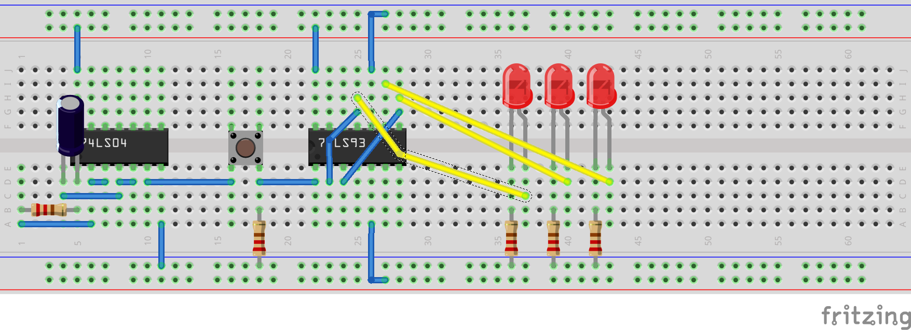
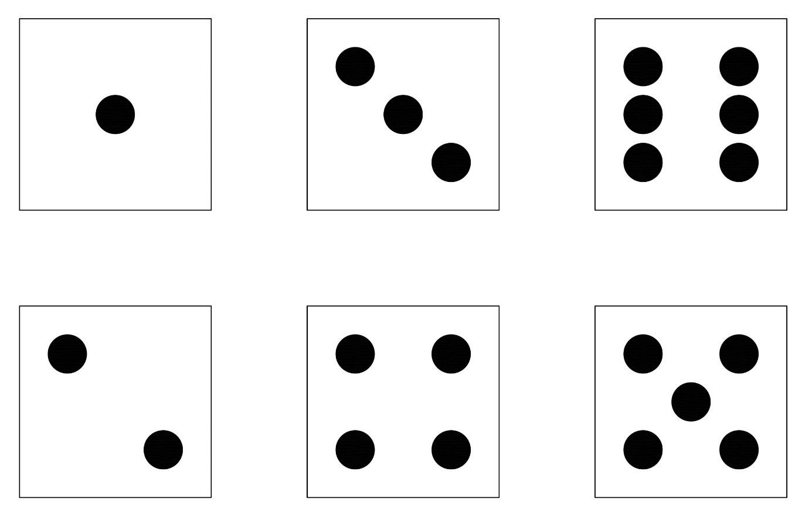
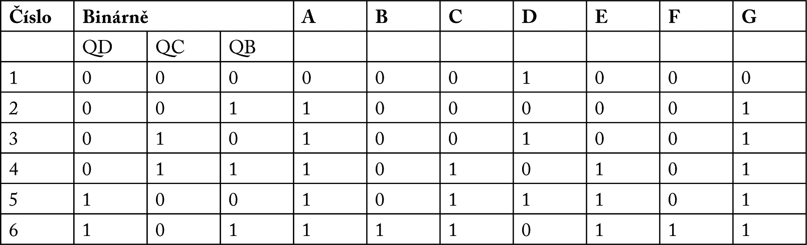
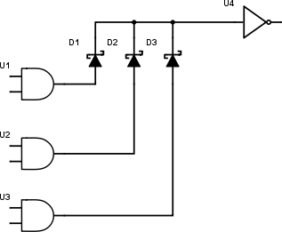
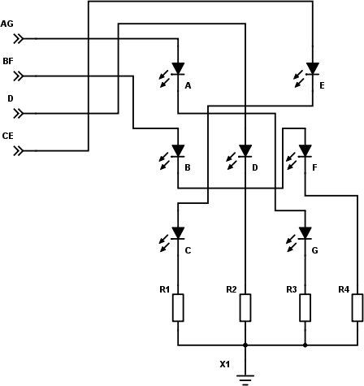
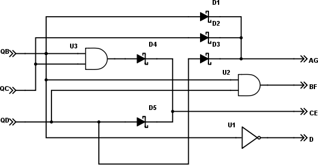

## 20.3 Hrací kostka {#20-3-hrac-kostka}

Máme ten čítač 7493, a víme, jak ho zapojit tak, aby dělil šesti. Co tak bychom mohli…?

No jasně: Můžeme rozšířit náš _mincovrhostroj_ a udělat z něj hrací kostku. Takovou tu klasickou z Člověče, nezlob se.

Na vstup čítače pustíme ten generátor pulsů 1 kHz, na výstupu se bude rychle měnit 0 – 1 – 2 – 3 – 4 – 5, a my podle toho zobrazíme odpovídající počet teček. Jak na to?

Pojďme si nejdřív postavit „binární kostku“. Výstup budeme zobrazovat pomocí tří LED. Na vstup připojíme náš generátor kmitů, ale pro začátek ho necháme kmitat pomaleji, ať můžeme zkontrolovat, že čítač dělá, co dělat má.

Tip: Nemusíte vždy stavět oscilátor z obvodu 7404, rezistoru a kondenzátoru. Pro tyto testy můžete použít Arduino a jednoduchý příklad Blink. Z pinu 13 (nebo z kteréhokoli jiného) si můžete odebírat potřebný signál, jehož frekvenci i střídu nastavíte pomocí konstant delay(). V takovém případě je nejlepší brát napájecí napětí přímo z Arduina. Pokud budete zbytek obvodu napájet jiným zdrojem, nezapomeňte spojit vodivě zemní napájecí vodiče pro oba obvody!

Použijte obvod 7404 a obvod 7493\. Když zvolíte velkou kapacitu C1 a velký odpor R4, bude oscilátor kmitat dost pomalu na to, aby bylo vidět, jak se přepínají stavy na LEDkách. Není to úplně naprosto dokonalá kostka, protože výsledek musíte číst binárně, ale základ máte položený!

Teď můžete zrychlit a zapojit tlačítko. Pokud bude stisknuté, bude čítač rychle střídat hodnoty 0-5\. Jakmile ho pustíte, zůstane na čítači poslední hodnota.

Do zapojení jsem přidal i rezistor R5, protože – kdo to ví? Ano? Přesně tak! Bez rezistoru R5 by byl vstup B „ve vzduchu“, pokud by tlačítko nebylo stisknuté. Proto je tam rezistor R5, který v tu dobu na vstup B přivede logickou 0\. Jakmile je tlačítko stisknuté, tak „slabou nulu“ z R5 přebije výstup z oscilátoru. Jak velký ten rezistor má být? No, můžeme to spočítat z výstupních proudů 7404, ale takové „bastličské pravidlo“ říká: _Na místo pullup nebo pulldown dej rezistor 10k, když to bude moc, uber, když málo, přidej._ A věřte nebo ne – pro většinu zapojení to je naprosto vhodná hodnota.

Je to podobné empirické pravidlo, jako je u „rezistoru k LED“. Pokud to nepotřebujete nějak extra přesně, nezáleží vám na tom, jak jasný svit bude, a pokud zapojujete LEDku k číslicovým obvodům, dejte 330 ohmů. To je „bezpečný rezistor“, který bude pro 99 % LED fungovat.

Tip: Pokud tuto knihu čtete během studia na technické škole, tak prosím svému vyučujícímu neříkejte, že „tam dáte 10k, protože jste to četli“, pracujte tak, jak po vás vyučující chce, a správnou hodnotu si spočítejte! Totéž platí, pokud budete navrhovat a oživovat složitější zapojení. Ovšem pro jednoduché projekty toho typu, jaké si předvádíme my, si vystačíte s výše zmíněnými empirickými pravidly.

Takhle nějak by mohlo vaše zapojení „binární kostky“ na nepájivém poli vypadat. Dokud držíte tlačítko, budou lehce svítit všechny LED (ta vpravo víc). Jakmile tlačítko pustíte, uvidíte jeden z šesti možných stavů.

Proč ta vpravo svítí víc? Odpověď se skrývá v binárních číslech. Střídají se stavy 000, 001, 010, 011, 100 a 101\. Během těchto šesti taktů svítí LED vpravo v plné polovině stavů (001, 011, 101). Prostřední LED svítí třetinu doby (010,011), levá taky (100,101). Vzpomeňte si na kapitolu o PWM. Tady je pravá LED buzena polovinu doby, zbývající jsou buzeny třetinu doby.

### 20.3.1 Reálná kostka {#20-3-1-re-ln-kostka}

Opravdová hrací kostka není binární. Číslo se ukazuje pomocí kombinace 1 až 6 teček ve známém obrazci.

Označíme si jednotlivé tečky (je jich sedm) pomocí písmen, takto:

| A |  | E |
| --- | --- | --- |
| B | D | F |
| C |  | G |

Uděláme si další tabulku, aby bylo jasno, co kdy svítí. V tabulce jsem zapsal i binární vyjádření, tedy stavy, které jsou na výstupu čítače 7493.

Všimněte si jedné zajímavé věci. Některé tečky jsou spolu spojené. Třeba vždy, když svítí A, tak svítí i G. Když svítí B, tak svítí i F. No a C svítí vždy společně s E.

Prostřední tečka (D) se objevuje u kombinací 000, 010 a 100.

_D = not QB_

Diagonální LED A a G se rozsvěcí ve všech případech, kromě jedničky (což je pro nás stav 000). Můžeme tedy jejich stav zapsat jako logický součet (OR) všech tří vstupních bitů:

_A = G = QB or QC or QD_

Vodorovné LED (B a F) se rozsvěcí pouze v jednom jediném případě, totiž když je hodnota 6 (pro nás stav 101). Zobrazíme je tedy tehdy, když bude vstup QD i QB v logické 1.

_B = F = QB and QD_

Druhá diagonála, tvořená diodami C a E, je aktivní pouze pro čísla 4, 5 a 6\. Pro nás to jsou hodnoty 011, 100 a 101\. Jak bude vypadat výraz pro tuto kombinaci?

### 20.3.2 Vyjádření logických výrazů {#20-3-2-vyj-d-en-logick-ch-v-raz}

Víme, že C (= E) má být 1 pro kombinace 011, 100 a 101\. Pro kombinace 000, 001 a 010 má být 0\. Pro ostatní kombinace je nám to jedno, protože ty nenastanou. Jak takovéhle zadání převést na logický výraz?

Vidíme, že C je 1 tehdy, když je QD (nejvyšší bit) v logické 1\. Toto pravidlo pokrývá kombinace 100 a 101\. Zapíšeme si:

_C = E = QD ..._

a pokračujeme dál. Musíme totiž pokrýt kombinaci 011.

Tu bychom mohli vyjářit jako „NOT QD AND QC AND QB“ – platí, pokud je QD 0, QC 1 a QB taky 1\. Jenže my nepotřebujeme úplně přesně odlišit 011 a 111 (protože ta druhá nenastane). Můžeme tedy říct, že je nám stav QD ukradený. Pomůže to nějak? Pomůže! Kombinaci něco-1-1 můžeme vyjádřit jako „pokud nastane QB a zároveň QC“. Spojka „a“ znamená funkci AND. QB AND QC bude platit pro kombinace 011 a 111, ale to nám nevadí, protože 111 nenastane.

No a výsledek tedy je: C je 1, pokud:

je QD rovno 1

nebo

je QC=1 a QB=1

Tedy:

_C = E = QD OR (QC AND QB)_

Ptáte se, jestli existuje způsob, jak z tabulky zjistit logický výraz? Existuje jich několik. Jeden z nich, asi nejjednodušší pro funkce tří nebo čtyř bitů, je takzvaná Karnaughova mapa. Do té se teď nechci pouštět, ale myslím, že se k ní ještě vrátím, alespoň v příloze.

Máme tedy sérii výrazů. První vyjádříme pomocí hradla NOT, druhý pomocí třívstupového OR, třetí pomocí dvouvstupového AND, a čtvrtý pomocí dvojice AND-OR.

To znamená, že budeme potřebovat dvouvstupové AND (jeden obvod), třívstupové OR (druhý obvod), dvojici AND-OR (buď třetí obvod, nebo využijeme jedno hradlo AND z prvního obvodu a jedno hradlo OR z druhého obvodu), no a invertor. A ten už tam naštěstí máme.

Trošku problém bude u toho hradla OR. V základní řadě 74xx nejsou třívstupová hradla OR. Existují v řadě 7440xx, což jsou takové TTL náhrady za CMOS obvody. Tam je k dispozici obvod 744075 – trojice třívstupových hradel OR.

Ovšem naštěstí existuje takový technický hack, který nám ušetří hradla OR, a kterému se říká

### 20.3.3 Montážní OR {#20-3-3-mont-n-or}

Vůbec nevím, jestli vám to prozrazovat, protože to je opravdu ošklivé řešení, ale na druhou stranu: někdy se hodí, a určitě na něj v nějakém zapojení narazíte, tak je dobře ho znát.

Montážní OR je jeden ze dvou případů, kdy u číslicových obvodů spojíme vývody k sobě. Ale neuděláme to jako Pat a Mat, že bychom je humpolácky spojili dohromady, to ne. Půjdeme na to jinak.

Připomeňme si znovu fungování TTL hradel. Pokud je na výstupu logická 1, je výstup připojený uvnitř k napájení (Vcc) a proud teče ven. Pokud je výstup v logické 0, je tentýž výstup uvnitř hradla spojený se zemí, a _proud teče dovnitř_. Já vím, že to může znít divně, ale je to tak.

Pro vstupy platí analogická situace: pokud je vstup nějak propojen s napájením, teče proud do vstupu a tvoří logickou 1\. Pokud je vstup spojen nějak se zemí, teče proud uvnitř obvodu z Vcc přes tranzistor do vstupu a vstupem ven.

Pokud bychom natvrdo spojili dva výstupy, nic by se nestalo – pokud by byly oba ve stejné úrovni. Pokud by ale jeden byl v 1 a druhý v 0, tak by z toho v 1 tekl proud do toho v 0, a výsledek by byl nesmyslný.

Naštěstí máme součástku, která umí zařídit, aby proud tekl jen jedním směrem. Pamatujete? Ano, je to dioda. Takže když mezi výstupy hradel a „bod spojení“ zapojíme diody, zařídíme tím, že proud poteče jen jedním směrem.

Máme tu tři hradla U1 až U3, a jejich vývody jsme spojili přes diody. Výsledek je připojen na vstup hradla U4\. Co se teď stane?

Pokud jsou všechny tři výstupy hradel U1-U3 v logické 0, proud by rád tekl z U4 do vstupů těchto hradel, ale nemůže, brání mu v tom diody. Takže na vstupu U4 je logická 0.

Když některé z hradel, třeba U1, přepne do log. 1, proud se z výstupu dostane přes diodu D1 do bodu spojení a na vstup hradla U4, ale už nemůže odtékat zpátky přes výstupy hradel U2 a U3, protože tomu brání diody D2 a D3.

Výsledná funkce takového zapojení je „log. 1, pokud je alespoň jeden ze vstupů v logické 1“ – tedy funkce OR.

Výhoda takového zapojení je jediná: můžeme jednoduše vytvořit OR s několika vstupy jen pomocí diody, nemusíme k tomu vyplýtvat integrovaný obvod.

Nevýhodou takového zapojení může být třeba to, že na diodách vzniká úbytek napětí, který může posunout hodnoty napětí do zakázaného pásma. Tomu můžeme předejít tím, že použijeme diody s nízkým úbytkem (např. Schottkyho). Jsou i další nevýhody, například to, že dioda má nějakou nenulovou kapacitu, takže může ovlivnit vysokofrekvenční signály atd. Ale někdy holt výhoda jednoduchosti převýší nad nevýhodami, a proto se s „montážním OR“ čas od času setkáte.

### 20.3.4 Zobrazovací obvod hrací kostky {#20-3-4-zobrazovac-obvod-hrac-kostky}

Zapojme si tedy sedm LED tak, aby dávaly dohromady stejné obrazce, jako jsou na hrací kostce. Využijeme toho, že některé jsou vždy ve stejném stavu (A a G, B a F, C a E) a zapojíme to třeba takto:

A teď otázka: Mohu to takto zapojit? Mohu zapojit dvě LED za sebe (sériově)? Brání mi v tom něco?

Může mi v tom teoreticky zabránit úbytek napětí na diodě. Když zapojím dvě za sebe, a na každé vznikne úbytek 2 volty, tak bude celkový úbytek 4 volty, což je ještě OK. Třetí LED by vyžadovala už zvýšení napájecího napětí, s ní bychom se do pěti voltů nevešli.

(A co když je zapojím vedle sebe, co se stane?)

### 20.3.5 Dekodér hrací kostky {#20-3-5-dekod-r-hrac-kostky}

Chybí teď ta podstatná část, totiž jak ze signálů QB, QC a QD z čítače udělat požadované signály AG, BF, CE a D.

U D to mám nejjednodušší, ten připojím přes invertor U1 (mám ho třeba v oscilátoru 7404) na QB.

Signál AG vytvořím třeba montážním OR pomocí tří Schottkyho diod (D1, D2, D3) ze signálů QB, QC a QD.

Pro signál BF musím použít hradlo AND (U2), třeba obvod 7408\. Sloučím signály QB a QD.

Signál CE vygeneruju tak, že pomocí hradla AND (U3) spojím signály QB a QC, a výsledek pomocí montážního OR spojím se signálem QD (diody D4, D5).

Zde je opravdu na místě použít Schottkyho diody, které mají malý úbytek napětí. Nezapomeňte na to, že kvůli zapojení LED do série potřebujeme na vstupu alespoň 4 volty. Kdybychom použili normální diody s úbytkem 0,7 voltu, bylo by to už dost na hraně.

Existuje řešení problému s napětím? Co třeba zapojit dvojice LED ne sériově, za sebe, ale paralelně, vedle sebe? Snížili bychom potřebné napětí na polovinu, ale vzrostl by zase potřebný proud. Najděte si v datasheetu obvodu 7493, kolik proudu je schopen dát na vývodech při stavu log. 1 – bude se to lišit pro obvody 74LS93, 7493, 74ALS93 a třeba 74HCT93\. Většinou platí, že u obvodů HC(T) bývá maximální proud okolo 20 mA. U typu 74LS93 to je, pro zajímavost, 16 mA. Ale není dobré součástky napínat na mezní hodnotu. Když navrhneme rezistor tak, abychom odebírali 10 mA, bude na každou diodu připadat 5 mA, což je dostatečný proud. Rezistor tak bude mít velikost R = U / I, tedy 5 / 0,01 = 500 ohmů. Použijte rezistor nejbližší vhodné hodnoty, tedy 470 ohmů...

Zkuste si zapojit takovou kostku na nepájivém kontaktním poli. A až si dostatečně zaházíte, podíváme se na další čítače.
